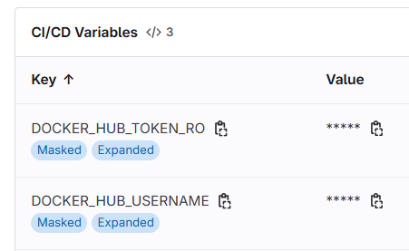

In one of my GitLab CI, I came across the need to use a Docker image stored on `hub.docker.com` in a private repository.

I couldn't simply do a `docker pull my_image` because, first of all, I had to authenticate myself in the CI before I could retrieve the image (it's a private one).

This article is a how-to and explains how to do it.

<!-- truncate -->

## Create a token

You'll need to create a token first. Please visit this page: [https://app.docker.com/settings/personal-access-tokens](https://app.docker.com/settings/personal-access-tokens). You'll need to do a sign in of course.

Click on the `Generate new token` button and create a new one. Make sure to correctly specify the scope. To be able to access to private images; you should select `Read-Only` and not `Public Repo Read-Only` (because the last one didn't give access to private images).

Once created, Docker will provide you a small help screen where you'll read that you can connect to Docker by using the token just like if it's your password.

## Create two CI/CD variables in your repository page

In your GitLab CI/CD settings page, add two new variables:

* The first one will be called `DOCKER_HUB_USERNAME`. The value to enter here is your Docker account name (like `christophe` or `my_company` if the image is stored in a business account) and
* the second one will be called `DOCKER_HUB_TOKEN_RO`. The value to enter here is the token you've received.

Make sure variables are hidden and protected. This will prevent GitLab to echoed the value in any output like when you initialize `CI_DEBUG_TRACE=true` ([doc](https://docs.gitlab.com/ci/variables/variables_troubleshooting/#enable-debug-logging)) for full debug.



:::note
You can add the variables in your repository's CI/CD settings page or at a higher level like the group level or at the instance level (you should be an admin for this).
:::

## Your gitlab-ci.yml file

Once done, here is how to connect to Docker in your `.gitlab-ci.yml` file:

<Snippet filename=".gitlab-ci.yml">

```yaml
demo:
  image: docker:latest
  before_script:
    - | # Do a secure login
      echo "$DOCKER_HUB_TOKEN_RO" | docker login -u "$DOCKER_HUB_USERNAME" --password-stdin
  script:
    - | # Download the image
      docker pull your_private_image
    # - | # Use it
    #   docker run [...] your_private_image [...]
```

</Snippet>
