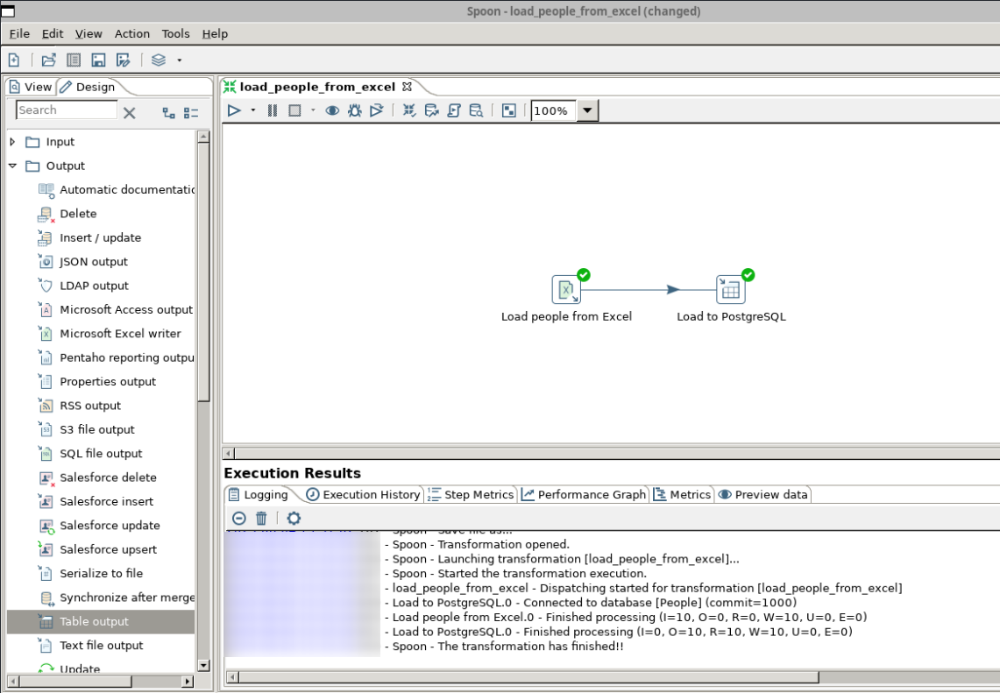

<!-- cspell:ignore pentaho,xtract,ransform,sheetname,dpage,webkitgtk -->

Pentaho Data Integration is a ETL tool (**E**xtract, **T**ransform and **L**oad) used for data integration. Let's imagine you've an Excel file and you want to extract records (only those matching a specific rule), then apply a transformation (like adding some new columns based on current data) and load them in a PostgreSQL database.

Pentaho (also called **PDI** or **Kettle**) will allow you to *draw* a data flow (load files, do some merge, apply transformation, run some piece of code (Shell or Javascript), ... and store the result somewhere (a database or a file) or, even, send information by email in case of failure).

Let's quickly discover Pentaho and, as a first example, load an Excel file into a PostgreSQL database.

<!-- truncate -->

## Installation on Linux

Pentaho can be installed on both Windows and Linux since it's a Java application.

My personal experience: even with a powerful computer with plenty of RAM, Java interfaces on Windows are just impossible because interfaces are so unresponsive. On top, before you can even launch the application, you have to go through the trouble of installing Java and ... yuck.

Let's move on and install it under Linux; it's really easy to do.

1. Go to [https://pentaho.com/pentaho-developer-edition/](https://pentaho.com/pentaho-developer-edition/); fill in the form (it's mandatory) before getting the list of files you can download),
2. Download the `pdi-ce-10.2.0.0-222.zip` file. If like me you're under Windows, the archive will be put on your Windows partition; let's copy it to your Linux one.
  
   1. Start your Linux console and create a new folder like f.i. `~/tools/pentaho` (you can decide to use another path but, in this documentation, we'll refer to `~/tools/pentaho`)
   2. Still in your console, run `explorer.exe .` in the command line to run Windows Explorer and open your Linux folder in it.
   3. In a new tab (in Windows Explorer thus), go to your download directories to retrieve the downloaded file.
   4. Copy the file from the Windows folder to your Linux one; using a drag&drop f.i.
3. Back to your Linux console, go to the folder where you've just copied the file (`~/tools/pentaho`)
4. Run `rm *Zone.Identifier` to remove unneeded file (create by Windows during the copy action)
5. Run `unzip pdi-ce-10.2.0.0-222.zip`. That command will create a `data-integration` subfolder.
6. Run `rm pdi-ce-10.2.0.0-222.zip` since we don't need it anymore and run `cd data-integration` to jump in the new folder.
7. The next things to do is to prepare your system:
   1. Please run `sudo apt-get update`,
   2. Then, please run `sudo apt-get install openjdk-11-jdk` since Pentaho requires Java to run and
   3. Please run `sudo apt-get install libgtk-3-0` to install GTK 3 (*GTK 2 is obsolete*)

### Adding Pentaho to the PATH

To finalize the installation, you also need to update the `PATH` Linux variable.

Please run `code ~/.bashrc` (or `code ~/.zshrc` if you're using Oh-my-ZSH); search in the file if you already have a line with `PATH=`. If yes, please update and add `$HOME/tools/pentaho/data-integration` to it. If not, please go to the end of the file and add this line:

<Snippet filename="~/.bashrc">

```bash
PATH="$HOME/tools/pentaho/data-integration:$PATH"
```

</Snippet>

Save and quit.

To make the change also for your current console, run `export PATH="$HOME/tools/pentaho/data-integration:$PATH"`  (or create a new console).

From now, you'll be able to run Pentaho whatever the current directory.

## Let's prepare our environment

We'll create a new project; please run `mkdir -p /tmp/pentaho && cd $_` to create a temporary folder and jump in it.

We will create a dummy Excel file then load it in a PostgreSQL database. The target table will be called `people` and we'll create it automatically (but well manually).

### First, we need an Excel file to load

For this tutorial, we'll load an Excel file in PostgreSQL so we need an Excel file.

Copy the table here below into Excel and save the new files as `people.xlsx` (otherwise, click [here](./files/people.xlsx) to download it). Save the file to your Linux `/tmp/pentaho` folder.

<!-- cspell:disable -->
| ID | Firstname | Lastname | City |
|----|-----------|----------|------|
| 1 | Jean | Dupont | Brussels |
| 2 | Marie | Leclerc | Antwerp |
| 3 | Pierre | Dubois | Ghent |
| 4 | Sophie | Martin | Charleroi |
| 5 | Thomas | Bernard | Liège |
| 6 | Chloé | Petit | Bruges |
| 7 | Antoine | Durand | Namur |
| 8 | Léa | Leroy | Leuven |
| 9 | Nicolas | Moreau | Mons |
| 10 | Manon | Simon | Mechelen |
<!-- cspell:enable -->

### Then we need a PostgreSQL database

For this, we'll use Docker. Please create a file called `compose.yaml` in your `/tmp/pentaho` folder with this content:

<Snippet filename="compose.yaml">

```yaml
name: pentaho

services:
  postgres:
    image: postgres:9-alpine
    hostname: postgresql
    environment:
      - DATABASE_HOST=postgresql
      - POSTGRES_DB=people
      - POSTGRES_HOST_AUTH_METHOD=trust
      - POSTGRES_PASSWORD=admin
      - POSTGRES_USER=admin
    ports:
      - "5432:5432"
    expose:
      - "5432"
    networks:
      - pentaho

  pgadmin:
    image: dpage/pgadmin4:6.12
    hostname: pgadmin
    ports:
      - "8080:80"
    depends_on:
      - postgres
    environment:
      - PGADMIN_DEFAULT_EMAIL=admin@yopmail.com
      - PGADMIN_DEFAULT_PASSWORD=admin
    networks:
      - pentaho

networks:
  pentaho:
    external: false

```

</Snippet>

### And for our easiness, let's create a makefile

<Snippet filename="makefile">

```makefile
.PHONY: start
start:
	SWT_GTK3=1 SKIP_WEBKITGTK_CHECK=1 KETTLE_HOME=${PWD} spoon.sh

.PHONY: up
up:
	docker compose up
```

</Snippet>

### Let's run our Docker container

Please run `docker compose up --detach` to start the PostgreSQL container and the pgAdmin one.

As you've seen, we've already foresee a pgAdmin interface; we can open it by going to `http://localhost:8080`.


Use `admin@yopmail.com` and `admin` as credentials.

Once in the interface of pgAdmin, we've to create a new server by clicking on the `Add new server` button.

Give a name to the server then, in the `Connection` tab, fill in as below:


As you can see on the image below, during the creation of our PostgreSQL container, a new database called `people` has been created. That database has a `public` schema and, right now, no tables.


:::info
This is done thanks our `compose.yaml` file. If you're curious, open the `compose.yaml` file again and pay attention to the `environment` section for the `postgres` service. We've instruct PostgreSQL to create a database called `people`; owned by user called `admin`.
:::

## The pieces of the jigsaw are in place, create our flow

Now, run `spoon.sh` to start the graphical user interface of Pentaho. That interface is called **Spoon**.


### We need to create a new transformation file

Click on the `File` menu, then `New` and select `Transformation`.

#### Load from Excel

In our scenario, we want to load an Excel file so click on the `Input` category and scroll down until you see `Microsoft Excel input` and drop it to the main canvas.


Double-click on the just added step so you can configure it:

* Give it a clear name (like *Load people from Excel*),
* Click on the Browse... button to retrieve your file (f.i. `/tmp/pentaho/people.xlsx`) then click on the `Add` button to add that file to the list of *Selected files*
  
* In the `Sheets` tab, click on the `Get sheetname(s)...` button, retrieve the name of the sheet and add it.
  
* In the `Content` tab, there is nothing to change (since our Excel file has a header row then the data without empty rows between)
* In the `Fields` tab, click on `Get fields from header row...` to load names then adjust some properties like below illustrated:
  
* Click on the `Preview rows` button if you want to check if everything is OK
  

We're done; click on the `OK` button.

#### Define our database connection

Now, click on `View` tab as illustrated below and double-click on the `Database connections` item.


Remember our `compose.yaml` file and fill in the screen like this:

* Host Name: `localhost`
* Database Name: `people`
* Port Number: `5432`
* Username: `admin`
* Password: `admin`


Click on the `Test` button to make sure the connection is correctly configured.


Click on the `Ok` button to save your connection.

#### Prepare our table output

Click on the `Design` table then on the `Output` category and find `Table output`. Do a drag&drop to the canvas.


Click onn the `Load people from Excel` box and wait until the small icons below are displayed:


Click on the button with the *output connector* (the one with the right arrow) and drop the line onto the **Table output** box:


It tells to Pentaho that, once the **Load people from Excel** step is successfully done to continue with **Table output**.

Now double-click on **Table output** and let's do some configuration:

* Give it a clear step name (like *Load to PostgreSQL*),
* The name of the Connection to use should be `People` (the one we've just created),
* The Target schema has to be `public` (the one from our People database),
* The Target table is `people`.

Now, click on the `SQL` button to see that Pentaho will provide a popup (think to resize the window) with a `CREATE TABLE` instruction:


Since our table didn't exists yet, click on the `Execute` button:


Let's verify thanks to pgAdmin:


Nice. We can now close the two popup window, go back to the configuration of our table. Click on the `OK` button since we've finished this step.

#### Time to save our transformation

Please click on the `File` menu then `Save`.

Save the file to `/tmp/pentaho` with the `load_people_from_excel.ktr` name.

#### Run it

See the `Run` icon:


Click on it. You'll get a new window with bottom right a `Run` button; click on it.

If everything was correctly configured and fired, you'll get this screen:



Back to pgAdmin, get the list of records from the `people` table to verify if the Excel file was well loaded and, yes, it is.


### Download the transformation file

If you've some troubles by creating your transformation file, here is the one I've used for this article: [load_people_from_excel.ktr](./files/load_people_from_excel.ktr).

If you want the Excel file used in this article, here is the [link](./files/people.xlsx) again.

## Conclusion

Aside Docker, PostgreSQL and pgAdmin, we've seen how to load a Excel file on a Linux environment and store records in a PostgreSQL table.

The possibilities offered by Pentaho are just monstrous.
