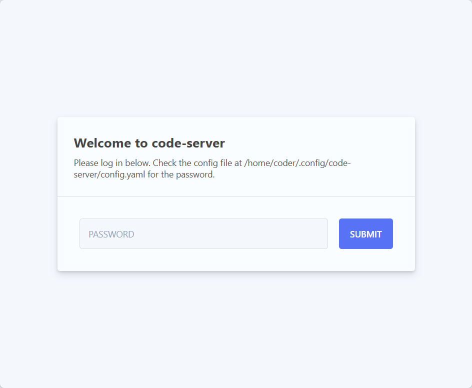
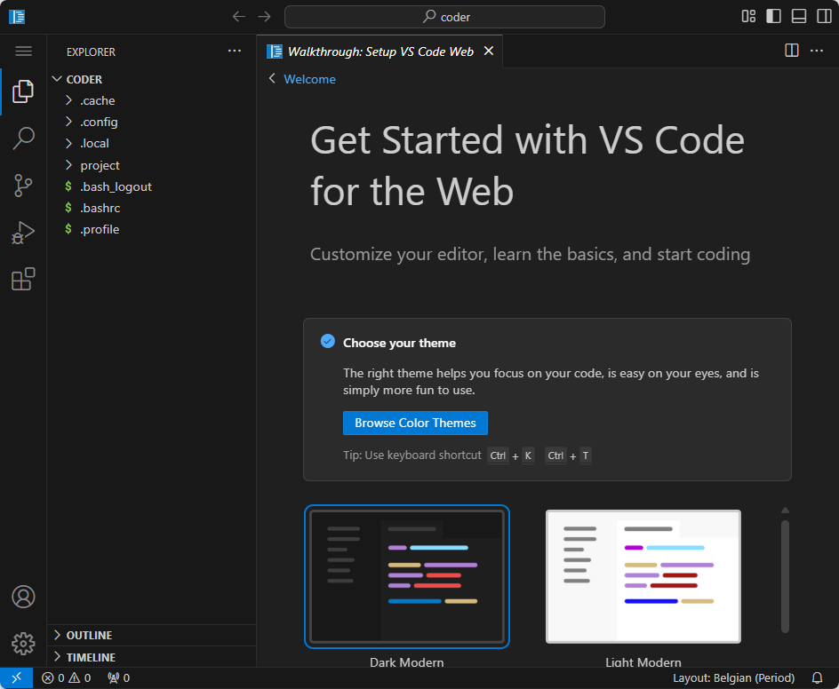

<!-- cspell:ignore codercom,tadaaaa -->

Maybe one day we won't need to install an operating system, just have Docker on our machine.  Well, it won't be tomorrow yet, but as far as VSCode is concerned, yes, we can.

You read that right: there's a Docker image that's nothing other than VSCode in a browser.

It's useless if you're a heavy user of VSCode (=you've installed it on every of your computer) but there are situations where, for example, you need to work on another computer (while yours is being repaired or you're travelling and don't have yours) and VSCode's Docker image will come in handy.

Or ... you're not yet convinced by VSCode and just want to try it out.

<!-- truncate -->

By running the instruction below, you'll download (once) the `codercom/code-server` Docker image then run a container as a daemon.

```bash
docker run -d --name code-server -p 8080:8080 \
  -v "${HOME}/.config:/home/coder/.config" \
  -v ".:/home/coder/project" \
  -u "$(id -u):$(id -g)" \
  -e "DOCKER_USER=${USER}" \
  codercom/code-server:latest
```

Once triggered successfully, just open your browser and visit `http://127.0.0.1:8080` to start VSCode in the browser.

:::info The `docker run` explained
* `-d`: the code-server will run as a daemon service,
* `-p 8080:8080`: we'll expose the service on our port 8080,
* `--name`: it's just for giving a descriptive name to our container (optional),
* `-v "${HOME}/.config:/home/coder/.config"`: save the code-server configuration on your host, in your home directory.
* `-v ".:/home/coder/project"`: mount your current directory in the container so you can work on it in code-server,
* `-u "$(id -u):$(id -g)"`: map the user used inside the container with local one so files/folders created/modified in the container will have the exact same permissions and 
* `-e "DOCKER_USER=${USER}"`: if you run `echo ${USER}` on your host, you'll see you'll get your Linux name (`christophe` for me) so, here, just inform the container about your name.
:::

The code-server configuration is thus stored in your home directory, in the folder `/.config/`. Like this, config files will not be part of your current project and the configuration will be the same if you start code-server at several places, for different projects.

By opening `http://127.0.0.1:8080` you'll get this screen:



Back to your console, run `cat ${HOME}/.config/code-server/config.yaml` to discover the configuration for code-server. You'll see something like this:

```text
bind-addr: 127.0.0.1:8080
auth: password
password: d8345b9abff6c01d044fac59
cert: false
```

Copy/paste the password in the form and submit it and tadaaaa:



Continue your journey with the official documentation: [https://github.com/coder/code-server](https://github.com/coder/code-server) or [https://coder.com/docs/code-server/guide](https://coder.com/docs/code-server/guide) to get more info. 

