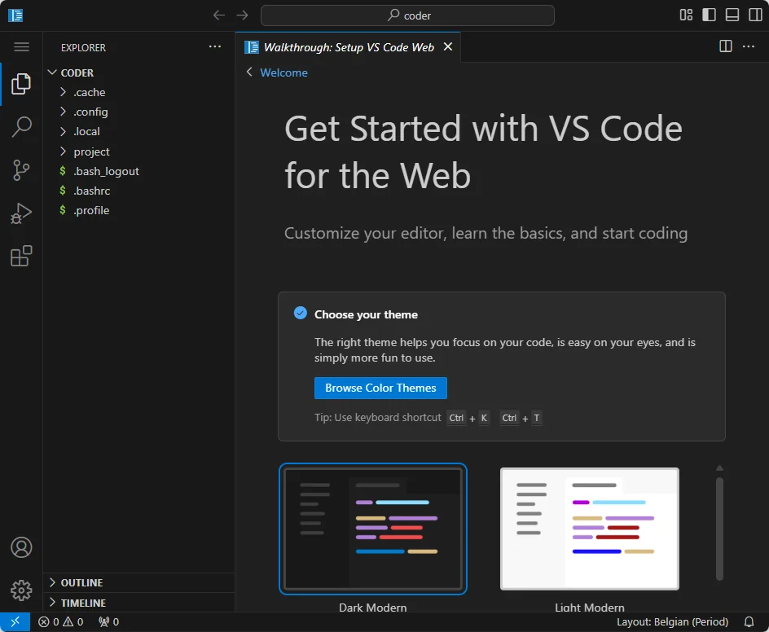
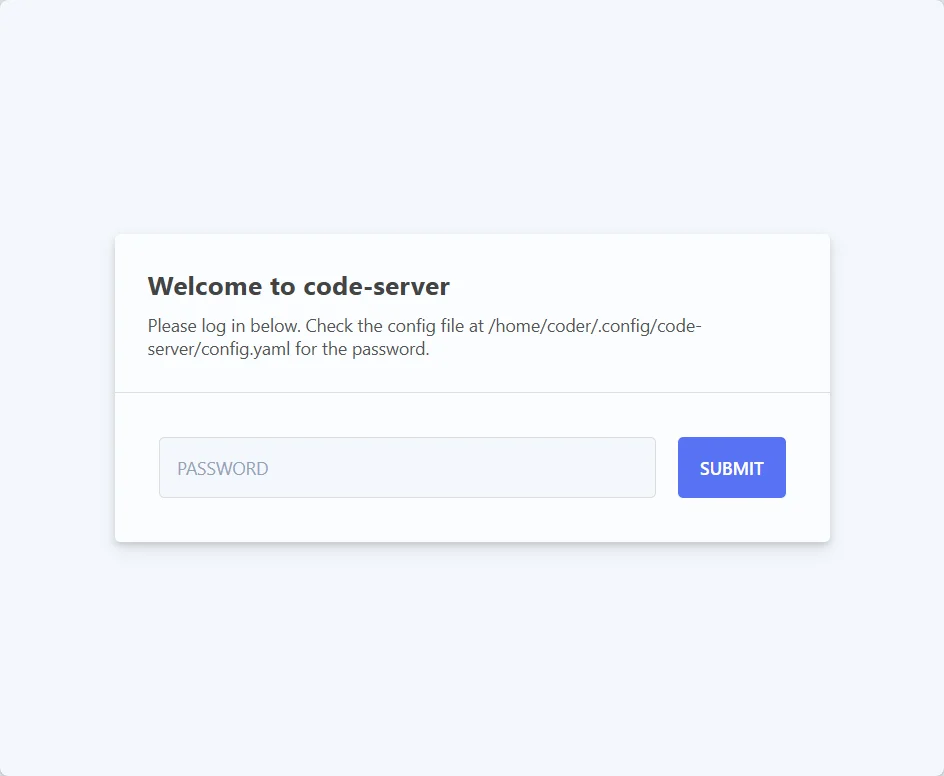

<!-- cspell:ignore codercom -->

<TLDR>
This article shows you how to run a full VS Code environment directly in your browser using the `code-server` Docker image. It's a perfect solution if you need to code on a machine without VS Code installed. The guide provides a single `docker run` command and breaks down each flag to explain how it mounts your project, persists configuration, and avoids file permission issues by mapping your local user. You'll learn how to find the auto-generated password and get started with your browser-based editor in minutes.
</TLDR>

Maybe one day we won't need to install an operating system, just have Docker on our machine.  Well, it won't be tomorrow yet, but as far as VSCode is concerned, yes, we can.

You read that right: there's a Docker image that's nothing other than VSCode in a browser.

It's useless if you're a heavy user of VSCode (=you've installed it on every one of your computers) but there are situations where, for example, you need to work on another computer (while yours is being repaired or you're traveling and don't have yours) and VSCode's Docker image will come in handy.

*A third option, when you do have VSCode locally but the code lives elsewhere: <Link to="/blog/vscode-remote-ssh">SSH Remote development with VSCode</Link>.*

Or ... you're not yet convinced by VSCode and just want to try it out.

If all you need is to edit a file or two in a GitHub repository, there is an even lighter option that doesn't require Docker at all: see <Link to="/blog/vscode-github-dev">Start vscode from github.com</Link>.

<!-- truncate -->

One `docker run codercom/code-server` command, and here's the result: a full VS Code, running in your browser.

## Why It Works

- No local VS Code install needed — the editor itself runs inside the container, your browser is just the display.
- Configuration is stored on your host (`~/.config/`), not inside the project, so it persists across containers and is shared if you start code-server for several projects.
- The container user is mapped to yours (`-u "$(id -u):$(id -g)"`), so files created or edited from the browser keep your normal file permissions — no `root`-owned files to clean up afterward.

## Installation

<Vars port="8080" name="code-server" labels={{ port: "Host port", name: "Container name" }} />

By running the instruction below, you'll download (once) the `codercom/code-server` Docker image then run a container as a daemon.

<Terminal typewriter source="./files/terminal-2.txt" />

Once triggered successfully, just open your browser and visit `http://127.0.0.1:`<Var name="port">8080</Var> to start VSCode in the browser.

<AlertBox variant="info" title="The `docker run` explained">
* `-d`: the code-server will run as a daemon service,
* <Code>-p <Var name="port">8080</Var>:8080</Code>: we'll expose the service on our port <Var name="port">8080</Var>,
* `--name`: it's just for giving a descriptive name to our container (optional),
* `-v "${HOME}/.config:/home/coder/.config"`: save the code-server configuration on your host, in your home directory.
* `-v ".:/home/coder/project"`: mount your current directory in the container so you can work on it in code-server,
* `-u "$(id -u):$(id -g)"`: map the user used inside the container with local one so files/folders created/modified in the container will have the exact same permissions and
* `-e "DOCKER_USER=${USER}"`: if you run `echo ${USER}` on your host, you'll see you'll get your Linux name (`christophe` for me) so, here, just inform the container about your name.

</AlertBox>

The code-server configuration is thus stored in your home directory, in the folder `~/.config/`. Like this, config files will not be part of your current project and the configuration will be the same if you start code-server at several places, for different projects.

## Getting the Password

By opening <Code>http://127.0.0.1:<Var name="port">8080</Var></Code> you'll get this screen:

<BrowserWindow url="http://127.0.0.1:%%port=8080%%">
  
</BrowserWindow>

Back to your console, run `cat ${HOME}/.config/code-server/config.yaml` to discover the configuration for code-server. You'll see something like this:

<Terminal typewriter source="./files/terminal-1.txt" />

Copy/paste the password in the form and submit it and tadaaa — the same VS Code in the browser already shown at the top of this article.

## Conclusion

One Docker image, one `docker run` command, and a full VS Code is available from any browser — no local install, no lost configuration, no permission headaches on the files you edit. Continue your journey with the official documentation: [https://github.com/coder/code-server](https://github.com/coder/code-server) or [https://coder.com/docs/code-server/guide](https://coder.com/docs/code-server/guide) to get more info.
