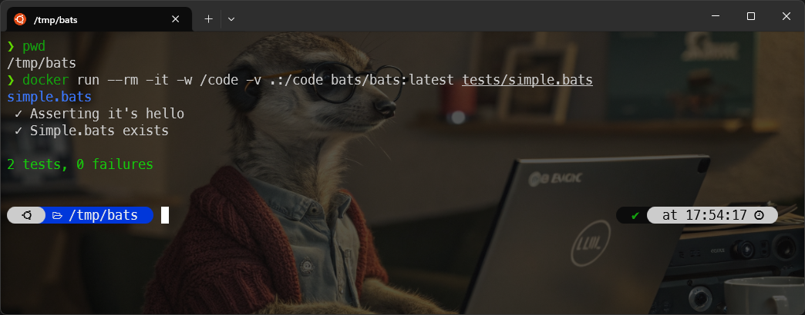
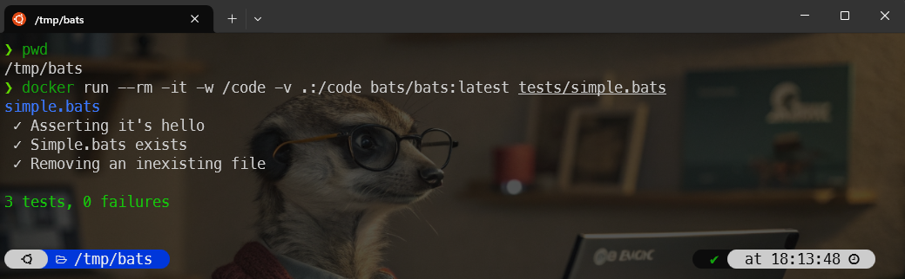

<!-- cspell:ignore imple -->


Like all command-line developers, I write Linux Bash scripts.  Like any programmer, I'm supposed to write unit tests. Well, I have to admit that I rarely write them.

Some time ago, I wrote a set of Bash scripts that make up a library of functions (just like a framework) and here, the interest in having unit tests is even greater since these functions are supposed to be stable and can be used as foundations for more advanced scripts.

In this article, we look at how to write unit tests for Bash scripts.

<!-- truncate -->

## Let's start with a little hors d'oeuvre

Like always, first, we'll create a new folder so we can play with some examples.

Please run `mkdir -p /tmp/bats && cd $_` to create a temporary folder and jump in it; then run `code .` to start VSCode and open the folder.

We'll create a simple illustration file, let's call it `tests/simple.bats` and copy/paste the following content:

<Snippet filename="tests/simple.bats">

```bash
#!/usr/bin/env bats

setup() {
    bats_load_library bats-support
    bats_load_library bats-assert
}

@test "Asserting it's hello" {
  run echo "hello"
  assert_output "hello"
  assert_success
}

@test "Simple.bats exists" {
  run ls simple.bats
  assert_output --regexp "[Ss]imple\.bats"
  assert_success
}
```

</Snippet>

And now, the very difficult part is, ouch no, really easy in fact, to run [Bats-core](https://bats-core.readthedocs.io/en/stable/):

<Terminal>
$ docker run --rm -it -w /code/tests -v .:/code bats/bats:latest simple.bats
</Terminal>

And ... it works.



### What did we do?

We've created a very basic example with two checks.

The first one is called *Asserting it's hello* and we've fired `echo "hello"` just like we can make in a Shell script. Then running `assert_output "hello"` we are checking the output of the fired command is `hello` and it's a success (so it's `hello` and nothing else)

This is done using this script:

<Snippet filename="tests/simple.bats">

```bash
@test "Asserting it's hello" {
  run echo "hello"
  assert_output "hello"
  assert_success
}
```

</Snippet>

And the second check is called *Simple.bats exists* and we're just doing a `ls simple.bats` and check if, for the illustration, `Simple.bats` or `simple.bats` is returned in the list of file (this, to illustrate the use of a regular expression).

<Snippet filename="tests/simple.bats">

```bash
@test "Simple.bats exists" {
  run ls simple.bats
  assert_output --regexp "[Ss]imple\.bats"
  assert_success
}
```

</Snippet>

### Asserting a failure

Of course we can also assert a failure. Edit your `simple.bats` file like this:

<Snippet filename="tests/simple.bats">

```bash
#!/usr/bin/env bats

setup() {
    bats_load_library bats-support
    bats_load_library bats-assert
}

@test "Asserting it's hello" {
  run echo "hello"
  assert_output "hello"
  assert_success
}

@test "Simple.bats exists" {
  run ls simple.bats
  assert_output --regexp "[Ss]imple\.bats"
  assert_success
}

# highlight-start
@test "Removing an inexistent file" {
  run rm INEXISTENT_FILE
  assert_failure
}
# highlight-end
```

</Snippet>

So, in the new test function, we'll just try to remove a not-existing file and we expect, for sure, a failure:



## Some real-world use cases

Imagine the following, simplified, tree structure:

<Terminal>
.
├── src
│   └── assert.sh
└── tests
    ├── assert.bats
</Terminal>

The file `src/assert.sh` contains your Linux shell code you want to test. Your test scenario should be stored in the `tests` folder. Since we'll write tests for the `src/assert.sh` file, let's create the  `tests/assert.bats`.

Below the content of the `src/assert.sh`. Let's start with a simple function: checking if a given binary is installed on the system or not. The name of the binary has to be passed as a parameter to the function.

<Snippet filename="src/assert.sh">

```bash
#!/usr/bin/env bash

function assert::notEmpty() {
    local -r variable="${1:-}"
    local -r errorMessage="${2:-"The variable can't be empty."}"

    [[ -z ${variable} ]] && echo "${errorMessage}" >&2

    return 0
}

function assert::binaryExists() {
    local -r binary="${1:-}"

    assert::notEmpty "${binary}" \
        "You should specify the name of the program whose existence needs to be checked."

    if [[ -z "$(command -v "$binary" || true)" ]]; then
        echo "The ${binary} binary wasn't found on your system." >&2
        exit 1
    fi

    return 0
}
```

</Snippet>

Below the content of the `tests/assert.bats`.

<Snippet filename="tests/assert.bats">

```bash
#!/usr/bin/env bats

setup() {
    bats_load_library bats-assert
    bats_load_library bats-support

    source ./../src/assert.sh

    # Create a dummy file every time a test function is called
    tmpFile="/tmp/bats/assert.tmp"
    [[ ! -d "/tmp/bats" ]] && mkdir "/tmp/bats"

    touch "${tmpFile}"
}

# Once the test function has been called, remove the temporary
teardown() {
    [[ -f "${tmpFile}" ]] && rm -f "${tmpFile}"
    return 0
}

@test "assert::binaryExists - Assert some binaries exists" {
    # clear is a native Linux command
    run assert::binaryExists "clear"

    # We expect thus binaryExists return a zero exit code (=success)
    assert_success

    # and no output message since it's successful
    assert_output ""


    # Another test with the native ls command
    run assert::binaryExists "ls"
    assert_output ""
    assert_success
}

@test "assert::binaryExists - Assert some binaries didn't exist" {
    run assert::binaryExists "fakeProgram"

    # Since fakeProgram didn't exist, we expect binaryExists exit with code 1
    assert_failure 1

    # We also expect this, exact, error message
    assert_output "The fakeProgram binary wasn't found on your system."
}
```

</Snippet>

The command line:

<Terminal>
$ docker run --rm -it -w /code/tests -v .:/code bats/bats:latest assert.bats
</Terminal>

By running it, we expect a success for the binaryExists for `clear` and `ls` commands (since well installed on our system) and we expect a failure for `fakeProgram` but, since we're using `assert_failure`, our tests scenario should work.

Let's add a check to see if a specific Docker image already exists or not on the system:

<Snippet filename="src/assert.sh">

```bash
#!/usr/bin/env bash

function assert::notEmpty() {
    local -r variable="${1:-}"
    local -r errorMessage="${2:-"The variable can't be empty."}"

    [[ -z ${variable} ]] && echo "${errorMessage}" >&2

    return 0
}

function assert::binaryExists() {
    local -r binary="${1:-}"

    assert::notEmpty "${binary}" \
        "You should specify the name of the program whose existence needs to be checked."

    if [[ -z "$(command -v "$binary" || true)" ]]; then
        echo "The ${binary} binary wasn't found on your system." >&2
        exit 1
    fi

    return 0
}

# highlight-start
function assert::dockerImageExists() {
    local -r imageName="${1:-}"
    local -r errorMessage="${2:-The Docker image \"$imageName\" did not exist}"

    assert::notEmpty "${imageName}" "You should specify the name of the Docker image whose existence needs to be checked."

    # When the image exists, "docker images -q" will return his ID (f.i. `5eed474112e9`), an empty string otherwise
    if [[ "$(docker images -q "$imageName" 2> /dev/null)" == "" ]]; then
        echo "${errorMessage}" >&2
        exit 1
    fi

    return 0
}
# highlight-end
```

</Snippet>

and the updated `tests/assert.bats` file:

<Snippet filename="tests/assert.bats">

```bash
#!/usr/bin/env bats

setup() {
    bats_load_library bats-assert
    bats_load_library bats-support

    source ./../src/assert.sh

    # Create a dummy file every time a test function is called
    tmpFile="/tmp/bats/assert.tmp"
    [[ ! -d "/tmp/bats" ]] && mkdir "/tmp/bats"

    touch "${tmpFile}"
}

# Once the test function has been called, remove the temporary
teardown() {
    [[ -f "${tmpFile}" ]] && rm -f "${tmpFile}"
    return 0
}

@test "assert::binaryExists - Assert some binaries exists" {
    # clear is a native Linux command
    run assert::binaryExists "clear"

    # We expect thus binaryExists return a zero exit code (=success)
    assert_success

    # and no output message since it's successful
    assert_output ""


    # Another test with the native ls command
    run assert::binaryExists "ls"
    assert_output ""
    assert_success
}

@test "assert::binaryExists - Assert some binaries didn't exist" {
    run assert::binaryExists "FakeProgram"

    # Since FakeProgram didn't exist, we expect binaryExists exit with code 1
    assert_failure 1

    # We also expect this, exact, error message
    assert_output "The FakeProgram binary wasn't found on your system."
}

# highlight-start
@test "assert::dockerImageExists - Assert docker image exists - using mockup" {
    # Mock - we'll create a very simple docker override and return a fake ID
    # This will simulate the `docker images -q "AN_IMAGE_NAME"` which return
    # the ID of the image when found
    docker() {
        echo "feb5d9fea6a5"
    }

    run assert::dockerImageExists "A-great-Docker-Image"
    assert_output ""
    assert_success
}

@test "assert::dockerImageExists - Assert docker image didn't exist - using mockup" {
    # Mock - we'll create a very simple docker override and return a fake ID
    # This will simulate the `docker images -q "AN_IMAGE_NAME"` which return
    # the ID of the image when found; here return an empty string to simulate
    # a non-existent image
    docker() {
        echo ""
    }

    run assert::dockerImageExists "Fake/image" "ERROR - Bad choice, that image didn't exist"
    assert_failure 1
    assert_output --partial "Bad choice, that image didn't exist"
}
# highlight-end
```

</Snippet>

## Another examples

### assert_equal

Simply verify that both values are equals. Here, we'll call a function that will return the length of an array and verify it's the expected value.

<Snippet filename="tests/simple.bats">

```bash
@test "array::length - Calculate the length of an array" {
    arr=("one" "two" "three" "four" "five")

    assert_equal $(array::length arr) 5
}

function array::length() {
    local -n array_length=$1
    echo ${#array_length[@]}
}
```

</Snippet>

### assert_failure

`assert::binaryExists` will exit 1 if the binary can't be retrieved. An error message like *The binary can't be found will be echoed on the console*.

<Snippet filename="tests/simple.bats">

```bash
@test "Assert binary didn't exist" {
    # Simulate which and return an error meaning "No, that binary didn't exist on the host"
    which() {
        exit 1
    }

    run assert::binaryExists "Inexistent_Binary" "Ouch, no, no, that binary didn't exist on the system"

    assert_failure

    assert_output --partial "Ouch, no, no, that binary didn't exist on the system"
}

function assert::binaryExists() {
    local binary="${1}"
    local msg="${2:-${FUNCNAME[0]} - File \"$binary\" did not exist}"

    [[ -z "$(which "$binary" || true)" ]] && echo "$msg" && exit 1

    return 0
}
```

</Snippet>

### assert_output

`assert_output` has two nice options: `--partial` and `--regexp`.

Using `--partial` will allow f.i. the check if the output contains some raw text like, for a help screen, a given sentence.

<Snippet filename="tests/simple.bats">

```bash
@test "Show the help screen" {
    source 'src/helpers.sh'

    arrArguments=("--help")

    run helpers::showHelp ${arrArguments[@]}

    assert_output --partial "Convert a revealJs slideshow to a PDF document"
}
```

</Snippet>

Using `--regexp` will allow to use a regular expression:

<Snippet filename="tests/simple.bats">

```bash
@test "Show the help screen" {
    source 'src/helpers.sh'
    arrArguments=("--input InvalidFile")
    run helpers::__process ${arrArguments[@]}
    assert_output --regexp "ERROR - The input file .* doesn't exist."
}
```

</Snippet>

### assert_success

`assert::binaryExists` will return 0 when the binary can be retrieved. The function will run in silent (no output).

<Snippet filename="tests/simple.bats">

```bash
@test "Assert binary exists" {
    run assert::binaryExists "clear" # clear is a native Linux command
    assert_output ""                 # No output when success
    assert_success
}

function assert::binaryExists() {
    local binary="${1}"
    local msg="${2:-${FUNCNAME[0]} - File \"$binary\" did not exist}"

    [[ -z "$(which "$binary" || true)" ]] && echo "$msg" && exit 1

    return 0
}
```

</Snippet>

### Check for ANSI colors

Imagine the following code:

<Snippet filename="script.sh">

```bash
__RED=31

function console::printRed() {
    for line in "$@"; do
        printf "\e[1;${__REd}m%s\e[0m\n" "$line"
    done
}
```

</Snippet>

We wish to check that the line will be echoed in red.

<Snippet filename="tests/simple.bats">

```bash
@test "console::printRed - The sentence should be displayed" {
    run console::printRed "This line should be echoed in Red"
    assert_output "�[1;31mThis line should be echoed in Red�[0m"
    assert_success
}
```

</Snippet>

### Check for multi-line output

Imagine the following code:

<Snippet filename="script.sh">

```bash
function console::banner() {
    printf "%s\n" "============================================"
    printf "= %-40s =\n" "$@"
    printf "%s\n" "============================================"
}
```

</Snippet>

This will write three lines on the console, like f.i.

```bash
# ============================================
# = Step 1 - Initialisation                  =
# ============================================
```

To check for multi-lines, use the `$lines` array like this:

<Snippet filename="tests/simple.bats">

```bash
@test "console::banner - The sentence should be displayed" {
    run console::banner "Step 1 - Initialisation"

    assert_equal "${lines[0]}" "============================================"
    assert_equal "${lines[1]}" "= Step 1 - Initialisation                  ="
    assert_equal "${lines[2]}" "============================================"

    assert_success
}
```

</Snippet>

### Check against a file

Imagine a function that will parse a file and f.i. remove some paragraphs. We need to check if the content is correct, once the function has been fired.

For this, imagine a `removeTopOfFileComments` function. The function will parse the file and remove the HTML comments (`<!-- ... -->`) present at the top of the file.

For the test, we'll create a file with three empty lines, then a HTML comment block, then two empty lines, then the HTML code. So, by removing the HTML comment, we'll have five empty lines followed by the HTML block so, we need to check our file contains six lines.

The tip used is:

* `cat --show-ends --show-tabs "$tempfile"` i.e. get the content of the file but with `$` where we've a line feed and, here, also `^I` for tabs.
* then we'll pipe the result with `tr "\n" "#"` so, instead of getting six lines, we'll get only one by replacing line feed by `#`.

Now, bingo, since we've a variable with only one line (in our example: `$#$#$#$#$#<html><body/></html>$#`), we can compare with our expectation:

<Snippet filename="tests/simple.bats">

<!-- cspell:disable -->
```bash
@test "html::removeTopOfFileComments - remove HTML comments - with empty lines" {
    tempfile="$(mktemp)"

    # Here, we'll have extra, empty, lines. They should be removed too
    echo '' >$tempfile
    echo '' >>$tempfile
    echo '' >>$tempfile
    echo '<!--  ' >>$tempfile # We also add extra spaces before the start tag
    echo '   Lorem ipsum dolor sit amet, consectetur adipiscing elit.' >>$tempfile
    echo '   Morbi interdum elit a nisi facilisis pulvinar.' >>$tempfile
    echo '   Vestibulum fermentum consequat suscipit. Vestibulum id sapien metus.' >>$tempfile
    echo '-->     ' >>$tempfile # We also add extra spaces after the end tag
    echo '' >>$tempfile
    echo '' >>$tempfile
    echo '<html><body/></html>' >>$tempfile

    run html::removeTopOfFileComments "$tempfile"

    # Get now the content of the file
    #   We expect three empty lines (the three first)
    #       The HTML comment has been removed
    #   Then there are two more empty line (so we'll five empty lines)
    #   And we'll have our "<html><body/></html>" block.
    #
    #   cat --show-ends --show-tabs will show the dollar sign (end-of-line) and f.i. ^I for tabulations
    #   tr "\n" "#" will then convert the line feed character to a hash so, in fact, fileContent will
    #   be a string like `$#$#$#$#$#<html><body/></html>$#`
    fileContent="$(cat --show-ends --show-tabs "$tempfile" | tr "\n" "#")"

    # Once we've our string, compare the fileContent with our expectation
    assert_equal "$fileContent" "\$#\$#\$#\$#\$#<html><body/></html>\$#"
}
```
<!-- cspell:enable -->

</Snippet>

### Check against a file using a regex

A second scenario can be: you have a write function (think to a logfile) and you want to check the presence of a given line in the file.

The example below relies on `bats-file` and his `assert_file_contains` method. That method asks for a filename and a regex pattern.

<Snippet filename="tests/simple.bats">

```bash
setup() {
    bats_load_library bats-support
    bats_load_library bats-assert
    bats_load_library bats-file

    #! "grep" without the "-P" argument seems to not support repetition like "\d{4}"
    #
    # a date like `2022-04-07`
    regexDate="[0-9][0-9][0-9][0-9]\-[0-9][0-9]\-[0-9][0-9]"
    # a time like `17:41:22`
    regexTime="[0-9][0-9]\:[0-9][0-9]\:[0-9][0-9]"
    # a time zone difference like "0200"
    regexUTC="[0-9]*" #! Should be [0-9][0-9][0-9][0-9] but didn't work???

    # The final pattern so we can match f.i. `[2022-04-07T18:00:20+0200] `
    __DATE_PATTERN="\[${regexDate}\T${regexTime}\+${regexUTC}.*\]\s"

    return 0
}

@test "log::write - Write a line in the log" {
    local sentence=""
    sentence="This is my important message"
    run write "${sentence}"

    assert_file_exist "/tmp/bats_log.tmp"

    echo "${__DATE_PATTERN}${sentence}" >/tmp/regex.tmp
    assert_file_contains "/tmp/bats_log.tmp" "${__DATE_PATTERN}${sentence}"
    assert_success
}
```

</Snippet>

### Check that a value is NOT in a file

Another use of the assert_failure can be to start a command like a grep and expect to get an error:

```bash
run grep "REGEX_SOMETHING_THAT_SHOULD_BE_MISSING" "/tmp/test.log"
assert_failure 1
```

### Some special functions

#### setup

The `setup` function is called before running a test. For each `@test` function present in the scenario, the `setup()` function will be called.

In the following example, since there are two test functions, `setup()` will be called twice.

<Snippet filename="tests/simple.bats">

```bash
setup() {
    bats_load_library bats-support
    bats_load_library bats-assert

    source 'src/env.sh'
}

@test "env::assertFileExists - Assert .env file exists - The path isn't initialised" {
    run env::assertFileExists
    assert_failure
}

@test "env::assertFileExists - Assert .env file exists - The file exists" {
    ENV_ROOT_DIR="/tmp"
    ENV_FILENAME=".env.bats.testing"
    touch ${ENV_ROOT_DIR}/${ENV_FILENAME}
    run env::assertFileExists
    assert_success
}
```

</Snippet>

#### teardown

Just like `setup`, the `teardown` function will be called for each test but once the test has been fired. This is the good place for, f.i., removing some files created during the execution of a test.

```bash
teardown() {
    rm -f /tmp/bats
}
```

### Running the tests

The command `docker run --rm -it -w /code/tests -v .:/code bats/bats:latest simple.bats` will run the `simple.bats` file while `docker run --rm -it -w /code/tests -v .:/code bats/bats:latest` will run all `.bats` file in the working directory.

#### Mocking

We can override a function during a test. Consider the following use case: we've a function that will return 0 when a give Docker image is present on the host. The function will return 1 and echo an error on the console if the image isn't retrieved.

<Snippet filename="script.sh">

```bash
function assert::dockerImageExists() {
    local image="${1}"
    local msg="${2:-The Docker image \"$image\" did not exist}"

    # When the image exists, "docker images -q" will return his ID (f.i. `5eed474112e9`), an empty string otherwise
    [[ "$(docker images -q "$image" 2>/dev/null)" == "" ]] && echo "$msg" && exit 1

    return 0
}
```

</Snippet>

So, we need to override the docker answer. When the image is supposed to be there, we just need to return a non-empty string, anything but not an empty string. Let's return a fake ID to really simulate the answer of `docker images -q`.

<Snippet filename="tests/simple.bats">

```bash
@test "Assert docker image exists" {
    # Mock - we'll create a very simple docker override and return a fake ID
    # This will simulate the `docker images -q "AN_IMAGE_NAME"` which return
    # the ID of the image when found
    docker() {
        echo "feb5d9fea6a5"
    }

    source assert.sh
    run assert::dockerImageExists "A-great-Docker-Image"
    assert_output "" # No output when success
    assert_success
}
```

</Snippet>

And return an empty string to simulate an inexistent image.

<Snippet filename="tests/simple.bats">

```bash
@test "Assert docker image didn't exist" {
    # Mock - we'll create a very simple docker override and return a fake ID
    # This will simulate the `docker images -q "AN_IMAGE_NAME"` which return
    # the ID of the image when found; here return an empty string to simulate
    # an inexistent image
    docker() {
        echo ""
    }

    source assert.sh
    run assert::dockerImageExists "Fake/image" "Bad choice, that image didn't exist"
    assert_output --partial "Bad choice, that image didn't exist"
    assert_failure
}
```

</Snippet>
