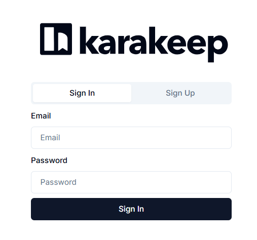
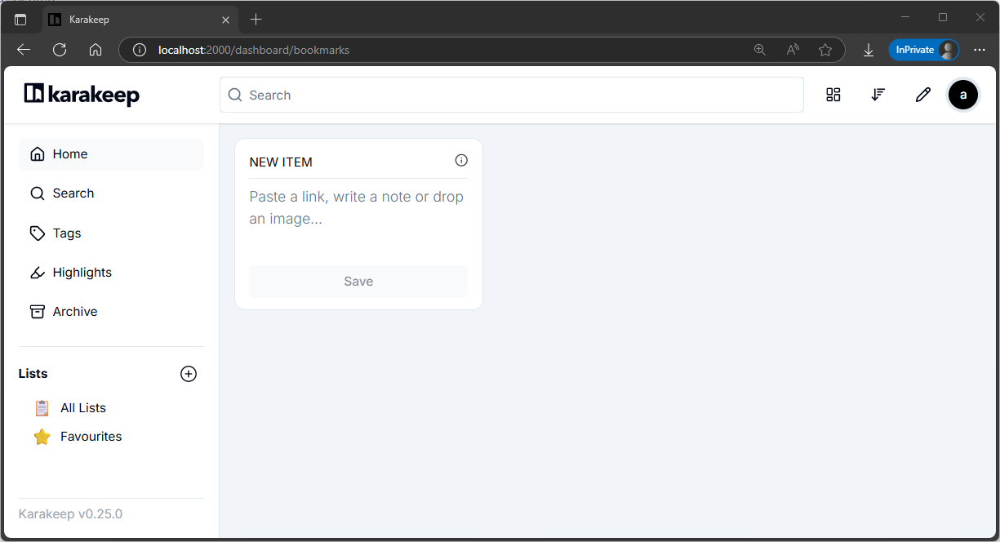
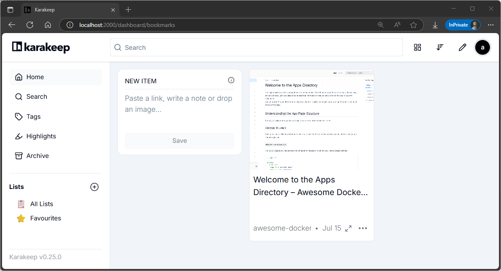
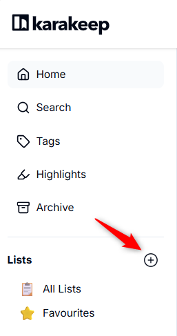
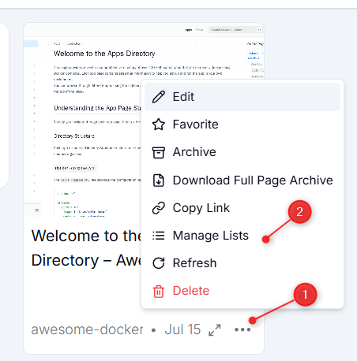
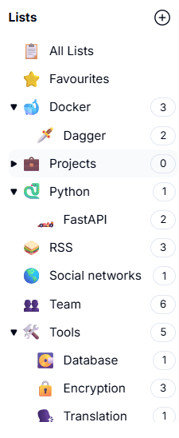

<!-- cspell:ignore karakeep,bitwarden -->


Since a few months, I'm using <Link to="/blog/heimdall-dashboard">Heimdall</Link> but it has one major weakness: its hyper-basic search engine (which is even non-existent, since it's not possible to search for a link globally).

So I was rather dissatisfied and waiting to find something better: karakeep.

It's a tool that you can self-host and which is a bookmarks, note-taking and even image manager that works very simply.

And the search engine is quite powerful. Overall, karakeep is a pleasure to use.

Let's look at how to install it.

<!-- truncate -->

## Let's install karakeep

Please create a folder like `mkdir ~/tools/karakeep && cd $_`. In that folder, please create a `compose.yaml` file with the content below:

<Snippet filename="compose.yaml">

<!-- cspell:disable -->
```yaml
name: tools

services:
  web:
    image: ghcr.io/karakeep-app/karakeep:${KARAKEEP_VERSION:-release}
    restart: unless-stopped
    volumes:
      - ./data:/data
    ports:
      - 2000:3000
    env_file:
      - .env
    user: ${UID:-1000}:${GID:-1000}
    environment:
      MEILI_ADDR: http://meilisearch:7700
      BROWSER_WEB_URL: http://chrome:9222
      DATA_DIR: /data

  chrome:
    image: gcr.io/zenika-hub/alpine-chrome:123
    restart: unless-stopped
    command:
      - --no-sandbox
      - --disable-gpu
      - --disable-dev-shm-usage
      - --remote-debugging-address=0.0.0.0
      - --remote-debugging-port=9222
      - --hide-scrollbars

  meilisearch:
    image: getmeili/meilisearch:v1.13.3
    restart: unless-stopped
    env_file:
      - .env
    environment:
      MEILI_NO_ANALYTICS: "true"
    volumes:
      - meilisearch:/meili_data

volumes:
  meilisearch:
```
<!-- cspell:enable -->

</Snippet>

:::note
The line `user: ${UID:-1000}:${GID:-1000}` will ask Docker to use a specific user (not the `root` one) while creating files on your disk.

The user `1000:1000` is, in the most cases, you i.e. it's your current Linux user (type `id -u` and, then, `id -g` to retrieve your user ID and your group ID and you'll see it'll be `1000` for both).

If yours IDs are not `1000`, please edit the yaml file and put yours IDs instead.
:::

:::info
Compared with the default Docker configuration, I've made one change, which is to store the data on the hard disk rather than using a Docker volume.

I had to reinstall Karakeep following a configuration change and I had to export the volume to retrieve the data (Docker Desktop offers this feature).

To avoid this situation, I might as well keep the files immediately on my hard disk.
:::

Once the `compose.yaml` file has been created, in your console, now, just run `docker compose up --build --detach`.

You've now karakeep running. Surf to `http://localhost:2000/` and you'll get this screen:



Because it's your first time, click on `Sign Up` and let's create a new user. karakeep will force the password to respect some rules so, once defined, don't forget to add it in your password safe program (Bitwarden for my own).

You'll get the dashboard:



## Add a bookmark

And now, it's really piece of cake; just click in the **New Item** text area and start to type something (it can be pure text like a reminder note or a website URL).

I'll type `https://awesome-docker-compose.com/apps` and save it and immediately, I'll get this:



As you can see, karakeep has grab a picture of the web page.

## Adding to a list

First, create a list and fill in the different options (name, icon, ...):



Being back to the dashboard, click on the `...` button of the desired item and click on the `Manage Lists` option to be able to create a new list:



It's also possible to create a list as a child of an existing one and thus, you can easily do something like this:



### Tips - Select a list before adding an item

By first selecting a list, new items will be adding directly to that list.

## Extra features

### Import / Export

By clicking on your profile avatar (top right) then on `User Settings` you will be able to a.o.t. access to an `Import / Export` feature. It's good to know; you can import from a lot of sources and, too, export as a JSON or a HTML page.

## More info

Please refer to the official [https://karakeep.app/](https://karakeep.app/) site to get more info.
