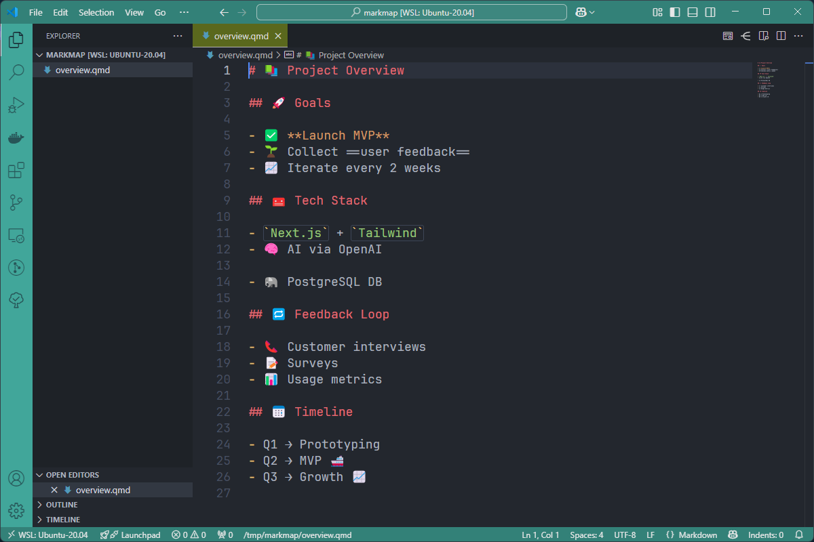
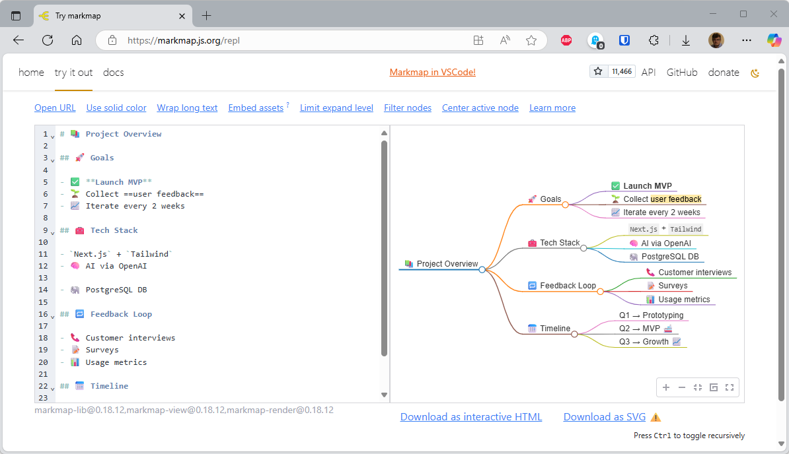
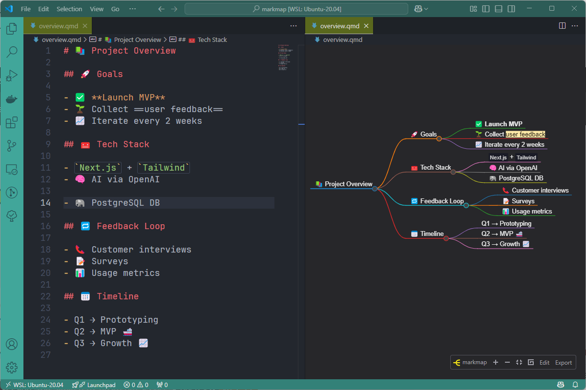
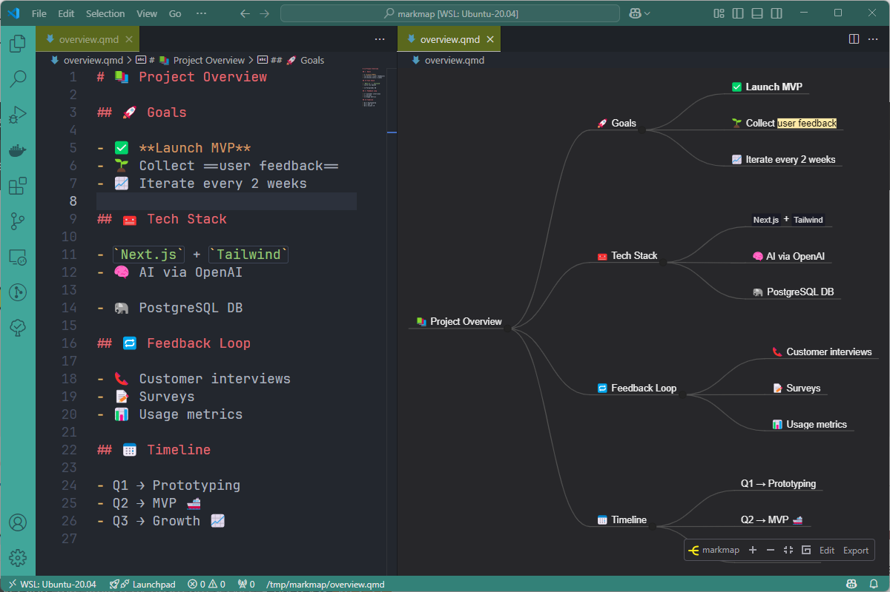
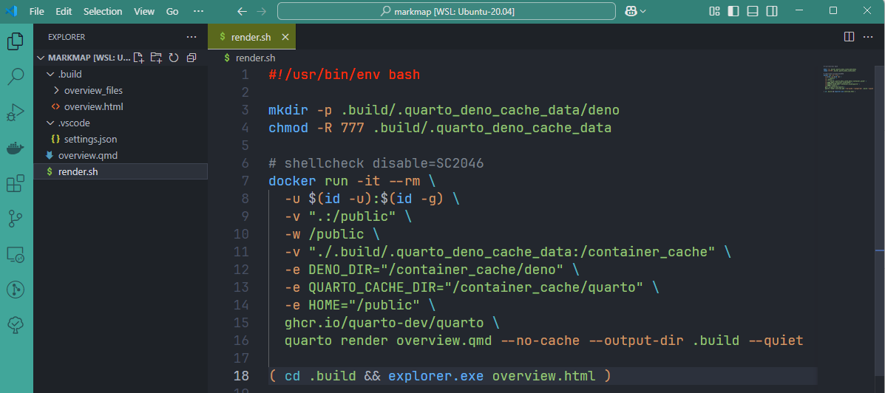
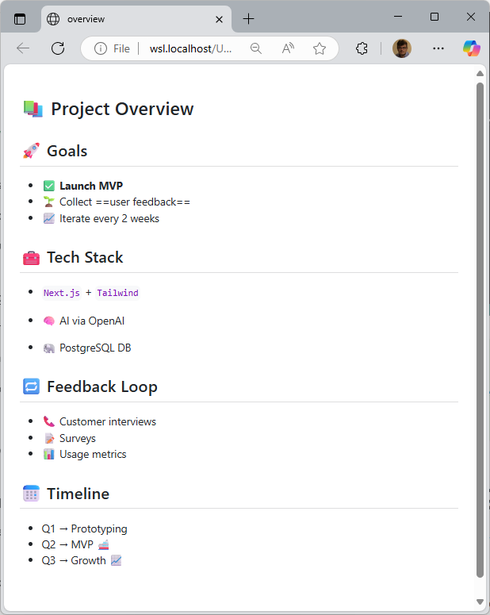

In 2023, I wrote this <Link to="/blog/docker-mindmap">Build a mind map using Docker and Markdown</Link> blog post about how to render a Markdown document as a mindmap.

This time, I would like to go one step further and make it more attractive.

<!-- truncate -->

Let's start by the beginning: please start VSCode, create a new file. Because we'll do a little more than this, let's create a new folder: `mkdir -p /tmp/markmap && cd $_`.

Please create a Markdown file there f.i. `overview.qmd`.  The `.qmd` extension is just to tell *This is a Markdown file and we foresee to use it with Quarto*; nothing really special here.

<Snippet filename="overview.qmd" source="./files/overview.qmd" />

<AlertBox variant="note" title="">
The content of the `overview.qmd` file here above has been generated by AI.

</AlertBox>

So, we'll have this:

## Render the markmap online

Jump to [https://markmap.js.org/repl](https://markmap.js.org/repl) and paste the Markdown content to immediately get a first rendering:

Ok, it works but not really impressive.

## Installing the VSCode extension

There is a Markmap extension on the marketplace; jump to [https://marketplace.visualstudio.com/items?itemName=gera2ld.markmap-vscode](https://marketplace.visualstudio.com/items?itemName=gera2ld.markmap-vscode) to Install it.

Once installed in VSCode, press <kbd>CTRL</kbd>+<kbd>SHIFT</kbd>+<kbd>P</kbd> to open the *Command Palette* and then search for `Markmap`, please select `Markmap: open as markmap` and press <kbd>Enter</kbd>.

You'll get almost the same output than the online version:

### Configuring the rendering

By creating a `.vscode/settings.json` file, you can specify some CSS and default options i.e. by configuring the Markmap-vscode extension.

Please create the `.vscode/settings.json` file with this content:

<Snippet filename="overview.qmd" source="./files/overview.part2.qmd" />

Save the file, go back to the `overview.qmd` file and if needed, run `Markmap: open as markmap` again.

The preview will be better:

<AlertBox variant="info" title="Read the doc">
The list of existing options are documented on the official site: [https://markmap.js.org/docs/json-options](https://markmap.js.org/docs/json-options)

</AlertBox>

## Rendering as a HTML page using Quarto

The last step for this article, let's render our Markdown content as a nice HTML page; this by using Quarto.

Let's create a new file: `render.sh` with the following content:

<Snippet filename="render.sh" source="./files/render.sh" />

Please make this file executable by running `chmod +x render.sh`.

Now, time to call it: in your console, please run `./render.sh` to execute the script.

The very first time, it'll be longer because Docker has to download the Quarto Docker image (`ghcr.io/quarto-dev/quarto`).

The script will call Quarto, do some initializations and convert the `overview.qmd` file as an HTML page that will be stored in a newly `.build` folder.

So, after you have fired the script, you'll then have this structure in your project:

The nice thing is: Quarto has rendered your Markdown content as a beautiful page; which was the objective of this blog post:

## Conclusion

It's very easy to write a MindMap-type structure and generate either an image or a web page. We could go even further with Quarto, because a web page can be customized using CSS.

And, because it's a web page, you can easily copy and paste the rendering into an email, Word document or anything else and get a pretty cool visual for what was originally just a simple list.
