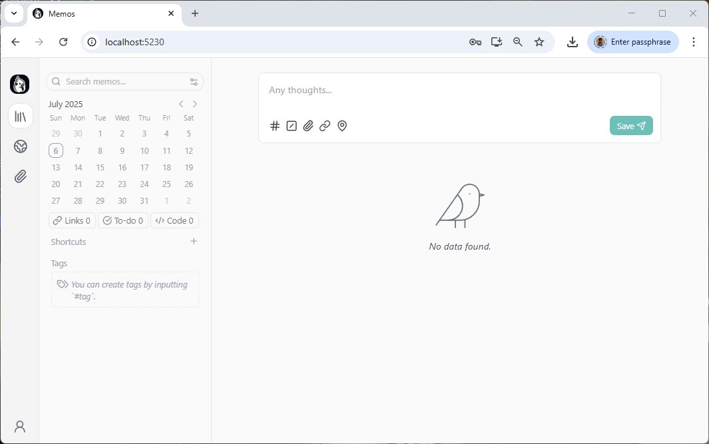

<!-- cspell:ignore neosmemo -->


As a developer, I'm working all day on a computer and sometimes (too often in fact), at the end of the day, I send myself an email for tomorrow's me *Don't forget to ...*, *you have to continue [a task]*, *I stopped at [a file], I've to continue the others*, in short, I use my inbox like a to-dos/to-remember manager.

Can we do better? Of course, but which tool should I choose?

What I'd like: to be able to write notes very easily, for some notes to be tasks (a checkbox is enough for me) and for me to be able to copy/paste images such as a screenshot.

Ideally, I'd like to have a local website that I can consult every day as a reminder.

Simplicity is the key.

<!-- truncate -->

There are a lot of applications but, because I really need one simple and fast (it's the end of the day, I should leave for my train, hop hop, a few seconds, ok, the note for tomorrow has been created), I've tried **[memos](https://www.usememos.com/)** and I appreciate it a lot.


## Let's install memos

This time, I will not suggest to use the temporary folder since we'll need to keep track of our notes, pasted images, ... on our disk during the next couple of days, weeks or months.

So, please run `mkdir -p  ~/tools/memos && cd $_` to create a folder in your home directory and jump in it.

Then, please create a file called `compose.yaml` with this content:

<Snippet filename="compose.yaml">

```yaml
name: tools

services:
  memos:
    image: neosmemo/memos:stable
    container_name: memos
    init: true
    user: ${UID:-1000}:${GID:-1000}
    ports:
      - "5230:5230"
    volumes:
      - ./data:/var/opt/memos
    restart: unless-stopped
```

</Snippet>

:::note
The line `user: ${UID:-1000}:${GID:-1000}` will ask Docker to use a specific user (not the `root` one) while creating files on your disk.

The user `1000:1000` is, in the most cases, you i.e. it's your current Linux user (type `id -u` and, then, `id -g` to retrieve your user ID and your group ID and you'll see it'll be `1000` for both).

If yours IDs are not `1000`, please edit the yaml file and put yours IDs instead.
:::

In your console, now, just run `docker compose up --build --detach`.

In just six seconds, memos has been installed on my machine and a container has been created:


Go to `http://localhost:5230` and you'll see the website is already running:


:::tip
See on the bottom left; it's possible to select another language; French is supported f.i.
:::

I'll create my account (`admin/admin` since I'm working on my localhost) and I'm ready to create my first note. It took me less than one minute until now.



Click in the `Any thoughts...` edit box and start to type your thought... For instance:

```markdown
**Python Codebase - User Authentication Module:**

- [ ] Implement password hashing using bcrypt.
- [ ] Create user registration endpoint (`/register`).
- [ ] Develop user login endpoint (`/login`) with JWT token generation.
```


By pressing the `Save` button, the note is created. It's clean and, tomorrow, oh nice, oh yes, that's true, I need to do these three things.

Imagine it's tomorrow and I've achieved the first one, I just need to check the box and it's automatically saved:


I can still edit, pin, delete, archive, ... the task using the three-dots button:


## Let's create a few more tasks

As you can see, even it's optional, let's assign one or more tags to a note. Simply by using the hash syntax:

```markdown
**Python Codebase - User Authentication Module:** #python

- [x] Implement password hashing using bcrypt.
- [ ] Create user registration endpoint (`/register`).
- [ ] Develop user login endpoint (`/login`) with JWT token generation.
```

```markdown
Investigate and resolve the bug in the budgetary application that occurs when initializing a new financial exercise. #budget
```

```markdown
Write the missing documentation for the new user authentication module, covering API endpoints, data models, and setup instructions. #python
```

```markdown
Review the Dockerfile for the user authentication service to ensure optimal image size and security practices. #docker #python
```


## Filtering using tags

When you've used tags, you'll see them immediately bottom left under `Tags`. Simply click on a tag to filter on it. You can click on more than ones if you want. In the example below, I've three notes for `Python` and just one with the Docker tag:


## Creating shortcuts

Next to tags, you can use more sophisticated filters like what memos call `shortcut`.


The used filter is `has_task_list && tag in ["python"]`.

Now, just click on the filter to enable it. You'll just see one task (because the other tasks with the `python` tag didn't have a checkbox). Really easy no?

[Learn more about writing filters](https://www.usememos.com/docs/getting-started/shortcuts#how-to-write-a-filter)

## Pasting images

Just like you do in any modern application, copy the image in the clipboard and paste it in the text area. Add if you want some text.

## Customization

By clicking on the bottom left profile icon, you can update the application's settings like setting `Monday` as the first day of the week (for the top left calendar).

You can also inject some CSS / Javascript to customize the look&feel of memos.

## Conclusions

As introduced in the preamble, personally, it's more than enough for my needs. I wanted something ultra-simple (a tab in my browser) and the ability to write my notes very quickly (with Markdown support), the possibility of having checkboxes and being able to copy/paste a screenshot.

Memos go a step further with tag and shortcut management, and the ability to restrict the to-do list to a calendar period.

And it's all 100% free!

## More info

Please refer to the official [https://www.usememos.com](https://www.usememos.com) site to get more info.
