<!-- cspell:ignore fastapi,uvicorn,hobbyte,keyserver,usebruno,ECONNREFUSED,davidkarlsen -->


<Link to="/blog/tags/postman">Bruno](https://www.usebruno.com/) is a tool like [Postman</Link> you can use for free. Everything is stored on your computer so you can store files within your codebase and submit it to your code versioning tool f.i.

<!-- truncate -->

## Let's install our own APIs first

A few months ago, I wrote <Link to="/blog/python-fastapi">"Python - Fast API - Create your JSON API in Python in one minute"</Link>.

In short, please:

1. Run `mkdir /tmp/fastapi && cd $_` to create a temporary folder and jump in it
2. Create a `Dockerfile` with the content below

    <Snippet filename="Dockerfile">

    ```docker
    # We'll use the latest version of Python and the smaller image in size (i.e. `slim`)
    FROM python:slim

    # We'll define the default folder in the image to /app
    WORKDIR /app

    # The only dependency we need is fastapi
    RUN pip install --no-cache-dir fastapi[standard]

    # We need to copy our Python script in the image
    COPY main.py main.py

    # Run Uvicorn with hot reload so any changes to our main.py script will force
    # the server to invalidate the cache and refresh the page.
    CMD ["uvicorn", "main:app", "--reload", "--host", "0.0.0.0", "--port", "82"]
    ```

    </Snippet>

3. Create a `main.py` with the content below

    <Snippet filename="main.py">

    ```python
    from random import choice
    from fastapi import FastAPI

    app = FastAPI()

    jokes = [
        "Why do programmers always mix up Halloween and Christmas? Because Oct 31 == Dec 25",
        "Why don't programmers like nature? Because it's full of bugs!",
        "How many programmers does it take to change a light bulb? None. That's a hardware problem.",
        "What do you call 8 hobbits? A hobbyte",
        "What is this [“hip”, ”hip”]? hip hip array!"
    ]

    @app.get("/jokes")
    async def get_jokes():
        """
        Returns a random joke from the list.
        """
        return {"joke": choice(jokes)}

    @app.get("/jokes/{joke_id}")
    def read_item(joke_id: int):
        """
        Returns a specific joke (between 0 and 4).
        """
        try:
            return {"joke": jokes[joke_id]}
        except IndexError:
            return {"error": f"Joke with ID {joke_id} not found."}, 404
    ```

    </Snippet>

4. Run the `docker build -t python-fastapi . && docker run --detach -v .:/app -p 82:82 python-fastapi` command to run the server.

5. Start a browser and open the `http://127.0.0.1:82/jokes` site to see a first joke (press <kbd>F5</kbd> to get a new one; random)

## Install Bruno

To install Bruno GUI on my Ubuntu distribution, I'm running these commands:

<Terminal>
$ sudo mkdir -p /root/.gnupg

$ sudo chmod 700 /root/.gnupg

$ sudo mkdir -p /etc/apt/keyrings

$ sudo gpg --no-default-keyring --keyring /etc/apt/keyrings/bruno.gpg --keyserver keyserver.ubuntu.com --recv-keys 9FA6017ECABE0266

$ echo "deb [signed-by=/etc/apt/keyrings/bruno.gpg] http://debian.usebruno.com/ bruno stable" | sudo tee /etc/apt/sources.list.d/bruno.list

$ sudo apt update

$ sudo apt install bruno

</Terminal>

Please refers to the [Download & Install](https://docs.usebruno.com/get-started/bruno-basics/download) official documentation for more info.

## Run Bruno

Once installed, just start `bruno` from the command line to start the interface:

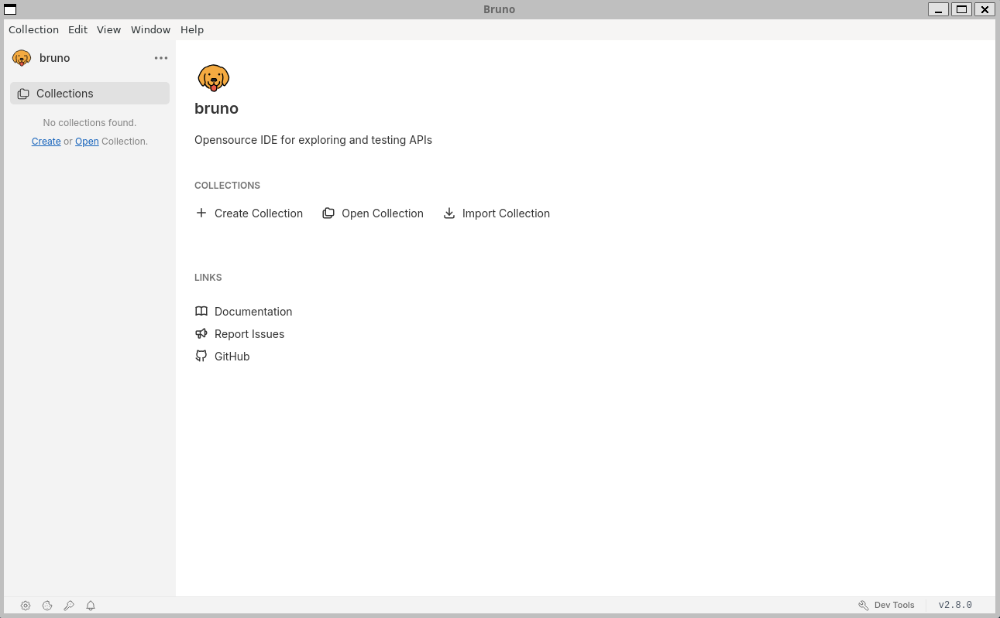

First thing first, let's create a collection:

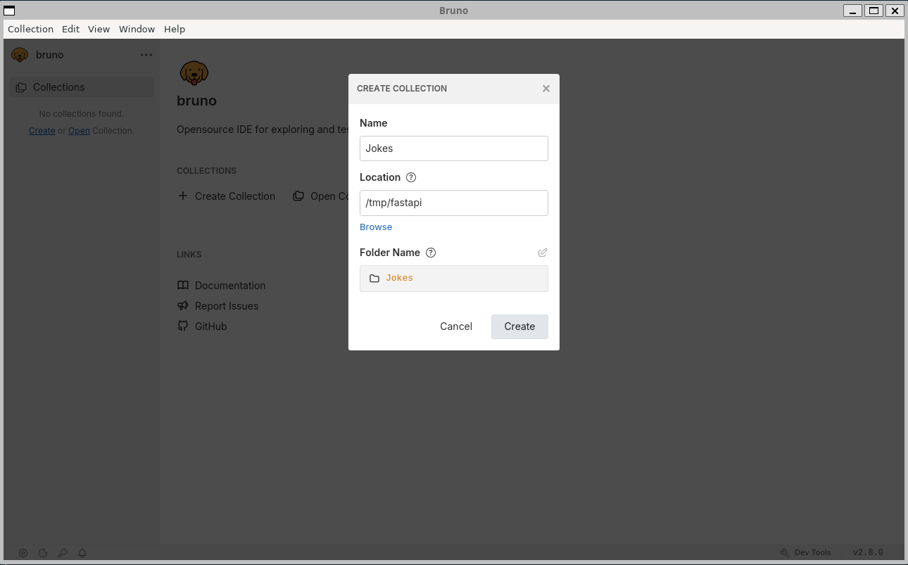

And, because we're smart, let's create an environment too (so we can define our website root URL once):

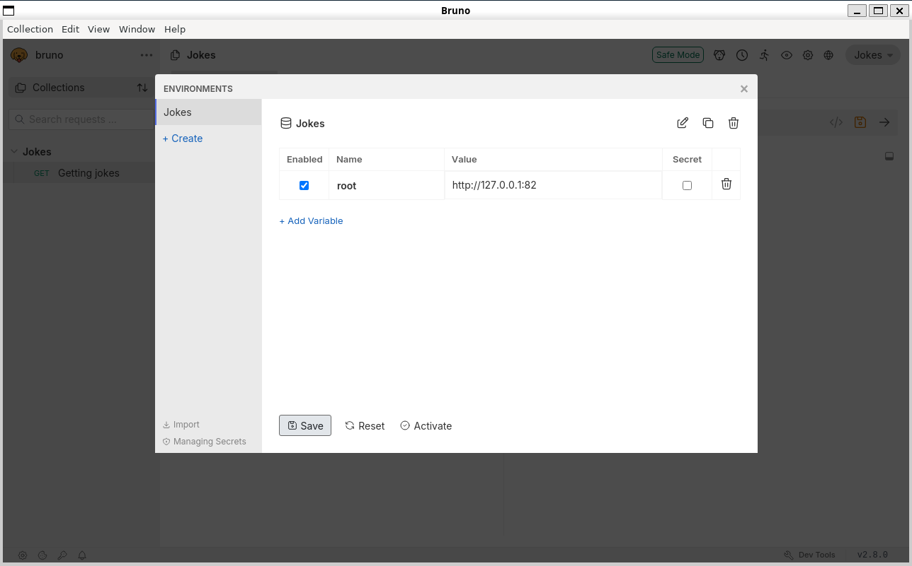

Now, we're ready, let's create a new request:

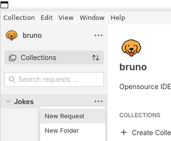

Getting a random joke:

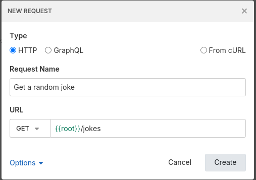

Once the request has been created, press <kbd>CTRL</kbd>+<kbd>ENTER</kbd> or click on the right arrow:

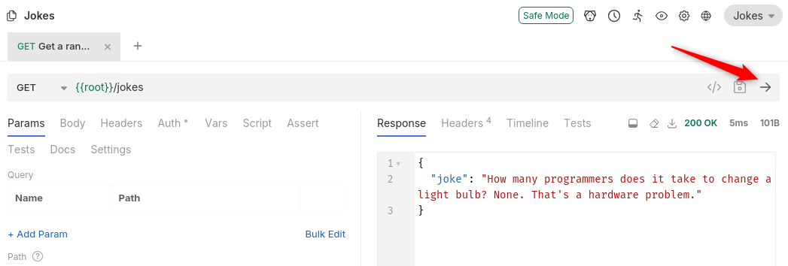

## Opening the project with VSCode

By opening the project in VSCode, we can see there is a new folder called `Jokes` (our collection) with a very few files like `environments/dev.bru` where we can find our environment's variables, a `bruno.json` generic file then our request in `Get a random joke.bru`.

Very clean structure no?

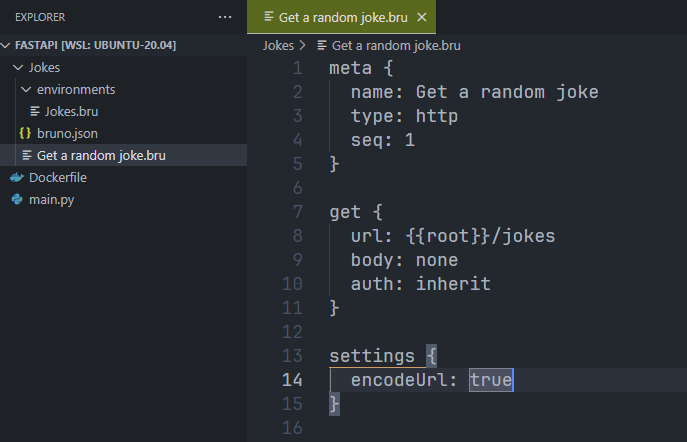

## Running requests from the command line

Bruno comes with a [Docker image](https://hub.docker.com/r/alpine/bruno): it'll help us to automate the execution of our requests from the command line.

:::caution
Mid-july 2025, I wasn't able to make this image working as expected. I was facing *Cannot read properties of undefined (reading 'headers')* errors even when, I think, everything was correctly configured.

For that reason, I've searched for another image and I've found that one [davidkarlsen/bruno-image](https://github.com/davidkarlsen/bruno-image) but, no luck, even the last version at that time (version 2.7.0) was giving a problem.

By looking at the [Dockerfile](https://github.com/davidkarlsen/bruno-image/blob/main/Dockerfile), I've seen the file was really easy and a newer version of [Bruno was released](https://github.com/usebruno/bruno/tags); version 2.8.

So, in short, I'll create my own Docker image and check if things are better.
:::

### Create our own Bruno CLI image

Let's create a file `bruno.Dockerfile` with the following content:

<Snippet filename="bruno.Dockerfile">

```docker
FROM node:lts-bookworm-slim
// highlight-next-line
RUN npm install -g @usebruno/cli@2.8.0
ENTRYPOINT ["bru"]
CMD ["run"]
```

</Snippet>

We'll create our image like this: `docker build --file bruno.Dockerfile  -t bruno-image .` (we can check our image by running `docker run -it --rm bruno-image --version`; we should see `2.8.0`).

As we've just seen:

* Our collection is stored in the `Jokes` folder and
* our environment is stored in the `environments/dev.bru`.

With this in mind, just run `docker run -it --rm -v "./Jokes":/apps -w /apps alpine/bruno run --env=dev`

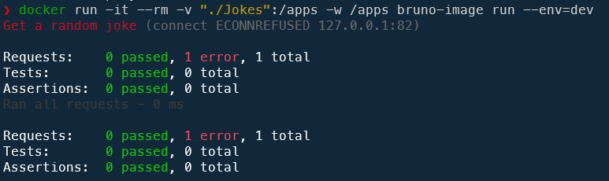

Ok, something goes wrong. We've fired one request and it has failed. But when running the request from Bruno GUI, it was well working. Why? The answer is: because we are using Docker.

### Understanding why the Bruno CLI Docker container didn't work

Look at the `connect ECONNREFUSED 127.0.0.1:82` error message: the Bruno CLI container is trying to access to the 127.0.0.1 webserver but, no, the webserver is running on our host. We've to find a proper way to tell Bruno to reuse our host.

Let's look back at the `environments/dev.bru`:

```none
vars {
  root: http://127.0.0.1:82
}
```

We've created a `root` variable and assign it to `http://127.0.0.1:82` and when we run Bruno GUI, it works.

Why? Because the GUI is running on our host and `127.0.0.1` is our machine. If we do a `curl -v http://127.0.0.1:82/jokes` from the command line, it's works too.

<!-- cspell:disable -->

<Terminal>
$ curl -v http://127.0.0.1:82/jokes
{`
* Uses proxy env variable no_proxy == 'localhost,127.0.0.1,*.local'
*   Trying 127.0.0.1:82...
* TCP_NODELAY set
* Connected to 127.0.0.1 (127.0.0.1) port 82 (#0)
> GET /jokes HTTP/1.1
> Host: 127.0.0.1:82
> User-Agent: curl/7.68.0
> Accept: */*
>
* Mark bundle as not supporting multiuse
< HTTP/1.1 200 OK
< date: Wed, 23 Jul 2025 08:36:40 GMT
< server: uvicorn
< content-length: 72
< content-type: application/json
<
* Connection #0 to host 127.0.0.1 left intact
\{"joke":"Why don't programmers like nature? Because it's full of bugs!"}
`}
</Terminal>

<!-- cspell:enable -->

We should thus find a solution to make the Bruno Docker CLI container use the correct IP.

### We'll use a new configuration file

Please create the `environments/dev-docker.bru` file like this:

```none
vars {
  host: http://host.docker.internal:82
}
```

That file won't work from the Bruno GUI: we'll be able to select `dev` and it'll work but not `dev-docker`

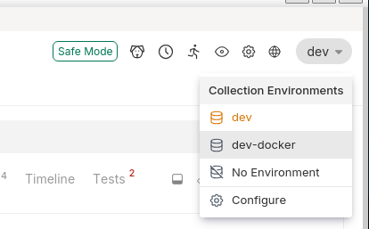

But from Bruno CLI container it'll works:

<Terminal>
$ docker run -it --rm -v "./Jokes":/apps -w /apps \
  --add-host host.docker.internal:host-gateway \
  bruno-image run --env=dev-docker
</Terminal>

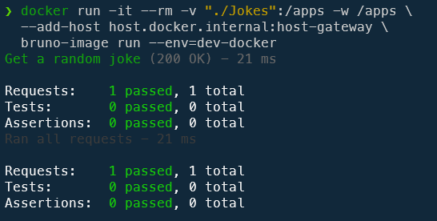

## Adding some assertions

For sure, the idea of the CLI tool is to be able to run assertions from the command line and make sure the API is still working.

Let's update the `Get a random joke.bru` file like this:

<Snippet filename="Get a random joke.bru">

```none
meta {
  name: Get a random joke
  type: http
  seq: 1
}

get {
  url: {{host}}/jokes
  body: none
  auth: none
}

<!-- highlight-start -->
assert {
  res.status: eq 200
  res.headers["content-type"]: isDefined
  res.headers["content-type"]: isString
  res.headers["content-type"]: contains "application/json"
  res.body.joke.length: gt 0
  res.body.joke: isString
}
<!-- highlight-end -->

settings {
  encodeUrl: true
}
```

</Snippet>

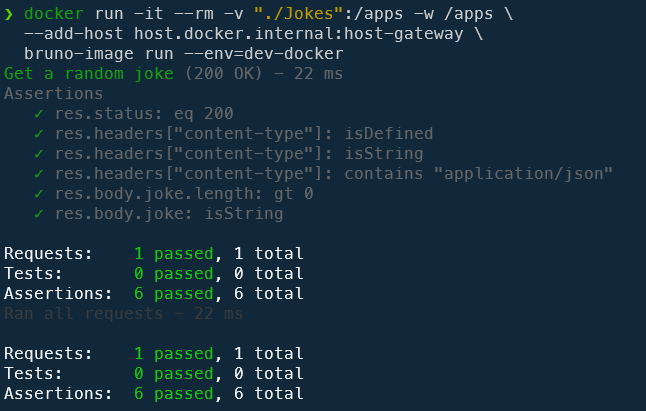
