<!-- cspell:ignore fastapi,uvicorn,hobbyte,keyserver,usebruno,ECONNREFUSED,davidkarlsen -->


<TLDR>
This article introduces Bruno, a free, open-source alternative to Postman for API testing. It guides you through setting up a sample Python FastAPI, and then using both the Bruno GUI and CLI to test it. You'll learn how to create requests, manage environments, and run tests from the command line using Docker, including how to handle common networking challenges. The post also covers adding assertions to your tests for validation.
</TLDR>

[Bruno](https://www.usebruno.com/) is a tool like Postman you can use for free. Everything is stored on your computer so you can store files within your codebase and submit it to your code versioning tool f.i.

*Because those files live in your repository, the CLI part of Bruno turns naturally into a CI job — see <Link to="/blog/gitlab-docker-out-of-docker">GitLab - Running Docker-out-of-Docker in your CI</Link>. And to check the API's contract rather than its answers, there's <Link to="/blog/belgif-api-linter">Validate your OpenAPI schema against the Belgif REST standards</Link>.*

<!-- truncate -->

## Run Bruno

Once installed, just start `bruno` from the command line to start the interface:

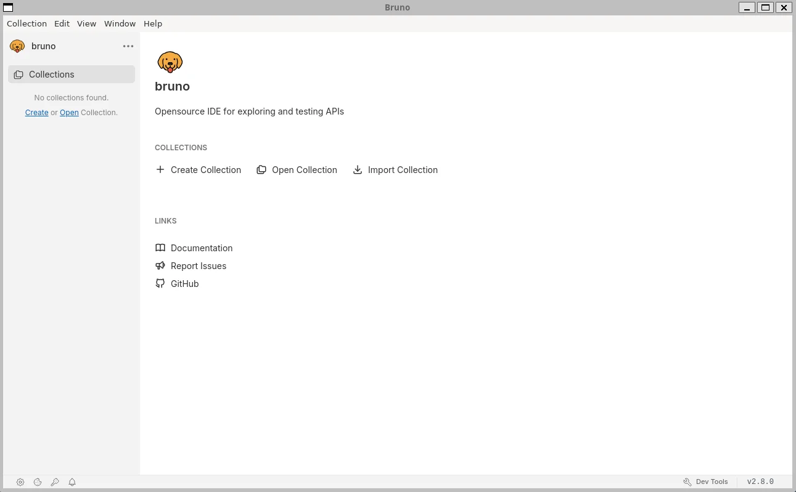

First thing first, let's create a collection:

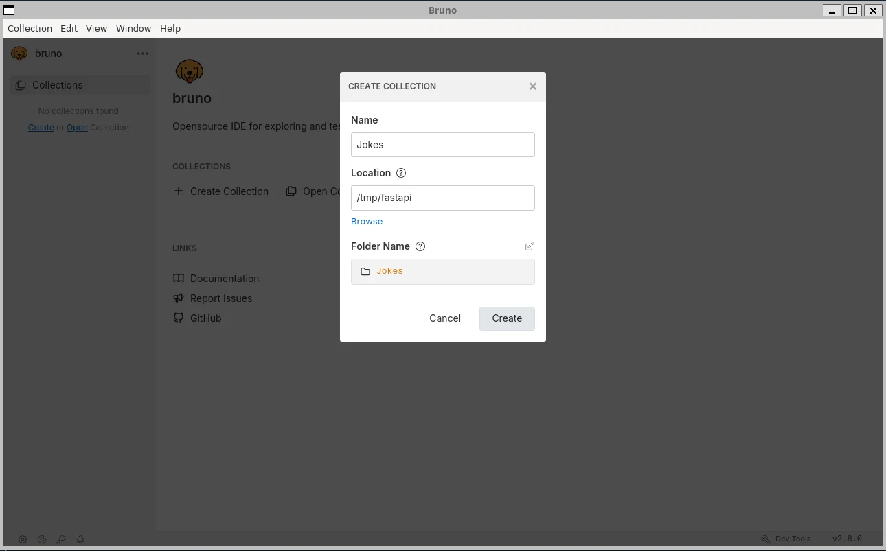

And, because we're smart, let's create an environment too (so we can define our website root URL once):

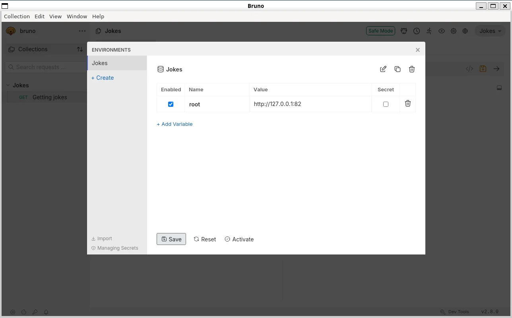

Now, we're ready, let's create a new request:

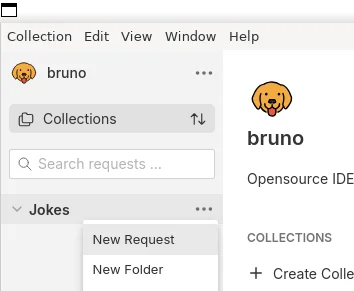

Getting a random joke:

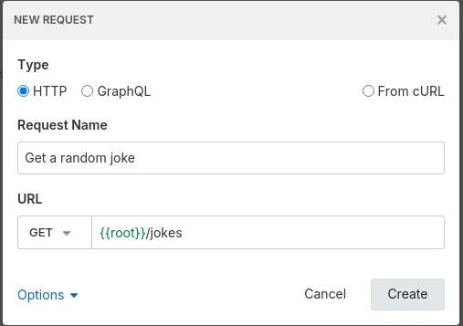

Once the request has been created, press <kbd>CTRL</kbd>+<kbd>ENTER</kbd> or click on the right arrow:

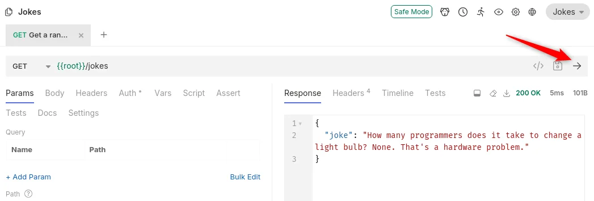

## Why It Works

- Everything — collection, environments, requests — is stored as plain `.bru` text files in your repo, so a request diffs and reviews like code.
- The same collection runs two ways: click-and-explore in the GUI, or scripted checks from the CLI — no separate tool to keep in sync.
- A collection maps to a single, clean folder (see the *Opening the project with VSCode* section below); nothing lives in a database or a cloud account you don't control.

## Installation

To install Bruno GUI on my Ubuntu distribution, I'm running these commands:

<Terminal typewriter source="./files/terminal-2.txt" />

Please refer to the [Download & Install](https://docs.usebruno.com/get-started/bruno-basics/download) official documentation for more info.

<Details label="Optional - Spin up a test API to try Bruno against (click for the details)">

Bruno needs something to talk to. If you don't already have an API handy, here's a one-minute FastAPI test API borrowed from <Link to="/blog/python-fastapi">"Python - Fast API - Create your JSON API in Python in one minute"</Link>:

<StepsCard
  variant="steps"
  steps={[
    "Run `mkdir /tmp/fastapi && cd $_` to create a temporary folder and jump in it",
    "Create a `Dockerfile` with the content below",
    "Create a `main.py` with the content below",
    "Run the `docker build -t python-fastapi . && docker run --detach -v .:/app -p 82:82 python-fastapi` command to run the server",
    "Start a browser and open the `http://127.0.0.1:82/jokes` site to see a first joke (press F5 to get a new one; random)"
  ]}
/>

<Snippet filename="Dockerfile" source="./files/Dockerfile" />

<Snippet filename="main.py" source="./files/main.py" />

</Details>

## Opening the project with VSCode

By opening the project in VSCode, we can see there is a new folder called `Jokes` (our collection) with very few files like `environments/dev.bru` where we can find our environment's variables, a `bruno.json` generic file then our request in `Get a random joke.bru`.

Very clean structure no?

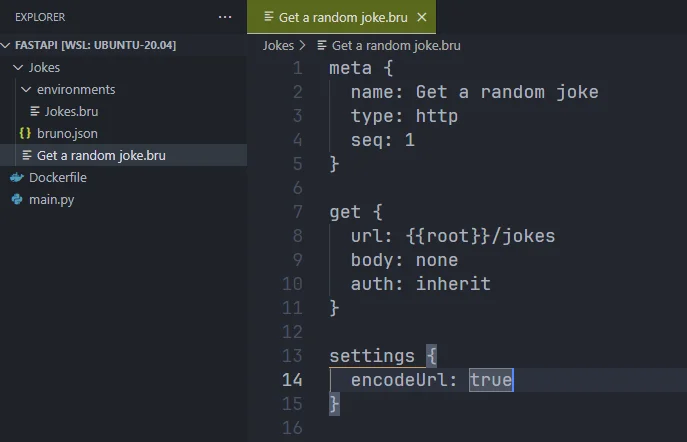

## Running Requests From the Command Line

Bruno comes with a [Docker image](https://hub.docker.com/r/alpine/bruno): it'll help us to automate the execution of our requests from the command line.

<AlertBox variant="caution">
Mid-July 2025, I wasn't able to make this image working as expected. I was facing *Cannot read properties of undefined (reading 'headers')* errors even when, I think, everything was correctly configured.

For that reason, I've searched for another image and I've found that one [davidkarlsen/bruno-image](https://github.com/davidkarlsen/bruno-image) but, no luck, even the last version at that time (version 2.7.0) was giving a problem.

By looking at the [Dockerfile](https://github.com/davidkarlsen/bruno-image/blob/main/Dockerfile), I've seen the file was really easy and a newer version of [Bruno was released](https://github.com/usebruno/bruno/tags); version 2.8.

So, in short, I'll create my own Docker image and check if things are better.

</AlertBox>

### Create our own Bruno CLI image

Let's create a file `bruno.Dockerfile` with the following content:

<Snippet filename="bruno.Dockerfile" source="./files/bruno.Dockerfile" />

We'll create our image like this: `docker build --file bruno.Dockerfile  -t bruno-image .` (we can check our image by running `docker run -it --rm bruno-image --version`; we should see `2.8.0`).

As we've just seen, our collection is stored in the `Jokes` folder and our environment is stored in `environments/dev.bru`. A container can't reach `127.0.0.1` on your host though, so create a second environment file, `environments/dev-docker.bru`, pointing at `host.docker.internal`:

```none
vars {
  host: http://host.docker.internal:82
}
```

Now run the collection with that environment:

<Terminal typewriter>
$ docker run -it --rm -v "./Jokes":/apps -w /apps \
  --add-host host.docker.internal:host-gateway \
  bruno-image run --env=dev-docker
</Terminal>

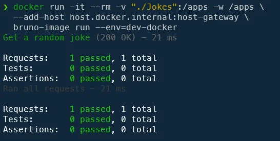

### Under the Hood (skip this if you just want to use it)

Why not just reuse `environments/dev.bru`, the one the GUI already uses? Running it as-is from the CLI fails:

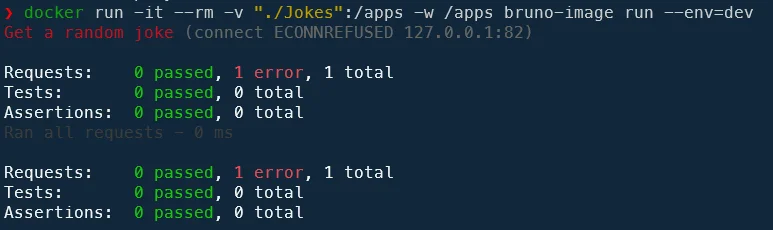

Look at the `connect ECONNREFUSED 127.0.0.1:82` error message: the Bruno CLI container is trying to reach the `127.0.0.1` webserver, but that address is the container itself, not your host. `environments/dev.bru` looks like this:

```none
vars {
  root: http://127.0.0.1:82
}
```

That works from the GUI, because the GUI runs directly on your host — `127.0.0.1` *is* your machine there. A `curl -v http://127.0.0.1:82/jokes` from your host's command line works too:

<!-- cspell:disable -->

<Terminal typewriter source="./files/terminal-1.txt" />

<!-- cspell:enable -->

A container has its own network namespace, so `127.0.0.1` inside it never reaches the host. That's exactly what `environments/dev-docker.bru` and `host.docker.internal` fix above. One side effect: that new environment file won't work from the Bruno GUI — we can select `dev` and it runs fine, but not `dev-docker`:

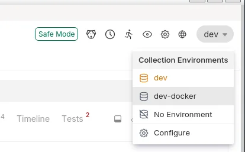

## Adding some assertions

For sure, the idea of the CLI tool is to be able to run assertions from the command line and make sure the API is still working.

Let's update the `Get a random joke.bru` file like this:

<Snippet filename="Get a random joke.bru" source="./files/Get a random joke.bru" />

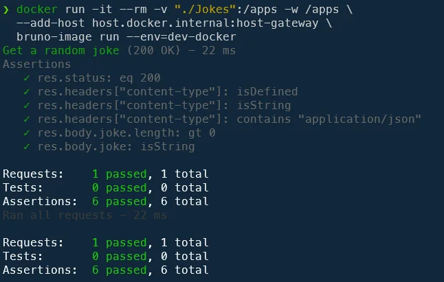

## Conclusion

Bruno gives you a Postman-like workflow — collections, environments, assertions — without leaving your repository: every request is a `.bru` file you can diff, review, and version like the rest of your code. The GUI is where you explore and build a collection; the CLI, wrapped in your own Docker image, is what turns that same collection into a repeatable check.

That repeatability is exactly what a CI pipeline wants. See <Link to="/blog/gitlab-docker-out-of-docker">GitLab - Running Docker-out-of-Docker in your CI</Link> to run this CLI image as a job, and <Link to="/blog/belgif-api-linter">Validate your OpenAPI schema against the Belgif REST standards</Link> to check the API's contract, not just its answers.
