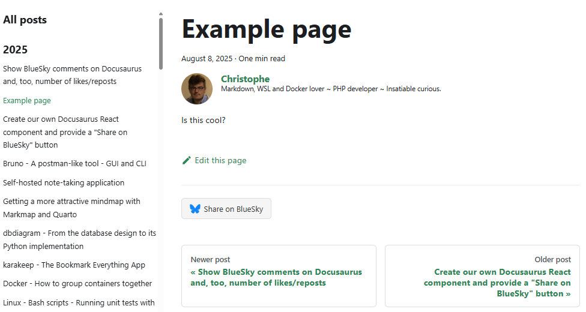

<!-- cspell:ignore reposts,clsx,blogpostitem,3lwbehu3h2k2i -->

Back nine months ago, I had enabled the feature to write comments under my articles by using **Giscus** (see [Adding a comment area](/blog/site-creation)) but only people having a GitHub account were eligible to use that feature and so, almost no one did it.

So I went nearly nine months without giving readers of this blog the opportunity to interact with me, which is a bit frustrating and prevents us from exchanging ideas and enriching each other's lives.

Since a few weeks, I'm now present on [Bluesky](https://bsky.app/profile/avonture.be) and ... why not adding a *Share on Bluesky* button below each article?

This idea is neither revolutionary nor complicated so, let's play...

In this first article in a series of two, we'll see how can create our Docusaurus React component. Before writing this article, I just didn't know how and now, yes, it's so easy.

<!-- truncate -->

<AlertBox variant="info" title="">
In a second article, we'll also create interactions with Bluesky like retrieving the number of likes, reposts and comments posted on Bluesky and display them below our articles but that's for a next article.

</AlertBox>

Because I had absolutely no idea on how to start; let's asked some AI to generate a skeleton. I've asked something like "*Hello my friend, I would like to show a Bluesky share button below my article on my Docusaurus blog. Give me a skeleton; please.*"

Once generated by the AI, it's now time to read, understand and make some tests.

## We need to override how the article is rendered by Docusaurus

So I learned I've to create a file called `src/theme/BlogPostItem/index.js` and just put some content to it.

The AI gives me the content but ... hey my friend, from where comes that content? After some research, I learn it's an override of the standard `@docusaurus/theme-classic` template.

I also learn we can **extract** the original file by using the so-called **Swizzle** action.

<AlertBox variant="info" title="">
In the Docusaurus terminology, Swizzle can be understood as override: we'll extract, here, a template so we can then override it.

</AlertBox>

The `src/theme/BlogPostItem/index.js` file will **customize the layout and content of individual blog posts** so, by updating that file, I can override then change how every single post of my blog will look like.

Since I want to add a **Share button**; it's the perfect candidate. The AI is right.

## Extract the original file

Start a console and make sure you're in the root folder of your blog.

In your console, run `yarn docusaurus swizzle @docusaurus/theme-classic BlogPostItem`.

When prompted, select `Javascript`, then **`Eject`** and finally `YES`.


As you can see, a lot of files will be created in our Docusaurus directory's structure.

### Keep things under control

As you can see on the screen, you'll extract a lot of files. **Let's keep things under control: we just want to add a share button below our article; we don't want to do more than that.**

Look at your Docusaurus site now; go to the `src/theme/BlogPostItem` folder and see that, yes, you've now a lot of files and sub folders. Just remove every sub folders; we don't want to update them i.e. we want to keep the original ones. So next time you'll install a newer version of Docusaurus, you'll stay up to date.

Just keep the `index.js` file created by the `swizzle` command. Here is the one I just got on my current Docusaurus version:

<Snippet filename="src/theme/BlogPostItem/index.js">

```js
import React from 'react';
import clsx from 'clsx';
import {useBlogPost} from '@docusaurus/plugin-content-blog/client';
import BlogPostItemContainer from '@theme/BlogPostItem/Container';
import BlogPostItemHeader from '@theme/BlogPostItem/Header';
import BlogPostItemContent from '@theme/BlogPostItem/Content';
import BlogPostItemFooter from '@theme/BlogPostItem/Footer';
// apply a bottom margin in list view
function useContainerClassName() {
  const {isBlogPostPage} = useBlogPost();
  return !isBlogPostPage ? 'margin-bottom--xl' : undefined;
}
export default function BlogPostItem({children, className}) {
  const containerClassName = useContainerClassName();
  return (
    <BlogPostItemContainer className={clsx(containerClassName, className)}>
      <BlogPostItemHeader />
      <BlogPostItemContent>{children}</BlogPostItemContent>
      <BlogPostItemFooter />
    </BlogPostItemContainer>
  );
}
```

</Snippet>

## Playing and adding a stupid message to every blog post

Before proceeding, let us conduct a test: is this the correct file to modify for our need?

Let's play and add a line just after our post title. Look at the example below; I've just added a new line:

<Snippet filename="src/theme/BlogPostItem/index.js">

```js
import React from 'react';
import clsx from 'clsx';
import {useBlogPost} from '@docusaurus/plugin-content-blog/client';
import BlogPostItemContainer from '@theme/BlogPostItem/Container';
import BlogPostItemHeader from '@theme/BlogPostItem/Header';
import BlogPostItemContent from '@theme/BlogPostItem/Content';
import BlogPostItemFooter from '@theme/BlogPostItem/Footer';
// apply a bottom margin in list view
function useContainerClassName() {
  const {isBlogPostPage} = useBlogPost();
  return !isBlogPostPage ? 'margin-bottom--xl' : undefined;
}
export default function BlogPostItem({children, className}) {
  const containerClassName = useContainerClassName();
  return (
    <BlogPostItemContainer className={clsx(containerClassName, className)}>
      <BlogPostItemHeader />
      // highlight-next-line
      {/* Just after the blog post title, we'll add a "Are you ready" text */}
      // highlight-next-line
      <strong style={{color:"red"}}>Are you ready to update your BlogPostItem layout?</strong>
      <BlogPostItemContent>{children}</BlogPostItemContent>
      <BlogPostItemFooter />
    </BlogPostItemContainer>
  );
}
```

</Snippet>

Save the file and refresh your page using your browser and tadaaa 🎉🎉🎉... Yes, we can see that text on each blog post.

On the image here above, we can see our stupid message:


<AlertBox variant="note" title="">
If it didn't work, please stop and restart your Docusaurus server. On my case (I'm using Docker), I just need to stop and restart my container.

</AlertBox>

So, as you can see, it's now quite easy. We can change the layout of our Docusaurus page just by manipulating the `ìndex.js` file.

## Time to create our Bluesky Docusaurus component

We'll proceed step by step and keeping in mind a few things:

<StepsCard
  title="Things to Remember"
  variant="remember"
  steps={[
    'We should minimize our changes on the original `src/theme/BlogPostItem/index.js`; the less updates the best;',
    'We will create a Docusaurus component in `src/components/` to allow interactions with Bluesky (think about the evolution of the component) so, for this reason, we\'ll put everything (code, image, css) together and',
    'We will try to keep things clean and maintainable for the developer and configurable for the user.'
  ]}
/>

### 1/5 The layout of our Bluesky generic component

The first file we'll create will be our `index.js` file i.e. our global Bluesky component.

In this article, we'll just foresee a "Share on Bluesky" button but in the second article, we'll add some more features.

This `index.js` will be the **entry point** of the component.

Please create the `src/components/Bluesky/index.js` file with this content:

<Snippet filename="src/components/Bluesky/index.js">

```js
import BlueskyShare from "./share";
import PropTypes from "prop-types";
import styles from './styles.module.css';

export default function Bluesky({ metadata }) {
  return (
    <div className={styles.blueskyContainer}>
      <BlueskyShare metadata={metadata} />
    </div>
  );
}

Bluesky.propTypes = {
  metadata: PropTypes.shape({
    frontMatter: PropTypes.shape({
      blueskyRecordKey: PropTypes.string,
    }),
  }).isRequired,
};
```

</Snippet>

**This is our React `<Bluesky />` component! Simple no? Right now, it's just a div containing another component called `<BlueskyShare />`**.

If you look at the code here above, we've to create two new files: `share.js` and `styles.module.css`.

### 2/5 Our "Share on Bluesky" button

Ok, now, we've to create a second file called `src/components/Bluesky/share.js` and to copy/paste this content in it:

<Snippet filename="src/components/Bluesky/share.js" source="src/components/Bluesky/share.js" />

As you can see, we've defined a function called `BlueskyShare` and that function ask a parameter called `metadata`.

<AlertBox variant="info" title="">
Look back in the `src/components/Bluesky/index.js` we've just created before. We had this line: `<BlueskyShare metadata={metadata} />` so, yes, we're well passing that parameter.

The `metadata` parameter is an object initialized by Docusaurus and that will contain all the front matter data from the Markdown file of the current blog post. It includes properties like title, description, date, tags, and any other custom fields you've defined in the front matter.

</AlertBox>

What does the `BlueskyShare` function? In fact, we'll just provide a button with a url like `https://bsky.app/intent/compose?text=<title>%20<url>` (where we'll inject the blog post title and url).

If you look at the code here above, we've to create another file called: `bluesky.svg`.

### 3/5 The Bluesky logo

For sure, we need the Bluesky logo somewhere.

Please create a third file called `src/components/Bluesky/bluesky.svg` and copy/paste this content in it:

<Snippet filename="src/components/Bluesky/bluesky.svg" source="src/components/Bluesky/bluesky.svg" / >

### 4/5 And finally our CSS

And, very important, we need a CSS. Please create a fourth file called `src/components/Bluesky/styles.module.css` and copy/paste this content in it:

<Snippet filename="src/components/Bluesky/styles.module.css" source="src/components/Bluesky/styles.module.css" />

### 5/5 Last thing, we need to implement our component in Docusaurus

Our Bluesky component is ready. We have created our four files.

You should have this:

```bash
.
├── src/components/Bluesky
│   ├── bluesky.svg             -- The Bluesky logo
│   ├── index.js                -- Our Bluesky component
│   ├── share.js                -- Our BlueskyShare sub-component
│   └── styles.module.css       -- Our stylesheet
...
└── src/theme/BlogPostItem
    ├── index.js                -- The BlogPostItem template
```

Let's go back to what was said earlier: in order to adapt the page layout, Docusaurus uses the file `src/theme/BlogPostItem/index.js`. So it's time to inject our newly-created component in that script.

<Snippet filename="src/theme/BlogPostItem/index.js">

```js
import React from 'react';
import clsx from 'clsx';
import {useBlogPost} from '@docusaurus/plugin-content-blog/client';
import BlogPostItemContainer from '@theme/BlogPostItem/Container';
import BlogPostItemHeader from '@theme/BlogPostItem/Header';
import BlogPostItemContent from '@theme/BlogPostItem/Content';
import BlogPostItemFooter from '@theme/BlogPostItem/Footer';

// highlight-next-line
// import our Bluesky component
// highlight-next-line
import Bluesky from "@site/src/components/Bluesky/index.js";

// apply a bottom margin in list view
function useContainerClassName() {
  const {isBlogPostPage} = useBlogPost();
  return !isBlogPostPage ? 'margin-bottom--xl' : undefined;
}

export default function BlogPostItem({ children, className }) {
  // highlight-next-line
  // We need to retrieve the isBlogPostPage flag
  // highlight-next-line
  const { metadata, isBlogPostPage } = useBlogPost();
  const containerClassName = useContainerClassName();
  return (
    <BlogPostItemContainer className={clsx(containerClassName, className)}>
      <BlogPostItemHeader />
      <BlogPostItemContent>{children}</BlogPostItemContent>
      <BlogPostItemFooter />
      // highlight-next-line
      {/* Only display Bluesky components on the post page; not the blog view */}
      // highlight-next-line
      {isBlogPostPage && <Bluesky metadata={metadata} />}
    </BlogPostItemContainer>
  );
}
```

</Snippet>

Congratulations! If you go to a page on your blog and refresh the page, you will see the Bluesky button at the bottom of the page.

<AlertBox variant="note" title="">
If it didn't work, please stop and restart your Docusaurus server. On my case (I'm using Docker), I just need to stop and restart my container.

</AlertBox>

## Result

And, tadaaa 🎉🎉🎉, here is our Share button in action:



In a next article, we'll learn how to interact with Bluesky:

* Providing a button below the article to jump to the Bluesky posts so your visitors will be able to:
  * Like your article (which is always nice, isn't it?),
  * Share your article (even better) and
  * Start or participate to a discussion
* We'll also show the number of likes and reposts on the Bluesky post and
* Retrieve all comments posted on Bluesky and display them on your blog; this will undoubtedly increase your visitors' engagement.

## Final remarks - Take care about the swizzle command

You need to understand that, by swizzling (overriding) the BlogPostItem layout, you're no more *aligned* with the standard layout of Docusaurus.

**If, in a next release, new features will be added by Docusaurus; you'll not have them!** since you're no more using the default layout for your post.

Just keep that in mind and, perhaps, from time to time (after a major release f.i.), think to run the swizzle command again and restart your customization.

This is why our changes to the index.js file were kept to a minimum.
