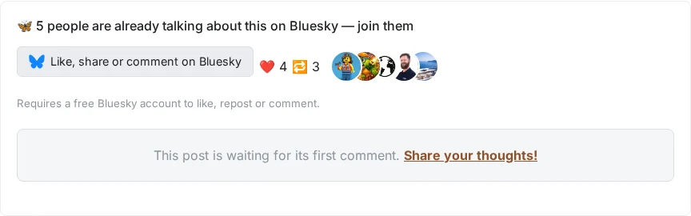
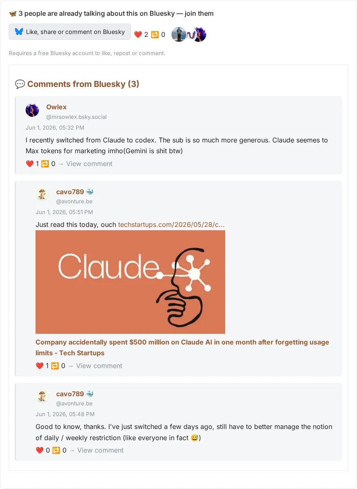
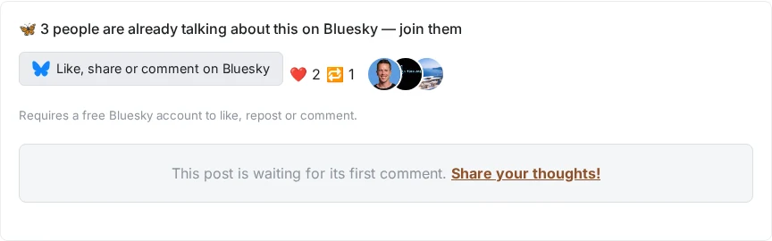

<!-- cspell:ignore reposts,packagist,3lun2qjuxc22r,repost,noopener,noreferrer,3lwnnydhdk22x,facepile,facepiles,deduplicated,reposters,commenters -->

<TLDR>
  This article is the second part of the 'Bluesky Docusaurus component' series.
  It enhances the component created in the first part by adding features to
  display Bluesky comments, likes, and repost counts directly on your Docusaurus
  blog. To achieve this, you'll learn how to link your blog posts to Bluesky
  posts using a frontmatter key, update the React component to fetch and display
  this information, and configure your Docusaurus site with your Bluesky handle.
</TLDR>

In a [previous article](/blog/docusaurus-bluesky-share), we've seen how we can, simply said, provide a "Share the article on Bluesky".

This is not really interactive right? Let's see in this article how to make the link between a Docusaurus blog post and Bluesky.

<!-- truncate -->

## What You'll Get

Once wired up, every article gets a "Like, share or comment on Bluesky" button, a single **engagement facepile** merging likes, reposts and commenters into one deduplicated avatar stack, and the list of comments straight from your Bluesky post — right below the article, no separate comment system to host.

Here is that block, live on three different articles of this very blog, at three different levels of engagement:

<BrowserWindow url="http://localhost/">
  
</BrowserWindow>

<BrowserWindow url="http://localhost/">
  
</BrowserWindow>

<BrowserWindow url="http://localhost/">
  
</BrowserWindow>

<AlertBox variant="info">
Notice there's no separate "likers" row and "commenters" row: a person who both liked **and** commented on the post shows up as a single avatar, sorted first — that's the whole point of the facepile merge described below.

</AlertBox>

<StepsCard
  title="The workflow will be:"
  variant="steps"
  steps={[
    "You publish your article on your blog,",
    'You share the article on Bluesky (by using the "Share the article" feature of course),',
    "You retrieve the **Bluesky Record key** i.e. the very last part of Bluesky post URL (something like `3lun2qjuxc22r`),",
    "You edit back your Docusaurus article and you add a key in your YAML front matter (the YAML block at the top of your article). The key to add is `blueskyRecordKey: xxxx` where `xxxx` is your **Bluesky Record key**.",
    "You publish your updated article on your blog again.",
  ]}
/>

So, from now, you've clearly made the link between your article and your Bluesky post.

<StepsCard
  title="Thanks to this link, we can:"
  variant="steps"
  steps={[
    'Display a button "Like, share or comment on Bluesky": the visitor can then jump to your Bluesky post and like, share or comment your article,',
    "Display the number of likes and reposts below your article and,",
    "Display the list of comments you've received on your Bluesky post and, if none, display a *Call to action* area to encourage your reader to share their thoughts",
  ]}
/>

In the previous article (see [Create our own Docusaurus React component and provide a "Share on Bluesky" button](/blog/docusaurus-bluesky-share)), we've created the `src/components/Bluesky/index.js` file. Please edit that file and use this new content:

## 1/5 The layout of our Bluesky generic component

Here is our new Bluesky layout for our component:

<Snippet
  filename="src/components/Bluesky/index.js"
  source="src/components/Bluesky/index.js"
/>

<AlertBox variant="info">
The highlighted lines are the new ones compared to the previous version of the file if you've already followed the first tutorial.

</AlertBox>

<StepsCard
  title="As you can see, this time, we'll foresee four components:"
  variant="steps"
  steps={[
    "A Share button,",
    "A Post button (to jump to your post on Bluesky),",
    "A likes area (to show the number of likes and reposts of your post on Bluesky) and",
    "An area for displaying comments you've on Bluesky",
  ]}
/>

## 2/5 Our "Like, share or comment" button

<Snippet
  filename="src/components/Bluesky/post.js"
  source="src/components/Bluesky/post.js"
/>

## 3/5 Our component for getting the number of likes and reposts

<Snippet
  filename="src/components/Bluesky/likes.js"
  source="src/components/Bluesky/likes.js"
/>

<AlertBox variant="note">
An earlier version of this component only showed the avatars of the people who **liked** the post. That was misleading: a reader could see "5 likes" next to only 3 avatars, because reposters and commenters weren't counted. The current version fetches likers, reposters and commenters in parallel, merges them into a single `Map` keyed by the person's Bluesky `did` (so the same person liking **and** commenting only appears once), and sorts that list by number of actions — someone who liked *and* commented outranks someone who only liked. Up to ten avatars are shown, the rest collapse into a `+N` badge, and each avatar's tooltip spells out what that person actually did (`"liked and commented on this post"`).

</AlertBox>

## 4/5 Retrieving all comments

<Snippet
  filename="src/components/Bluesky/comments.js"
  source="src/components/Bluesky/comments.js"
/>

## 5/5 Our new CSS

<Snippet
  filename="src/components/Bluesky/styles.module.css"
  source="src/components/Bluesky/styles.module.css"
/>

## Update the Docusaurus configuration file

We're almost done. In order to be able to retrieve likes, shares and comments from your Bluesky account, you have to tell the component your Bluesky handle.

You have to edit the `docusaurus.config.js` file and add a new section called `customFields` as illustrated below:

<Snippet
  filename="docusaurus.config.js"
  source="./files/docusaurus.config.js"
/>

<AlertBox variant="danger">
For sure, use yours; not mine ;-)

</AlertBox>
