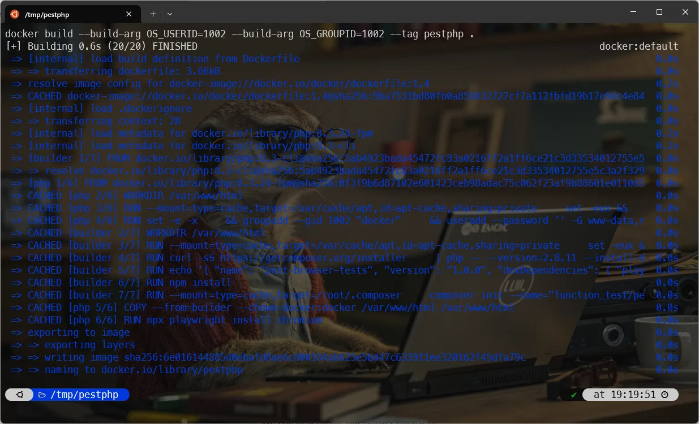
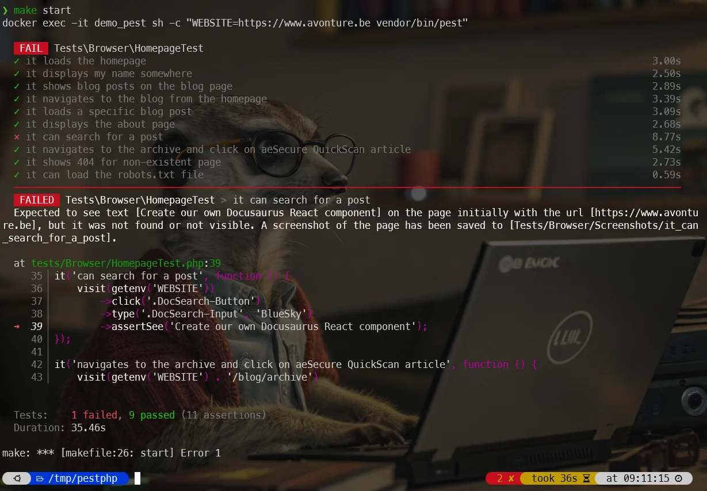
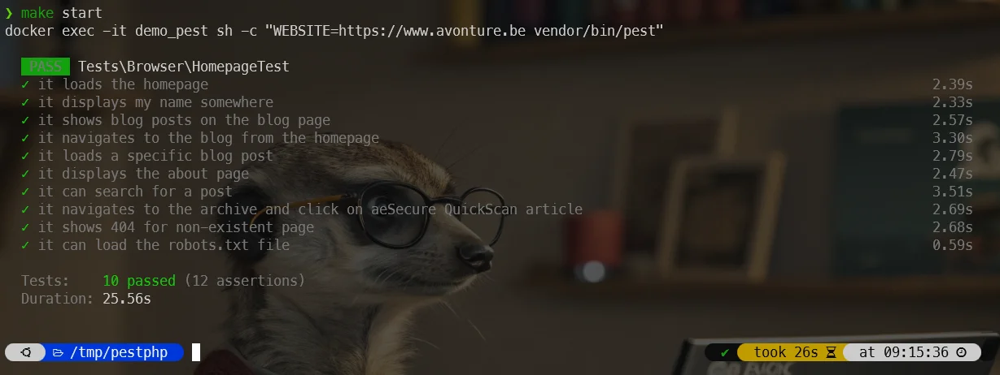

<!-- cspell:ignore  -->

<TLDR>
This article provides a comprehensive guide to writing functional tests for your website using Pest v4. It walks you through setting up a complete Docker-based testing environment from scratch, including creating a Dockerfile and a Makefile for easy command execution. You'll learn how to write a browser test case, run it against a live website, and interpret the results. The post also covers how Pest automatically captures screenshots on failure, making debugging easier, and provides insights into the underlying technology like Playwright.
</TLDR>

Last year, I wrote [Write PHP unit tests using Pest](/blog/pest_tips). Since then [Nuno Maduro](https://nunomaduro.com/) has released [Pest](https://pestphp.com/) in a version 4 with **built-in browser testing**.

What does that mean? Now, aside unit testing (see my previous article), we can also ask Pest to visit a website and make actions like clicking on a button, filling in some fields (think to a login page, a search field, ...), submitting forms, navigating, ... and thus, yes, running some functional tests.

An example can be to visit the homepage of your website, click in the search text area, fill some keywords, select the first visible item, click on it and assert the new page will display some text.

I've already written an article about [Behat](/blog/tags/behat), another one about [Cypress](/blog/tags/cypress); it was logical to do the same with Pest v4.

<!-- truncate -->

My idea, like always, is to use (or create) a Docker image so we can immediately start without the pain of installing and configuring everything.

## Let's create a temporary project

First, let's create a temporary folder and jump in it:

<Terminal>
$ mkdir /tmp/pestphp && cd $_
</Terminal>

Right now, there is no ready-to-use Docker image for Pest v4 so let's create ours.

Please create a file called `Dockerfile` in your temporary folder with this content:

<Snippet filename="Dockerfile" source="./files/Dockerfile" />

For our easiness, let's also create a `makefile` to be able to run very easy command like `make build`, `make up`, ...

Create a file called `makefile` in your project with this content:

<Snippet filename="makefile" source="./files/makefile" />

And ... we're almost there. We just need to create a Pest test script. Please create a file called `tests/Browser/HomepageTest.php` with content:

<Snippet filename="HomepageTest.php" source="./files/HomepageTest.php" />

<StepsCard
  title="Our current situation"
  variant="prerequisites"
  steps={[
    "We'll create our own Docker image thanks to our `Dockerfile`,",
    "We'll use a makefile for easiness and",
    "We've a test scenario with 10 functional tests."
  ]}
/>

## Create the image

To create the Docker image, please run `make build`:

<Terminal>
$ make build
</Terminal>

<AlertBox variant="info" title="">
If you don't have `make` yet on your host, please run `sudo apt-get update && sudo apt-get -y install make`.

<Terminal>
$ sudo apt-get update && sudo apt-get -y install make
</Terminal>

</AlertBox>

The build phase can be slow because a lot of things should be downloaded. The final image will be around 2 GB.

## Create the container

Once the image has been created; we can now create our Docker container:

<Terminal>
$ make up

docker run --detach -v ./tests:/var/www/html/tests --name demo_pest pestphp
12e700df85b54becb9eb537a09c5711265aaca730529c461b0e53a17b6928875
</Terminal>

## Run tests

And, last thing to do, once the container has been created, you can run all tests by just running `make start`.

I've **intentionnaly** create an error to illustrate some nice feature:

<Terminal>
$ make start

{`docker exec -it demo_pest sh -c "WEBSITE=https://www.avonture.be vendor/bin/pest"

  FAIL  Tests\Browser\HomepageTest
  ✓ it loads the homepage                                                 3.00s
  ✓ it displays my name somewhere                                         2.50s
  ✓ it shows blog posts on the blog page                                  2.89s
  ✓ it navigates to the blog from the homepage                            3.39s
  ✓ it loads a specific blog post                                         3.09s
  ✓ it displays the about page                                            2.68s
  ⨯ it can search for a post                                              8.77s
  ✓ it navigates to the archive and click on aeSecure QuickScan article   5.42s
  ✓ it shows 404 for non-existent page                                    2.73s
  ✓ it can load the robots.txt file                                       0.59s
  ──────────────────────────────────────────────────────────────────────────────
   FAILED  Tests\Browser\HomepageTest > it can search for a post
  Expected to see text [Create our own Docusaurus React component] on the page initially with the url [https://www.avonture.be], but it was not found or not visible. A screenshot of the page has been saved to [Tests/Browser/Screenshots/it_can_search_for_a_post].

  at tests/Browser/HomepageTest.php:39
     35▕ it('can search for a post', function () {
     36▕     visit(getenv('WEBSITE'))
     37▕         ->click('.DocSearch-Button')
     38▕         ->type('.DocSearch-Input', 'Bluesky')
  ➜ 39▕         ->assertSee('Create our own Docusaurus React component');
     40▕ });
     41▕
     42▕ it('navigates to the archive and click on aeSecure QuickScan article', function () {
     43▕     visit(getenv('WEBSITE') . '/blog/archive')

  Tests:    1 failed, 9 passed (11 assertions)
  Duration: 35.46s

make: *** [makefile:26: start] Error 1`}
</Terminal>

As we can see, the test `it can search for a post` has failed while the previous ones have succeeded.

<AlertBox variant="note" title="">
Did you've notice that others tests were well fired? Pest won't stop on failure.

</AlertBox>

The nice thing is: Pest has automatically take a snapshot. See the error message, it says that a file `Tests/Browser/Screenshots/it_can_search_for_a_post` has been created automatically.

Pest has taken a screenshot; we were searching for `Create our own Docusaurus React component` (as coded in our `tests/Browser/HomepageTest.php` scenario) and indeed, we don't see that title at all:

But we see `React component and provide a "Share on Bluesky" button` so let's update the script:

<Snippet filename="HomepageTest.php" source="./files/HomepageTest.part2.php" />

We don't need to build the image again neither to recreate the container; just run `make start` again.

<Terminal>
$ make start

docker exec -it demo_pest sh -c "WEBSITE=https://www.avonture.be vendor/bin/pest"

  PASS  Tests\Browser\HomepageTest
  ✓ it loads the homepage                                                 2.39s
  ✓ it displays my name somewhere                                         2.33s
  ✓ it shows blog posts on the blog page                                  2.57s
  ✓ it navigates to the blog from the homepage                            3.30s
  ✓ it loads a specific blog post                                         2.79s
  ✓ it displays the about page                                            2.47s
  ✓ it can search for a post                                              3.51s
  ✓ it navigates to the archive and click on aeSecure QuickScan article   2.69s
  ✓ it shows 404 for non-existent page                                    2.68s
  ✓ it can load the robots.txt file                                       0.59s

  Tests:    10 passed (12 assertions)
  Duration: 25.56s

</Terminal>

Congratulations, we've just tested 10 features in less than 26 seconds.

## In-depth

* Pest is using [playwright](https://pestphp.com/docs/browser-testing#content-getting-started); this is why our Dockerfile is more complex because we should also install NodeJS,
* Something really cooooool: we don't need to `wait_for` something change on the page, Pest will do it for us. For instance, with CyPress and Behat, when we click on a button, we have to wait that f.i. the Ajax script on that page has been fired and the `DOM element` has been loaded. With Pest, we shouldn't care about this and that's an amazing feature!
* We also have to create a specific user in the Docker image to match our local one. This because when a test will fail, Pest (running in Docker) will create an image and that one should be created on our host machine with our UID/GID,
* The `make up` action defined in the `makefile` is mounting our local `tests` folder in the container. It means that if we create new tests files or update existing ones, they will be immediately synchronized with the running container; nothing special to do here,
* To reduce the need for configuration files, a `WEBSITE` operating system variable has been defined (see the `makefile`). That variable will be created in the container. A PHP script will then refer to the variable like this `getenv('WEBSITE')`.
* There is a `--parallel` flag for Pest. If you want to run your different tests files in parallel, edit the `makefile`, search for `docker exec -it demo_pest sh -c "WEBSITE=$(WEBSITE) vendor/bin/pest"` and replace with `docker exec -it demo_pest sh -c "WEBSITE=$(WEBSITE) vendor/bin/pest --parallel"`

<Snippet filename="makefile.diff" source="./files/makefile.diff" />
