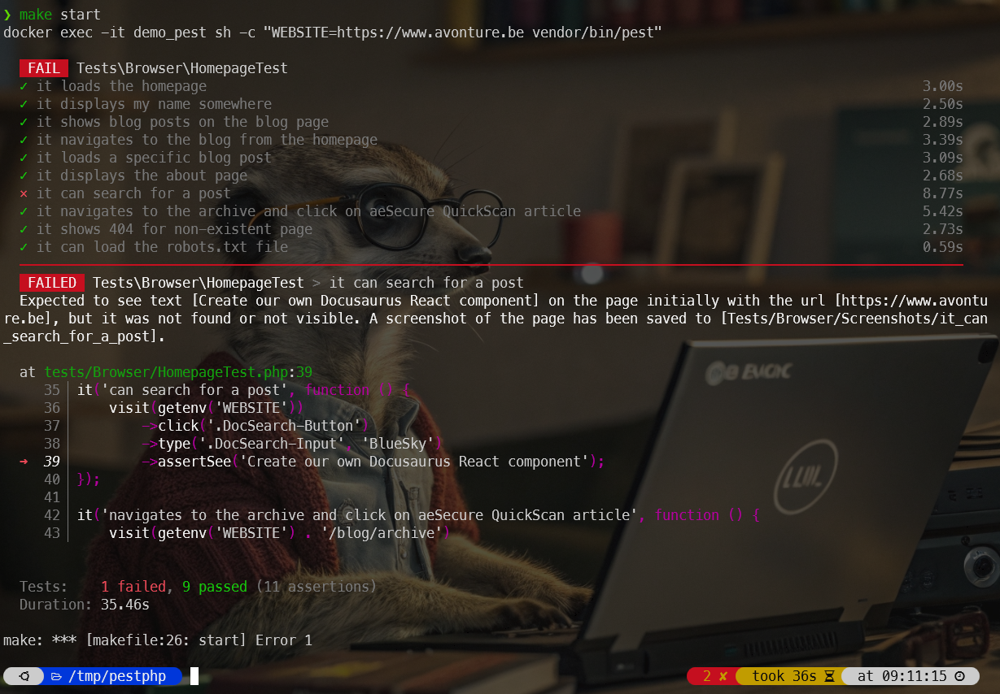

<!-- cspell:ignore  -->


Last year, I wrote [Write PHP unit tests using Pest](/blog/pest_tips). Since then [Nuno Maduro](https://nunomaduro.com/) has released [Pest](https://pestphp.com/) in a version 4 with **built-in browser testing**.

What does that mean? Now, aside unit testing (see my previous article), we can also ask Pest to visit a website and make actions like clicking on a button, filling in some fields (think to a login page, a search field, ...), submitting forms, navigating, ... and thus, yes, running some functional tests.

An example can be to visit the homepage of your website, click in the search text area, fill some keywords, select the first visible item, click on it and assert the new page will display some text.

I've already written an article about [Behat](/blog/tags/behat), another one about [Cypress](/blog/tags/cypress); it was logical to do the same with Pest v4.

<!-- truncate -->

My idea, like always, is to use (or create) a Docker image so we can immediately start without the pain of installing and configuring everything.

## Let's create a temporary project

First, let's create a temporary folder and jump in it:

<Terminal>
$ mkdir /tmp/pestphp && cd $_
</Terminal>

Right now, there is no ready-to-use Docker image for Pest v4 so let's create ours.

Please create a file called `Dockerfile` in your temporary folder with this content:

<Snippet filename="Dockerfile">

```docker
# syntax=docker/dockerfile:1.4

ARG PHP_CLI_VERSION=8.3-cli
ARG PHP_FPM_VERSION=8.3.24-fpm
ARG COMPOSER_VERSION=2.8.11

ARG OS_USERID=1000
ARG OS_GROUPID=1000
ARG OS_USERNAME="docker"

ARG TIMEZONE="Europe/Brussels"

FROM php:${PHP_CLI_VERSION} AS builder

ARG COMPOSER_VERSION

WORKDIR /var/www/html

# Set cache environment variables for all subsequent commands
ENV NPM_CONFIG_CACHE=/var/www/html/.npm-cache \
    PLAYWRIGHT_BROWSERS_PATH=/var/www/html/.cache/ms-playwright

# Install system dependencies, PHP extensions, and Node.js with browser dependencies
RUN --mount=type=cache,target=/var/cache/apt,id=apt-cache,sharing=private \
    set -eux && \
    apt-get update && apt-get install -y \
        unzip zip git curl libzip-dev gnupg2 wget ca-certificates \
        libgtk-3-0 libxshmfence-dev libxkbcommon-x11-dev \
        libnspr4 libnss3 libgbm1 libasound2t64 \
    && docker-php-ext-install zip sockets \
    && curl -fsSL https://deb.nodesource.com/setup_20.x | bash - \
    && apt-get install -y nodejs \
    && apt-get clean && rm -rf /var/lib/apt/lists/*

# Install Composer
RUN curl -sS https://getcomposer.org/installer \
    | php -- --version=${COMPOSER_VERSION} --install-dir=/usr/local/bin --filename=composer

# Create a temporary package.json to install node dependencies
RUN echo '{ "name": "pest-browser-tests", "version": "1.0.0", "devDependencies": { "playwright": "^1.55.0", "playwright-core": "^1.55.0" } }' > package.json

# Install Node dependencies with cache
RUN npm install

# Setup Composer dependencies with cache
RUN --mount=type=cache,target=/root/.composer \
    composer init --name="function_test/pestphp" --require-dev="pestphp/pest:^4.0" --no-interaction && \
    composer config --no-plugins allow-plugins.pestphp/pest-plugin true && \
    composer require pestphp/pest-plugin-browser --dev && \
    composer install --no-interaction --prefer-dist --no-progress

FROM php:${PHP_FPM_VERSION} AS php

ARG TIMEZONE
ENV TZ=${TIMEZONE}

WORKDIR /var/www/html

# Install PHP and Node.js dependencies
RUN --mount=type=cache,target=/var/cache/apt,id=apt-cache,sharing=private \
    set -eux && \
    apt-get update && apt-get install -y \
        unzip zip libzip-dev curl gnupg2 wget ca-certificates \
        libgtk-3-0 libxshmfence-dev libxkbcommon-x11-dev \
        libnspr4 libnss3 libgbm1 libasound2t64 \
    && docker-php-ext-install pcntl zip sockets \
    && curl -fsSL https://deb.nodesource.com/setup_20.x | bash - \
    && apt-get install -y nodejs \
    && apt-get clean && rm -rf /var/lib/apt/lists/*

ARG OS_USERID
ARG OS_GROUPID
ARG OS_USERNAME

RUN set -e -x \
    && groupadd --gid ${OS_GROUPID} "${OS_USERNAME}" \
    && useradd --password '' -G www-data,root --uid ${OS_USERID} --gid ${OS_GROUPID} -l -d "/home/${OS_USERNAME}" "${OS_USERNAME}" \
    && mkdir -p "/home/${OS_USERNAME}" \
    && chown -R "${OS_USERNAME}":"${OS_USERNAME}" "/home/${OS_USERNAME}"

# Copy all files from the builder stage and set permissions
COPY --from=builder --chown=${OS_USERNAME}:${OS_USERNAME} /var/www/html /var/www/html

# Set cache and path environment variables for all subsequent commands
ENV NPM_CONFIG_CACHE=/var/www/html/.npm-cache \
    PLAYWRIGHT_BROWSERS_PATH="/var/www/html/.cache/ms-playwright" \
    PATH="/var/www/html/node_modules/.bin:$PATH"

# Switch to our user
USER ${OS_USERNAME}

# Install Playwright browsers in the new, accessible location
RUN npx playwright install chromium

# Dev entrypoint (keep container alive)
ENTRYPOINT ["tail", "-f", "/dev/null"]
```

</Snippet>

For our easiness, let's also create a `makefile` to be able to run very easy command like `make build`, `make up`, ...

Create a file called `makefile` in your project with this content:

<Snippet filename="makefile">

```makefile
# Default value. To override it, run something like "WEBSITE=my_website make start"
WEBSITE ?= https://www.avonture.be

UID:=$(shell id -u)
GID:=$(shell id -g)

.PHONY: build
build:
	clear
	docker build --build-arg OS_USERID=${UID} --build-arg OS_GROUPID=${GID} --tag pestphp .

.PHONY: remove
remove:
	docker rm demo_pest --force

.PHONY: up
up:
	docker run --detach -v ./tests:/var/www/html/tests --name demo_pest pestphp

.PHONY: bash
bash:
	docker exec -it demo_pest /bin/bash

.PHONY: start
start:
	docker exec -it demo_pest sh -c "WEBSITE=$(WEBSITE) vendor/bin/pest"
```

</Snippet>

And ... we're almost there. We just need to create a Pest test script. Please create a file called `tests/Browser/HomepageTest.php` with content:

<Snippet filename="HomepageTest.php">

```php
<?php

it('loads the homepage', function () {
    visit(getenv('WEBSITE'))
        ->assertSee('Avonture');
});

it('displays my name somewhere', function () {
    visit(getenv('WEBSITE'))
        ->assertSee('Christophe Avonture');
});

it('shows blog posts on the blog page', function () {
    visit(getenv('WEBSITE') . '/blog')
        ->assertSee('All posts');
});

it('navigates to the blog from the homepage', function () {
    visit(getenv('WEBSITE'))
        ->click('Blog')
        ->assertPathIs('/blog')
        ->assertSee('All Posts');
});

it('loads a specific blog post', function () {
    visit(getenv('WEBSITE') . '/blog/docker-joomla')
        ->assertSee('Create your Joomla website using Docker');
});

it('displays the about page', function () {
    visit(getenv('WEBSITE') . '/about')
        ->assertSee('My name is Christophe Avonture');
});

it('can search for a post', function () {
    visit(getenv('WEBSITE'))
        ->click('.DocSearch-Button')
        ->type('.DocSearch-Input', 'Bluesky')
        ->assertSee('Create our own Docusaurus React component');
});

it('navigates to the archive and click on aeSecure QuickScan article', function () {
    visit(getenv('WEBSITE') . '/blog/archive')
        ->click('August 1 - aeSecure - QuickScan - Free viruses scanner')
        ->assertPathIs('/blog/aesecure-quickscan')
        ->assertSee('Just start your browser and go to the URL where your site is accessible.');
});

it('shows 404 for non-existent page', function () {
    visit(getenv('WEBSITE') . '/this-page-does-not-exist')
        ->assertSee('Page Not Found');
});

it('can load the robots.txt file', function () {
    visit(getenv('WEBSITE') . '/robots.txt')
        ->assertSee('User-agent');
});
```

</Snippet>

<StepsCard
  title="Our current situation"
  variant="prerequisites"
  steps={[
    "We'll create our own Docker image thanks to our `Dockerfile`,",
    "We'll use a makefile for easiness and",
    "We've a test scenario with 10 functional tests."
  ]}
/>

## Create the image

To create the Docker image, please run `make build`:

<Terminal>
$ make build
</Terminal>

:::info
If you don't have `make` yet on your host, please run `sudo apt-get update && sudo apt-get -y install make`.

<Terminal>
$ sudo apt-get update && sudo apt-get -y install make
</Terminal>
:::

The build phase can be slow because a lot of things should be downloaded. The final image will be around 2 GB.


## Create the container

Once the image has been created; we can now create our Docker container:

<Terminal>
$ make up

docker run --detach -v ./tests:/var/www/html/tests --name demo_pest pestphp
12e700df85b54becb9eb537a09c5711265aaca730529c461b0e53a17b6928875
</Terminal>

## Run tests

And, last thing to do, once the container has been created, you can run all tests by just running `make start`.

I've **intentionnaly** create an error to illustrate some nice feature:

<Terminal>
$ make start

{`docker exec -it demo_pest sh -c "WEBSITE=https://www.avonture.be vendor/bin/pest"

  FAIL  Tests\Browser\HomepageTest
  ✓ it loads the homepage                                                 3.00s
  ✓ it displays my name somewhere                                         2.50s
  ✓ it shows blog posts on the blog page                                  2.89s
  ✓ it navigates to the blog from the homepage                            3.39s
  ✓ it loads a specific blog post                                         3.09s
  ✓ it displays the about page                                            2.68s
  ⨯ it can search for a post                                              8.77s
  ✓ it navigates to the archive and click on aeSecure QuickScan article   5.42s
  ✓ it shows 404 for non-existent page                                    2.73s
  ✓ it can load the robots.txt file                                       0.59s
  ──────────────────────────────────────────────────────────────────────────────
   FAILED  Tests\Browser\HomepageTest > it can search for a post
  Expected to see text [Create our own Docusaurus React component] on the page initially with the url [https://www.avonture.be], but it was not found or not visible. A screenshot of the page has been saved to [Tests/Browser/Screenshots/it_can_search_for_a_post].

  at tests/Browser/HomepageTest.php:39
     35▕ it('can search for a post', function () {
     36▕     visit(getenv('WEBSITE'))
     37▕         ->click('.DocSearch-Button')
     38▕         ->type('.DocSearch-Input', 'Bluesky')
  ➜ 39▕         ->assertSee('Create our own Docusaurus React component');
     40▕ });
     41▕
     42▕ it('navigates to the archive and click on aeSecure QuickScan article', function () {
     43▕     visit(getenv('WEBSITE') . '/blog/archive')

  Tests:    1 failed, 9 passed (11 assertions)
  Duration: 35.46s

make: *** [makefile:26: start] Error 1`}
</Terminal>

As we can see, the test `it can search for a post` has failed while the previous ones have succeeded.

:::note
Did you've notice that others tests were well fired? Pest won't stop on failure.
:::

The nice thing is: Pest has automatically take a snapshot. See the error message, it says that a file `Tests/Browser/Screenshots/it_can_search_for_a_post` has been created automatically.



Pest has taken a screenshot; we were searching for `Create our own Docusaurus React component` (as coded in our `tests/Browser/HomepageTest.php` scenario) and indeed, we don't see that title at all:


But we see `React component and provide a "Share on Bluesky" button` so let's update the script:

<Snippet filename="HomepageTest.php">

```php
<?php

it('loads the homepage', function () {
    visit(getenv('WEBSITE'))
        ->assertSee('Avonture');
});

it('displays my name somewhere', function () {
    visit(getenv('WEBSITE'))
        ->assertSee('Christophe Avonture');
});

it('shows blog posts on the blog page', function () {
    visit(getenv('WEBSITE') . '/blog')
        ->assertSee('All posts');
});

it('navigates to the blog from the homepage', function () {
    visit(getenv('WEBSITE'))
        ->click('Blog')
        ->assertPathIs('/blog')
        ->assertSee('All Posts');
});

it('loads a specific blog post', function () {
    visit(getenv('WEBSITE') . '/blog/docker-joomla')
        ->assertSee('Create your Joomla website using Docker');
});

it('displays the about page', function () {
    visit(getenv('WEBSITE') . '/about')
        ->assertSee('My name is Christophe Avonture');
});

it('can search for a post', function () {
    visit(getenv('WEBSITE'))
        ->click('.DocSearch-Button')
        ->type('.DocSearch-Input', 'Bluesky')
        // highlight-next-line
        ->assertSee('React component and provide a "Share on Bluesky" button');
});

it('navigates to the archive and click on aeSecure QuickScan article', function () {
    visit(getenv('WEBSITE') . '/blog/archive')
        ->click('August 1 - aeSecure - QuickScan - Free viruses scanner')
        ->assertPathIs('/blog/aesecure-quickscan')
        ->assertSee('Just start your browser and go to the URL where your site is accessible.');
});

it('shows 404 for non-existent page', function () {
    visit(getenv('WEBSITE') . '/this-page-does-not-exist')
        ->assertSee('Page Not Found');
});

it('can load the robots.txt file', function () {
    visit(getenv('WEBSITE') . '/robots.txt')
        ->assertSee('User-agent');
});


```

</Snippet>

We don't need to build the image again neither to recreate the container; just run `make start` again.

<Terminal>
$ make start

docker exec -it demo_pest sh -c "WEBSITE=https://www.avonture.be vendor/bin/pest"

  PASS  Tests\Browser\HomepageTest
  ✓ it loads the homepage                                                 2.39s
  ✓ it displays my name somewhere                                         2.33s
  ✓ it shows blog posts on the blog page                                  2.57s
  ✓ it navigates to the blog from the homepage                            3.30s
  ✓ it loads a specific blog post                                         2.79s
  ✓ it displays the about page                                            2.47s
  ✓ it can search for a post                                              3.51s
  ✓ it navigates to the archive and click on aeSecure QuickScan article   2.69s
  ✓ it shows 404 for non-existent page                                    2.68s
  ✓ it can load the robots.txt file                                       0.59s

  Tests:    10 passed (12 assertions)
  Duration: 25.56s

</Terminal>

Congratulations, we've just tested 10 features in less than 26 seconds.


## In-depth

* Pest is using [playwright](https://pestphp.com/docs/browser-testing#content-getting-started); this is why our Dockerfile is more complex because we should also install NodeJS,
* Something really cooooool: we don't need to `wait_for` something change on the page, Pest will do it for us. For instance, with CyPress and Behat, when we click on a button, we have to wait that f.i. the Ajax script on that page has been fired and the `DOM element` has been loaded. With Pest, we shouldn't care about this and that's an amazing feature!
* We also have to create a specific user in the Docker image to match our local one. This because when a test will fail, Pest (running in Docker) will create an image and that one should be created on our host machine with our UID/GID,
* The `make up` action defined in the `makefile` is mounting our local `tests` folder in the container. It means that if we create new tests files or update existing ones, they will be immediately synchronized with the running container; nothing special to do here,
* To reduce the need for configuration files, a `WEBSITE` operating system variable has been defined (see the `makefile`). That variable will be created in the container. A PHP script will then refer to the variable like this `getenv('WEBSITE')`.
* There is a `--parallel` flag for Pest. If you want to run your different tests files in parallel, edit the `makefile`, search for `docker exec -it demo_pest sh -c "WEBSITE=$(WEBSITE) vendor/bin/pest"` and replace with `docker exec -it demo_pest sh -c "WEBSITE=$(WEBSITE) vendor/bin/pest --parallel"`

<Snippet filename="makefile.diff">

```diff
- docker exec -it demo_pest sh -c "WEBSITE=$(WEBSITE) vendor/bin/pest"
+ docker exec -it demo_pest sh -c "WEBSITE=$(WEBSITE) vendor/bin/pest --parallel"
```

</Snippet>
