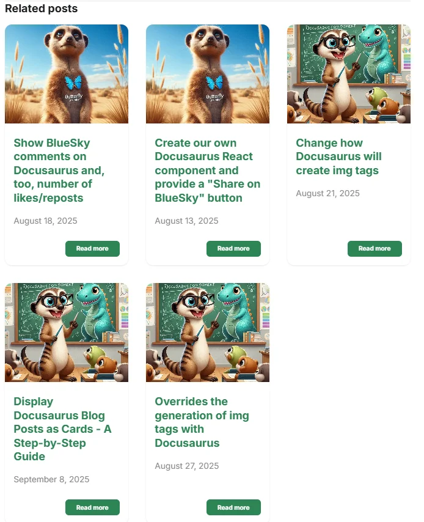
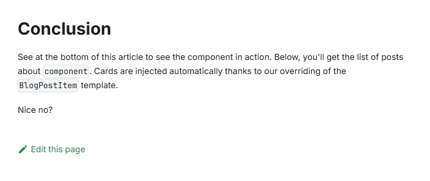
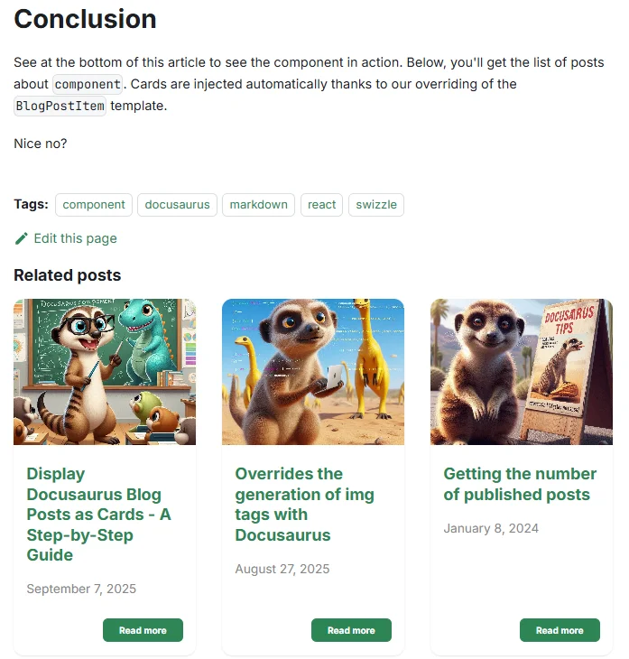

<!-- cspell:ignore relatedposts -->

<TLDR>
This guide explains how to add a 'Related Posts' section to your Docusaurus blog posts. You'll learn how to create a custom `<RelatedPosts>` React component that displays a list of articles sharing the same primary tag (`mainTag`). The process involves building a reusable `<Card>` component, creating a utility script to fetch and parse blog post data, and finally, overriding the Docusaurus `BlogPostItem` theme to inject your new component at the bottom of every article.
</TLDR>

Docusaurus can display a list of tags, but not related articles.

When you browse my blog, you will see a list of **Related Blog Posts** below every article. This is a component I coded using AI.

The objective of our component is to display something like this:

<!-- truncate -->

## We need a Card component

Please follow the instructions in the [Using the Reusable Card component of Docux](/blog/docusaurus-cards#using-the-reusable-card-component-of-docux) chapter.

You will have to create up to five files in a `src/components/Card/` folder (and its subfolders).

Return to this article after you have created the five files.

## We need a way to extract information from blog posts

If you haven't already, please create the `src/components/Blog/utils/posts.js` file. It will contain a helper function that we can reuse for several components.

That helper will scan each Markdown file with an `.md` or `.mdx` extension in the `blog` subfolder.

For each file, the script will look at the YAML front matter and use some of its properties. For example:

*   If the blog post has `draft: true` or `unlisted: true`, the post will be ignored.
*   If the blog post has a `slug`, it will be used. If not, the slug will be generated by the code.
*   If the blog post has an associated image, it will be used. If not, a default image will be used.
*   Then, the helper will return the list of posts and their properties.

Some properties, like `mainTag`, are custom.

So, just copy and paste the content of the file below and create the `src/components/Blog/utils/posts.js` file in your project's structure.

<Snippet filename="src/components/Blog/utils/posts.js" source="src/components/Blog/utils/posts.js" />

## Our RelatedPosts component

Now, please create the file `src/components/Blog/RelatedPosts/index.js`:

<Snippet filename="src/components/Blog/RelatedPosts/index.js" source="src/components/Blog/RelatedPosts/index.js" />

## Overriding the BlogPostItem template

We now need to override Docusaurus's **BlogPostItem** template so we can inject our `<RelatedPosts>` component at the bottom of each blog post.

In a terminal, run `yarn docusaurus swizzle @docusaurus/theme-classic BlogPostItem`, then select `Javascript`, then `Eject`, and finally `YES`.

Many files will be created in your Docusaurus project's `src/theme/BlogPostItem` folder. We can safely remove all files except for the `src/theme/BlogPostItem/index.js` file, which we need to edit.

So, please remove all files and folders under `src/theme/BlogPostItem` except for the `index.js` file.

In the code below, the highlighted lines are the ones we need to add.

<Snippet filename="src/theme/BlogPostItem/index.js" source="./files/index.js" />

Now, because we have just introduced an override, we need to restart our Docusaurus server so, the changes can take effect.

<AlertBox variant="info" title="Run npm run start">
If you're running Docusaurus locally, just run `npm run start` in your console.
If, like me, you are running Docusaurus with Docker, just stop the container and start a new one.

</AlertBox>

## Editing our blog posts

We have made all the required configurations, but when you visit your blog, you do not see anything like "Related Posts." Why?

For instance, in the image below, we do not see any cards.

<StepsCard
  title="This is because we need two things:"
  variant="prerequisites"
  steps={[
    "1. Your post should have a `mainTag` and ",
    "2. Posts in your blog should have a `tags` array"
  ]}
/>

Look at the example below:

<Snippet filename="post.md" source="./files/post.txt" defaultOpen={true} />

The blog post should have a `mainTag` item, and it should be associated with the most important tag for that post. Let's say, `docusaurus`.

Then, all posts in your blog should have the standard `tags` array, where you can list more than one tag.

The `RelatedPosts` component will then search for `docusaurus` across your posts and display up to six cards.

