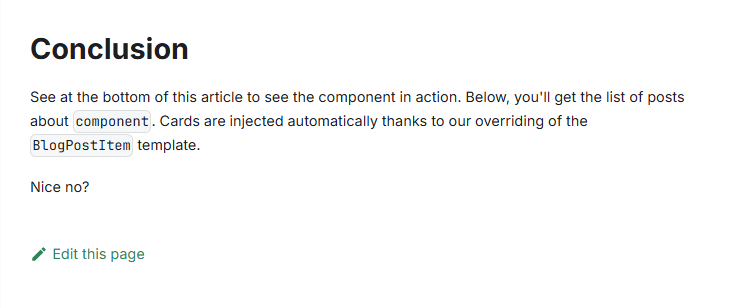
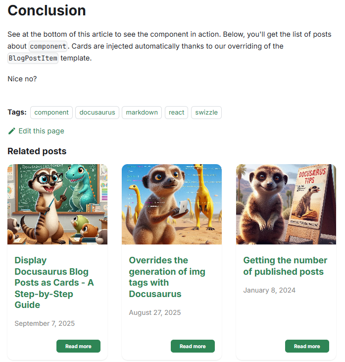

<!-- cspell:ignore relatedposts -->


Docusaurus can display a list of tags but not related articles.

When you surf on my blog, you'll see below every articles a list of **Related blog posts**. This is a component I've *vibe-coded* using AI.

The objective of our component will be to display something like this:


## We need a Card component

Please follow the [Using the Reusable Card component of Docux](/blog/docusaurus-cards#using-the-reusable-card-component-of-docux) chapter.

You'll have to create up to five files in a `src/components/Card/` folder (and sub-folder).

Come back to this article when the five files have been created.

## We need something for extracting information from blog posts

If you don't have it yet, please create the `src/components/Blog/utils/posts.js` file. It'll contain a helper function we can reuse for several components.

That helper will scan each Markdown files having the `.md` or `.mdx` extension in the `blog` sub-folder.

For each file, the script will looks at the YAML front matter and exploit some properties; f.i.:

* if the blog post has `draft: true` or `unlisted: true`, the post will be ignored,
* if the blog post has a `slug` will use it. If not, the slug will be generated by code,
* if the blog post has an associated image will use it. If not use a default one
* then the helper will simply return the list of posts and their properties.

Some properties are custom ones like `mainTag`.

So, just copy/paste the content of the file below and create the `src/components/Blog/utils/posts.js` in your project's structure.

<Snippet filename="src/components/Blog/utils/posts.js" source="src/components/Blog/utils/posts.js" />

## Our RelatedPosts component

Now please create this file `src/components/Blog/RelatedPosts/index.js`:

<Snippet filename="src/components/Blog/RelatedPosts/index.js" source="src/components/Blog/RelatedPosts/index.js" />

## Overriding the BlogPostItem template

We need now to override the **BlogPostItem** template of Docusaurus so we can inject our `<RelatedPosts>` component at the bottom of each blog post.

In a console, please run `yarn docusaurus swizzle @docusaurus/theme-classic BlogPostItem` then select, in that order, `Javascript`, then `Eject` finally `YES`.

A lot of files will be created in your Docusaurus directory's structure, in folder `src/theme/BlogPostItem`. We can safely removed all files except the `src/theme/BlogPostItem/index.js` file that we need to edit.

So, please remove any files/folders under `src/theme/BlogPostItem` except the `index.js` one.

In the code below, the highlighted lines are the ones we need to add.

<Snippet filename="src/theme/BlogPostItem/index.js">

```js
import { useBlogPost } from "@docusaurus/plugin-content-blog/client";
import BlogPostItemContainer from "@theme/BlogPostItem/Container";
import BlogPostItemContent from "@theme/BlogPostItem/Content";
import BlogPostItemFooter from "@theme/BlogPostItem/Footer";
import BlogPostItemHeader from "@theme/BlogPostItem/Header";
import clsx from "clsx";

import RelatedPosts from "@site/src/components/Blog/RelatedPosts/index.js";

// apply a bottom margin in list view
function useContainerClassName() {
  const { isBlogPostPage } = useBlogPost();
  return !isBlogPostPage ? "margin-bottom--xl" : undefined;
}
export default function BlogPostItem({ children, className }) {
  // We need to retrieve the isBlogPostPage flag
  const { metadata, isBlogPostPage } = useBlogPost();
  const containerClassName = useContainerClassName();
  return (
    <BlogPostItemContainer className={clsx(containerClassName, className)}>
      <BlogPostItemHeader />
      <BlogPostItemContent>{children}</BlogPostItemContent>
      <BlogPostItemFooter />
      // highlight-next-line
      {isBlogPostPage && <RelatedPosts count="6" description="false" />}
    </BlogPostItemContainer>
  );
}

```

</Snippet>

Now, because we've just introduced an override, we need to restart our Docusaurus server so changes can be taken into account.

:::info
If you're running Docusaurus locally, just run `npm run start` in your console.
If like me you're running Docusaurus thanks to Docker, just kill the container and run a new one.
:::

## Editing our blog posts

We've made all the required configuration but ... when you visit your blog, you don't see anything like "Related Posts"; why?

For instance, on the image here below, we don't see any cards.



<StepsCard
  title="This because we need to things:"
  variant="prerequisites"
  steps={[
    "1. Your post should have a `mainTag` and ",
    "2. Posts in your blog should have a `tags` array"
  ]}
/>

Look the example below:

<Snippet filename="post.md">

```markdown
---
date: 2025-09-03
slug: docusaurus-relatedposts
title: Displaying related posts below our Docusaurus article
authors: [christophe]
image: /img/components_social_media.jpg
series: Creating Docusaurus components
# highlight-start
mainTag: docusaurus
tags: [component, docusaurus, markdown, react, swizzle]
# highlight-end
---
```

</Snippet>

The blog post should have a `mainTag` item and should be associated to the most important tag for you. Let's say `docusaurus`.

Then, all posts in your blog should have the, standard, `tags` array where you can list more than one tag.

The `RelatedPosts` component will then search for `docusaurus` across your posts and display up to 6 cards.


