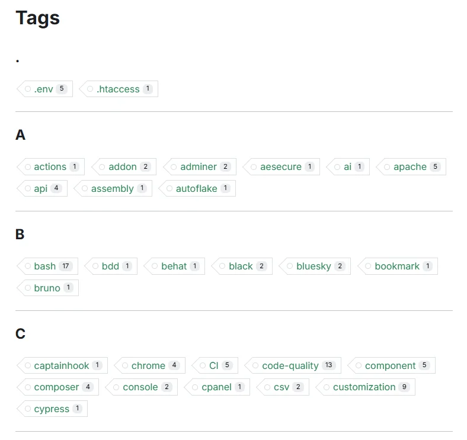
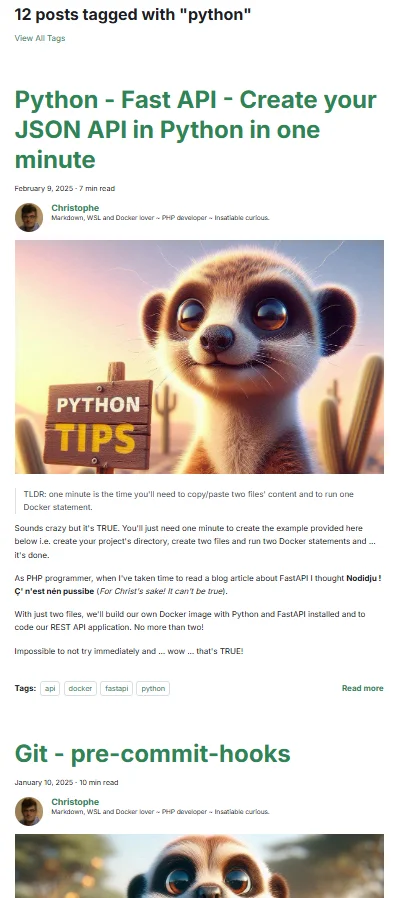

<!-- cspell:ignore  -->

<TLDR>
This comprehensive guide demonstrates how to transform Docusaurus's default blog post lists into a visually appealing card-based layout. You'll learn how to implement a reusable multi-part `<Card>` component, and then create a custom `<PostCard>` component to display post-specific information. The tutorial walks you through creating a local Docusaurus plugin to override the default `/blog/tags/:tag` route, and a new page component to render the cards. It also covers utility scripts for fetching post metadata and generating slugs.
</TLDR>

In this article, we'll learn how to create a card from a blog post.

If you're using Docusaurus for your blog, you might be looking for some ways to improve the layout of pages. Instead of displaying posts as a list, let's see how we can display them as **cards**.

In this guide, we'll walk through how to create this. You've been just asked to copy/paste files to your site and make a small change in your configuration file.

<!-- truncate -->

This will imply a big number of files but the idea is then to reuse created components / files for later use.

## Using the Reusable Card component of Docux

First, we'll retrieve the [Reusable Card Component](https://docuxlab.com/blog/card-component-docusaurus-infima/) of our friend, [Docux](https://github.com/Juniors017). It's a set of files you've to create; let's proceed.

<AlertBox variant="info" title="">
That one can be retrieved too on the [Docusaurus Community](https://docusaurus.community/knowledge/component-library/new/Card/) site but perhaps not up to date.

</AlertBox>

In your Docusaurus site, please create these files:

<Snippet
  filename="src/components/Card/index.js"
  source="src/components/Card/index.js"
/>

<Snippet
  filename="src/components/Card/styles.module.css"
  source="src/components/Card/styles.module.css"
/>

<Snippet
  filename="src/components/Card/CardBody/index.js"
  source="src/components/Card/CardBody/index.js"
/>

<Snippet
  filename="src/components/Card/CardFooter/index.js"
  source="src/components/Card/CardFooter/index.js"
/>

<Snippet
  filename="src/components/Card/CardHeader/index.js"
  source="src/components/Card/CardHeader/index.js"
/>

<Snippet
  filename="src/components/Card/CardImage/index.js"
  source="src/components/Card/CardImage/index.js"
/>

So right now, you've created six files on your disk.

Before going any further in this tutorial, let's first play around with the Card component and see if everything is saved correctly.

Please create a new post in your `blog` folder but pay attention to the extension, it should be a `.mdx` file (because we'll add some code that should be interpreted).

<Snippet filename="blog/card.mdx" source="./files/card.txt" />

If you run your blog right now, you should get this:

<AlertBox variant="note" title="">
If you want to retrieve the cute dino image, just grab it from here [https://github.com/Juniors017/docux-blog/blob/main/static/img/docux.png](https://github.com/Juniors017/docux-blog/blob/main/static/img/docux.webp) and store it in your `/static/img` folder with `docux.png` as a name.

You can reuse any other image for sure.

</AlertBox>

## Nice, it's works. Let's continue with a practical sample

In this article, we'll create override the standard page with the list of tags. As you know, natively, Docusaurus can display a page with the list of tags used across your articles if you access to the **/blog/tags** page. So for my own blog, the page is [https://www.avonture.be/blog/tags](https://www.avonture.be/blog/tags) and you'll get something like this:

By clicking on a specific tag, Docusaurus will show a list of posts for that tag and we'll change this.

For instance, this:

<AlertBox variant="info" title="">
It can be nice but ... OK, I've to scroll a lot before see all articles and find the one that might interest me.

</AlertBox>

We'll change this to a list of post cards. As an example, on my blog, I'm also writing about [python](https://www.avonture.be/blog/tags/python) and here is how I'm rendering the page:

This concrete example will allow us to implement two Docusaurus concepts: **the concept of plugins and that of components**.

## Overriding the /blog/tags/tag page by creating a plugin

Please create the file here above.

<Snippet
  filename="plugins/docusaurus-plugin-tag-route/index.cjs"
  source="plugins/docusaurus-plugin-tag-route/index.cjs"
/>

Take a few seconds to read this short script: as you can see that one will tell to Docusaurus to no more use his own standard `/blog/tags/:tag` page but ours (i.e. `src/components/Blog/Tags/TagArticlesPage`). Let's create that one.

## Creating the TagArticlesPage

Please create the file below. It's the `TagArticlesPage` function that'll be called by Docusaurus when he'll display a specific tag.

<Snippet
  filename="src/components/Blog/Tags/TagArticlesPage.js"
  source="src/components/Blog/Tags/TagArticlesPage.js"
/>

As you can see at the very top of the `TagArticlesPage.js` file, we're importing a few files. Some already exists in your Docusaurus site; some should be created.

There are three files we should create

## The slug generator

<Snippet
  filename="src/components/Blog/utils/slug.js"
  source="src/components/Blog/utils/slug.js"
/>

## The getBlogMetaData function

We need a function to loop all our existing blog posts (all `.md` or `.mdx` files under the `blog` folder) and collect information like the post title, image, slug and so on.

<Snippet
  filename="src/components/Blog/utils/posts.js"
  source="./files/posts.js"
/>

## Our PostCard component

And, finally, we need our PostCard component; the one who will display a blog post as a card.

You can see, in the top of the code, that we're importing a few parts of the [Card component](https://docusaurus.community/knowledge/component-library/new/Card/) of Docux.

<Snippet
  filename="src/components/Blog/PostCard/index.js"
  source="./files/index.js"
/>

Finally, we'll create a CSS file to allow us to do some customization:

<Snippet
  filename="src/components/Blog/PostCard/styles.module.css"
  source="./files/styles.modules.css"
/>

## We need to load our plugin

We're almost done.

Remember, the very first file we've created was `plugins/docusaurus-plugin-tag-route/index.cjs`; a plugin.

Please edit your existing `docusaurus.config.js` file like below illustrated:

<Snippet
  filename="docusaurus.config.js"
  source="./files/docusaurus.config.js"
/>

i.e.

1. You've to import the plugin at the top of your file
2. Then in the `plugins` section, you've to add a new line to load your imported plugin.

We're almost finished!

<AlertBox variant="caution" title="">
Please stop and restart your Docusaurus server. On my case (I'm using Docker), I just need to stop and restart my container.

</AlertBox>

If everything is going fine after the restart (no error message), please visit your website tags page and open a tag. You should now see your posts as cards.

Congratulations!

In next articles, we'll reuse this concept of post cards. Stay tuned!

## Extra

If you want your blog posts are listed from the newest one to the older one, please use this script.

But make sure every blog post you've has a `date` field in his YAML front matter.

<Snippet
  filename="src/components/Blog/Tags/TagArticlesPage.js"
  source="./files/TagArticlesPage.js"
/>
