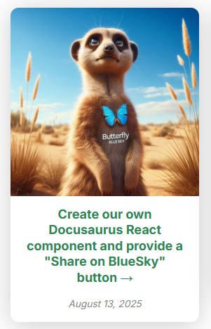
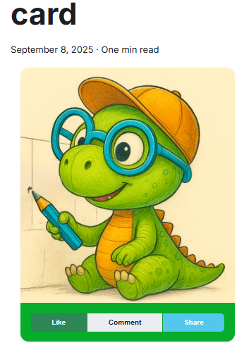
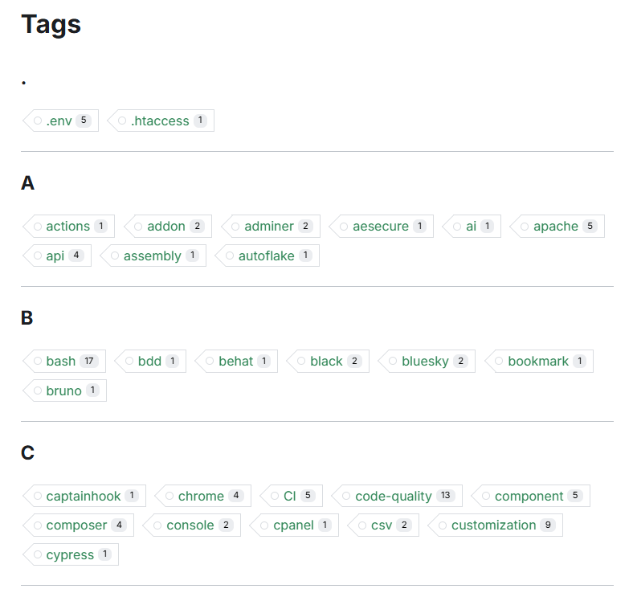
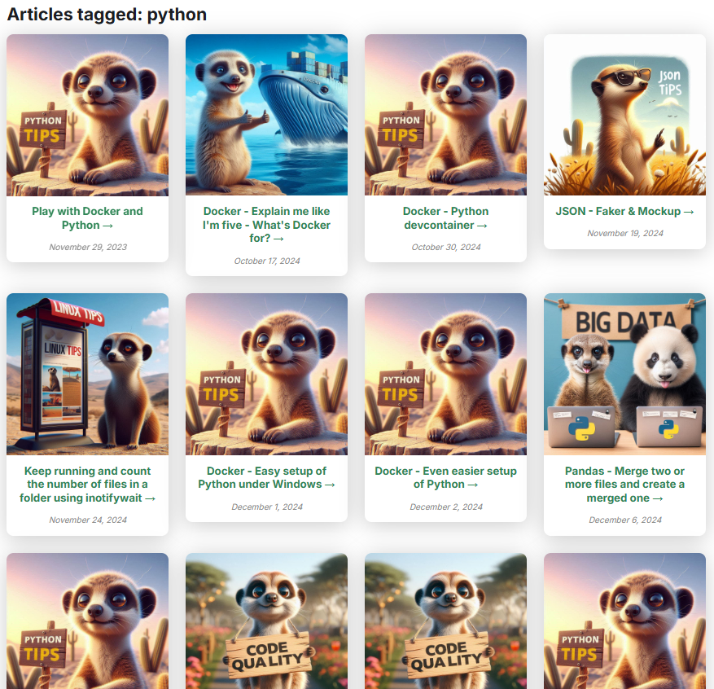

<!-- cspell:ignore  -->


In this article, we'll learn how to create a card from a blog post.

If you're using Docusaurus for your blog, you might be looking for some ways to improve the layout of pages. Instead of displaying posts as a list, let's see how we can display them as **cards**.

In this guide, we'll walk through how to create this. You've been just asked to copy/paste files to your site and make a small change in your configuration file.

<!-- truncate -->



This will imply a big number of files but the idea is then to reuse created components / files for later use.

## Using the Reusable Card component of Docux

First, we'll retrieve the [Reusable Card Component](https://docuxlab.com/blog/card-component-docusaurus-infima/) of our friend, [Docux](https://github.com/Juniors017). It's a set of files you've to create; let's proceed.

<AlertBox variant="info" title="">
That one can be retrieved too on the [Docusaurus Community](https://docusaurus.community/knowledge/component-library/new/Card/) site but perhaps not up to date.

</AlertBox>

In your Docusaurus site, please create these files:

<Snippet filename="src/components/Card/index.js" source="src/components/Card/index.js" />

<Snippet filename="src/components/Card/styles.module.css" source="src/components/Card/styles.module.css" />

<Snippet filename="src/components/Card/CardBody/index.js" source="src/components/Card/CardBody/index.js" />

<Snippet filename="src/components/Card/CardFooter/index.js" source="src/components/Card/CardFooter/index.js" />

<Snippet filename="src/components/Card/CardHeader/index.js" source="src/components/Card/CardHeader/index.js" />

<Snippet filename="src/components/Card/CardImage/index.js" source="src/components/Card/CardImage/index.js" />

So right now, you've created six files on your disk.

Before going any further in this tutorial, let's first play around with the Card component and see if everything is saved correctly.

Please create a new post in your `blog` folder but pay attention to the extension, it should be a `.mdx` file (because we'll add some code that should be interpreted).

<Snippet filename="blog/card.mdx">

```md
import Card from "@site/src/components/Card";
import CardFooter from "@site/src/components/Card/CardFooter";
import CardImage from "@site/src/components/Card/CardImage";

<div className="container">
   <div className="row padding-bottom--xl">
      <div className="col col--6">
         <div className="">
            <Card>
               <CardImage cardImageUrl="/img/docux.png" />
               <CardFooter
               style={{ backgroundColor: "#07ac2aff", color: "#eeff00ff" }}
               className="text--center"
               >
               <div className="button-group button-group--block">
                  <button className="button button--primary button--sm">Like</button>
                  <button className="button button--secondary button--sm">Comment</button>
                  <button className="button button--info button--sm">Share</button>
               </div>
               </CardFooter>
            </Card>
         </div>
      </div>
   </div>
</div>
```

</Snippet>

If you run your blog right now, you should get this:



<AlertBox variant="note" title="">
If you want to retrieve the cute dino image, just grab it from here [https://github.com/Juniors017/docux-blog/blob/main/static/img/docux.png](https://github.com/Juniors017/docux-blog/blob/main/static/img/docux.png) and store it in your `/static/img` folder with `docux.png` as a name.

You can reuse any other image for sure.

</AlertBox>

## Nice, it's works. Let's continue with a practical sample

In this article, we'll create override the standard page with the list of tags. As you know, natively, Docusaurus can display a page with the list of tags used across your articles if you access to the **/blog/tags** page.  So for my own blog, the page is [https://www.avonture.be/blog/tags](https://www.avonture.be/blog/tags) and you'll get something like this:



By clicking on a specific tag, Docusaurus will show a list of posts for that tag and we'll change this.

For instance, this:


<AlertBox variant="info" title="">
It can be nice but ... OK, I've to scroll a lot before see all articles and find the one that might interest me.

</AlertBox>

We'll change this to a list of post cards. As an example, on my blog, I'm also writing about  [python](https://www.avonture.be/blog/tags/python) and here is how I'm rendering the page:



This concrete example will allow us to implement two Docusaurus concepts: **the concept of plugins and that of components**.

## Overriding the /blog/tags/tag page by creating a plugin

Please create the file here above.

<Snippet filename="plugins/docusaurus-plugin-tag-route/index.cjs" source="plugins/docusaurus-plugin-tag-route/index.cjs" />

Take a few seconds to read this short script: as you can see that one will tell to Docusaurus to no more use his own standard `/blog/tags/:tag` page but ours (i.e. `src/components/Blog/Tags/TagArticlesPage`). Let's create that one.

## Creating the TagArticlesPage

Please create the file below. It's the `TagArticlesPage` function that'll be called by Docusaurus when he'll display a specific tag.

<Snippet filename="src/components/Blog/Tags/TagArticlesPage.js" source="src/components/Blog/Tags/TagArticlesPage.js" />

As you can see at the very top of the `TagArticlesPage.js` file, we're importing a few files. Some already exists in your Docusaurus site; some should be created.

There are three files we should create

## The slug generator

<Snippet filename="src/components/Blog/utils/slug.js" source="src/components/Blog/utils/slug.js" />

## The getBlogMetaData function

We need a function to loop all our existing blog posts (all `.md` or `.mdx` files under the `blog` folder) and collect information like the post title, image, slug and so on.

<Snippet filename="src/components/Blog/utils/posts.js">

```js
/**
 * 🧠 getBlogMetadata
 *
 * Extracts metadata from all MDX blog posts located in the `/blog` directory.
 * Uses Webpack's `require.context` to dynamically load and parse frontmatter
 * from each post, returning a structured array of metadata objects.
 *
 * 🔍 Behavior:
 * - Resolves permalinks based on `slug` or folder structure
 * - Normalizes image paths for static assets
 * - Filters out invalid or missing entries
 *
 * 📦 Returned metadata includes:
 * - `title`: Post title
 * - `description`: Short summary
 * - `image`: Resolved image path
 * - `draft`: Boolean flag for unpublished posts
 * - `unlisted`: Boolean flag for hidden posts
 * - `permalink`: URL path to the post
 * - `tags`: Array of tags
 * - `mainTag`: Primary tag (optional); used by the RelatedBlogPost component
 * - `authors`: Array of author names
 * - `date`: Publication date
 * - `series`: Series name (optional); used by the SeriesBlogPost component
 *
 * 🛠️ Usage:
 * ```js
 * import { getBlogMetadata } from './getBlogMetadata';
 * const posts = getBlogMetadata();
 * ```
 *
 * ⚠️ Note:
 * This function is intended for use in static site generation or client-side rendering
 * where Webpack's `require.context` is available.
 */

const posts = require.context("../../../../blog", true, /\.mdx?$/);

export function getBlogMetadata() {
  return posts
    .keys()
    .map((key) => {
      const post = posts(key);

      const dir = key.replace(/\/index\.mdx?$/, "").replace(/^\.\//, "");

      let permalink;
      if (post.frontMatter.slug) {
        permalink = post.frontMatter.slug.startsWith("/")
          ? post.frontMatter.slug
          : `/blog/${post.frontMatter.slug.replace(/^\//, "")}`;
      } else {
        permalink = `/blog/${dir}/`;
      }

      let imageUrl = post.frontMatter.image;
      if (imageUrl && imageUrl.startsWith("./")) {
        imageUrl = `/blog/${dir}/${imageUrl.replace("./", "")}`;
      }

      return {
        title: post.frontMatter.title,
        description: post.frontMatter.description,
        image: imageUrl,
        draft: post.frontMatter.draft || false,
        unlisted: post.frontMatter.unlisted || false,
        permalink,
        tags: post.frontMatter.tags || [],
        mainTag: post.frontMatter.mainTag || null,
        authors: post.frontMatter.authors || [],
        date: post.frontMatter.date,
        series: post.frontMatter.series || null,
      };
    })
    .filter(Boolean);
}

```

</Snippet>

## Our PostCard component

And, finally, we need our PostCard component; the one who will display a blog post as a card.

You can see, in the top of the code, that we're importing a few parts of the [Card component](https://docusaurus.community/knowledge/component-library/new/Card/) of Docux.

<Snippet filename="src/components/Blog/PostCard/index.js">

```js
/**
 * ♣️ PostCard component
 *
 * A reusable Docusaurus component that displays a blog post preview card.
 * It shows the post image (with fallback), title (as a link), and description.
 *
 * Accessibility:
 * - The title is wrapped in a semantic link with an aria-label for screen readers.
 * - The image includes alt and title attributes.
 *
 * Styling:
 * - Uses Infima utility classes for layout and spacing.
 * - Custom styles can be applied via `styles.module.css`.
 *
 * Location: src/components/Blog/PostCard/index.js
 */

import Card from "@site/src/components/Card";
import CardBody from "@site/src/components/Card/CardBody";
import CardImage from "@site/src/components/Card/CardImage";
import Link from "@docusaurus/Link";
import PropTypes from "prop-types";
import styles from "./styles.module.css";

/**
 * Renders a formatted date string.
 * @param {Object} props
 * @param {string} props.date - The date string to format.
 * @param {string} props.layout - The layout variant ('big' or 'small').
 * @returns {JSX.Element | null}
 */
const FormattedDate = ({ date, layout }) => {
  if (!date) {
    return null;
  }
  return (
    <p
      className={layout === "small" ? "" : styles.date}
      style={
        layout === "small"
          ? { color: "#888", fontSize: "0.95em", marginBottom: 8 }
          : {}
      }
    >
      <span>
        {new Date(date).toLocaleDateString("en-US", {
          year: "numeric",
          month: "long",
          day: "numeric",
        })}
      </span>
    </p>
  );
};

/**
 * @param {Object} props
 * @param {Object} props.post - Blog post metadata.
 * @param {string} [props.layout='big'] - The layout variant: 'big' or 'small'.
 * @param {string} props.defaultImage - Fallback image used when no image is provided.
 * @returns {JSX.Element}
 */
export default function PostCard({
  post,
  layout = "big",
  defaultImage = "/img/default.jpg",
}) {
  const { permalink, image, title, description, date } = post;

  if (layout === "small") {
    return (
      <div
        className="col col--4"
        style={{ marginBottom: "2rem", display: "flex" }}
      >
        <div
          className="card"
          style={{
            width: "100%",
            display: "flex",
            flexDirection: "column",
            height: "100%",
          }}
        >
          <div className="card__image">
            
          </div>
          <div className="card__body" style={{ flex: 1 }}>
            <h3>
              <Link to={permalink}>{title}</Link>
            </h3>
            {description && (
              <div
                style={{
                  color: "#6c63ff",
                  fontWeight: "bold",
                  marginBottom: 6,
                }}
              >
                {description}
              </div>
            )}
            <FormattedDate date={date} layout={layout} />
          </div>
          <div className="card__footer" style={{ textAlign: "right" }}>
            <Link className="button button--primary button--sm" to={permalink}>
              Read more
            </Link>
          </div>
        </div>
      </div>
    );
  }

  // Default "big" layout
  return (
    <div className="col col--3 margin-bottom--lg">
      <Card shadow="md">
        <CardImage
          cardImageUrl={image || defaultImage}
          alt={title}
          title={title}
        />
        <CardBody className="padding-vert--md text--center" textAlign="center">
          <h3>
            <Link href={permalink} aria-label={`Read article: ${title}`}>
              {title}&nbsp;→
            </Link>
          </h3>
          {description && <p className={styles.description}>{description}</p>}
          <FormattedDate date={date} layout={layout} />
        </CardBody>
      </Card>
    </div>
  );
}

PostCard.propTypes = {
  post: PropTypes.shape({
    permalink: PropTypes.string.isRequired,
    image: PropTypes.string,
    title: PropTypes.string.isRequired,
    description: PropTypes.string,
  }).isRequired,
  layout: PropTypes.oneOf(["big", "small"]),
  defaultImage: PropTypes.string,
};

```

</Snippet>

Finally, we'll create a CSS file to allow us to do some customisation:

<Snippet filename="src/components/Blog/PostCard/styles.module.css">

```css
.description {
  font-size: 12px;
}

.date {
  color: #888;
  font-size: 0.95em;
  margin-bottom: 8;
  font-style: italic;
}
```

</Snippet>

## We need to load our plugin

We're almost done.

Remember, the very first file we've created was `plugins/docusaurus-plugin-tag-route/index.cjs`; a plugin.

Please edit your existing `docusaurus.config.js` file like below illustrated:

<Snippet filename="docusaurus.config.js">

```js
import pluginTagRoute from "./plugins/docusaurus-plugin-tag-route/index.cjs"

const config = {
  // [...]
  plugins: [
    // [...]
    [pluginTagRoute, {}],
  ],
  // [...]
};
```

</Snippet>

i.e.

1. You've to import the plugin at the top of your file
2. Then in the `plugins` section, you've to add a new line to load your imported plugin.

We're almost finished!

<AlertBox variant="caution" title="">
Please stop and restart your Docusaurus server. On my case (I'm using Docker), I just need to stop and restart my container.

</AlertBox>

If everything is going fine after the restart (no error message), please visit your website tags page and open a tag. You should now see your posts as cards.

Congratulations!

In next articles, we'll reuse this concept of post cards. Stay tuned!

## Extra

If you want your blog posts are listed from the newest one to the older one, please use this script.

But make sure every blog post you've has a `date` field in his YAML front matter.

<Snippet filename="src/components/Blog/Tags/TagArticlesPage.js">

```js
import { createSlug } from "@site/src/components/Blog/utils/slug";
import { getBlogMetadata } from "@site/src/components/Blog/utils/posts";
import { useLocation } from "@docusaurus/router";
import Layout from "@theme/Layout";
import Link from "@docusaurus/Link";
import PostCard from "@site/src/components/Blog/PostCard";

function getTagFromPathname(pathname) {
  const match = pathname.match(/\/blog\/tags\/([^/]+)/);
  return match ? decodeURIComponent(match[1]) : null;
}

export default function TagArticlesPage() {
  const location = useLocation();
  const rawTag = getTagFromPathname(location.pathname);

  if (!rawTag) {
    return (
      <Layout>
        <div className="container">
          <p>No tag specified.</p>
          <Link href="/blog/tags">Go back to all tags</Link>
        </div>
      </Layout>
    );
  }

  const posts = getBlogMetadata();

  // Find original tag name based on slug
  const allTags = Array.from(new Set(posts.flatMap((post) => post.tags || [])));
  const displayTag = allTags.find((t) => createSlug(t) === rawTag) || rawTag;

  // highlight-start
  // Filter and sort posts by slug-matched tag (most recent first)
  const taggedPosts = posts
    .filter((post) => post.tags?.some((t) => createSlug(t) === rawTag))
    .sort((a, b) => new Date(b.date) - new Date(a.date)); // Descending
  // highlight-end

  if (taggedPosts.length === 0) {
    return (
      <Layout title={`Tag: ${displayTag}`}>
        <div className="container margin-top--lg margin-bottom--lg text--center">
          <h2>No articles found with tag "{displayTag}"</h2>
          <Link href="/blog/tags">Browse all tags</Link>
        </div>
      </Layout>
    );
  }

  return (
    <Layout title={`Tag: ${displayTag}`}>
      <div className="container margin-top--lg margin-bottom--lg">
        <h1>Articles tagged: {displayTag}</h1>
        <div className="row">
          {taggedPosts.map((post) => (
            <PostCard key={post.title} post={post} />
          ))}
        </div>
      </div>
    </Layout>
  );
}
```

</Snippet>