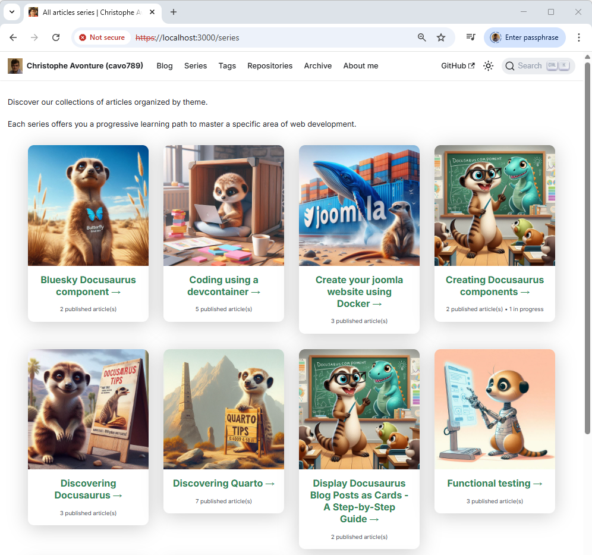
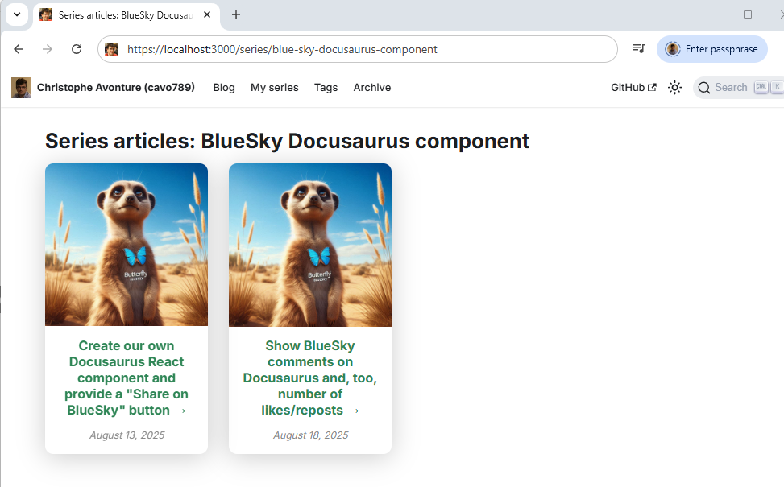

<!-- cspell:ignore reposts,packagist,3lun2qjuxc22r,repost,noopener,noreferrer,docux -->


If you have been using Docusaurus for a long time, you may have noticed that it is not possible to create links between articles as one would like to do for a series.

It would be nice to write a first article, a second, a third one, ... and teach Docusaurus these articles are part of the same series.

This will also have a positive impact on your SEO (by creating better internal linking) and keep your readers interested for longer.

It's impossible natively so, let's create our component for this.

:::caution Spoiler alert
Just click on the <Link to="/series">Series</Link> link to see how the **SeriesPosts** component is soooo cool. You'll learn how to do this here.
:::

<!-- truncate -->

:::tip
Hey, did you've already seen this article? Look at the top, you've a "This article is part of the **Creating Docusaurus components** series:"; this is exactly what we'll learn right now.
:::

This long article will have two main sections: one on the actual creation of the component, and the other on navigating the blog.

## Part 1 - Creation of the SeriesPosts component

In this first chapter, we'll create our `SeriesPosts` component so, by opening an article, we can get a `This article is part of the ... series` and a list of articles that are part of that series.

<StepsCard
  title="This will implies a lot of things like:"
  variant="prerequisites"
  steps={[
    "We'll need some helpers,",
    "We'll need a new component,",
    "Blog posts should have a `series:` YAML front matter item and",
    "We'll have to override the standard way of displaying a blog post"
  ]}
/>

### 1.1. We need some helpers

If you don't have it yet, please create the `src/components/Blog/utils/posts.js` file. It'll contain a helper function we can reuse for several components.

That helper will scan each Markdown files having the `.md` or `.mdx` extension in the `blog` sub-folder.

For each file, the script will looks at the YAML front matter and exploit some properties; f.i.:

* if the blog post has `draft: true` or `unlisted: true`, the post will be ignored,
* if the blog post has a `slug` will use it. If not, the slug will be generated by code,
* if the blog post has an associated image will use it. If not use a default one
* then the helper will simply return the list of posts and their properties.

Some properties are custom ones like `mainTag` (see my [Displaying related posts below our Docusaurus article](/blog/docusaurus-relatedposts) article) and, for our need right now, the `series` property.

So, just copy/paste the content of the file below and create the `src/components/Blog/utils/posts.js` in your project's structure.

<Snippet filename="src/components/Blog/utils/posts.js" source="src/components/Blog/utils/posts.js" />

We'll also need a second helper: please create the `src/components/Blog/utils/slug.js` file:

<Snippet filename="src/components/Blog/utils/slug.js" source="src/components/Blog/utils/slug.js" />

### 1.2. Our SeriesPosts component

Now, we'll create our component. Please create the `src/components/Blog/SeriesPosts/index.js` file with the following code:

<Snippet filename="src/components/Blog/SeriesPosts/index.js" source="src/components/Blog/SeriesPosts/index.js" />

This javascript code will retrieve the list of all blog posts. Then will extract a property called `series` (present or not in your blog post YAML front matter). If a post has the `series` property, the script will compare its value with the one of the current blog post.

If there is a match, we've thus another articles in the serie and the script will then display a "This article is part of ..." followed by the series name and the list of articles.

Articles will be displayed in a chronological order to allow the reader to follow the serie is a logical order.

The rest of the logic will simply to display a bullet list.

And the last file to create is the CSS file:

<Snippet filename="src/components/Blog/SeriesPosts/styles.module.css" source="src/components/Blog/SeriesPosts/styles.module.css" />

### 1.3. Editing our articles

Now, the easy part, please edit a few existing blog posts you've and add the `series` key in the YAML front matter; f.i.:

<Snippet filename="index.md">

```markdown
---
title: Create your Joomla website using Docker - Part 1
[...]
<!-- highlight-next-line -->
series: Create your joomla website using Docker
[...]
---

In this article, we will learn how to ...
```

</Snippet>

Do this for a few posts (so we'll have a few articles in that series).

:::caution
If you visit your blog right now and surf on your article, you'll not see any differences at all. And it's purely normal because we've just created a component; we still need to tell Docusaurus to use it.
:::

### 1.4. Overriding the BlogPostItem template

So we need to call our newly created component. For sure, we can include the `<SeriesBlogPost>` tag in each article but, uh oh, we're smart people isn't it?

Let's create an override of the BlogPostItem template of Docusaurus.

In a console, please run `yarn docusaurus swizzle @docusaurus/theme-classic BlogPostItem` then select, in that order, `Javascript`, then `Eject` finally `YES`.

A lot of files will be created in your Docusaurus directory's structure, in folder `src/theme/BlogPostItem`. We can safely removed all files except the `src/theme/BlogPostItem/index.js` file that we need to edit.

So, please remove any files/folders under `src/theme/BlogPostItem` except the `index.js` one.

In the code below, the highlighted lines are the ones we need to add.

<Snippet filename="src/theme/BlogPostItem/index.js">

```js
import { useBlogPost } from "@docusaurus/plugin-content-blog/client";
import BlogPostItemContainer from "@theme/BlogPostItem/Container";
import BlogPostItemContent from "@theme/BlogPostItem/Content";
import BlogPostItemFooter from "@theme/BlogPostItem/Footer";
import BlogPostItemHeader from "@theme/BlogPostItem/Header";
import clsx from "clsx";

// highlight-next-line
import SeriesPosts from "@site/src/components/Blog/SeriesPosts/index.js";

// apply a bottom margin in list view
function useContainerClassName() {
  const { isBlogPostPage } = useBlogPost();
  return !isBlogPostPage ? "margin-bottom--xl" : undefined;
}
export default function BlogPostItem({ children, className }) {
  // We need to retrieve the isBlogPostPage flag
  const { metadata, isBlogPostPage } = useBlogPost();
  const containerClassName = useContainerClassName();
  return (
    <BlogPostItemContainer className={clsx(containerClassName, className)}>
      <BlogPostItemHeader />
      // highlight-start
      {isBlogPostPage && (
        <SeriesPosts
          series={metadata.frontMatter.series}
          excludePermalink={metadata.permalink}
          highlightCurrent={true}
        />
      )}
      // highlight-end
      <BlogPostItemContent>{children}</BlogPostItemContent>
      <BlogPostItemFooter />
      // highlight-start
      {isBlogPostPage && (
        <SeriesPosts
          series={metadata.frontMatter.series}
          excludePermalink={metadata.permalink}
          highlightCurrent={true}
        />
      )}
      // highlight-end
    </BlogPostItemContainer>
  );
}

```

</Snippet>

:::caution We need to restart Docusaurus
Now, because we've just introduced an override, we need to restart our Docusaurus server so changes can be taken into account.
:::

:::info
If you're running Docusaurus locally, just run `npm run start` in your console.
If like me you're running Docusaurus thanks to Docker, just kill the container and run a new one.
:::

### Let's try if it's working

Return to your blog and refresh the page; you should get something like this (with your own content for sure):


Great, the component is now running.

We can create our series (in this example, I've edited three articles about Joomla and added the `series` key in their YAML front matter).

You can navigate from one article to the other.

:::info
We can stop here, but that would be like doing half the journey: we still need to implement a page that will display the list of series and by clicking on a series, the list of articles in it.
:::

## Part 2 - Adding a navigation to series

As said, we'll create a page `/series` to our blog so we can immediately get access to all series.

<StepsCard
  title="So we'll need to"
  variant="prerequisites"
  steps={[
    "Create the /series page",
    "Create a SeriesCards component",
    "Create a PostCard component",
    "Add a /series entry to our navigation bar and",
    "Create a plugin to manage /series/a-series-name URL"
  ]}
/>

### 2.1 Adding a new page to show all series

It'll be cool to have a page on our Docusaurus site to display the list of series no? Let's do this.

First, please create the `src/pages/series.mdx` file with this content:

<Snippet filename="src/pages/series.mdx" source="src/pages/series.mdx" />

:::caution
As you can see, that page is a Markdown content but with one special feature: it contains Javascript code. This is why, and it's really important, the extension is `.mdx`.
:::

As you can see, there are some Markdown content (adapt it to fit your needs) and the use of a new component, the `SeriesCards` one, let's create it.

### 2.2 Creation of the SeriesCards component

Please create the `src/components/Blog/SeriesCards/index.js` file with this content:

<Snippet filename="src/components/Blog/SeriesCards/index.js" source="src/components/Blog/SeriesCards/index.js" />

We need a new helper `src/components/Blog/utils/series.js`:

<Snippet filename="src/components/Blog/utils/series.js" source="src/components/Blog/utils/series.js" />

In short, the `SeriesCards` component is quite easy, it'll just retrieve all series from your existing blog posts then display them as cards. Nothing more.

### 2.3 Creation of the PostCard component

We thus need a component for displaying a post as a card; please create the `src/components/Blog/PostCard/index.js` file with this content:

<Snippet filename="src/components/Blog/PostCard/index.js" source="src/components/Blog/PostCard/index.js" />

Create `src/components/Blog/PostCard/styles.module.css` too:

<Snippet filename="src/components/Blog/PostCard/styles.module.css" source="src/components/Blog/PostCard/styles.module.css" />

The `PostCard` component is using the [Reusable Card component of Docux](/blog/docusaurus-cards#using-the-reusable-card-component-of-docux). If you don't have it yet, please create at least these four files:

<Snippet filename="src/components/Card/index.js" source="src/components/Card/index.js" />

<Snippet filename="src/components/Card/styles.module.css" source="src/components/Card/styles.module.css" />

<Snippet filename="src/components/Card/CardBody/index.js" source="src/components/Card/CardBody/index.js" />

<Snippet filename="src/components/Card/CardImage/index.js" source="src/components/Card/CardImage/index.js" />

### Testing our /series URL

Everything is now in place for our `/series` web page: we've created the `src/pages/series.mdx` and all dependencies.

Now, simply access to the `/series` URL. On my localhost, it's `http://127.0.0.1:3000/series`.

Here is what you can get without any stylization:



Great no?

### 2.4 Adding an entry to the serie pages to your blog

Edit your `docusaurus.config.js` file and in the `navbar` -> `items` section, please add a link to `/series`:

<Snippet filename="docusaurus.config.js">

```js

// [...]
const config = {
  themeConfig:
    ({
      navbar: {
        items: [
          // [...]
          {
            href: "/series",
            label: "My series",
          },
          // [...]
        ],
      },
    }),
};

export default config;
```

</Snippet>


### 2.5 Handling the /series/slug URL

Ok, it works but ... from the `/series` page, if you click on a series, you'll get this error:


So, we've just created the `/series` page but when you reader will click on a series to get the list of articles, the URL will become something like `/series/the-name-of-the-series` and, thus, we need to tell to Docusaurus how to handle these new URLs.

By default, Docusaurus don't know what to do.

For this, we'll need a plugin, please create the `plugins/docusaurus-plugin-series-route/index.cjs` file with this content:

<Snippet filename="plugins/docusaurus-plugin-series-route/index.cjs" source="plugins/docusaurus-plugin-series-route/index.cjs" />

As you can see in the plugin source code, we need a new component: `src/components/Blog/Series/SeriesArticlesPage.js`, let's create it:

<Snippet filename="src/components/Blog/Series/SeriesArticlesPage.js" source="src/components/Blog/Series/SeriesArticlesPage.js" />

And we need to load this plugin so we'll need to update the `docusaurus.config.js` file again:

<Snippet filename="docusaurus.config.js">

```js
// [...]
import pluginSeriesRoute from "./plugins/docusaurus-plugin-series-route/index.cjs"

const config = {
  // [...]

  // WE SHOULD IGNORE BROKEN LINKS because Docusaurus’s link checker doesn't
  // recognize dynamic routes created via plugins; and we're using at least one
  // i.e. "plugins/docusaurus-plugin-series-route/index.cjs".
  // If we don't ignore broken links, Docusaurus will always throw an error during build
  // time.
  onBrokenLinks: "ignore",
  // [...]
  plugins: [
    // [...]
    [pluginSeriesRoute, {}],
  ],
  // [...]
};

export default config;

```

</Snippet>

:::danger
The `onBrokenLinks` property has to be set to `ignore` because Docusaurus didn't load routers plugins while he's rendering the static version of the site. So he'll not understand any `/series/xxx` URLs and think they're broken.
:::

For the last time, please restart your Docusaurus server.

Now, in your main menu, you should have your `Series` entry and by clicking on it, you'll get the list of series. By clicking on a series, you'll obtain a new page with the list of articles in that series. Just click on a article to jump to it.



## Conclusion

It was definitely difficult. There were so many files to create, others to update, and a few configuration elements to fine-tune, but wasn't the result worth it?

Now you have a blog where you can write “pillar” articles with content so dense that you can easily break it down into different parts and offer it to your readers as a series of articles.

Your readers will be guided through the process, enabling them to better understand the different steps to follow. From an SEO perspective, you will enjoy greater visibility thanks to these “pillar” articles, among other things, but also because you will improve the structure of your page navigation. Search engines greatly appreciate this.
