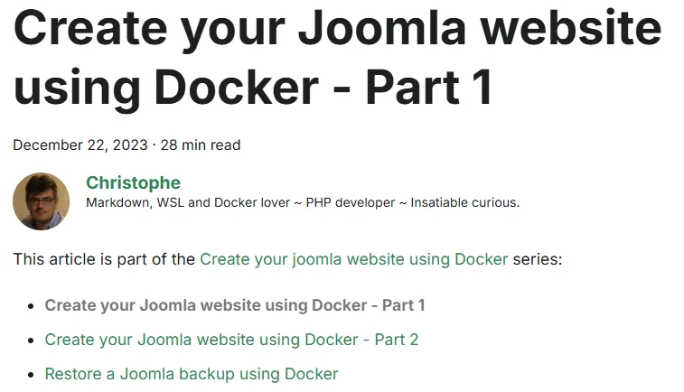
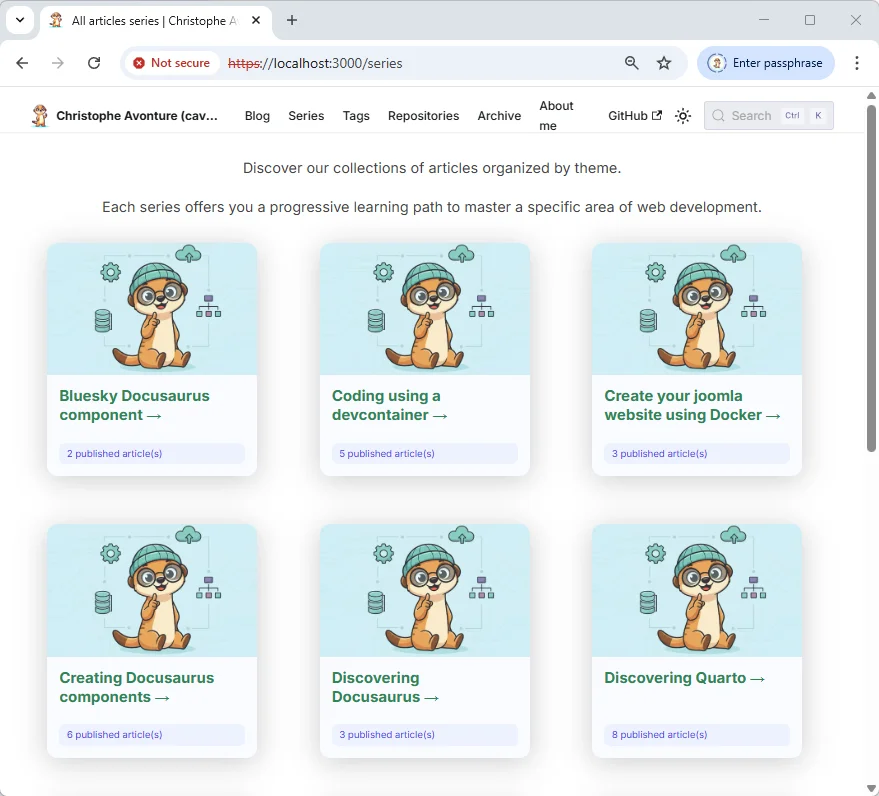
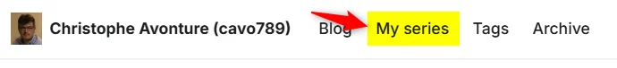
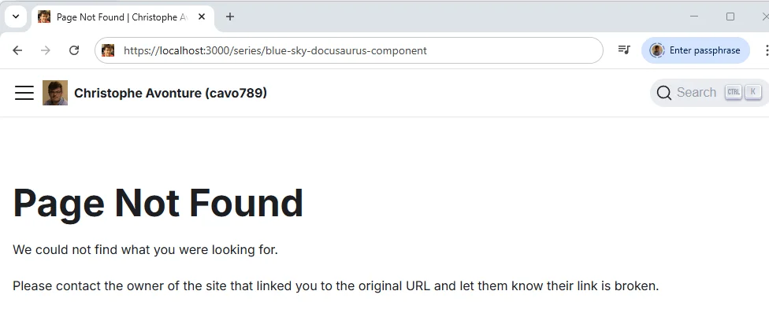
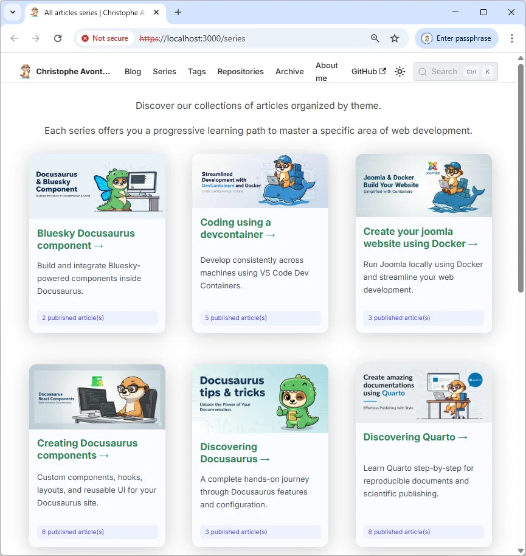

<!-- cspell:ignore reposts,packagist,3lun2qjuxc22r,repost,noopener,noreferrer,docux -->

If you have been using Docusaurus for a long time, you may have noticed that it is not possible to link articles together as a series.

It would be nice to write a first article, a second, a third, and so on, and be able to tell Docusaurus that these articles are part of the same series.

This will also positively impact your SEO (by creating better internal linking) and keep your readers engaged for longer.

This isn't possible natively, so let's create a component for it.

<AlertBox variant="caution" title="Spoiler alert">
Just click on the <Link to="/series">Series</Link> link to see how cool the **SeriesPosts** component is. You will learn how to do this here.

</AlertBox>

<!-- truncate -->

<AlertBox variant="info" title="">
Have you seen this article before? Look at the top. You will see a banner that says, 'This article is part of the **Creating Docusaurus components** series.' This is exactly what we will learn how to do right now.

</AlertBox>

This long article has two main sections: one on the actual creation of the component and the other on navigating the blog.

## Part 1 - Creation of the SeriesPosts component

In this first chapter, we will create our `SeriesPosts` component so that when you open an article, you will see a 'This article is part of the...' message and a list of other articles in that series.

<StepsCard
  title="This implies several things:"
  variant="prerequisites"
  steps={[
    "We will need some helpers.",
    "We will need a new component.",
    "Blog posts will need a `series` item in their YAML front matter, and",
    "We will have to override the standard way of displaying a blog post."
  ]}
/>

### 1.1. We need some helpers

If you do not have it yet, please create the `src/components/Blog/utils/posts.js` file. It will contain a helper function that we can reuse for several components.

That helper will scan each Markdown file with an `.md` or `.mdx` extension in the `blog` subfolder.

For each file, the script will look at the YAML front matter and use some of its properties. For example:

*   If the blog post has `draft: true` or `unlisted: true`, the post will be ignored.
*   If the blog post has a `slug`, it will be used; otherwise, the slug will be generated by the code.
*   If the blog post has an associated image, it will be used; otherwise, a default image will be used.
*   Then, the helper will return the list of posts and their properties.

Some properties are custom, like `mainTag` (see my [Displaying related posts below our Docusaurus article](/blog/docusaurus-relatedposts) article) and, for our current needs, the `series` property.

So, just copy and paste the content of the file below and create the `src/components/Blog/utils/posts.js` file in your project's structure.

<Snippet filename="src/components/Blog/utils/posts.js" source="src/components/Blog/utils/posts.js" />

We will also need a second helper. Please create the `src/components/Blog/utils/slug.js` file:

<Snippet filename="src/components/Blog/utils/slug.js" source="src/components/Blog/utils/slug.js" />

### 1.2. Our SeriesPosts component

Now, we will create our component. Please create the `src/components/Blog/SeriesPosts/index.js` file with the following code:

<Snippet filename="src/components/Blog/SeriesPosts/index.js" source="src/components/Blog/SeriesPosts/index.js" />

This JavaScript code will retrieve the list of all blog posts. Then, it will extract a property called `series` (which may or may not be present in your blog post's YAML front matter). If a post has the `series` property, the script will compare its value with the value of the current blog post.

If there is a match, we have other articles in the series, and the script will display 'This article is part of...' followed by the series name and the list of articles.

Articles will be displayed in chronological order to allow the reader to follow the series in a logical order.

The rest of the logic simply displays a bulleted list.

And the last file to create is the CSS file:

<Snippet filename="src/components/Blog/SeriesPosts/styles.module.css" source="src/components/Blog/SeriesPosts/styles.module.css" />

### 1.3. Editing our articles

Now for the easy part: edit a few of your existing blog posts and add the `series` key to the YAML front matter. For example:

<Snippet filename="index.md" source="./files/index.txt" defaultOpen={true} />

Do this for a few posts so that you have a few articles in that series.

<AlertBox variant="caution" title="">
If you visit your blog right now and browse to your article, you will not see any difference at all. This is completely normal because we have just created a component; we still need to tell Docusaurus to use it.

</AlertBox>

### 1.4. Overriding the BlogPostItem template

So, we need to call our newly created component. Of course, we could include the `<SeriesBlogPost>` tag in each article, but we're smarter than that, aren't we?

Let's create an override of the Docusaurus `BlogPostItem` template.

In a terminal, run `yarn docusaurus swizzle @docusaurus/theme-classic BlogPostItem`, then select `Javascript`, `Eject`, and finally `YES`.

Many files will be created in your Docusaurus project's `src/theme/BlogPostItem` folder. We can safely remove all files except for the `src/theme/BlogPostItem/index.js` file, which we need to edit.

So, please remove any files or folders under `src/theme/BlogPostItem` except for the `index.js` file.

In the code below, the highlighted lines are the ones we need to add.

<Snippet filename="src/theme/BlogPostItem/index.js" source="./files/index.js" />

<AlertBox variant="caution" title="We need to restart Docusaurus">
Now, because we have just introduced an override, we need to restart our Docusaurus server so the changes can take effect.

</AlertBox>

<AlertBox variant="info" title="Run npm run start">
If you're running Docusaurus locally, just run `npm run start` in your console.
If, like me, you are running Docusaurus using Docker, just stop the container and start a new one.

</AlertBox>

### Let's see if it's working

Return to your blog and refresh the page. You should see something like this (with your own content, of course):

Great! The component is now running.

We can create our series. In this example, I have edited three articles about Joomla and added the `series` key to their YAML front matter.

You can navigate from one article to another.

<AlertBox variant="info" title="">
We could stop here, but that would be like completing only half the journey. We still need to implement a page that will display the list of series and, when a series is clicked, the list of articles in it.

</AlertBox>

## Part 2 - Adding a navigation to series

As mentioned, we will create a `/series` page on our blog so we can immediately get access to all series.

<StepsCard
  title="So, we'll need to"
  variant="prerequisites"
  steps={[
    "Create the /series page",
    "Create a SeriesCards component",
    "Create a PostCard component",
    "Add a /series entry to our navigation bar and",
    "Create a plugin to manage `/series/a-series-name` URLs."
  ]}
/>

### 2.1 Adding a new page to show all series

It would be cool to have a page on our Docusaurus site to display the list of series, wouldn't it? Let's do it.

First, please create the `src/pages/series.mdx` file with this content:

<Snippet filename="src/pages/series.mdx" source="src/pages/series.mdx" />

<AlertBox variant="caution" title="">
As you can see, that page contains Markdown content with one special feature: it contains JavaScript code. This is why it is very important that the file extension is `.mdx`.

</AlertBox>

As you can see, there is some Markdown content (adapt it to fit your needs) and the use of a new component, `SeriesCards`. Let's create it.

### 2.2 Creation of the SeriesCards component

Please create the `src/components/Blog/SeriesCards/index.js` file with this content:

<Snippet filename="src/components/Blog/SeriesCards/index.js" source="src/components/Blog/SeriesCards/index.js" />

We need a new helper, `src/components/Blog/utils/series.js`:

<Snippet filename="src/components/Blog/utils/series.js" source="src/components/Blog/utils/series.js" />

In short, the `SeriesCards` component is quite simple. It will just retrieve all series from your existing blog posts and then display them as cards. Nothing more.

### 2.3 Creation of the PostCard component

We also need a component for displaying a post as a card. Please create the `src/components/Blog/PostCard/index.js` file with this content:

<Snippet filename="src/components/Blog/PostCard/index.js" source="src/components/Blog/PostCard/index.js" />

Create `src/components/Blog/PostCard/styles.module.css` as well:

<Snippet filename="src/components/Blog/PostCard/styles.module.css" source="src/components/Blog/PostCard/styles.module.css" />

The `PostCard` component is using the [Reusable Card component of Docux](/blog/docusaurus-cards#using-the-reusable-card-component-of-docux). If you do not have it yet, please create at least these four files:

<Snippet filename="src/components/Card/index.js" source="src/components/Card/index.js" />

<Snippet filename="src/components/Card/styles.module.css" source="src/components/Card/styles.module.css" />

<Snippet filename="src/components/Card/CardBody/index.js" source="src/components/Card/CardBody/index.js" />

<Snippet filename="src/components/Card/CardImage/index.js" source="src/components/Card/CardImage/index.js" />

### Testing our /series URL

Everything is now in place for our `/series` web page. We have created `src/pages/series.mdx` and all its dependencies.

Now, simply access the `/series` URL. On my localhost, it's `http://127.0.0.1:3000/series`.

Here is what you might get without any styling:

Great, right?

### 2.4 Adding an entry for the series page to your blog

Edit your `docusaurus.config.js` file, and in the `navbar` -> `items` section, please add a link to `/series`:

<Snippet filename="docusaurus.config.js" source="./files/docusaurus.config.js" />

### 2.5 Handling the /series/slug URL

Okay, it works, but from the `/series` page, if you click on a series, you will get this error:

So, we have just created the `/series` page. But when your reader clicks on a series to get the list of articles, the URL will become something like `/series/the-name-of-the-series`. Thus, we need to tell Docusaurus how to handle these new URLs.

By default, Docusaurus does not know what to do.

For this, we will need a plugin. Please create the `plugins/docusaurus-plugin-series-route/index.cjs` file with this content:

<Snippet filename="plugins/docusaurus-plugin-series-route/index.cjs" source="plugins/docusaurus-plugin-series-route/index.cjs" />

As you can see in the plugin's source code, we need a new component: `src/components/Blog/Series/SeriesArticlesPage.js`. Let's create it:

<Snippet filename="src/components/Blog/Series/SeriesArticlesPage.js" source="src/components/Blog/Series/SeriesArticlesPage.js" />

And we need to load this plugin, so we will need to update the `docusaurus.config.js` file again:

<Snippet filename="docusaurus.config.js" source="./files/docusaurus.config.part2.js" />

<AlertBox variant="danger" title="">
The `onBrokenLinks` property has to be set to `ignore` because Docusaurus does not load router plugins while it is rendering the static version of the site. Therefore, it will not understand any `/series/xxx` URLs and will think they are broken.

</AlertBox>

For the last time, please restart your Docusaurus server.

Now, in your main menu, you should have your `Series` entry. By clicking on it, you will get the list of series. By clicking on a series, you will get a new page with the list of articles in that series. Just click on an article to jump to it.

!Seeing a specific series

## Part 3 - Adding a /src/data/series.js file for customization

The component is working fine right now, but we are missing two important features:

1.  The ability to write a description for the series.
2.  The ability to use a custom image.

Let's create a new file called `/src/data/series.js` with content like this:

<Snippet filename="/src/data/series.js" source="./files/series.js" />

You have to respect one important rule: the value you specify in the `name` key must match the value of your `series` as specified in your YAML front matter.

So, for instance, for this blog post, my YAML key is `series: Creating Docusaurus components`, so I should find it in my `/src/data/series.js`.

The component will then be able to find the `description` and the `image` to use.

Now, your Series page will look like this:

## Conclusion

It was definitely difficult. There were many files to create, others to update, and a few configuration elements to fine-tune, but wasn't the result worth it?

Now you have a blog where you can write 'pillar' articles with content so dense that you can easily break it down into different parts and offer it to your readers as a series of articles.

Your readers will be guided through the process, enabling them to better understand the different steps to follow. From an SEO perspective, you will enjoy greater visibility thanks to these 'pillar' articles, among other things, but also because you will improve the structure of your page navigation. Search engines greatly appreciate this.
