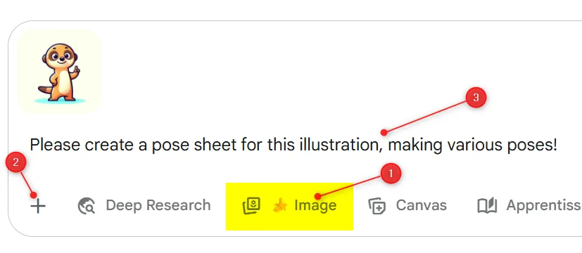
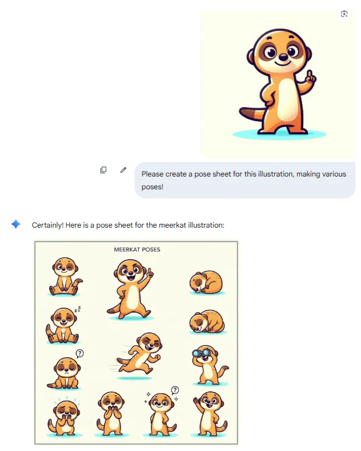
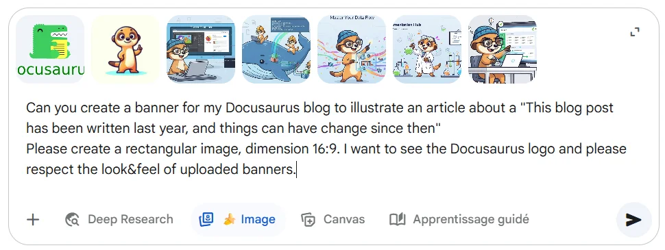

<!-- markdownlint-disable MD049 -->
<!-- cspell:ignore clipart,lzxdr -->

<TLDR>
This article details the author's journey of using Google Gemini to create all the custom banner images and a meerkat mascot for their blog. It explains the process of using Gemini's image-to-image generation to create various poses and scenes featuring the mascot. The author shares practical tips for getting the best results, such as providing reference images for style consistency, specifying aspect ratios, and iterating on prompts. The post also touches on the challenges, like getting the AI to render text correctly, while expressing admiration for the technology's power.
</TLDR>

Over the last few days, I've been using [Google Gemini](https://gemini.google.com/app) to redo all the images on my blog, and those who know me can count the number of times I've expressed my admiration for this technology. Prodigious, incredible, crazy... but, at the same time, fearful of how much these achievements will undermine an entire generation of young people who are going to embark on these careers.

In this article, let's take a look at how I went about generating these images.

<!-- truncate -->

First, and somewhat by chance, I asked Gemini to generate a clipart-style image of a meerkat. I got this one:

A few days later, I discovered this GitHub repository: [Awesome-Nano-Banana-images](https://github.com/PicoTrex/Awesome-Nano-Banana-images/blob/main/README_en.md) and just had one desire, to try.

There was an example: uploading a image (my meerkat character) and use this prompt: _Please create a pose sheet for this illustration, making various poses!_

i.e. :

1. I click on the "Image" button (see the banana icon) to tell Gemini I want to create an image,
2. I've clicked on the "+" button to upload my meerkat character (as a `.png` image) and
3. I type my prompt

And after just a few seconds, the unimaginable happened: I received a flood of offers, each one more impressive than the last.

Repeating the same prompt again and again and got others ones:

How easy, how crazy it's.

To generate all the images for this blog, I used Gemini's free plan, which allowed me to create about ten images per day.

My advice:

* Each time, upload the images that the AI should reuse (my meerkat, one or other logo to be embedded, etc.) and those it should resemble (I uploaded three or four banners it had already created each time and asked it to *create the new banner in the same style as the ones already created*).
* Almost every time, I had to remind him that I wanted a horizontal image, respecting a 16:9 display.
* Sometimes I would ask it to display a specific text, for example, *The text on the image should look like ‘Docker: Tips and Tricks’* but it made mistakes too often. Even when I told it to correct itself, it made the same mistakes.  In the end, I had only two choices: forbid him from adding text or edit the images by hand and, for example, swap two letters.

Often, the image was impressive from the very first result, but sometimes I would tell him that I didn't really like it, and in those cases, I would clarify my prompt and guide the image in the direction I wanted, such as *The meerkat will process a lot of input files then do some magic and generate output tables*, *I want the meerkat to be dressed up as a dinosaur (like the Docusaurus logo) and have blue wings (like the BlueSky logo)*.  And more often than not, the images were even more impressive.

My next article banner:

