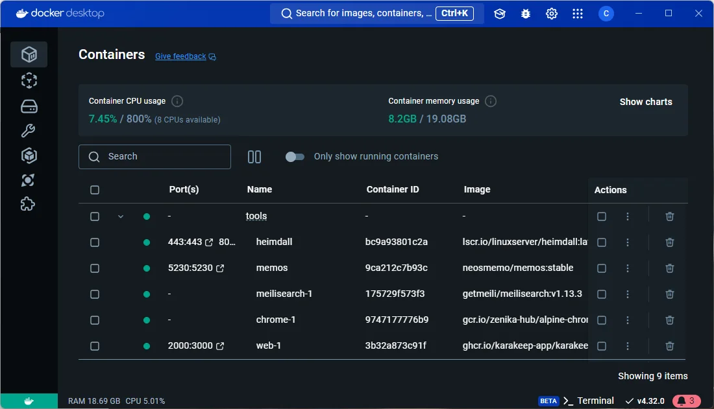

<!-- cspell:ignore Karakeep,neosmemo,heimdall -->

<TLDR>
This article provides a quick tip for organizing your containers in Docker Desktop. It explains how to use the top-level `name` property in your `compose.yaml` files to group related services together under a single, collapsible entry in the Docker Desktop UI. This simplifies management, allowing you to start and stop multiple containers at once and keep your workspace tidy. The post also notes that this is a UI feature and suggests converting `docker run` commands to a compose file to take advantage of it.
</TLDR>

On a daily basis, I'm running several tools as Docker containers: <Link to="/blog/heimdall-dashboard">Heimdall</Link>, <Link to="/blog/docker-memos">Memos</Link> and <Link to="/blog/docker-karakeep">Karakeep</Link>. It can be one or more containers per tool.

I'm working under Windows so I'm using Docker Desktop to get a list of containers and, because I'm working with Docker for my own projects (can be Python, PHP or whatever), I'm facing the following situation: I have a big list of containers and I would like some order.

Tools like Heimdall, Memos and Karakeep, I'm using them to make my daily work easier and it would be nice if I could group them together.

<!-- truncate -->

See below: I'm grouping tools of different origin under `Tools` so it's easier to manage them.

This way, I have a smaller overview of the containers and can quickly sort out my tools and projects.  Also, if the need arises, I can stop all the tools at once. That's handy.

## The name property in the compose.yaml file

The solution is easy to implement: if you have a `compose.yaml` (or `docker-compose.yml` if using the old name convention), just add a `name: tools` entry in the file, at the top.

For instance:

<Snippet filename="compose.yaml" source="./files/compose.yaml" />

And that's all.

*Another way to keep a long list of containers manageable, this time from the terminal rather than from Docker Desktop: the interactive `fzf`-based functions of <Link to="/blog/zsh-docker-functions">ZSH Functions - Customizing Your Shell for Docker Management</Link>.*

Now, by running `docker compose up --build --detach`, you'll see your containers will be grouped in `tools` (only visible in the Docker Desktop Windows software; not using the `docker ps` command).

Do the same for every tool you want, if there is a `compose.yaml` file, just add the `name: tools` top-level entry.

But what if you don't have a YAML file and you're using a `docker run` command instead? There is indeed a `--name` flag with `docker run` but it's for naming the container (equivalent to the `container_name` entry thus).

So, if you're running `docker run [something]` you'll have to convert the line to a YAML file. Any AI can do that. Just copy/paste your full `docker run [something]` command and ask it to convert it to a `compose.yaml` file.

Easy and really handy.

## Tools can be located in different folders

Just to say, you can put your files, volumes, ... in different folders, it doesn't matter. On my disk, I have a `~/tools` folder with one directory per tool (one for Heimdall, one for Memos, one for Karakeep, ...) and it's not a problem at all.

This lets me store files and volumes properly.
