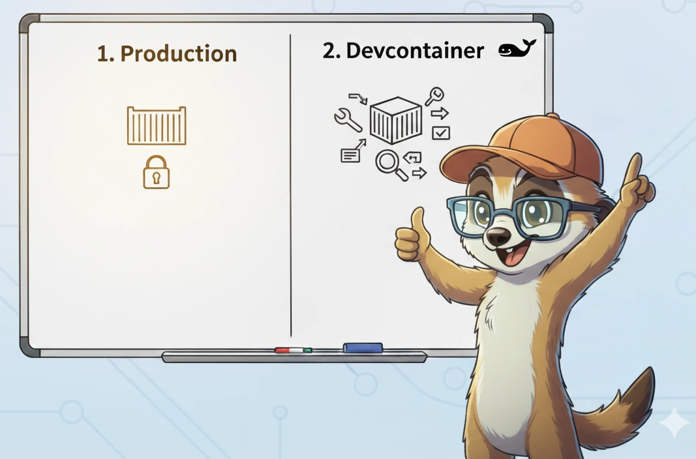
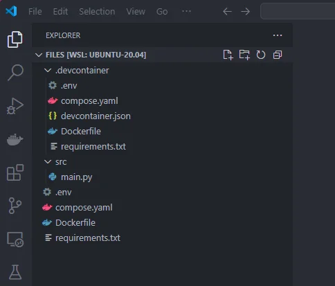
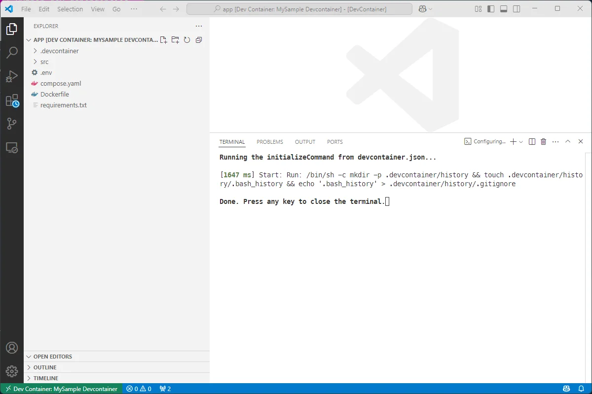
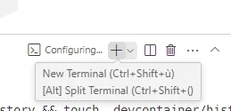
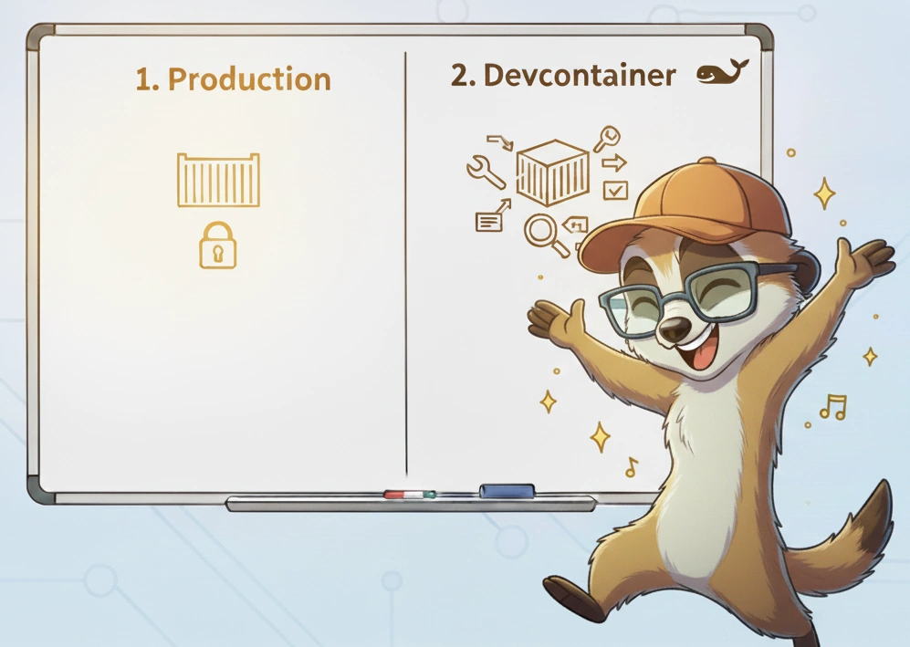

<!-- cspell:ignore groupid,Debugpy -->


This article is the result of intense reflection: how to define a Docker image for deployment in production as cleanly as possible and, while avoiding copy/paste and other repetitions as much as possible, create an image for development in devcontainer.

In other words: I want to create the lightest and most secure image possible for deployment in production, but of course, I need to be able to develop this image in my VSCode environment, and for that, I need my development tools, a specific Linux user to synchronize files with my host and avoid permissions problems, etc.

After multiple attempts, here is what I came up with, which seems to meet this need.

<!-- truncate -->

<AlertBox variant="coreConcept" title="A few core concepts to keep in mind while reading this article">
1. We must completely separate future production from our development (devcontainer).
2. We will need to create the production Docker image before we can use the devcontainer.
</AlertBox>

## What does a perfect separation of environments mean?

Our first instinct should always be: do we need this (utility, configuration, user, etc.) in the Docker image that we are going to deploy on the server?

Some examples:

* Development tools such as a linter, formatter, code quality tool, debugger, etc. have no place in the image that will be deployed.
* Creating a user that will allow file synchronization with the host has no place in the image that will be deployed.
* ...

Our image must be clean, as efficient and lightweight as possible... We must minimize what is known as "attack surface" i.e. to reduce the number of tools we'll install in order to reduce security risks.

Everything we need for our development will then have to be part of a second Docker image, which we will use when we activate the devcontainer feature in VSCode.  This is where we will create our user, add development tools, and activate certain configurations such as debugging, etc.

<AlertBox variant="coreConcept" title="So, in short, we'll have two Docker image">
One for the deploy and a second one to extend the first with additional tools and configuration items. That one will never leave our host and we'll never build it ourself but let VSCode does it for us.
</AlertBox>


## Step 1 - We've to create the production docker image

Please create a new folder in your temporary folder for our example.

<Terminal wrap={true}>
$ mkdir -p /tmp/docker-prod-devcontainer && cd $_
</Terminal>

### Let's create our production files

Let's create a few files (remember, for the production Docker image).

#### The production .env file

For this article, we'll create a Python script so we'll have to specify the version of Python we want.

This is just for the example but, in your case, this `.env` will be used to put there all the settings you want for your own production image.

So, even if you don't see yet why you've to use this file in your own use case, just keep it even if you've no variables to put inside.

<Snippet filename="/tmp/docker-prod-devcontainer/.env" source="./files/.env" />

#### The production Dockerfile file

The provided file is an example you can reuse. During this article, as an example, we'll create a small Python script to illustrate some things.

<Snippet filename="/tmp/docker-prod-devcontainer/Dockerfile" source="./files/Dockerfile" />

Look at the provided script:

1. We'll define the version to use for Python,
2. We'll configure some environment variables like the time zone, ...,
3. We'll install Linux dependencies we need for the production (**but make sure to not add here dependencies we just need for the local development**),
4. Because it's a Python example, we'll copy the `requirements.txt` file in the Docker image and install packages,
5. We'll copy all our files inside the Docker image (make sure to correctly configure your `.dockerignore` file),
6. And, finally, for the production image, we'll initialize the entry point and the command to keep.

<AlertBox variant="caution" title="">
As you can see, we've not created here, in the Docker image, an unprivileged user. Our production image is thus violating a rule we all have read: **Your Docker image should be rootless**.

This is a key concept here:

* The user will be configured while deploying the image using tools like Kubernetes f.i.,
* When we'll use the Docker image for local development, the user UID/GID has to match the one of the developers (and we don't know right now if it's `1000:1000` or something else),
* The user can be easily specified in the `compose.yaml` file.


</AlertBox>

#### The production compose.yaml file

The `compose.yaml` file is used by Docker compose (which is a part of Docker) to know how to build your image and how to create your container.

This is a very important file since we'll foresee here all the required configurations, we'll specify our `.env` file so Docker can translate variables to their values, ...

We'll also tell to Docker which port of the running container has to be shared with our host, ...

<Snippet filename="/tmp/docker-prod-devcontainer/compose.yaml" source="./files/compose.yaml" />

<AlertBox variant="caution" title="">
Pay attention to the `user:` and `security_opt:` parts.

It tells to Docker to use a user having UID/GID `1001` when creating a container based on our image. This user ... didn't exist in the image so why?

This is a trick to make sure the container is running rootless i.e. the user in the container is an unprivileged one.

As extra security measure, we've the `security_opt: - no-new-privileges:true` line to prevent the container to gain any additional privileges.

In short: when a container will be created based on our image, the user will be able to just run what we've decided for him, nothing more.

</AlertBox>

#### The production Python requirements file

We've seen a mention to this file in our `Dockerfile`: because we're using Python as an example for this blog post, we need a `requirements.txt` file to declare which dependencies our script needs. In our example, we need FastAPI dependencies:

<Snippet filename="/tmp/docker-prod-devcontainer/requirements.txt" source="./files/requirements.txt" />

<AlertBox variant="info" title="">
Look at this file once more: we only have, strictly speaking, the dependencies we need for production.

</AlertBox>

If your own use case isn't a Python script, for sure, you should not create this `requirements.txt` file (but, then, also update the `Dockerfile` and remove that part).

#### The production Python script

And finally, we'll create, for the demo, a FastAPI Python script that will return a simple JSON answer; pretty straightforward:

<Snippet filename="/tmp/docker-prod-devcontainer/src/main.py" source="./files/src/main.py" />

#### Summary for the production files

So at this point, our project looks like this i.e. we've five files.

```bash
docker-prod-devcontainer/
├─ .env
├── Dockerfile
├── compose.yaml
├── requirements.txt
└── src
    └── main.py
```

### Creating the Docker production image

Jump in a Linux console and run the command below to see if everything is fine i.e. if there are no error and f.i. our `.env` file where we've specified the version to use for Python is well retrieved and used.

<Terminal>
$ docker compose config
</Terminal>

You'll get something like this:

<Snippet filename="console output" source="./logs/prod.log" />

<AlertBox variant="info" title="Remember our user 1001">
Look here above on the `user: 1001:1001` line. We've seen this in a previous chapter: when the container will be created, the active user will be `1001:1001` and that one didn't exist (we've not create it in our `Dockerfile`): our container will be rootless; just what we want.
</AlertBox>

Now, we'll build and create the container by running the command below.

<AlertBox variant="highlyImportant" title="EXTREMELY IMPORTANT - WE HAVE TO BUILD THE IMAGE FIRST">
Because our future devcontainer will be derived from the production image, we MUST build it first:

<Terminal>
$ docker compose build

</Terminal>

This ensures that VSCode will retrieve a local version of your image. If you don't do this, if you've not yet built the image, Docker will try to pull it from Docker hub (from internet) and you'll probably get an error.

So, once again, before going further in this tutorial, please run `docker compose build` first in a console.

</AlertBox>

### Running a production container

Now, we can create a container if we want by running the command below:

<Terminal>
$ docker compose up --detach

</Terminal>

Since our demo project is a FastAPI Python application, simply start a browser and go to the `http://localhost:8000` location to see the message from FastAPI. The output is a JSON one:

<BrowserWindow url="http://localhost:8000" minHeight={300}>
  <div style={{ padding: '1rem' }}>
    <p>\{"message":"Hello, FastAPI - PRODUCTION!"\}</p>
  </div>
</BrowserWindow>

### And, just to be sure, checking who is the current user for PROD

Optional, let's run a parametrized command into the container to see who is the current user:

<Terminal wrap={true}>
$ docker compose exec app /bin/sh -c 'echo "Container user ID is $(id -u) and his group ID is $(id -g)"'

Container user ID is 1001 and his group ID is 1001
</Terminal>

This, just to confirm: when running our container, it'll run using a not-privileged user thanks our `compose.yaml` orchestration file.



## Step 2 - Override (or extend) the production image and get a devcontainer ready one

### Let's create our devcontainer files

Please now create a subfolder called `.devcontainer` with the files below.

#### The .devcontainer/.env file

In case we need some more configuration items, let's create the `.devcontainer/.env` file (even if empty).

<Snippet filename="/tmp/docker-prod-devcontainer/.devcontainer/.env" source="./files/.devcontainer/.env" />

#### The .devcontainer/Dockerfile file

One of the most important file is the `.devcontainer/Dockerfile` where we'll add extra things (Linux dependendies, Python libraries, ...) to allow us to have a better development experience.

<Snippet filename="/tmp/docker-prod-devcontainer/.devcontainer/Dockerfile" source="./files/.devcontainer/Dockerfile" />

Look at the provided script once again:

1. We are reusing our previously created Docker image (see the `FROM my_sample_prod:latest` line),
2. We well install some dev Linux tools like `bash`, `curl`, `git`, ... we don't need in prod,
3. Now, we'll create a non-root user by using a few parameters like `OS_USERID`, `OS_GROUPID` and `OS_USERNAME`. We'll create some custom folders too for that user,
4. We'll configure our Shell for things like the history file, to have a customized prompt, ...
5. We'll make sure the different folder we need to manipulate are owned by our user and
6. We'll install some specific Python Dev dependencies (this is needed for our sample here).

This last step is thus only needed for illustration of this blog post. Please use your own.

<AlertBox variant="coreConcept" title="Paying attention to the FROM statement">
Let me insist one more time on this point. Right now, our `Dockerfile` is extending an existing image called `my_sample_prod:latest`.

Did you have that image right now on your host? If you don't have it, VSCode, when you'll use the *Open in Devcontainer* feature, will first try to download the image from Docker Hub.

Ok, perhaps the image is hosted there and in that case, Docker will download it from the Hub. Perhaps that image didn't exists elsewhere than on your host.  Perhaps the image exists on both the Hub and your computer.

So many questions, right? Just be very aware of this!

Make sure to run `docker compose build` in your root folder if you need to:

1. Create the local image
2. Refresh the local image because you've modified your production Docker files (as seen in the previous chapter).

So, if not yet done, please run `docker compose build`! Make sure running `docker image ls | grep -i my_sample` in your console will well list your image.

</AlertBox>

#### The .devcontainer/requirements.txt file

This small file is there just for illustration purposes. In this blog post, we're creating a small FastAPI python application and, in the `.devcontainer/requirements.txt` we'll ask some extra dev dependencies for Python like installing the `Debugpy` tool i.e. the Microsoft Python Debugger.

<Snippet filename="/tmp/docker-prod-devcontainer/.devcontainer/requirements.txt" source="./files/.devcontainer/requirements.txt" />

Of course, if your project isn't a Python one, this file can be removed and, in that case, also remove the associate lines from the `.devcontainer/Dockerfile`.

#### The .devcontainer/compose.yaml file

As for the production image, here, we need to inform Docker how to image has to be built and how the container (the dev one) has to be created.

<Snippet filename="/tmp/docker-prod-devcontainer/.devcontainer/compose.yaml" source="./files/.devcontainer/compose.yaml" />

If you look at this `.devcontainer/compose.yaml` file, we're configuring a few things:

* The list of build arguments (`args`) should mention the user id, group id and name of our user. This is important: when we'll work inside the devcontainer, any files created in the container will be owned by this specific user. If we are using `johndoe` with `1001` for both user id and group id; then files will be synchronized on your host like that; owned by `johndoe` not you. If you are the user `1000:1000` locally, you understand that files won't be yours and you'll get permission’s problems. It's something we've to avoid. For this, we've to correctly configure the `.devcontainer/compose.yaml` file.

See the syntax: `${LOCAL_UID:-1000}`. By default, the file will assign `1000` (which is often the correct ID). But first, Docker will check if a variable called `LOCAL_ID` exists on the host. If this is the case, that value will be used. So, if running `id -u` (or `id -g` for the group id) didn't give `1000` on your host; make sure to create the `LOCAL_UID` or `LOCAL_GID` variable in your `.bashrc` file and assign them to the correct value.

* Because our current sample if about Python, we'll also expose the DebugPy standard port thanks the line `5679:5679` so, when starting a debug session in the container will work.

* We're also referring two `.env` files, the one from the root folder (used for the Docker PROD image) and the one from the `.devcontainer` folder

* We'll add some volumes:
  * `.:${APP_HOME:-/app}` will mount (=share) files from our project (inside VSCode) with the `${APP_HOME:-/app}` folder i.e. where the files are stored inside the Docker PROD image. Like this, files that we already copied in the PROD Docker image will just be overridden by the ones of our dev session (=> this is were the magic happens)
  * We'll also ask Docker to create a self-managed volume for the `vscode-extensions`. Thank this line, the first time we'll create the devcontainer, VSCode will install extensions but next time, thanks to this line, VSCode won't install extensions again, they're already present.  This `vscode-extensions` is used for data persistence.
  * And the line for `./.devcontainer/history/.bash_history` will persist the history of your command lines (in the console) in your project. So, next time you'll work inside the devcontainer, the CLI history will be already populated with what you did in the past.

#### The .devcontainer/devcontainer.json file

And, finally, the configuration file for VSCode.

In VSCode, to be able to run a `Devcontainer:` command (from the **Command Palette** (<kbd>CTRL</kbd>+<kbd>SHIFT</kbd>+<kbd>P</kbd>)), the `.devcontainer/devcontainer.json` file should be present and tells to VSCode what to do.

<Snippet filename="/tmp/docker-prod-devcontainer/.devcontainer/devcontainer.json" source="./files/.devcontainer/devcontainer.json" />

1. We've to use the `dockerComposeFile` item to load our two `compose.yaml` files i.e. the one of the root (the prod one) and the one from the `.devcontainer` folder. This is needed because we just need to extend the production `compose.yaml` file. We'll reuse all services and keys defined in `../compose.yaml` and just add (extend) or update (override) somes.
2. We need to tell to VSCode which folder should be open in our VSCode Devcontainer session, it has to be `/app` (has to match the `APP_HOME` variable from `.devcontainer/compose.yaml`)),
3. We'll define our remoteUser name, it'll be `vscode` (has to match the `OS_USERNAME` variable from `.devcontainer/compose.yaml`),
4. We'll also add a `GIT_SSH_COMMAND` environment variable. This is optional but it'll allow us to run a `git` command (like `git pull`) from inside our devcontainer,
5. The `initializeCommand` key will create the `.devcontainer/history` folder on our host (with us as owner) just before creating the container. Like this, we'll be able to store our bash history file there (see the `volumes` entry in `.devcontainer/compose.yaml`),
6. And, finally, in the `customizations` part, we can add vscode settings and extensions we want to configure and install inside our Devcontainer. You can add a lot of settings / extensions here if you want, depending of your project's type.

#### Our project's structure right now

So at this point, our project looks like this i.e. we've ten files.

```bash
docker-prod-devcontainer/
├── .devcontainer
│   ├── .env
│   ├── Dockerfile
│   ├── compose.yaml
│   ├── devcontainer.json
│   └── requirements.txt
├── .env
├── Dockerfile
├── compose.yaml
├── requirements.txt
└── src
    └── main.py
```

### Creating the Devcontainer image

This part is pure optional, it's just to check if everything is correctly filled in.

Jump in the `.devcontainer` folder (`cd .devcontainer`) and run this command:

<Terminal>
$ docker compose -f ../compose.yaml -f compose.yaml config

</Terminal>

You'll get something like this:

<Snippet filename="console output" source="./logs/devcontainer.log" />

Did you get an error? If so, you can more easily read/manage the error right now.

You can look at the configuration to see if everything looks correct i.e. if your variables have well be replaced by the values coming from the `.env` files.


## Opening the container using vscode

Time to open the project using the Devcontainer feature of VSCode.

<Terminal wrap={true}>
$ cd /tmp/docker-prod-devcontainer && code .

</Terminal>



If you look at the bottom right of your screen, you'll probably see this popup:


Simply click on the `Reopen in Container` button or, second way, press <kbd>CTRL</kbd>+<kbd>SHIFT</kbd>+<kbd>P</kbd> to open the **Command palette** and select the "Dev Containers: Rebuild Without Cache and Reopen in Container" option.

VSCode will close the project and reopen it. It'll take more time (the first time) because he needs to create the Docker container first.



If you see the image here above, you're in the container. I've configured a light theme just to make the clear distinction between host (black theme) and devcontainer (light theme).

Bottom right, you can create a new Terminal:



In this demo project, you can see this message; once:


The idea is thus to provide contextual help to the developer and to tell him, here, how he can start the FastAPI server using hot reload and with Debugpy enabled.

### Let's tests

If we return to the `http://localhost:8000` URL we can still get the JSON answer (so the container is well running).

<BrowserWindow url="http://localhost:8000" minHeight={300}>
  <div style={{ padding: '1rem' }}>
    <p>\{"message":"Hello, FastAPI - PRODUCTION!"\}</p>
  </div>
</BrowserWindow>

But now, in VSCode, if you edit the `src/main.py` script and update the Hello message like below:


You just need to save the change, go back to the browser window and refresh the page:

<BrowserWindow url="http://localhost:8000" minHeight={300}>
  <div style={{ padding: '1rem' }}>
    <p>\{"message":"Hello, FastAPI - I'm running from the Devcontainer!"\}</p>
  </div>
</BrowserWindow>

### Let's debug

In this demo project, we've added the Debugpy dependency.

We just need to add an extra file for VSCode.

<Snippet filename="/tmp/docker-prod-devcontainer/.vscode/launch.json" source="./files/.vscode/launch.json" />

To be sure the extension is correctly working, just close VSCode and open it again. Open the DevContainer again too (now, you can simply choose "Reopen in Devcontainer").

Once in your devcontainer, please open the `src/main.py` file. Click anywhere on the return line (line 7) and press <kbd>F9</kbd> to add a breakpoint.


Press <kbd>F5</kbd> to start the debugger session.

Go back to the browser, refresh the page and VSCode will break on that specific line.



