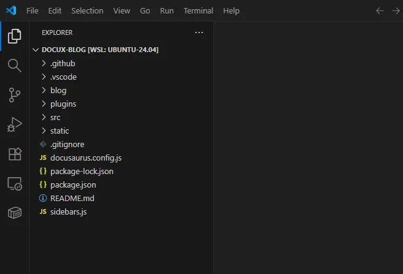
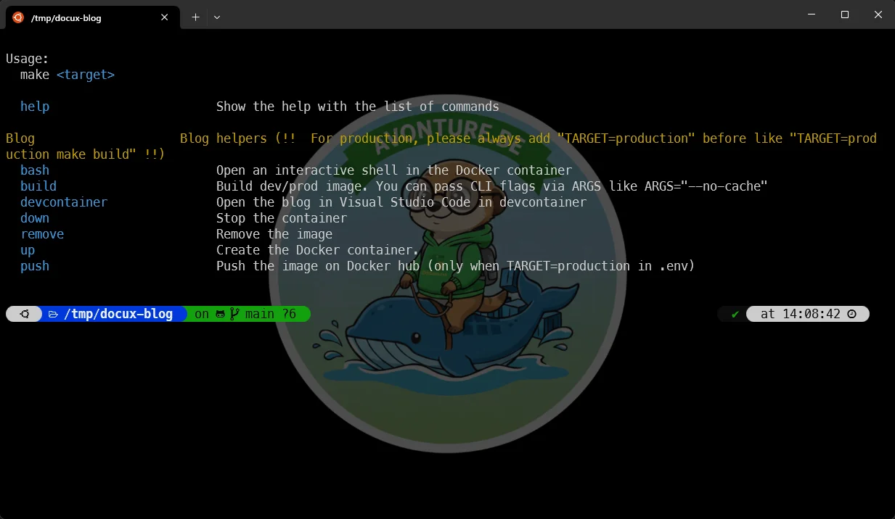
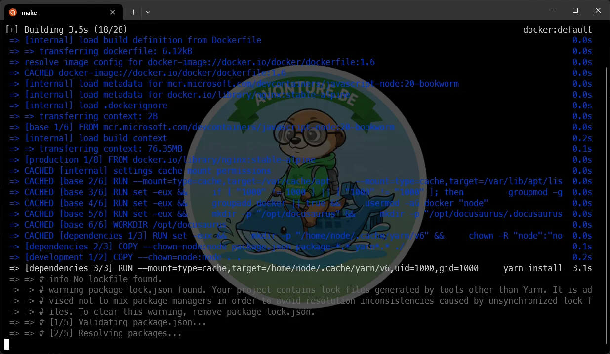
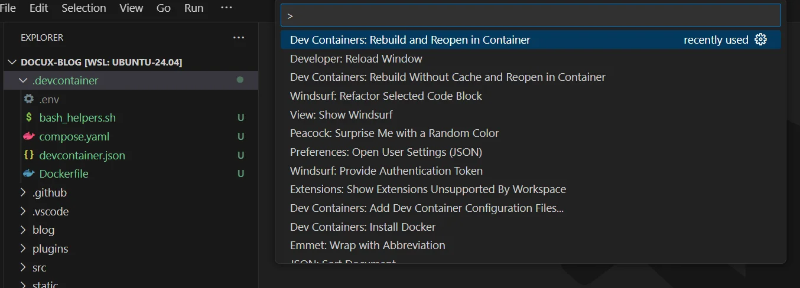
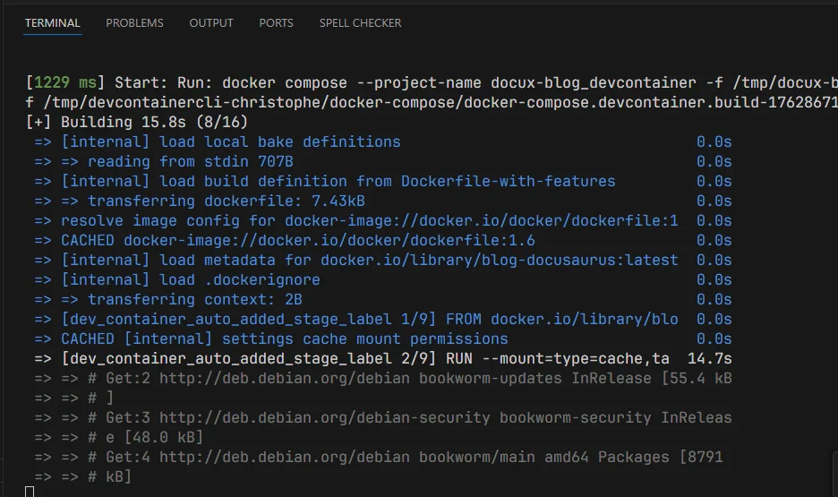
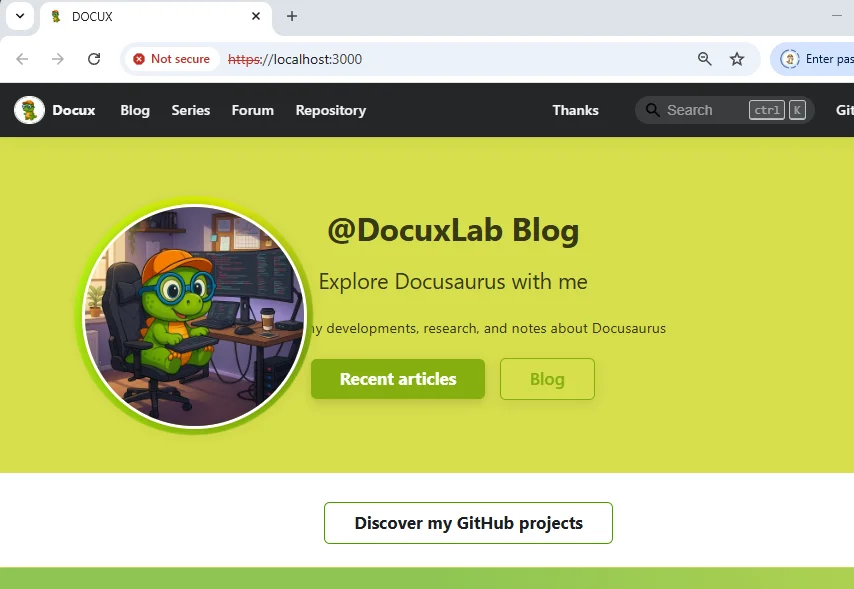
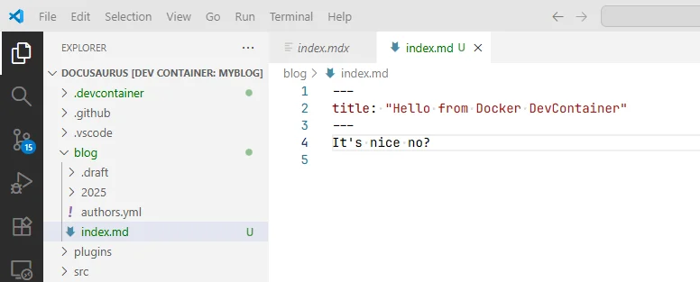
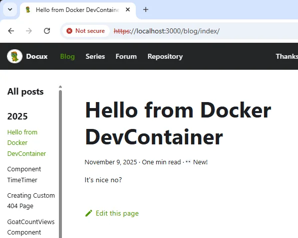
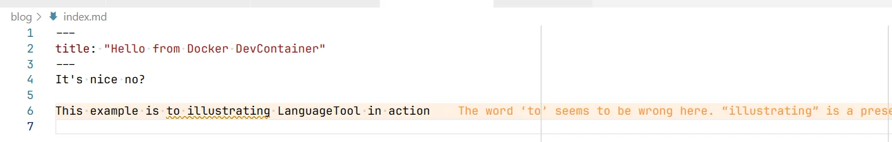
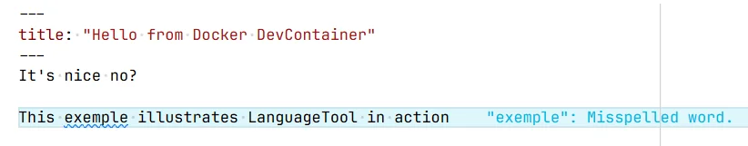

Streamline your Docusaurus workflow with a clean, reproducible setup. In this updated guide, you'll learn how to maintain a Docusaurus blog using a single Docker image, VSCode DevContainers, and a workflow that makes both production builds and day-to-day writing fast and reliable.

Eighteen months ago, I've published [Encapsulate an entire Docusaurus site in a Docker image](/blog/docker-docusaurus-prod) but, since then, I've refined the approach, especially around separating **production** and **development** environments cleanly (see [One Docker Image for Production and Devcontainers - The Clean Way](/blog/docker-prod-devcontainer)).

With this setup:

* You run `make build` once to create a base Docker image.
* You launch your editing environment with `make devcontainer`.
* VSCode automatically builds and opens an isolated container with everything configured.

Let’s walk through the complete workflow.

<!-- truncate -->

<StepsCard
  title="What we'll learn here:"
  variant="steps"
  steps={[
    "Retrieve a Docusaurus blog,",
    "Create a Docker image to run the blog",
    "Open the project in VSCode using DevContainers",
    "Enhance the environment with extensions like LanguageTool, Code Spell Checker or Markdown lint."
  ]}
/>

## Retrieve a Docusaurus blog

If you already have a Docusaurus blog, just skip this chapter. For demonstration purposes, we'll use my friend's blog, [Docux](http://docuxlab.com/) who is publishing very useful Docusaurus components and plugins.

Grab a copy of his blog by running commands below:

<Terminal wrap={true}>
$ cd /tmp && git clone git@github.com:Juniors017/docux-blog.git && cd docux-blog
</Terminal>

## Create the base Docker image

If you're new to Docusaurus, you might wonder: *How can I just run the blog locally?*. The fast answer is: by running a self-contained Docker image and we'll learn that in this chapter.

Please first open VSCode by running `code .`:

<Terminal wrap={true}>
$ code .
</Terminal>

You should now see the project structure in your editor.

### Create required files

In the root of the project, create the following files:

<Snippet filename="compose.yaml" source="./files/compose.yaml" />

<Snippet filename="Dockerfile" source="./files/Dockerfile" />

<Snippet filename="localhost-key.pem" source="./files/localhost-key.pem" />

<Snippet filename="localhost.pem" source="./files/localhost.pem" />

<Snippet filename="makefile" source="./files/makefile" />

<Snippet filename="nginx.conf" source="./files/nginx.conf" />

### Build and run the production image

Once the files are in place, in a console, please run `make` and you'll get a screen like this:

If `make` isn't yet installed on your machine, you'll get an error so please make sure to first install `make`:

<Terminal wrap={true}>
$ sudo apt-get update && sudo apt-get install make
</Terminal>

Now we've to run two commands, the first one will create a Docker image for production i.e. where everything is included in the image.

<Terminal wrap={true}>
$ TARGET=production make build
</Terminal>

You'll get a screen like this one and you'll have to wait something like 80 seconds until the image is built.

This done, please run the second command to create a running instance of the image i.e. a container:

<Terminal wrap={true}>
$ TARGET=production make up
</Terminal>

This will be very fast and you'll see on the console a message telling `Open the PROD blog (https://localhost)`.

And you know what? It's already done: just surf to `https://localhost` and be surprised, the blog is running.

<AlertBox variant="note" title="What have we done?">
By running `TARGET=production make build` we've created a standalone version of the blog running on nginx. We've encapsulated all articles from the blog (as Markdown files) and we've fired all the required commands to generate the static version of the blog. We've *parked* these files in a temporary location.

We've created the final image by using nginx and by copying static files created earlier in the image.

By running `TARGET=production make up` we've created a running instance (called `container`) of that image and we've ask our operating system to access the container on port `443` (the one of the `https` protocol). That's why, if we access to `https://localhost` we've running the website.
</AlertBox>

## Using DevContainers for Development

Building the production image is nice and helpful if you want to publish it on Docker Hub, but we also need a smooth editing workflow. Using VS Code DevContainers, we get a fully isolated environment tailored for Docusaurus.

First, run `make build` (notice, we don't specify `TARGET=production` here). It'll be extremely fast since everything was already created before.

Next, run `make devcontainer` to open VSCode and nothing happens right now: it's normal, we need to create additional files.

<AlertBox variant="tip" title="Run both in one command">
Under Linux, you can run `make build && make devcontainer` to run both in just one command.
</AlertBox>

### Create the .devcontainer folder

We'll need to create a new `.devcontainer` folder with a few files:

<Snippet filename=".devcontainer/.env" source="./files/.devcontainer/.env" />

<AlertBox variant="danger" title="Make sure to use your own UID/GID">
Please edit the `.devcontainer/.env` file and make sure these values are the ones you're using: please run `id -u` in your console and check if you get `1000`. If not, please report the obtained figure (f.i. `1002`) as `OS_USERID` and do the same with  the command `id -g`, here, it's for the `OS_GROUPID` variable.
</AlertBox>

<Snippet filename=".devcontainer/bootstrap.sh" source="./files/.devcontainer/bootstrap.sh" />

<Snippet filename=".devcontainer/bash_helpers.sh" source="./files/.devcontainer/bash_helpers.sh" />

<Snippet filename=".devcontainer/compose.yaml" source="./files/.devcontainer/compose.yaml" />

<Snippet filename=".devcontainer/devcontainer.json" source="./files/.devcontainer/devcontainer.json" />

<Snippet filename=".devcontainer/Dockerfile" source="./files/.devcontainer/Dockerfile" />

Since we've two bash scripts, we need to make them executable. Please run this command in a terminal:

<Terminal wrap={true}>
$ chmod +x .devcontainer/bootstrap.sh .devcontainer/bash_helpers.sh
</Terminal>

Now we've to open the devcontainer so please run:

<Terminal wrap={true}>
$ make build && make devcontainer
</Terminal>

Once in VSCode, please press <kbd>F1</kbd> to open the **Command Palette** and run **Dev Containers: Rebuild Without Cache and Reopen in Container**.

<AlertBox variant="note" title="Don't have it?">
If you don't have this command, please make sure to install the VSCode [Dev Container from Microsoft](https://marketplace.visualstudio.com/publishers/Microsoft).

</AlertBox>

Please click and thus run the **Dev Containers: Rebuild and Reopen in Container** action. If you look at the terminal (from inside VSCode), you'll get a lot of messages like the ones below:

At some point in time, you'll see this:

It means that Docusaurus is ready to serve your content.

Please surf to `https://localhost:3000` and tadaaa.

Let's play. Open the `blog` folder and create a new file called `index.md`:

Save it and, oh?, your browser will immediately reflect the change (hot reload is indeed enabled):

### Running the terminal from the devcontainer

Something really cool too is the use of the **Terminal** still inside VSCode.

In case of need, press <kbd>CTRL</kbd>+<kbd>ù</kbd> to open the Terminal and see the `+` button top right in that window. Click on the `+` to create a new one:

Did you see? You get a welcome screen with a few actions you can run. For instance, to upgrade Docusaurus to the latest version, you just need to run `upgrade` and that's all.

Could we make easier than this?

<AlertBox variant="tip" title="From where comes this welcome screen?">
See the `.devcontainer/bash_helpers.sh` file you've previously copied/pasted.

You'll in the Bash script the design of the welcome screen and also a few aliases like `version` to get the version of the installed Docusaurus instance.
</AlertBox>

## What are the advantages of such approach?

There are so numerous... Let's start with this one: on my host, I've just Docker and that's all. I don't need to install `Node` as needed by Docusaurus neither any Linux dependencies.

I can also build my blog as a standalone image. Just look at my `cavo789/blog` Docker image on [https://hub.docker.com/r/cavo789/blog](https://hub.docker.com/r/cavo789/blog). If you want to run it on your own machine, you just need to run `docker pull cavo789/blog && docker run -d -p 443:443 --name blog cavo789/blog` then surf on `https://localhost` and that's all.

Using a Devcontainer like illustrated in this article, you can also fine-tune your environment i.e. tell which extension in VSCode has to be installed and how that extension has to be configured. You can also define the look&feel of the editor (the font, size, color, template, ...).

Since everything is isolated, you can *drop* the container and recreate it without pain.

Someone has to work with you? Devcontainer is then the way-to-go since everyone will have the exact same environment.

## Using LanguageTool in VSCode

Let's see one of the many advantages: instead of *just using VSCode to write our posts*, let's use LanguageTool which provides basic grammar and spellchecking for your posts.

And you know what? You already have it. See your `.devcontainer/compose.yml` file. You'll see a service called `languagetool` based on a Docker image called **erikvl87/languagetool**. And now, see your `.devcontainer/devcontainer.json` file. Search for **languageToolLinter** and you'll see a local URL (based on an IP); this is the one exposed by the service. And look further for the **davidlday.languagetool-linter** extension, this is the one who'll make the magic happens.

Here an example of how LanguageTool will works:

For sure, the correct sentence should be *This example illustrates LanguageTool in action*.

## Code Spell Checker

Here another example, a mistake a French speaking people can do by inadvertance:

Here, the extension used is *Code Spell Checker* from **streetsidesoftware**.

## Markdown lint

And perhaps, while you'll write your Markdown content, VSCode will show you errors displayed in orange like `MD047/single-training-newline` to tells you you've forgot to add an empty line at the very bottom of the file.

These warnings comes from Markdownlint which is another extension already installed in the devcontainer.
