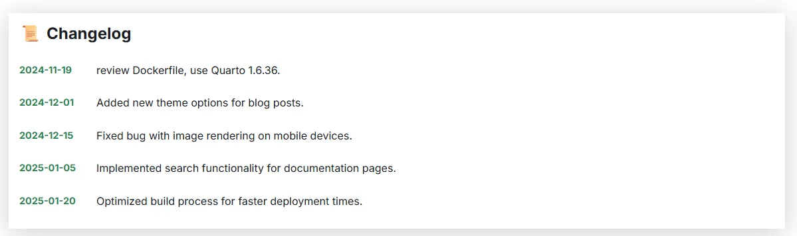

As a blog author, no doubt, it happens that you'll edit previous posts to add / clarify some part. Or just remove obsolete information.

Docusaurus support the `last_update` ([source](https://docusaurus.io/docs/api/plugins/@docusaurus/plugin-content-docs#last_update)) entry like illustrated below, but you just can foresee one date and no description.

```yaml
last_update:
  date: 1/1/2000
  author: custom author name
```

Let's create a very small component to enhance this.

<!-- truncate -->

We'll have to create a new component, and to swizzle the BlogPostPage, so the component will be executed automatically.

## Create the Updated component

Please create a new folder called `src/components/Blog/Updated` where you'll create two files: `index.js` and `styles.module.css`.

<Snippet filename="src/components/Blog/Updated/index.js" source="src/components/Blog/Updated/index.js" />

<Snippet filename="src/components/Blog/Updated/styles.module.css" source="src/components/Blog/Updated/styles.module.css" />

Shortly, the component will check if the YAML frontmatter of your blog post contain a `updates` entry. If this is the case, will parse it. It has to be an array with two information: a `date` and a `note`.

## Override the BlogPostPage template

Please first check if you don't have the `src/theme/BlogPostItem/Content/index.js` file yet. If you're a reader of this blog and already have customized Docusaurus, perhaps you've it already.

If not, please start a console and run `yarn swizzle @docusaurus/theme-classic BlogPostItem/Content`.

From now, you'll a new file on your disk: `src/theme/BlogPostItem/Content/index.js`.

We'll have to inject our new `Updated` component, please edit the `index.js
` file to inject the required code.

Below the minimum sentences to add at the right place in your own file.

<Snippet filename="src/theme/BlogPostItem/Content/index.js" source="./files/index.js" />

## Use the component

Now, just edit any of your existing post and add a `updates` entry in your YAML front matter like for instance

```yaml
updates:
  - date: 2024-11-19
    note: review Dockerfile, use Quarto 1.6.36.
  - date: 2024-12-01
    note: Added new theme options for blog posts.
  - date: 2024-12-15
    note: Fixed bug with image rendering on mobile devices.
  - date: 2025-01-05
    note: Implemented search functionality for documentation pages.
  - date: 2025-01-20
    note: Optimized build process for faster deployment times.
```

Just save the post and refresh your web page. If you've done everything correctly, you'll see the information in your browser.

Below an image of what you'll get.



Feel free to update the `src/components/Blog/Updated/styles.module.css` to match your own styling preferences.
