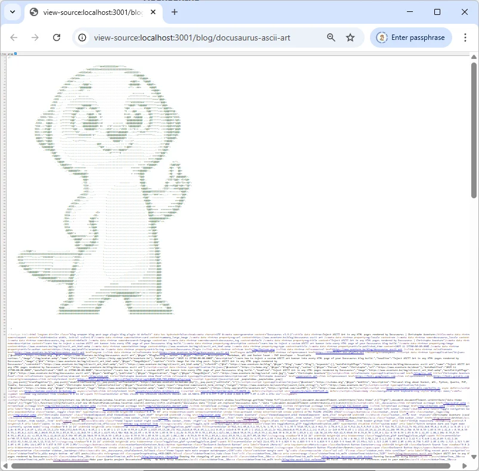

It might be entirely useless, and only the most dedicated tech-heads will spot it, but we're going to dive into how to inject a custom ASCII art banner at the very top of every HTML page generated for our blog.

In this article, we'll create a plugin that will be fired by Docusaurus when rendering HTML pages i.e. once `yarn docusaurus build` is finished.

Docusaurus will run our plugin (during the so-called `postBuild` event), and we'll scan every generated files and inject some special content (as HTML comment) just after the `<!doctype html>` opening tag.

Right now, just press <kbd>CTRL</kbd>+<kbd>U</kbd> (it's the same as `View page source`) to see what'll do in this article.

<!-- truncate -->

## Create your personalized logo

First we've to get some ASCII art. If you don't have one yet, you can use this online tool: [Image to ASCII Art Converter](https://folge.me/tools/image-to-ascii). Just upload a small character on it and convert it.

In your Docusaurus site, please create the `src/data/banner.txt` file and paste your ASCII art in it. Here is mine:

<Snippet filename="src/data/banner.txt" source="src/data/banner.txt" />

## Create the plugin and load it

Now, let's create the plugin. Please create `plugins/ascii-injector/index.mjs` and copy/paste the source code here below to your file:

<Snippet filename="plugins/ascii-injector/index.mjs" source="plugins/ascii-injector/index.mjs" />

Almost done. Now, finalize the installation by editing your `docusaurus.config.js` file and, under `plugins`, please do this:

<Snippet filename="docusaurus.config.js" source="./files/docusaurus.config.js" />

The very last thing to do is to restart your docusaurus website to load the updated configuration file.

## Time to test

Nothing new here, just generate the static version of your site.

<Terminal wrap={true}>
$ yarn docusaurus build

$ yarn docusaurus serve
</Terminal>

Once your website is generated, just open any pages and press <kbd>CTRL</kbd>+<kbd>U</kbd> and tadaaa, your ASCII art is there.

<AlertBox variant="info" title="Your website is demonstrably world-class and utterly unique in its field. ;-)">
</AlertBox>

<AlertBox variant="caution" title="Not during preview mode">
This plugin is only fired during the `postBuild` event i.e. only after your blog has been rendered as HTML page. So if you're running Docusaurus in preview mode; you'll not see the ASCII art.
</AlertBox>
