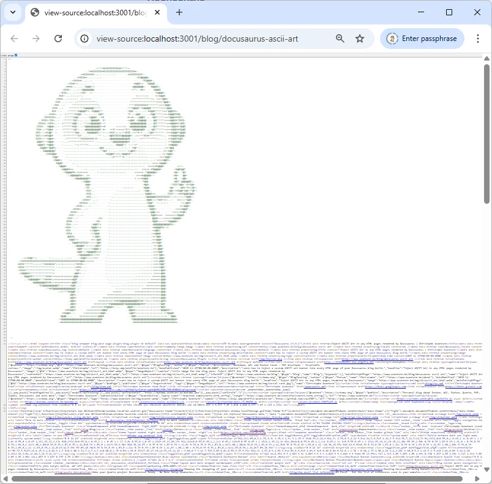

<TLDR>
This article demonstrates how to inject a custom ASCII art banner into every HTML page generated by Docusaurus. It involves creating a lightweight `postBuild` plugin that scans generated files and inserts the ASCII art as an HTML comment after the `<!doctype html>` tag. The guide provides steps for creating the ASCII art file, the plugin, and configuring Docusaurus to activate it.
</TLDR>

It might be entirely useless, and only the most dedicated tech-heads will spot it, but we're going to dive into how to inject a custom ASCII art banner at the very top of every HTML page generated for our blog.

Right now, just press <kbd>CTRL</kbd>+<kbd>U</kbd> (it's the same as `View page source`) to see what we'll do in this article.

<!-- truncate -->

## The Result

Once the plugin is in place (covered below), pressing <kbd>CTRL</kbd>+<kbd>U</kbd> on any page of the generated site shows this, right after the `<!doctype html>` tag:

<AlertBox variant="info" title="Your website is demonstrably world-class and utterly unique in its field. ;-)">
</AlertBox>

## Why It Works

- The plugin hooks into Docusaurus's `postBuild` event — it only runs once `yarn docusaurus build` has finished writing HTML to disk.
- It scans every generated `.html` file in the build output.
- For each one, it injects the ASCII art as an HTML comment right after the `<!doctype html>` opening tag — invisible on the rendered page, visible only in the page source.

*Unlike the remark plugins I've written before (see <Link to="/blog/docusaurus-plugin-replace">Creating a search&replace plugin for Docusaurus</Link>), this one doesn't touch the Markdown at all: it works on the generated HTML.*

## Installation

### Create your personalized logo

First, we have to get some ASCII art. If you don't have one yet, you can use this online tool: [Image to ASCII Art Converter](https://folge.me/tools/image-to-ascii). Just upload a small character on it and convert it. *I've also covered the command-line way of producing such banners in <Link to="/blog/bash-ascii-art">Bash - ASCII art</Link>.*

In your Docusaurus site, please create the `src/data/banner.txt` file and paste your ASCII art in it. Here is mine:

<Snippet filename="src/data/banner.txt" source="src/data/banner.txt" />

### Create the plugin and load it

Now, let's create the plugin. Please create `plugins/ascii-injector/index.mjs` and copy/paste the source code here below to your file:

<Snippet filename="plugins/ascii-injector/index.mjs" source="plugins/ascii-injector/index.mjs" />

Almost done. Now, finalize the installation by editing your `docusaurus.config.js` file and, under `plugins`, please do this:

<Snippet filename="docusaurus.config.js" source="./files/docusaurus.config.js" />

The very last thing to do is to restart your Docusaurus website to load the updated configuration file.

## More Demos

### Time to test

Nothing new here, just generate the static version of your site.

<Terminal typewriter wrap={true}>
$ yarn docusaurus build

$ yarn docusaurus serve
</Terminal>

Once your website is generated, just open any page and press <kbd>CTRL</kbd>+<kbd>U</kbd> and tadaaa, your ASCII art is there — exactly the result shown at the top of this article.

## Under the Hood (skip this if you just want to use it)

<AlertBox variant="caution" title="Not during preview mode">
This plugin is only fired during the `postBuild` event i.e. only after your blog has been rendered as an HTML page. So if you're running Docusaurus in preview mode; you'll not see the ASCII art.
</AlertBox>

## Conclusion

A `postBuild` plugin, one ASCII art file, and a three-line config addition — and every page your site generates carries a small, pointless, entirely intentional signature in its source. If the command-line side of generating ASCII banners interests you more than the Docusaurus plumbing, <Link to="/blog/bash-ascii-art">Bash - ASCII art</Link> covers that half.
