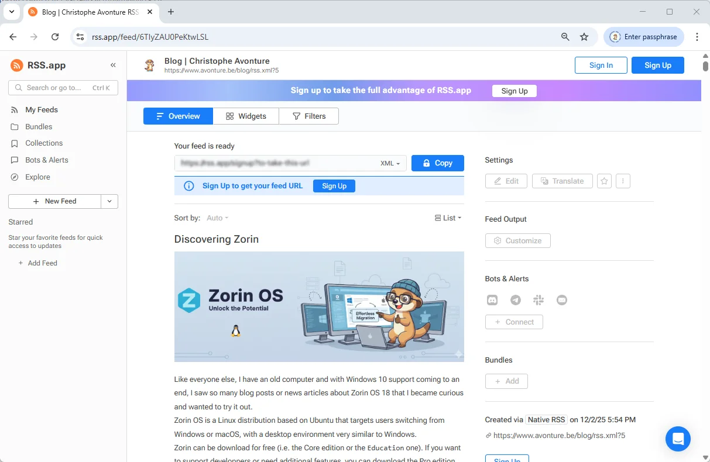

<TLDR>
Docusaurus's default RSS feed is basic, lacking full article content and images, which limits its utility for RSS readers. This article provides a solution by guiding users to create a custom plugin that disables the default feed generation. The new plugin produces an enhanced `rss.xml` file, incorporating full article HTML content, images, and improved metadata for a richer reader experience.
</TLDR>


If you're running Docusaurus, you can ask it to generate a `rss.xml` file by adding the code below in the `blog` section of `docusaurus.config.js`.

```javascript
feedOptions: {
    type: ["rss"],
},
```

Docusaurus uses **RSS 2.0** and exports, by default, up to 20 articles. The file generated is relatively basic; for example, it does not include the image from the post or the HTML content of the article. Docusaurus creates a fairly simple file.

Let's see how to enhance it.

<!-- truncate -->

## What is the rss.xml file?

This file is used by RSS readers to be informed of new articles on your blog. Some people, myself included, use these tools for technical monitoring (or tech watch): they use services like [Feedly](https://feedly.com/) or [inoreader](https://www.inoreader.com/) to subscribe to new content published on the sites they want to track. As a result, when they open their RSS reader, they instantly see a list of updates, all powered by the RSS feed

The standard `rss.xml` file generated by Docusaurus is too basic for me. Indeed, when I open my RSS reader, I'm missing the full content of my article and the introduction image.

If you're maintaining a blog with Docusaurus, your RSS is located at the `blog/rss.xml` location. For my site, it's [https://www.avonture.be/blog/rss.xml](https://www.avonture.be/blog/rss.xml)

It's a XML file but you'll see a nice HTML page because there is a `XSLT` (a transformation of XML to HTML)


<AlertBox variant="tip" title="View source">
Just press <kbd>CTRL</kbd>+<kbd>U</kbd> to see the XML source code if you're interested.
</AlertBox>

## Viewing the RSS using Inoreader

Below, what I was seeing in Inoreader:


In the next chapters, we'll see how to improve our `rss.xml`. Once done, you'll get this:


And by opening an article, we'll get this:


## How Docusaurus is managing feeds

The generation of feeds is defined by the `feedOptions` item in the `docusaurus.config.js` file.

I've tried the official documentation ([https://docusaurus.io/docs/api/plugins/@docusaurus/plugin-content-blog](https://docusaurus.io/docs/api/plugins/@docusaurus/plugin-content-blog)) but **didn't success to manage the `createFeedItems` element**: we're supposed to be able to define which informations (author, categories, description, content, images, ...) we want in the feed but, I've to admit, all my attempts have failed.

That's why, after hours, I've created my own plugin using AI.

## Let's optimize it

### Prepare your system

Please start a console and add some dependencies needed by the plugin we'll create.

<Terminal wrap={true}>
$ yarn add cheerio feed front-matter fs-extra glob
</Terminal>

### Create the plugin

Please create the `plugins/blog-feed-plugin/index.js` with the code below

<Snippet filename="plugins/blog-feed-plugin/index.js" source="plugins/blog-feed-plugin/index.js" />

### Update your configuration

Please update your `docusaurus.config.js` and do two things.

1. We need to disable the RSS generation of the feed by Docusaurus then
2. We need to implement our own plugin

See below how to do:

<Snippet filename="docusaurus.config.js" source="./files/docusaurus.config.js" />

<AlertBox variant="note" title="atom can stay">
In `feedOptions` you can keep `type: ["atom"]` if you've it but please remove `rss` if you see it.

There are two types of feeds, the older one (**rss**) and the newer (**atom**).
</AlertBox>

### Run the plugin

Once done, just run `yarn run build` in a terminal to generate the static version of your site.

<Terminal wrap={true}>
$ yarn run build
</Terminal>

During this stage, Docusaurus will call our plugin to generate the `rss.xml` file instead of calling its own, standard, feature.

Once finished, if you want to see it the file in action on your machine, just run `yarn run serve` to start your Docusaurus static website then go to the `http://localhost/blog/rss.xml` (your local URL) and you'll see your XML.


### Visualize the new look&feel

Let's use an online tool like [https://codebeautify.org/rssviewer/](https://codebeautify.org/rssviewer/).

In the left part, just copy/paste the content of your `blog/rss.xml` and look how it'll be displayed; nice no?

.

You can use another tool like [https://rss.app/rss-feed](https://rss.app/rss-feed) but here, you must first upload your `blog/rss.xml` file to your production site first.



## Why this is better?

As you can see, the new `rss.xml` file will now expose the introduction image but not only, you'll also have much more information like the HTML of your article.

<AlertBox variant="tip" title="View source">
Remember, just press <kbd>CTRL</kbd>+<kbd>U</kbd> to see the XML source code.
</AlertBox>

RSS agregators, even the older ones, will have access to the full content so they can display the article without having to grab it from your website.

## Configuration options of the plugin

The plugin can be configured directly in your `docusaurus.config.js` file.

See below all optional options you can use:

```javascript
const config = {
    // ...
    plugins: [
    [ "./plugins/blog-feed-plugin/index.mjs", {
        maxItems: 20,           // optional
        includeContent: true,   // optional
        includeImages: true,    // optional
        stripSelectors: [       // optional — add any site-specific UI selectors to remove
        ".custom-ads",
        ".share-buttons",
        ".newsletter-signup",
        ],
        ignorePatterns: ["**/_archived/**"], // optional
    }],
    ],
};

export default config;
```

* **maxItems** (number, default: `20`): Limit the number of items in the feed. By default, Docusaurus is only showing 20. The higher this number is, the larger the rss.xml file will be.  You might be tempted to want all of the articles (in my case, nearly 215 at present), but that is not the primary purpose of an RSS file. This file is there to list the **latest articles** and allow you to see the most recent posts on your blog.  So be... reasonable.

* **includeContent** (boolean, default: `true`): Include the cleaned HTML body of each post in the `<content>` field. If you want to force people to visit your website to get the full content, just initialize this option to `false`.

* **includeImages** (boolean, default: `true`): Add the post image at the top of the description and include an `<enclosure>` tag with proper MIME type.

* **stripSelectors** (string[], default: merged with defaults): Additional CSS selectors to remove from the article HTML. Critical selectors (`header`, `svg`) are always removed.

* **ignorePatterns** (string[], default: [`"**/_archived/**"`]): Glob patterns for excluding certain blog files.

## Some tools

### Visualization tools

While you're coding the plugin, just use some of these visualization tools to make sure the content is correctly displayed.

* [https://rss.app/rss-feed/](https://rss.app/rss-feed/)
* [https://codebeautify.org/rssviewer/](https://codebeautify.org/rssviewer/)
* [https://rssgizmos.com/rssviewer.html](https://rssgizmos.com/rssviewer.html)

### Validation tools

If you want to make sure your `rss.xml` is valid:

* [https://validator.w3.org/feed/](https://validator.w3.org/feed/)
* [https://www.rssboard.org/rss-validator/](https://www.rssboard.org/rss-validator/)
* [https://ralfvanveen.com/en/tools/rss-feed-checker/](https://ralfvanveen.com/en/tools/rss-feed-checker/)
