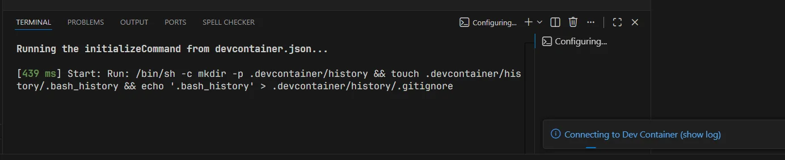
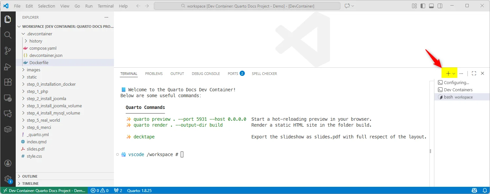
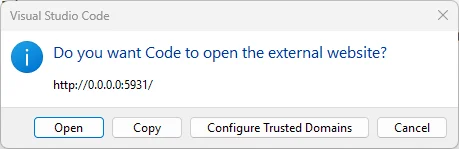
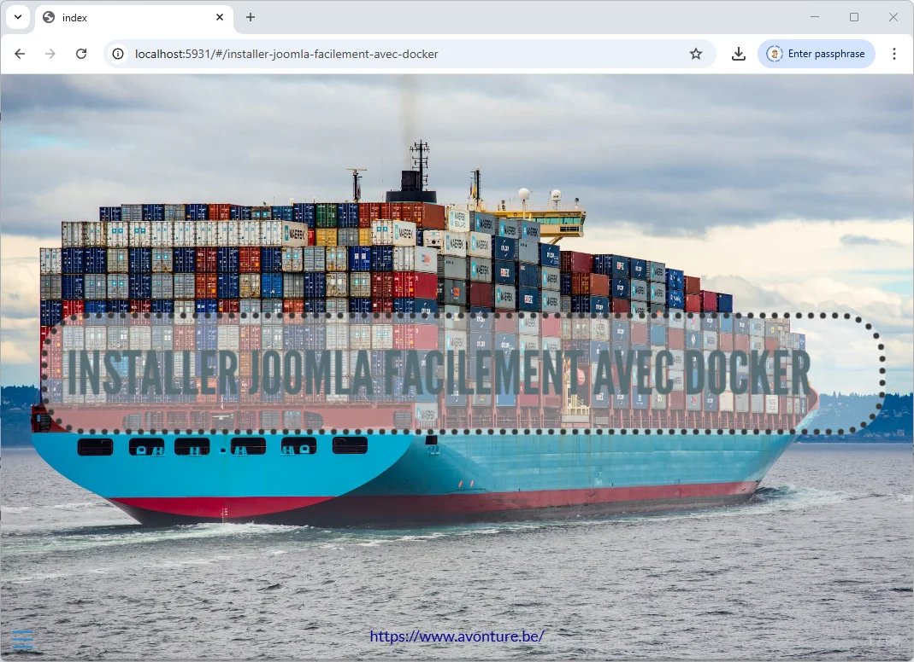
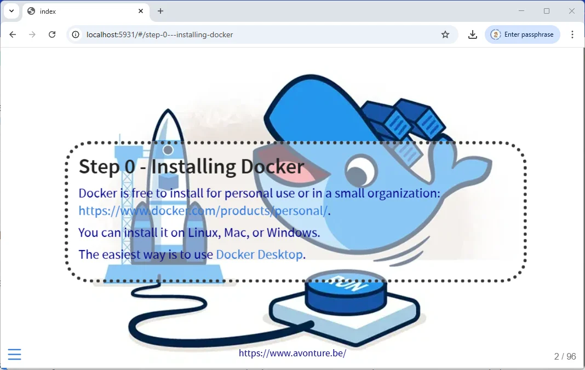

It's been years, perhaps eight years, since I last used PowerPoint for a presentation.  Clicking, dragging, resizing, changing slide resolutions, damn it, starting all over again... Drawing text boxes, playing around with fonts and sizes, moving things around... Oh no, enough already!  No more PowerPoint. I'm still shaking.

I use Markdown for all my documentation and exports (PDF, DOCX, etc.), so it made perfect sense to choose [reveal.js](https://revealjs.com/), which allow me to write my slides without touching the mouse, just by writing Markdown code.

reveal.js is beautiful, simple, and practical. It allows you to write HTML slideshows from a single .md file. Since I use [Quarto](https://quarto.org/) for my documentation and Quarto allows me to generate a reveal.js site, what could be more natural than to continue one of my previous articles and set myself this goal: with just VSCode and Docker on my computer, to program a devcontainer that will allow me to write and view my reveal.js presentation, but also to export it as a static HTML site so that I can, e.g., deploy my presentation on an SFTP server, but also generate a PDF version of the presentation where each slide corresponds to a page in landscape mode.

Let's embark on this adventure.

<!-- truncate -->

So, make sure you've VSCode and Docker on your machine.

## We need a Quarto project

For this blog post, the idea is to use Quarto and not to create a reveal.js project directly *by hand*. This because Quarto will allow us to make a lot more things like exporting our slideshow as a Word document or a pdf or anything else supported by Quarto as targets.

We'll use Quarto to, also, be able to render the project as a slideshow.

### You don't have one yet

As illustration for this post, please download the [demo.zip](./files/demo.zip) file I've made. It's a ready-to-use slideshow project.

Save the file in a new folder on your disk like `/tmp/revealjs` and unzip it (`unzip demo.zip`). Once done, jump in the newly created folder (`cd /tmp/revealjs/demo`) and start `code .` to open the project in VSCode.

In this demo project, you'll already find a `.devcontainer` folder with the needed files I'm describing the next chapter.

### You have one

If you already have an existing Quarto project, just jump in it and run `code .` to open the project in VSCode.

Then, add the following files to your project root:

<ProjectSetup folderName="/tmp/revealjs/demo">
  <Guideline>Now, start 'code .' to open VScode. Press 'F1' and select 'Dev containers: Rebuild and Reopen in Devcontainer' to open the project as a devcontainer</Guideline>
  <Snippet filename="_quarto.yml" source="./files/_quarto.yml" />
  <Snippet filename=".devcontainer/compose.yaml" source="./files/.devcontainer/compose.yaml" />
  <Snippet filename=".devcontainer/devcontainer.json" source="./files/.devcontainer/devcontainer.json" />
  <Snippet filename=".devcontainer/Dockerfile" source="./files/.devcontainer/Dockerfile" />
</ProjectSetup>

<AlertBox variant="note" title="Images below will be based on my project, for sure, some will be different for you.">
</AlertBox>

## Open the Devcontainer

In VSCode, please press <kbd>F1</kbd> to open the **Command Palette** then select **Dev containers: Rebuild and Reopen in Devcontainer**. *If you don't have this command, please make sure to install the VSCode [Dev Container from Microsoft](https://marketplace.visualstudio.com/publishers/Microsoft).*

VSCode will thus *rebuild and reopen the project as a Devcontainer*: in other words, VSCode will first build a special Docker image (as described in the `.devcontainer/Dockerfile` file.) and probably first download the Quarto Docker image the, once the image has been created, VSCode will create a container based on that image and finally, will reopen the project in a special environment called *a Devcontainer*.

The container will build (this takes 1–2 minutes the first time).

After the build completes, VS Code displays a welcome screen like this:

By clicking on the `Connecting to Dev Container (show log)` link, you'll get more and be able to follow what is done.

After one or two minutes (this only the first time), you'll obtain a screen like this:

<AlertBox variant="tip" title="Click on the `+` button">
If you don't have the **Terminal** screen like on the image above, look at the right side of the screen and click on the `+` button to create a new, bash, terminal.
</AlertBox>

## Preview the slideshow

So, look at the list of commands you can see on the Terminal, there is one for the preview. Just run it as suggested so please run `quarto preview . --port 5931 --host 0.0.0.0`.

<Terminal wrap={true}>
quarto preview . --port 5931 --host 0.0.0.0
</Terminal>

Press <kbd>Enter</kbd> to start the preview server. VS Code will ask for permission to open the site in your browser.

And, almost immediately, VSCode will launch your browser and create a new tab with your slideshow already active:

So ... easy no?

### Updating the slideshow

As you can see, my slideshow is in French. Let's translate it.

Use any translation tool you wish, I'll use [DeepL](https://www.deepl.com/). Copy some content and translate to English. Go back to your running slideshow and refresh the page and ... tadaaaaa, your content is now in English.

As we've seen, updates in your content will be automatically reflected in the browser.

## Export a PDF

Now that your slideshow is running, just go back in your Terminal (press <kbd>CTRL</kbd>+<kbd>ù</kbd> to open it) and create a new Bash session (click on the `+` button).

There, run `decktape` in the Terminal to generate a file called `slides.pdf`:

<Terminal wrap={true}>
$ decktape
</Terminal>

This will generate a nice PDF file (better than when using the PDF export feature of reveal.js).

## Export as static HTML site

By running `quarto render . --output-dir build` you'll create a folder called ` build` with your slideshow there:

<Terminal wrap={true}>
$ quarto render . --output-dir build
</Terminal>

<AlertBox variant="tip" title="Want to try?">
In your host, just jump in the `build` folder and run `docker run -d --name static-site -p 8080:80 -v .:/usr/local/apache2/htdocs/ httpd:alpine` to run the slideshow outside your Devcontainer.

It's an easy way to validate it's working.
</AlertBox>

Now, you can start your SFTP client f.i. and upload the `static` folder to your webserver if it was your objective.
