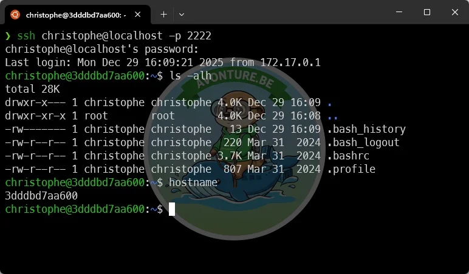
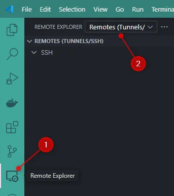
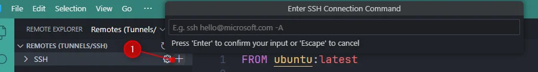
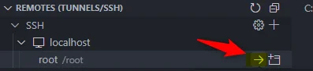
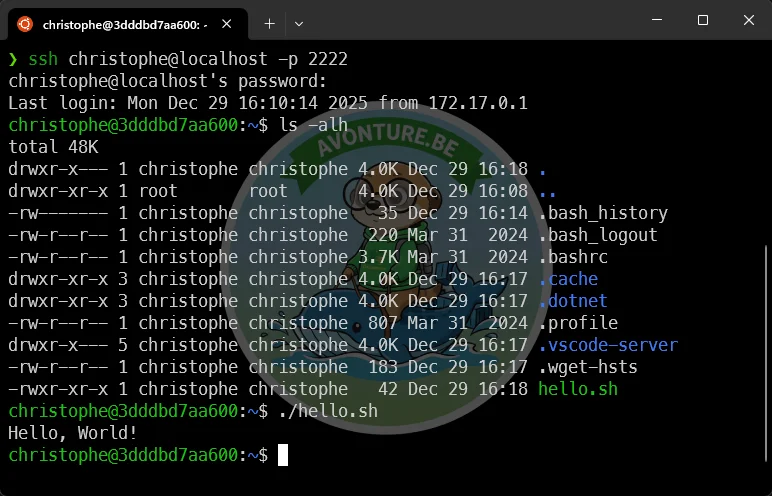
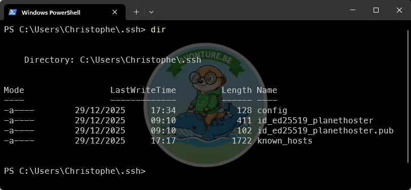
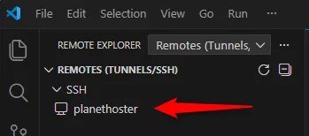
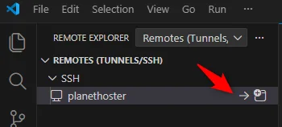
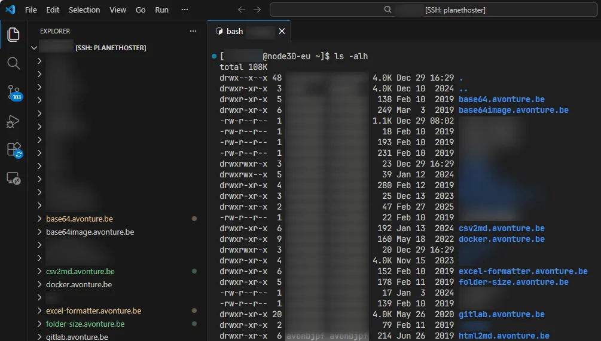

In this article, let's explore how to develop directly on the server using VS Code on my machine while editing files stored on the server, without maintaining a local copy and manual uploads.

My use case was simple: I had to run a Python script on a Linux server that could access an Oracle database, while my development environment (my computer or my Windows VM) could not reach that database due to network restrictions.

Let's dive into SSH Remote Development with VS Code...

<!-- truncate -->

We'll first simulate a server locally with Docker so you can learn the workflow safely, then repeat the same steps against a real production server.

## Simulate a server locally with Docker

Create a Docker container that acts as a Linux SSH server so you can practice connecting from VS Code.

### Create the Docker container that will act as our SSH server

Please create the `Dockerfile` with the content below.

<ProjectSetup folderName="/tmp/remote-ssh" createFolder={true} >
  <Guideline>
    Now, please run 'docker build -t ssh-server' to build the Docker image then 'docker run -d -p 2222:22 --name remote-dev ssh-server' to create the container.
  </Guideline>
  <Snippet filename="Dockerfile" source="./files/Dockerfile" />
</ProjectSetup>

Then, we need to build our Docker image and create the container. To build it, run `docker build -t ssh-server .` then create the container with `docker run -d -p 2222:22 --name remote-dev ssh-server`.

<Terminal>
$ docker build -t ssh-server .

$ docker run -d -p 2222:22 --name remote-dev ssh-server
</Terminal>

The container acts as an SSH server and (for this demo) creates a user `christophe` with the password `p@ssword`.

#### Test our container

Test the container and accept the host fingerprint and enter the password (`p@ssword`) when prompted.

<Terminal>
$ ssh christophe@localhost -p 2222

The authenticity of host '[localhost]:2222 ([127.0.0.1]:2222)' can't be established.
ECDSA key fingerprint is SHA256:/XRLXCojjc9ykoYiuM0aEhDKu5MyZuUU793NokTqxlI.
Are you sure you want to continue connecting (yes/no/[fingerprint])? yes
Warning: Permanently added '[localhost]:2222' (ECDSA) to the list of known hosts.

christophe@localhost's password:

</Terminal>

Once connected, run commands like `ls -alh`, `hostname`, or `whoami`.

<AlertBox variant="info" title="Type `exit` to quit the terminal and return to your host." />

This small test illustrates that the container is working and that we can connect to it using SSH.

### The Remote - SSH extension

Our objective is: start VSCode and edit files from the server.

To do this, we need to install the [Remote - SSH](https://marketplace.visualstudio.com/items?itemName=ms-vscode-remote.remote-ssh) extension from Microsoft.

Once installed, you'll see a new button on the left called *Remote Explorer*. Click it and, in the new pane, select the `Remote Explorer` dropdown and choose `Remotes (Tunnels/SSH)` (if you don't see it, confirm the extension is installed).

Click on the `+` button to create a new connection:

You're prompted to type the SSH connection string you'll use.

In our example, it'll be `christophe@localhost -p 2222` because:

* The user defined in our `Dockerfile` is called `christophe`,
* Our server is our `localhost` (since it's a Docker container running on our machine) and
* The port number to use is `2222` (the one we've specified in the `docker run` command)

VSCode will then ask which SSH configuration file you want to update.

<AlertBox variant="important" title="WSL2 & Windows users">
If you're using WSL2, note that VS Code running on Windows may not read your Linux `~/.ssh/config` file. Copy any needed entries into your Windows SSH config (typically `C:\Users\<you>\.ssh\config`) and copy your SSH keys (public and private) too so VS Code can use them.

Also make sure the SSH key files are accessible to the client you use.
</AlertBox>

VS Code will create or update the chosen SSH config file and show something like this:

Now, if you click on the **SSH** link in the left pane, you'll see the `remote-dev` server with an arrow button to start the connection:

Select the remote OS type (Linux), authenticate, and then open the user's home folder. You can create files (for example `hello.sh`), make them executable and run them from the integrated terminal. Running `hostname` shows the container's hostname (not your local machine's).

<AlertBox variant="note" title="The hostname is the Docker container ID" />

For illustration, exit VS Code, go back to the console and run `ssh christophe@localhost -p 2222`.

We can see our `hello.sh` file:

<AlertBox variant="info" title="What we demonstrated">

We used a local Docker container as an SSH server to simulate remote development. The editor edits files on the remote host and the integrated terminal runs commands there — a smooth workflow for development and debugging.

</AlertBox>

## Now repeat on a real production server

First, make sure your SSH configuration and keys are in place so you can connect to the production server.

I've explained how to create an SSH connection to a hosting server (PlanetHoster in my case) in this post: <Link to="/blog/connect-using-ssh-to-your-hosting-server">How to connect to your hosting server using SSH</Link>.

If you've followed that guide, you should be able to connect to your production server using SSH keys and a configured `~/.ssh/config` alias (for example `planethoster`).

<AlertBox variant="important" title="Because I'm working on WSL2">
But, here, something important in my own situation: I'm working on WSL2 so my Linux `~/.ssh/config` file **is not used** by VSCode (running on Windows). I've to copy the configuration to my Windows `C:\Users\Christophe\.ssh\config` file (in my case, I've just opened Notepad and copy the lines I need)

I've to copy my keys (public and private one) from Linux to Windows.

Below the content of my Windows SSH configuration:

<Snippet filename="C:\Users\Christophe\.ssh\config" source="./files/windows_config" />

</AlertBox>

In VS Code, open the *Remote Explorer* pane and choose `Remotes (Tunnels/SSH)`. Select your configured host (for example `planethoster`) and click the connect arrow. Choose the OS (Linux) and the folder to open (usually the user's home directory). Once connected, edits and terminal commands act on the remote host directly — no uploads required.

From now, you're connected to your production server using VSCode and the Remote - SSH extension. If you change some files, you're directly modifying those on the server. No need to upload anything anymore.

<AlertBox variant="warning" title="Work carefully on production">
Editing files directly on a production server is risky — mistakes can cause downtime or data loss. Prefer SSH key authentication, test changes in staging, keep backups, and perform risky operations during maintenance windows.
</AlertBox>

## Bonus - A word about SSH key pair

Just like passwords; you can have just one password for multiple services, but if that password is compromised, all your services are at risk. Everyone knows this no?

This is the same with SSH keys. If you use the same SSH key pair for multiple servers, and that key pair is compromised, all those servers are at risk.

When you use an instruction like `ssh-keygen -t ed25519 -C "john_doe" -f ~/.ssh/id_ed25519`, `john_doe` is just a label to help you identify the key later. It doesn't add any security. It's not the username to connect to the server; it's just a comment.

You can perfectly use `ssh-keygen -t ed25519 -C "this is my super SSH key for all servers" -f ~/.ssh/id_ed25519` then use that same key for multiple servers. But if that key is compromised, all those servers are at risk.

This is the reason, here above, I insisted on creating a dedicated SSH key pair for each server you connect to. This way, if one key is compromised, only that server is at risk.

## Conclusion

VS Code's [Remote - SSH](https://marketplace.visualstudio.com/items?itemName=ms-vscode-remote.remote-ssh) extension lets you develop directly on remote hosts using the full power of your local editor and tools. Combined with a safe workflow (test locally, use SSH keys, and follow the security best practices above), it's a powerful option when network constraints prevent local development.

Commands executed in VS Code's integrated terminal run on the remote host, just like being logged in via SSH.

At the beginning of this article I mentioned I couldn't connect to the database from my computer due to network restrictions. With the Remote - SSH extension, connecting from the editor to the server becomes possible and relatively straightforward.

