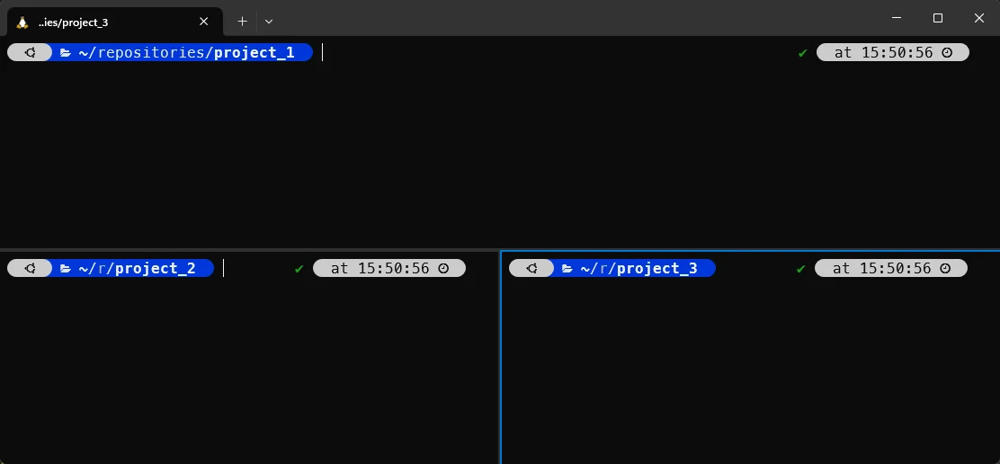
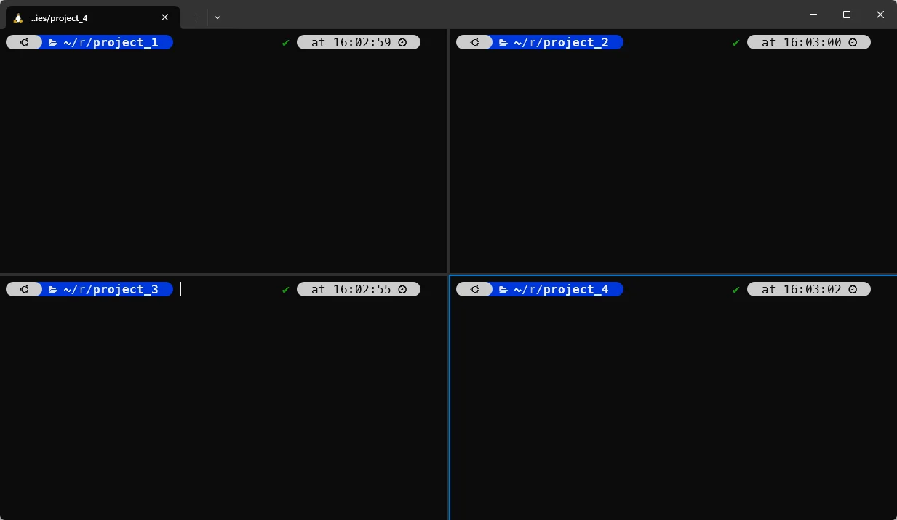
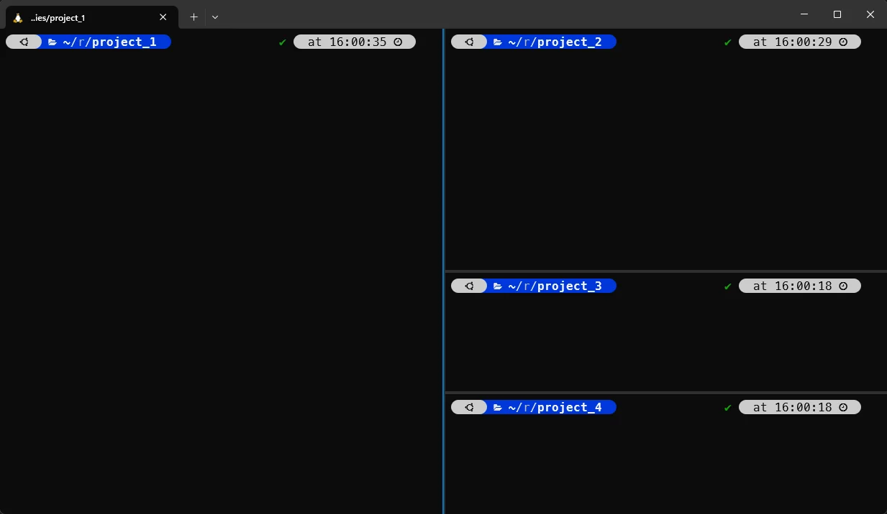
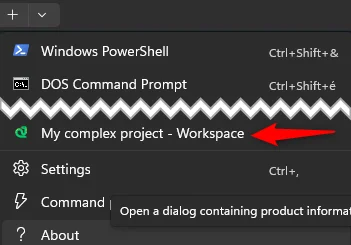
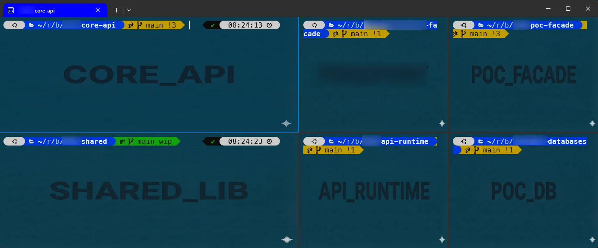

In this article, we'll show how to create a Windows Terminal profile with three (or more) split panes so you can monitor multiple consoles at the same time.

I often need this when working on a large project composed of several repositories: a backend application, a consumer application, a shared library, a proof-of-concept, ... that ties them together. Instead of opening separate terminal windows, I prefer a single window with split panes.

This also lets me run the same command in all panes (for example, run tests), monitor logs, or push changes to Git - all from one window.

And when I need to focus on one pane, I can zoom in on it and hide the others temporarily.

<!-- truncate -->

We'll use Windows Terminal. It ships with Windows 10 and later and is the default terminal for Windows. If you don't have it, download it here: [Windows Terminal on Microsoft Store](https://www.microsoft.com/store/productId/9N0DX20HK701).

There are two approach:

1. We can "hardcode" the command line.
2. We can reuse existing profiles

Let's see both.

## Open Windows Terminal Settings

The first step is to open the Windows Terminal settings page. You can use one of these methods:

1. Click the `+` button to open a new tab, then select **Settings** from the dropdown menu.
2. Press `Ctrl + ,` in Windows Terminal.
3. Right-click the title bar and select **Settings**.
4. Run `wt -p` from PowerShell or CMD.


Look at the **bottom-left** and click **Open JSON file**. This opens an editor (for example, VS Code) with the `settings.json` file.


## Create a new profile and hardcode the command line

Inside `settings.json`, add a new profile object to the `profiles.list` array.

Copy and paste the code below as a new entry in the `list` array and adapt it to your needs (profile name, icon, command line, etc.).

```json
{
    "name": "My complex project - Workspace",
    "icon": "🐍",
    "commandline": "wt.exe nt -p \"Ubuntu 24.04\" wsl.exe -d Ubuntu-24.04 --cd ~/repositories/project_1 ; sp -H -p \"Ubuntu 24.04\" wsl.exe -d Ubuntu-24.04 --cd ~/repositories/project_2 ; sp -V -p \"Ubuntu 24.04\" wsl.exe -d Ubuntu-24.04 --cd ~/repositories/project_3",
    "hidden": false
},
```

<AlertBox variant="note" title="-p 'Ubuntu 24.04'">
In the suggested command line here above, I've used `-p "Ubuntu 24.04"` because it's the name of an existing profile in my Windows Terminal. You'll certainly use something else here.
</AlertBox>

This will create a new profile named `My complex project - Workspace` with three split panes, each running a different WSL Ubuntu instance in a specific directory (project_1, project_2, project_3).

Go back to Windows Terminal and display the list of profiles and, you'll see the newly created one. Click on it to start it.

<AlertBox variant="info" title="Due to the use of the `wt.exe nt` command, Windows Terminal will open a new window with the specified layout." />

The first pane will be the main one, and the other two will be split horizontally and vertically as illustrated below.



If you need four panes, you can add another `sp` command in the `commandline` property.

```json
{
    "name": "My complex project - Workspace",
    "icon": "🐍",
    "commandline": "wt.exe nt -p \"Ubuntu 24.04\" wsl.exe -d Ubuntu-24.04 --cd ~/repositories/project_1 ; sp -H -p \"Ubuntu 24.04\" wsl.exe -d Ubuntu-24.04 --cd ~/repositories/project_2 ; sp -V -p \"Ubuntu 24.04\" wsl.exe -d Ubuntu-24.04 --cd ~/repositories/project_3 ; sp -V -p \"Ubuntu 24.04\" wsl.exe -d Ubuntu-24.04 --cd ~/repositories/project_4",
    "hidden": false
}
```


Or if you want a layout with a screen divided by four; two on top and two at the bottom, you can use this command line:

```json
{
    "name": "My complex project - Workspace",
    "icon": "🐍",
    "commandline": "wt.exe nt -p \"Ubuntu 24.04\" wsl.exe -d Ubuntu-24.04 --cd ~/repositories/project_1 ; sp -H -p \"Ubuntu 24.04\" wsl.exe -d Ubuntu-24.04 --cd ~/repositories/project_3 ; sp -V -p \"Ubuntu 24.04\" wsl.exe -d Ubuntu-24.04 --cd ~/repositories/project_4 ; mf up ; sp -V -p \"Ubuntu 24.04\" wsl.exe -d Ubuntu-24.04 --cd ~/repositories/project_2",
    "hidden": false
}
```



If you prefer a vertical layout:

```json
 {
    "name": "My complex project - Workspace",
    "icon": "🐍",
    "commandline": "wt.exe nt -p \"Ubuntu 24.04\" wsl.exe -d Ubuntu-24.04 --cd ~/repositories/project_1 ; sp -V -p \"Ubuntu 24.04\" wsl.exe -d Ubuntu-24.04 --cd ~/repositories/project_2 ; mf left ; sp -H -p \"Ubuntu 24.04\" wsl.exe -d Ubuntu-24.04 --cd ~/repositories/project_3 ; mf right ; sp -H -p \"Ubuntu 24.04\" wsl.exe -d Ubuntu-24.04 --cd ~/repositories/project_4",
    "hidden": false
},
```



There are many ways to create layouts—see the full `wt` command reference here: [Windows Terminal Command Line Arguments](https://learn.microsoft.com/en-us/windows/terminal/command-line-arguments?tabs=windows).

## Create a workspace profile and reuse existing profiles

As you can see, by using hardcoding command line, the CLI becomes quickly quite complex to maintain.

Let's do better by reusing existing profiles.

In the example below, I'm creating up to six profiles; one by subprojects. In each profile, I'm forcing the working directory (see the `commandline` attribute) and a specific background (image, opacity and stretch mode). Then, I'll set the `hidden` attribute to `false` so the profile won't be displayed in the list of profiles.

```json
{
    "name": "Core API",
    "commandline": "wsl.exe -d Ubuntu-24.04 --cd ~/repositories/core-api",
    "tabTitle": "Core API",
    "hidden": true,
    "backgroundImage": "c:/Users/Christophe/backgrounds/core_api.jpg",
    "backgroundImageOpacity": 1,
    "backgroundImageStretchMode": "fill",
    "guid": "{ab98421f-2e2e-4ae0-9065-5385ee28c930}"
},
{
    "name": "Facade",
    "commandline": "wsl.exe -d Ubuntu-24.04 --cd ~/repositories/facade",
    "hidden": true,
    "tabTitle": "Facade",
    "backgroundImage": "c:/Users/Christophe/backgrounds/facade.jpg",
    "backgroundImageOpacity": 1,
    "backgroundImageStretchMode": "fill",
    "guid": "{c2f1edf0-a7c6-427e-bc29-f74549363ec7}"
},
{
    "name": "POC Facade",
    "commandline": "wsl.exe -d Ubuntu-24.04 --cd ~/repositories/poc-facade",
    "tabTitle": "POC Facade",
    "hidden": true,
    "backgroundImage": "c:/Users/Christophe/backgrounds/poc_facade.jpg",
    "backgroundImageOpacity": 1,
    "backgroundImageStretchMode": "fill",
    "guid": "{1b82632f-68a2-4611-b03e-ff0d0ff2ff08}"
},
{
    "name": "Shared Lib",
    "commandline": "wsl.exe -d Ubuntu-24.04 --cd ~/repositories/shared",
    "tabTitle": "Shared Lib",
    "hidden": true,
    "backgroundImage": "c:/Users/Christophe/backgrounds/shared_lib.jpg",
    "backgroundImageOpacity": 1,
    "backgroundImageStretchMode": "fill",
    "guid": "{71b426b6-6404-4e12-a549-4546f59683e7}"
},
{
    "name": "API Runtime",
    "commandline": "wsl.exe -d Ubuntu-24.04 --cd ~/repositories/api-runtime",
    "tabTitle": "API Runtime",
    "hidden": true,
    "backgroundImage": "c:/Users/Christophe/backgrounds/api_runtime.jpg",
    "backgroundImageOpacity": 1,
    "backgroundImageStretchMode": "fill",
    "guid": "{c2a595be-9ae2-4038-9f59-a3d4e60eeb4c}"
},
{
    "name": "POC Databases",
    "commandline": "wsl.exe -d Ubuntu-24.04 --cd ~/repositories/poc-databases",
    "tabTitle": "POC Databases",
    "hidden": true,
    "backgroundImage": "c:/Users/Christophe/backgrounds/poc_databases.jpg",
    "backgroundImageOpacity": 1,
    "backgroundImageStretchMode": "fill",
    "guid": "{3b64affc-5130-441c-9653-1e25d78f3209}"
},
```

<AlertBox variant="tip" title="guid is no more needed in newer version of Windows Terminal">
In the code here above, I've use a legacy one: for the illustration, I've keep the `guid` attribute because older version of Windows Terminal will force you to specify that field.

If you've a recent version, you can drop the `guid` line; no more required.

If you should specify that attribute and ask you *How can I generate a guid string?*, there is a command on Linux here; simply type `uuidgen` in your console.  Each time, you'll get a new, and valid, guid.

</AlertBox>

Ok, that was to define profiles I'll reuse in my workspace.

Now, add this final profile:

```json
{
    "name": "My complex project - Workspace",
    "icon": "🐍",
    "commandline": "wt.exe nt -p \"Core API\" ; sp -H -p \"Shared Lib\" ; sp -V -p \"API Runtime\" ; sp -V -p \"POC Databases\" ; mf up ; sp -V -p \"Facade\" ; sp -V -p \"POC Facade\"",
    "guid": "{521ac4e0-056d-460c-b2b4-69dd727c8836}"
},
```

If you save this file and go back to Windows Terminal, by clicking on the `+` button to display the list of profiles:



By clicking on it, you'll now have a new terminal having 6 different panes, each of them will be clearly identified thanks the background image:




## Bonus

### Toggle zoom for a pane

This one is my favorite. You can zoom in and out of a pane by pressing <kbd>Ctrl</kbd> + <kbd>Shift</kbd> + <kbd>P</kbd> then selecting **Toggle zoom for pane**. Repeat the shortcut to restore the view.

This is very useful when you want to focus on a specific pane without closing the others.

### Keyboard shortcuts to manage panes

Here is a list of useful keyboard shortcuts to manage panes in Windows Terminal:

<AlertBox variant="note" title="`+` and `-` refer to the keys on the main keyboard, not the numeric keypad." />

* <kbd>Alt</kbd> + <kbd>Shift</kbd> + <kbd>+</kbd> : Split the current pane vertically.
* <kbd>Alt</kbd> + <kbd>Shift</kbd> + <kbd>-</kbd> : Split the current pane horizontally.
* <kbd>Alt</kbd> + <kbd>Shift</kbd> and play with arrow keys : Increase or decrease the size of the current pane in the direction of the arrow key pressed.

Press <kbd>Ctrl</kbd> + <kbd>Shift</kbd> + <kbd>W</kbd> to close the current pane.

### Control panel actions

You can broadcast input to all panes by toggling the **Toggle broadcast input to all panes** option from the **Control Panel** menu (the one you get by pressing <kbd>Ctrl</kbd> + <kbd>Shift</kbd> + <kbd>P</kbd>).

So, toggle this option, and you'll see the cursor change to indicate that broadcasting is active. Now, whatever you type in one pane will be sent to all panes.


Toggle the option again to disable broadcasting.

Use cases: you can clear the screen in all panes at once by typing `clear` or, like in my use case, I can push my changes to Git in all repositories by typing something like `git add . && git commit -m 'wip' && git push` once.
