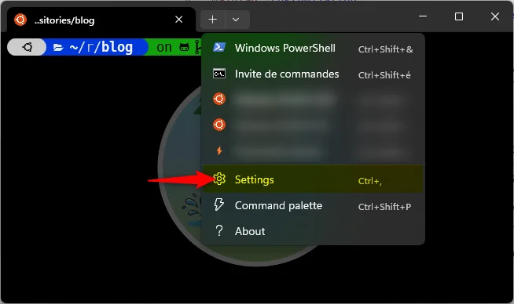

<TLDR>
This guide demonstrates how to streamline server connections by creating a dedicated SSH profile directly within the Windows Terminal settings. Users simply need to add a new empty profile, configure the command line with their specific SSH instruction, and optionally customize the appearance with icons or background images. This setup enables immediate access to remote servers through the Terminal dropdown menu, eliminating the need to manually type connection commands.
</TLDR>

In this article, we'll see how to create a new SSH profile in Windows Terminal so we even don't need anymore to remember how to connect to the server; we just need to open the profile and that's all.

For illustration purposes, I'll use my hosting server at PlanetHoster, but you can use the same technique for any SSH server you want to connect to.

<!-- truncate -->

## Open Windows Terminal Settings

To open the Windows Terminal settings, you can use the following methods:

1. Click on the `+` button to open a new tab, then select "Settings" from the dropdown menu or,
2. Press `Ctrl + ,` while in Windows Terminal or,
3. Right-click on the title bar and select "Settings" or
4. Use the command `wt -p` in PowerShell or CMD.

## Add a profile for any SSH connection

In a recent article, we've seen how to create an SSH profile and be able to run a command like `ssh planethoster` (or anything else). If you missed it, please read <Link to="/blog/connect-using-ssh-to-your-hosting-server">How to connect to your hosting server using SSH</Link>.

So, right now, to connect to your hosting server, you only need to run `ssh planethoster` in a Windows Terminal console (PowerShell, CMD or WSL).

Let's see how to create a Windows Terminal profile that will directly open a console connected to your hosting server:

1. Open the Settings of Windows Terminal,
2. In the left menu, select "Add a new profile",
3. Click on "New empty profile",
4. In the "Name" field, type "SSH - PlanetHoster" (or anything else you want),
5. In the "Command line" field, type `ssh planethoster` (or the alias you defined in your `~/.ssh/config` file),
6. Optionally, choose an icon for your profile by clicking on the "Browse" button or paste here an emoji like "⚡",
7. Finally, click on the "Save" button at the bottom right.

The change is immediate: by clicking on the down arrow next to the `+` button, you'll see your new profile.

## Adding a background image (optional)

Go back to the Settings, select your newly created profile (`SSH - PlanetHoster` in our example) and scroll down to the "Appearance" section and click on it to expand it.

In the "Background image path" field, click on the "Browse" button and select an image file on your computer (for example a `.jpg` or a `.webp` file).

Adjust any other settings you want (for example the "Background image opacity" slider to make the image more or less visible).

Click on the "Save" button at the bottom right.

## Conclusion

From now on, whenever you want to connect to your hosting server, just open Windows Terminal and select your SSH profile. A new console will open, automatically connected to your server via SSH.

Close the console to end the session when you're done.

Additionally, pay attention to any other settings you can customize in the profile, such as font size, color scheme, and more, to enhance your experience. You can, too, define the home directory to open when the profile starts.
