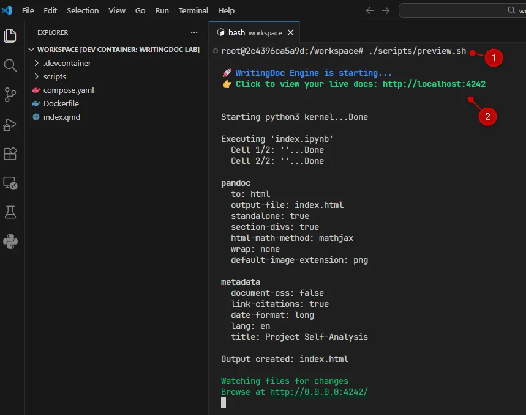
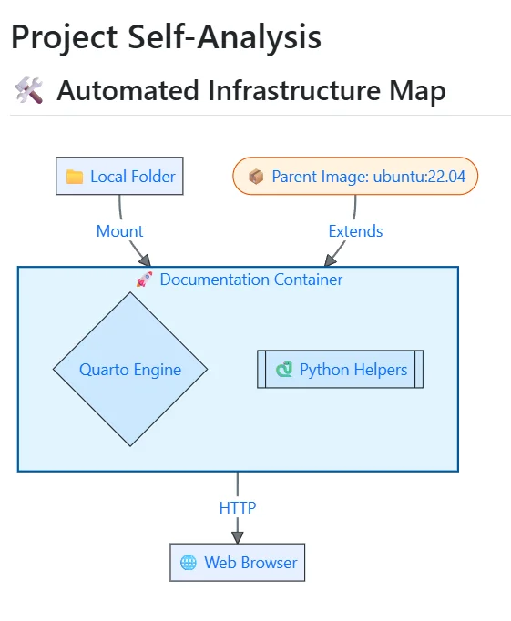
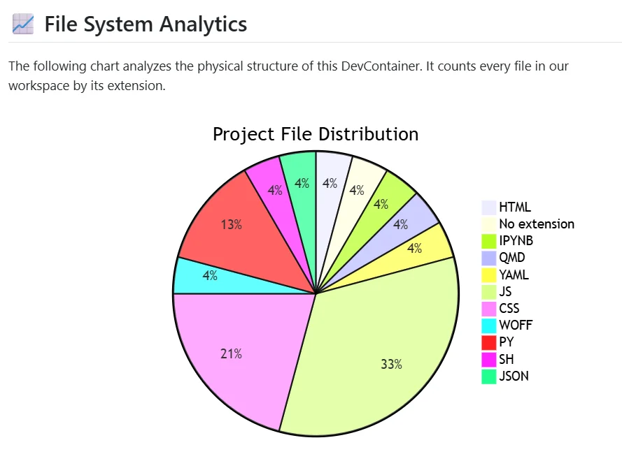
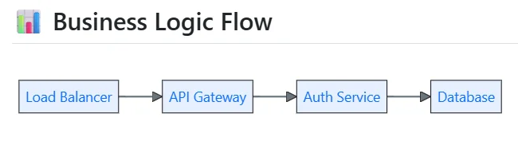
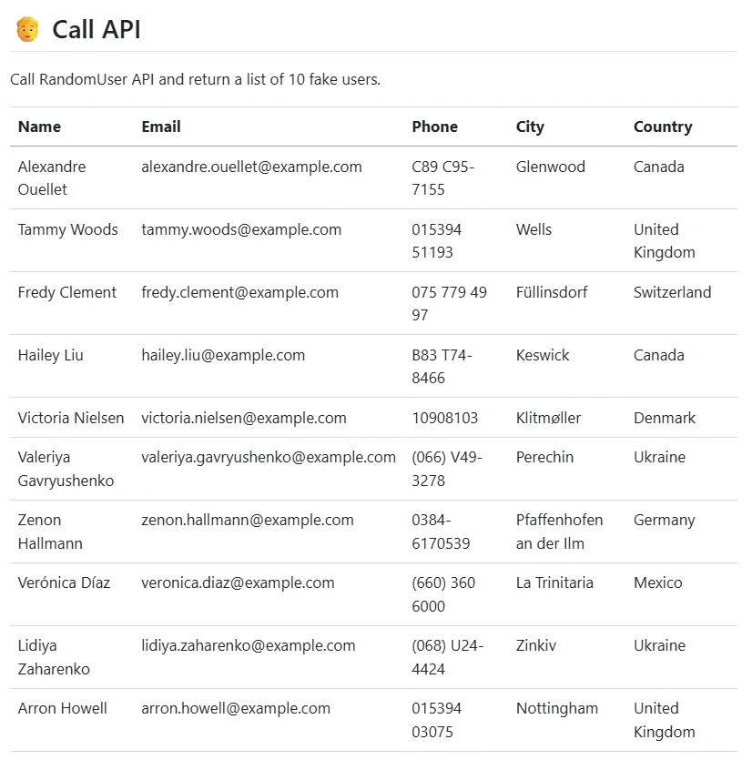
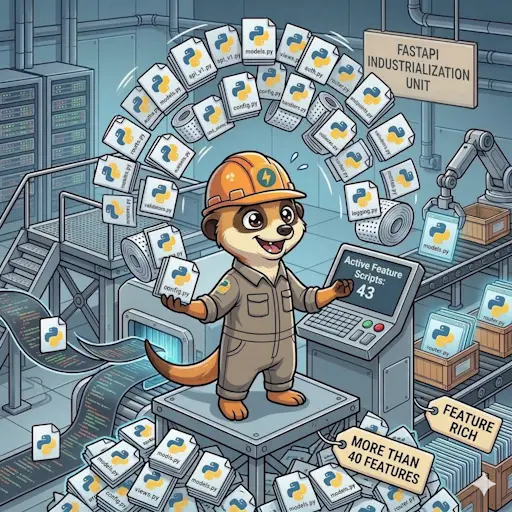

<TLDR>
This blog post explores how I built a self-documenting ecosystem for over 50 projects using Quarto and Docker, automating the documentation process and ensuring it stays up-to-date with the codebase.
</TLDR>

As a developer, I like writing code and documentation but, I need to be honest: it's difficult to keep documentation up-to-date. The moment you write it, it becomes outdated. This is a problem I've faced repeatedly throughout my career. I wanted to find a way to automate the documentation process, ensuring that it always reflects the current state of the codebase.

You build a beautiful API, you write a manual, and then… you change your code. The structure of your answer is quite different, the error message is no more the same, you've published a v1.1 while your documentation was about v1.0 and many things like that.

What can I do to try to solve this problem? Can we automate the documentation process? Can we make it self-updating? Can we make it so that when I change my code, my documentation changes too? The short answer is: yes, we can. And that's what I did with [Quarto](https://quarto.org/).

Let's see how we can industrialize our documentation process with Quarto and Docker, creating a self-documenting ecosystem that scales across multiple projects.

<!-- truncate -->

Over the last few months, I’ve been building for my team an ecosystem called **"WritingDoc"**. It’s not just a template; it’s a fully automated, Doc-as-Code powerhouse built on top of Quarto and Docker. Today, I want to pull back the curtain on how I transformed documentation from a chore into a high-performance build pipeline that scales across 50 different projects.

This blog post is a deep dive into the architecture, the technical choices, and the specific implementations that make WritingDoc a game-changer for my team. If you’re tired of outdated docs and want to see how to build a self-documenting system, this is for you.

## 🛠️ The "Wow" Lab: Build Your First Doc-Engine in 5 Minutes

Before I dive into the architectural depths, I want to show you exactly how simple it is to turn a static document into an engineered one. Most people think Doc-as-Code is just "saving Markdown in Git." It’s not. It’s about **runtime execution.**

Here is a concrete, ready-to-use setup. This Dockerfile creates an environment where Quarto can "talk" to custom Python scripts to generate Mermaid diagrams on the fly.

### 1. The Orchestrator (compose.yaml)

<Snippet filename="compose.yaml" source="./files/compose.yaml" defaultOpen={false} />

### 2. The Engine (`Dockerfile`)

We install Quarto and configure the `PYTHONPATH` so our document can import our custom "Feature" library from anywhere.

<Snippet filename="Dockerfile" source="./files/Dockerfile" defaultOpen={false} />

### 3. The Experience (.devcontainer/devcontainer.json)

This is where the magic happens. We tell VS Code which extensions to install and how to behave.

<Snippet filename=".devcontainer/devcontainer.json" source="./files/.devcontainer/devcontainer.json" defaultOpen={false} />

### 4. Our Python scripts

We'll use a few, simple, Python scripts to generate content for our documentation. For example, `my_feature.py` contains a simple function that generates a Mermaid diagram based on a list of items. While `file_stats.py` could be a script that analyzes the project files and generates a report.And `project_viz.py` could be a script that creates a visual representation of the project structure.

<Snippet filename="scripts/call_api.py" source="./files/scripts/call_api.py" defaultOpen={false} />
<Snippet filename="scripts/file_stats.py" source="./files/scripts/file_stats.py" defaultOpen={false} />
<Snippet filename="scripts/my_feature.py" source="./files/scripts/my_feature.py" defaultOpen={false} />
<Snippet filename="scripts/project_viz.py" source="./files/scripts/project_viz.py" defaultOpen={false} />

### 5. The Document (`index.qmd`)

This is where we write our Quarto document. Instead of static Markdown, we can execute Python code directly in our document to generate dynamic content. For example, we can call our `my_feature.py` script to generate a Mermaid diagram based on the current state of our code.

<Snippet filename="index.qmd" source="./files/index.txt" defaultOpen={false} />

See the three `{python}` blocks in the document? This is where the magic happens. That’s where we execute our Python code. The output of that code is directly rendered in the document.

When Quarto will see the block below, we'll execute the `render_project_arch()` function from our `project_viz.py` script (that feature has to be present in the `PYTHONPATH`). This function will generate a Mermaid diagram based on the current state of our project, and Quarto will render it directly in the document.

````markdown
```{python}
#| echo: false
#| output: asis
from project_viz import render_project_arch
render_project_arch()
```
````

The `output: asis` option tells Quarto to treat the output as raw Markdown. This means that if our Python script outputs a Mermaid diagram, Quarto will render it as a diagram instead of just displaying the code.

### The full project

Here is the full project structure. You can copy this setup and run it on your machine to see how it works in practice. The easiest way to do this is to click on the `Generate install script` button then on the `Copy` button.  Start a terminal and paste the command. It will create a `/tmp/quarto_industrialisation` folder with all the files and the Docker setup ready to go.

<ProjectSetup folderName="/tmp/quarto_industrialisation" createFolder={true} >
  <Guideline>
    Now, start vscode by running `code .`and select **Reopen in Container** when asked. In the terminal, run `./scripts/preview.sh` and open the link in your browser. Change the list in `my_feature.py` and see the diagram update in real-time.
  </Guideline>
  <Snippet filename=".devcontainer/devcontainer.json" source="./files/.devcontainer/devcontainer.json" />
  <Snippet filename="scripts/call_api.py" source="./files/scripts/call_api.py" defaultOpen={false} />
  <Snippet filename="scripts/file_stats.py" source="./files/scripts/file_stats.py" />
  <Snippet filename="scripts/my_feature.py" source="./files/scripts/my_feature.py" />
  <Snippet filename="scripts/project_viz.py" source="./files/scripts/project_viz.py" />
  <Snippet filename="scripts/preview.sh" source="./files/scripts/preview.sh" />
  <Snippet filename="compose.yaml" source="./files/compose.yaml" />
  <Snippet filename="Dockerfile" source="./files/Dockerfile" />
  <Snippet filename="index.qmd" source="./files/index.txt" />
</ProjectSetup>

## 🚀 The "Wow" Moment

1. Now, open this folder in VS Code and click **"Reopen in Container."**.  The first time it'll take time to build the Docker image, but once it's done, you have a fully configured environment with Quarto and Python ready to go.
2. Open the terminal and type: `./scripts/preview.sh`.

You'll get something like this:



Do a `Ctrl + Click` on the URL (`http://localhost:4242`), and it will open your browser with the rendered Quarto document. You should see the Mermaid diagrams generated by our Python scripts.



Great no? But from where comes this diagram? It’s generated by the `render_project_arch()` function in our `project_viz.py` script. That script looks to our `compose.yaml` and our `Dockerfile` to understand the structure of our project and generates a Mermaid diagram based on that.

Let's look to the output of our `file_stats.py` script. It analyzes the files in our project and generates a report that is rendered directly in our Quarto document.



This is in real-time. If you add a new file to the project, save it, and refresh the browser, you'll see the new file appear in the stats and the architecture diagram update accordingly.

The `my_feature.py` script generates a simple Mermaid diagram based on a list of items. You can change the list in the script, save it, and see the diagram update in real-time.



And last but not least, the `call_api.py` script can be used to call a live API during the render process. This means you can pull real data from your production or staging environment and include it in your documentation, all while keeping your credentials secure with the Secrets Resolver.



## My real use case

In my 50-project ecosystem, I took this "Lab" concept and turned it into an industrial-strength **WritingDoc Base Image**.

Most documentation setups start with a "minimal" image. That’s a mistake. "Minimal" means "slow startup." I went the opposite way. My image is a 2.5.GB beast, but it follows a **"Zero-Wait" philosophy**.

I baked everything in: Quarto, Python, Node.js, Mermaid-CLI, and every linter known to man. When a writer opens a project in a VS Code DevContainer, they don't wait for `apt-get` or `pip install`. The environment is alive and ready the moment the window opens.

### Doc-as-Code: The Python AST Magic

The real "Wow" factor started when I stopped copy-pasting code into Markdown. I wrote a suite of Python "Features" that use **AST (Abstract Syntax Tree)** analysis to read my source code.

Actually I've more than 40 different "Features" that can analyze my codebase, extract information, and generate documentation automatically.



A few examples of these features:

* **Python AST Semantic Analyzers**
  * **The Power:** These are the "brains" of the system. They perform Abstract Syntax Tree (AST) analysis on your source code to extract logic without executing it. They automatically generate UML diagrams, API endpoint tables, and data dictionaries that stay perfectly in sync with the code.
* **Live Database Introspection**
  * **The Power:** Bridges the gap between data and docs. It connects to a running PostgreSQL instance to generate real-time ERD diagrams (Mermaid), functional domain flows, and complete data dictionaries with data previews, all while handling complex architectural layering.
* **Format-Aware Mermaid Engine with Global Caching**
  * **The Power:** Solves the "Static Export" problem. It intelligently detects if you are rendering for HTML (interactive SVG) or PDF/Word (high-res PNG via Puppeteer). It includes a fingerprint-based caching system and a centralized BOSA-branded theme configuration.
* **Secure Authenticated API Orchestrator**
  * **The Power:** Allows documentation to pull live data from protected production or staging environments. It handles the full OAuth2/Bearer token handshake and uses the **Secrets Resolver** (`env:` prefix) to ensure credentials never touch the Git repository.
* **Intelligent Terminal High-Fidelity Capture**
  * **The Power:** Instead of plain text, it captures real CLI execution into a vector-based SVG image. It preserves ANSI colors, complex ASCII borders, and layout integrity, ensuring dashboards and logs look professional in any output format.
* **GitLab CI/CD Infrastructure Mapper**
  * **The Power:** Reconstructs the effective pipeline by resolving recursive `includes` and `extends`. It generates a visual architecture of the CI/CD stages and extracts human-readable job descriptions directly from the shell scripts.
* **Docker Ecosystem Visualizers**
  * **The Power:** Provides a 360-degree view of the infrastructure. It maps image inheritance chains, service topology (ports, networks, volumes), and multi-stage build sequences into clean, understandable diagrams.
* **The "Invisible" TODO Dashboard**
  * **The Power:** Scans hidden HTML comments (`<!-- TODO: -->`) across the project to generate a consolidated internal backlog. It allows writers to leave notes without polluting the final customer-facing PDF or Word documents.
* **Dynamic Workspace Assistant**
  * **The Power:** Eliminates manual navigation maintenance. It automatically manages the Quarto sidebar based on file structure and provides real-time VS Code IntelliSense snippets for every variable and helper script in the project.
* **Smart Multi-Format Data Viewer**
  * **The Power:** A polymorphic renderer for CSV, JSON, and XML. It can switch between horizontal comparison tables and vertical "detail" views, supporting deep node selection (XPath/Dot-notation) and high-performance TTL caching.
* **Language-Aware Project Scaffolder**
  * **The Power:** A tech-aware template engine. It uses a subset-tagging system (`file.python.fastapi.qmd`) to instantly generate a complete, tailored documentation structure based on the specific technologies used in the project.

### Visualizing the Invisible: Mermaid & Caching

Quarto is able to render Mermaid.js while rendering a documentation as a website but, it will not work for offline outputs like Word or PDF.

I solved this by building an **Advanced Mermaid Renderer**. In my setup, the renderer is format-aware. If you're viewing the HTML preview, it serves sharp SVGs. If you're building a `.docx` for a business stakeholder, it automatically spins up a headless Chromium instance (via Puppeteer), renders the diagram at 300 DPI, and embeds a high-res PNG.

And because I hate waiting, I implemented a **Content-Aware Caching System**. Every diagram and every API snapshot is fingerprinted. If the source hasn't changed, the build skips the heavy lifting and pulls the image from the cache. My build times dropped from minutes to seconds.

### The "Living" Documentation: Authenticated API Calls

I wanted my documentation to be a window into the live system. So, I built a feature that can perform **real REST API calls during the render process**.

It handles the full OAuth2 handshake: it hits the authentication server, gets a Bearer token, fetches the latest data, and masks the secrets before displaying a "Terminal Trace" in the documentation.

Worried about security? I built a custom **Secrets Resolver**. By using an `env:` prefix in my Quarto files, I can pull credentials from a local `.secrets` file that is never committed to Git. The framework resolves them at runtime and masks them in every log file. It’s enterprise-grade security for Markdown.

### The "Invisible" Assistant: Background Daemons & Snippets

I realized that even with all this automation, writers still had to remember variable names or script signatures. To fix this, I created the **WritingDoc Assistant**. It’s a Python **daemon** that runs in the background of the container.

It watches my `_variables.yml` and my `features/` directory. The second I save a change, the daemon wakes up and generates **VS Code IntelliSense Snippets** on the fly.

* I type `v-` and I get a list of every variable in the project with its current value.
* I type `feature-` and I get a list of every automation script with its full documentation.
* I type `r-` and it has already scanned all my files to offer me cross-references to every heading and figure in the project.

It’s like having a dedicated librarian living inside my editor, watching my every move to make my life easier.

The daemon is started in my Devcontainer using the `nohup` command, ensuring it runs in the background without blocking the main process. It continuously monitors for changes and updates the snippets in real-time, providing an always up-to-date coding experience. It's really a game-changer for productivity.

### Centralization at Scale

Scaling to 50 projects meant I couldn't have 50 different configurations. I centralized everything:

* **`_variables.yml`**: The "Brain" of the project. Every name, every link, and every setting is here. It’s the single source of truth.
* **`update_chapters.py`**: A script I wrote that maintains the Quarto sidebar. It respects folder numbering and ignores "draft" folders, ensuring a perfect table of contents every time.
* **The Glossary**: A single YAML file that generates an alphabetical, anchor-linked glossary across the entire site.
* **Global References**: A central file for all external URLs, so I never have to hunt for a link twice.

### The Result

Today, when I start a new project, I run a single command: `scaffold`. In seconds, I have a complete structure tailored for my stack.

The documentation isn't a static monument to the past anymore. It’s a living, breathing reflection of the code. It’s fast, it’s secure, and it’s beautiful.

This is the power of **engineered documentation**. We’ve moved beyond writing; we’re now compiling our knowledge.

## 🎖️ A Final Word: Why Quarto Changes Everything

None of this would be possible without the visionary work of the developers behind Quarto.

The Quarto team had the intelligence and the foresight to build something different: a bridge between narrative and execution.

By allowing us to execute real code (Python, R, Julia) directly within the document lifecycle, they didn't just give us a better version of [Pandoc](https://pandoc.org/). They gave us an extensible documentation engine. It is this specific capability—the ability to run a script, analyze an API, or scan a filesystem during the build—that allowed me to build the "WritingDoc" ecosystem.

To the Quarto developers: **Thank you for your extraordinary work** and for providing the world with an open-source tool that finally empowers technical writers to behave like software engineers. You’ve turned the "chore" of documentation into a high-fidelity engineering discipline.
