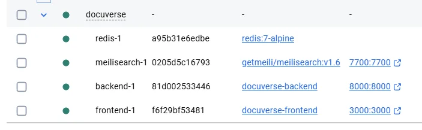
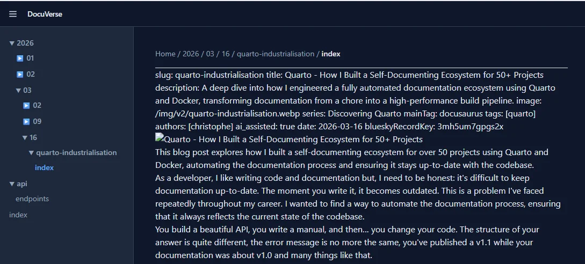
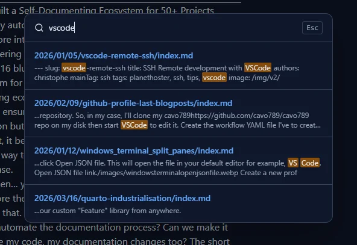
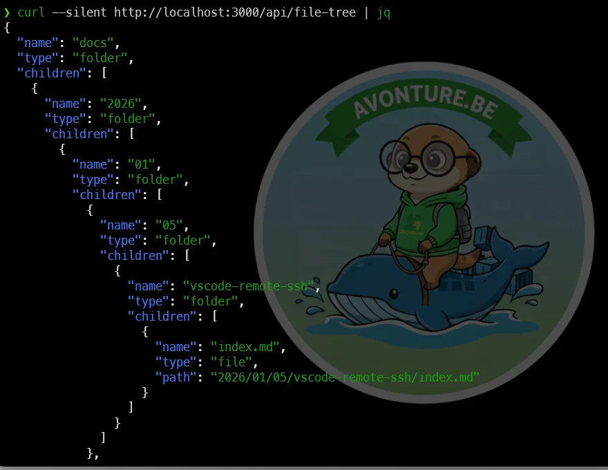

This week, a colleague told me about [Lovable.dev](https://lovable.dev), saying: "*In a prompt, you just have to describe the program you want to generate, and the tool will build it and even deploy it for you*". Wow, I definitely needed to try it.

But what should I ask for? What if I asked it to create a clone of [Marknotes](https://github.com/cavo789/marknotes)? Those who have been following me for years know that I created Marknotes, a note-taking application, 10 years ago. I worked on it for five years before moving on.

Let's see if Lovable.dev can build the same thing in just one hour. **Spoiler: it didn't, but it wasn't too bad.**

<!-- truncate -->

## The objective

I asked it to create a fully dockerized application with a Python/FastAPI backend and a React frontend. The application should render Markdown to HTML once. If the conversion was already done, the HTML should be served from a cache (Redis). The application should be able to browse a folder on my disk recursively and display the list of files and folders. When I click on a file, it should render the Markdown content to HTML and display it.

The application should also have a search engine to search for a text in the Markdown files (Meilisearch).

Here is the prompt I used:

<Snippet filename="prompt.md" source="./files/prompt.txt" />

## The different versions

After one minute, I got a first version of the application. Since I wanted to exclusively use Docker, the command I had to run was `docker compose up --build`.

It wasn't working due to an error in the frontend Dockerfile. I copy/pasted the error back into the prompt and got a second version. Then a third, fourth, and finally a fifth version.

The last one built successfully. I got the web interface with two sample Markdown files, but neither displayed due to a Python error.

I copy/pasted the error back into the prompt and received an answer like: "Ok, the error is located in file ... and you should do this update and that one."

## The result after one hour and a half

After applying the update, the application worked! I was able to browse my disk and display the content of my Markdown files.

As you can see, the interface is showing the list of files at the left and when I click on a file, the content is rendered at the right. The application is also caching the HTML content in Redis. So, if I click again on the same file, the content is retrieved from Redis and not rendered again.

The rendering is far from perfect, but it's a good start. Perhaps I should specify how to manage the YAML front matter, the titles, etc. Still, it's a very solid foundation.

As requested, I have a breadcrumb at the top of the page to show the file path.

In the top right corner, there is a search engine. By typing `vscode`, I get a very nice list of files containing that word. When I click on a file, its content is rendered on the right. This feature is pretty good because it allows me to quickly find a file without having to browse through folders.

Another great thing: the API works out of the box. I can get the list of files by calling `http://localhost:8000/api/file-tree` and the content of a file by calling `http://localhost:8000/api/render?path=path/to/file.md`.

## Conclusion

After roughly two hours, it was fully working. I was able to browse my disk, display the content of Markdown files, and search for text within the files.

Since I have the full source code, I can continue to improve it myself, ask Lovable.dev to do it for me, or upload the code to another AI platform (like Google AI Studio).

If you want to try it, you can download it by clicking on the button below.

<DownloadButton file={require("./files/docuverse.zip").default} />
