<TLDR>This guide explains how to install Ollama locally using Docker to run large language models for free while maintaining complete data privacy. It details how to select appropriate models based on your available system memory for tasks like rapid code autocompletion and complex refactoring. You will also learn to integrate these tools directly into your workflow using Open WebUI and the Continue extension for VSCode.</TLDR>

In one of my last articles about my <Link to="/blog/gemini-tldr">TL;DR summary</Link> component, I created a Python script to consume the Gemini API and boom, after just a few requests, I got a maximum quota exceeded error.

If you need to install Docker, please follow

What if we can solve this for free? How? Simply by installing a LLM locally, on our host. No more quota.

<!-- truncate -->

## Do you need a local LLM?

Probably the most important reason is privacy: having it locally, on your host, means that your documents stay on your computer. You won't share your codebase, for example, with AI companies.

You can also think about automation: you'll be able to run automation scripts without the fear of reaching any quota. Also, you don't have to be afraid of billing; since it runs on your host, it's completely free.

## Installing and running Ollama

You know, as a Docker lover, I'll not install Ollama by hand.

Let's create the `compose.yaml` file on your disk. I use a few Docker containers every day, and I save their configuration files in a `~/tools` folder; let’s do the same here.

Run `mkdir ~/tools/ollama && cd $_` then create a `compose.yaml` with this content:

<Snippet filename="compose.yaml" source="./files/compose.yaml" defaultOpen={false} />

Still in the `~/tools/ollama` folder, simply run `docker compose up --detach` to download ollama and run it as a Docker container.

## Download an LLM model

First, you need to think about your use case. Most probably you'll expect speed and accuracy.

For speed, you should use a "small" LLM like `llama3.1:8b`. Let's take an example: you plan to use a VSCode extension and, you need speed for autocompletion.

For accuracy, you might be okay with waiting a bit longer to get better results.

First, pay attention to how much free RAM you have.

```bash
$ free -h
               total        used        free      shared  buff/cache       available
Mem:            15Gi       5.4Gi       2.4Gi       9.7Mi       7.8Gi       9.9Gi
Swap:          4.0Gi        11Mi       4.0Gi
```

Look at the last column **available**.  I've actually ~10GB free so I can easily choose for a model ~4.7GB like `llama3.1:8b`.

Start a new terminal and run this command:

<Terminal wrap={true}>
$ docker exec -it ollama ollama pull llama3.1:8b
</Terminal>

<AlertBox variant="note" title="We're using Docker right?">

Since we've installed ollama as a Docker container, we've to use the `docker exec -it ollama` syntax then the ollama CLI.

This is why, f.i. we're running `docker exec -it ollama ollama pull llama3.1:8b`.

</AlertBox>

If you run `free -h` again, look at the `Available` column again. I had ~9.9G before, now I've ~5.5G.

<AlertBox variant="note" title="Where are stored LLMs?">

Since we're using Docker, look at the `compose.yaml` file. We're using a `ollama_data` Docker self-managed volume.

Like any other volume, nothing will pollute our disk. If one day we wish to remove Ollama, we just need to remove the Docker container and the associated volume. Et voilà.

</AlertBox>

### More power needed?

There are a lot of models available, look at the suffix at the end of `llama3.1:8b` f.i. `8b` means 8 billion of parameters. The more you can have the more knowledge you'll get but, it has a price: the size.

If you've more than 32GB of RAM you can certainly also use `gemma2:27b` (27 billion of parameters, around ~17G), `mixtral:8x7b` (around ~26G) or `llama3:70b` (70 billion of parameters, ~45GB).

The higher, the better result but, too, the higher, the slower. You've to determine for your own use case (your hardware, your GPU, your need, ...) one or two LLM you'll use.

For instance, a very fast one (so small one) for interactions: you don't want to wait 30 seconds before getting an answer and a more powerful one for heavy tasks like code refactoring, generating some codebase, ...

#### What Does 8x7b Mean?

If you look at mixtral, you'll notice the `8x7b` suffix. This indicates that the model uses a **Mixture of Experts** (MoE) architecture, meaning it is **composed of 8 distinct expert neural networks, each with 7 billion parameters**.

When you use this type of model, a built-in router first analyzes your prompt to determine which experts are best equipped to answer.

Let's look at an example: imagine you ask Mixtral to generate a Python function. First, the router processes the context of your question. Then, it seamlessly activates only the most relevant experts for that specific task (typically just two out of the eight) to generate the best possible answer.

Because it selectively uses its experts, mixtral is an incredibly versatile and highly efficient model—provided your machine has enough RAM to load the entire framework into memory!

### Getting the list of models

If you want to retrieve models you've already installed:

<Terminal wrap={true}>
$ docker exec -it ollama ollama list
</Terminal>

The entire list of existing models in online: [https://ollama.com/library](https://ollama.com/library)

## Try it in your terminal

The command to run is `ollama run <model_name>` so, if you've followed this tutorial, our command would be `docker exec -it ollama ollama run llama3.1:8b`.

<Terminal wrap={true}>
$ docker exec -it ollama ollama run llama3.1:8b
</Terminal>

You can now start to ask anything like a comparaison between Quarto and Docusaurus:

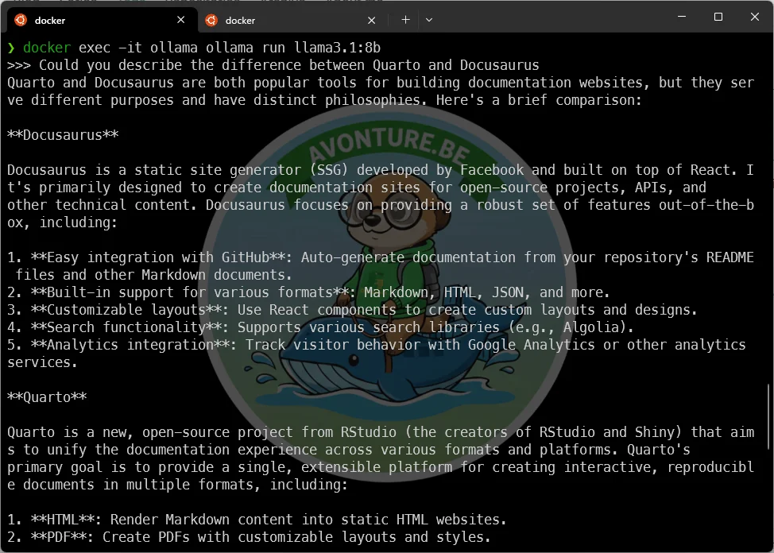

Or getting a joke :

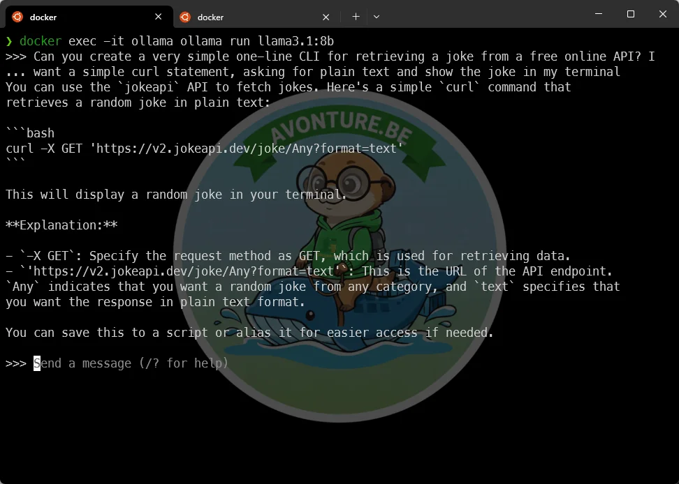

Type `/bye` to exit.

<AlertBox variant="info" title="Faster the second time">

You've experienced some delay right before getting the prompt? Run the exact same command again; you'll see, it's now immediate since the model is already loaded in RAM.

And, if you don't use the model anymore the next five minutes, ollama will unload it so you'll retrieve your RAM.

</AlertBox>

### Should I speak English with the model?

In fact, no. Just like using a webpage; you can speak your own language. In the example below you can also see another way to ask a question: instead of asking jumping in a terminal, you can also type your question directly in the command line.

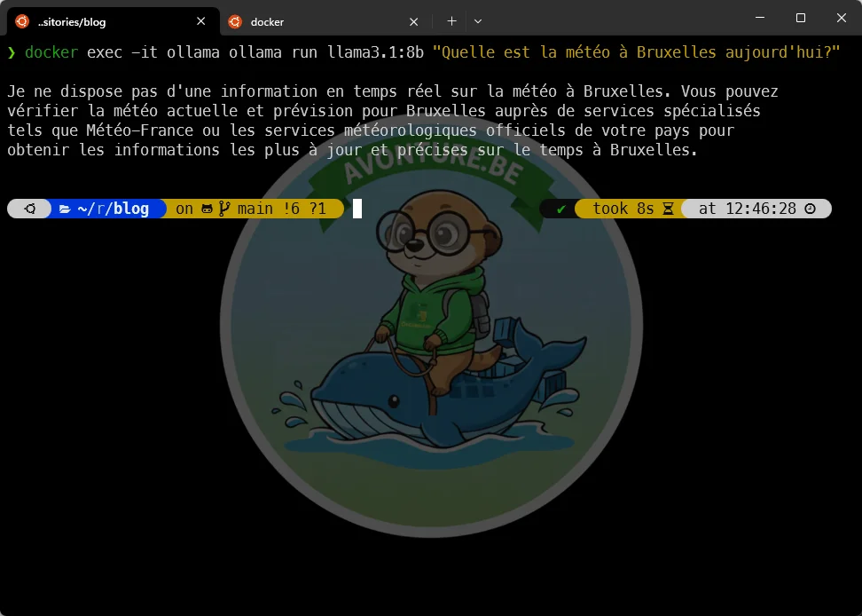

## Using a web interface

You can download a WebGUI to interact with Ollama and the most used one is **Open WebUI**

Let's edit our `compose.yaml` file and add a new service:

<Snippet filename="compose.yaml" source="./files/compose_webui.yaml" defaultOpen={false} />

Run `docker compose up --detach` to download the `open-webui` image (~1.7G) and create the container.

Now, simply surf to `http://localhost:4000` and you'll have your interface and, you can start to interact with your local LLM.

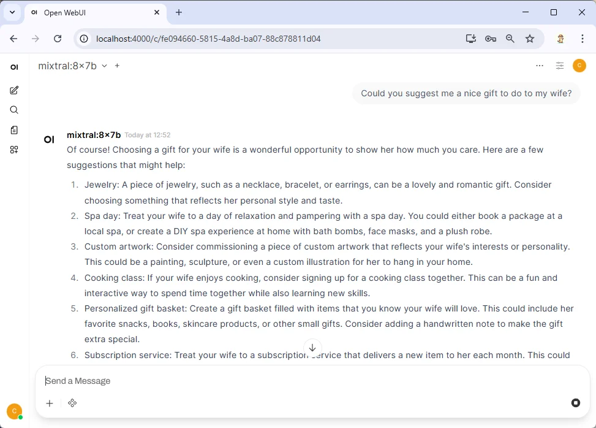

Pay attention top left: you can see there the list of installed models.

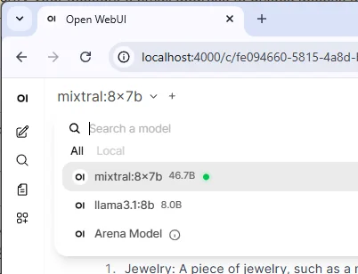

## Using a VSCode extension

If you want to add AI in VSCode, you can install [Continue - open-source AI agent](https://marketplace.visualstudio.com/items?itemName=Continue.continue).

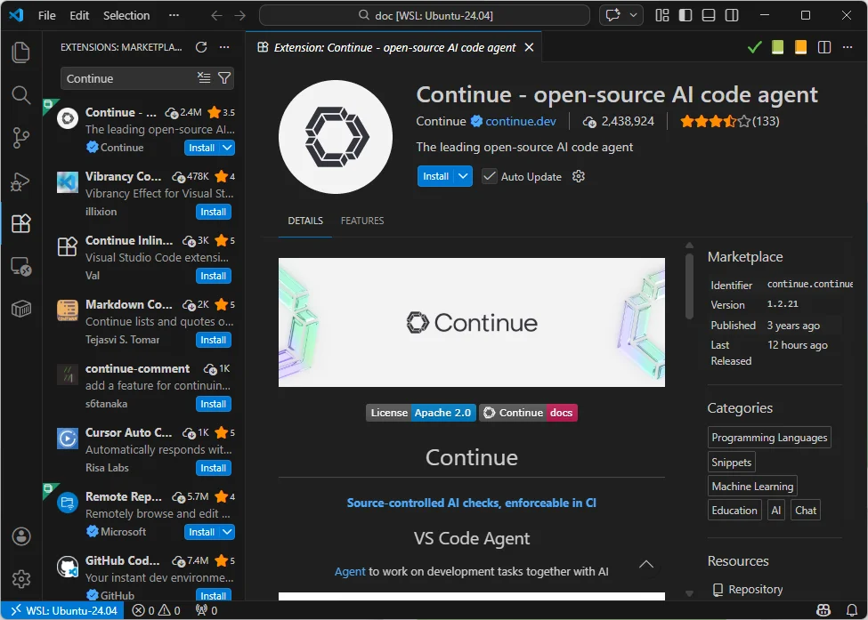

Continue requires a `config.json` file **in your Windows home folder**; not WSL side.

Start a Powershell terminal, run `cd ~/.continue ; del config.yaml ; notepad config.json` and paste the content of this file:

<Snippet filename=".continue/config.json" source="./files/continue/config.json" defaultOpen={false} />

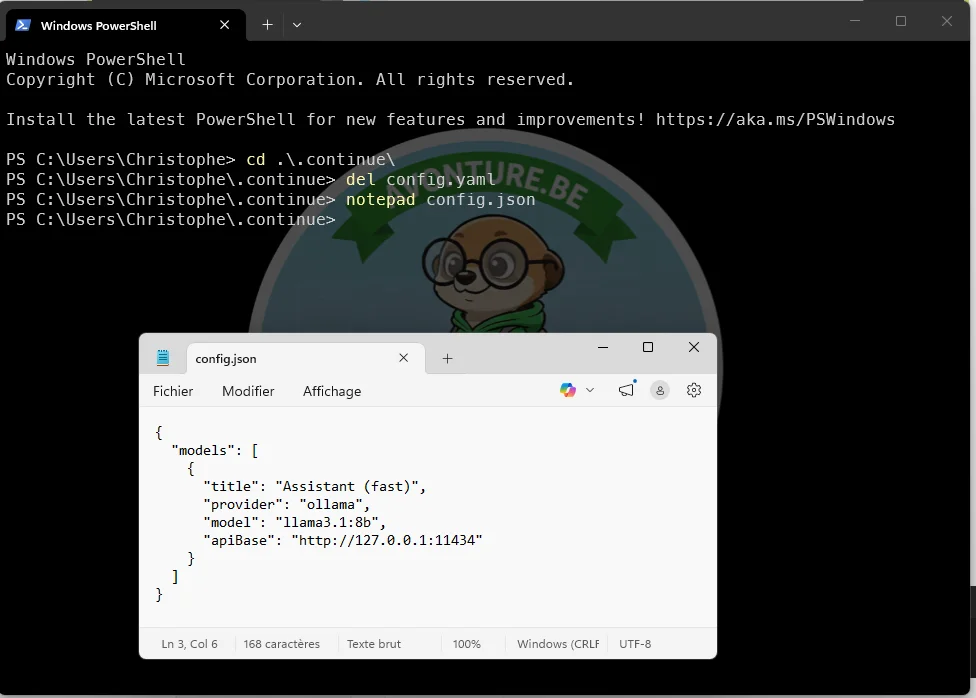

Restart VSCode again or, in the Continue pannel, fin the `Local config` option and select `Refresh`.

When you'll see your model name in the list of loaded models, Continue is ready to manage your first question.

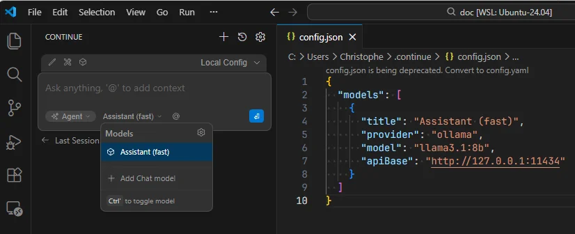

From now one, you can use Continue to ask questions about your codebase, generate unit tests, refactor some code, and so on.

The speed will depend on the model you've selected and your hardware for sure.

### Using autocompletion

When you're typing some text in VSCode, you wish immediate autocompletion and not to wait one second or more.

For this, you'll need to use a faster model; let's use `qwen2.5-coder:1.5b`  (1.5 billion of parameters, around ~1G).

<Terminal wrap={true}>
$ docker exec -it ollama ollama pull qwen2.5-coder:1.5b
</Terminal>

Update your `.continue/config.json` file (on Windows side) with this new content:

<Snippet filename=".continue/config.json" source="./files/continue/config_with_autocompletion.json" defaultOpen={false} />

Now that I've added the `qwen2.5-coder:1.5b` model in my config file, let's create a `calculate.sh` file with this content:

<Snippet filename="calculate.sh" source="./files/calculate.sh" defaultOpen={true} />

... and nothing more.

After just one second, VSCode will suggest me to complete the function with the right code:

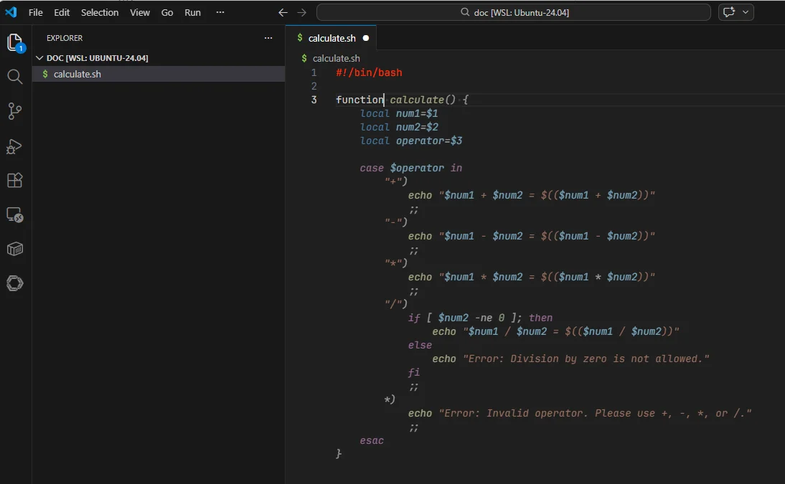

I've accepted the suggestion and, I've typed `function main` and again, after one second, the rest of the code is autocompleted.

Then I've typed `function help`, accept the proposal and the last thing was to accept the last lines of the script.

So, in less than 5 seconds, I've got a complete script with the right code and the right comments. All this without writing a single line of code, just by accepting suggestions from the LLM.

<Snippet filename="calculate.sh" source="./files/calculate_autocompleted.sh" defaultOpen={false} />

And it's works out-of-the-box!

<Terminal wrap={true}>

$ chmod +x ./calculate.sh

$ ./calculate.sh
Usage: ./calculate.sh \<num1\> \<num2\> \<operator\>
Example: ./calculate.sh 5 3 +

❯ ./calculate.sh 5 3 -
5 - 3 = 2

</Terminal>

### Using more powerfull LLM depending on your expectations

If you've a powerfull CPU and/or GPU with 32GB or more, you can also add a better model `gemma2:27b` (27 billion of parameters, around ~17G):

<Snippet filename=".continue/config.json" source="./files/continue/config_with_expert.json" defaultOpen={false} />

<Terminal wrap={true}>
$ docker exec -it ollama ollama pull gemma2:27b
</Terminal>

This model will be much more accurate, but also slower. Save it for intensive code analysis tasks such as code refactoring, generating complex unit tests, and so on.

I've selected `gemma2:27b` and asked for a refactoring. It was really slow even on my machine (i9 - 64GB).

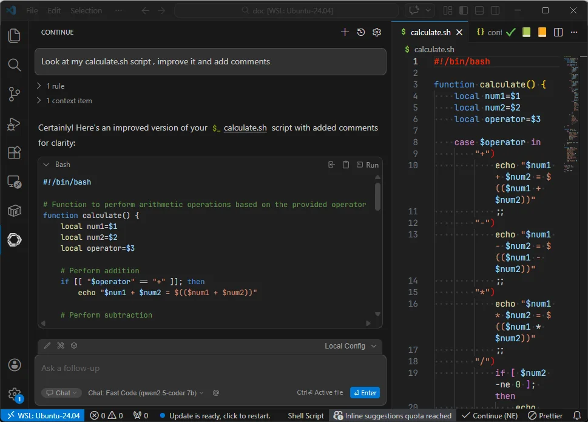

And using autocompletion for the `readme.md`

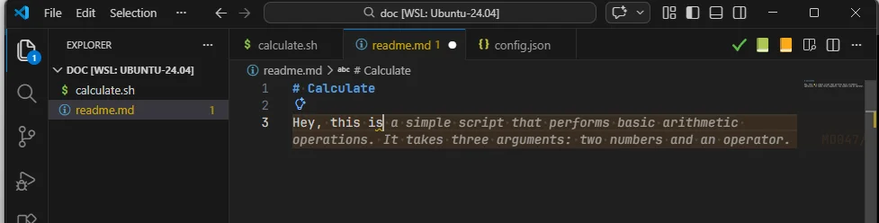

## Bonus

### CanIRun.ai

The website [https://www.canirun.ai/](https://www.canirun.ai/) automatically detects your CPU, GPU, and memory configuration—strictly locally, without transmitting your system data to an external server—and instantly outputs a realistic assessment of which AI models your machine can execute smoothly.

By visiting that web page, the system will calculate which AI models can run on your hardware and how fast. No data is sent to any server. Everything is computed client-side.

### Freeing Up RAM with ollama stop

If you ever need to instantly reclaim your system's memory, you can force a model to unload by running `docker exec -it ollama ollama stop <model_name>`.

However, this manual step usually isn't necessary, as Ollama is designed to automatically unload models from your RAM after a few minutes of inactivity. It's simply a handy command to keep in your back pocket for those times you need immediate control over your resources!

### Remove a model

Simply run `docker exec -it ollama ollama rm <model_name>`.

### .wslconfig file

If you're a WSL2 user, it's a good idea to create a `.wslconfig` file in your Windows partition in order to specify a few default settings for WSL like how many (max) RAM he can eat.

On my host, I use these settings:

<Snippet filename=".wslconfig" source="./files/.wslconfig" defaultOpen={true} />

To create this file, simply start a new Powershell terminal, run `cd ~` to go in your home directory (at Windows level) and run `notepad .wslconfig` to open that file (and create it if needed).

<AlertBox variant="tip">

Think to run `wsl --shutdown` in a Powershell console if you've created/updated the `.wslconfig` file.

</AlertBox>
