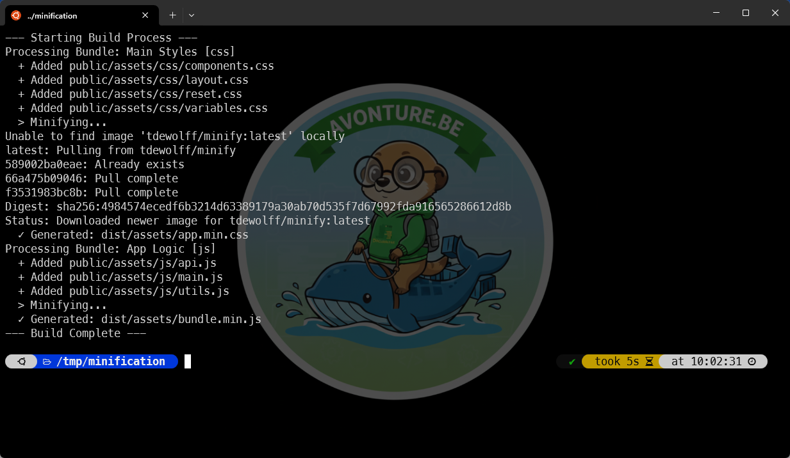

<TDLR>This guide demonstrates how to build a clean, modular, and blazing-fast asset pipeline without polluting your host machine. By combining a declarative YAML manifest, a straightforward Bash orchestrator, and a Dockerized Go-based minifier (`tdewolff/minify`), you get reproducible, isolated builds. It is the perfect setup for projects that require a lean, Docker-first approach to frontend optimization.</TDLR>

In modern web development, keeping your CSS and JavaScript files lean is crucial for performance. While heavy-duty bundlers like Webpack or Vite are great for complex apps, sometimes you just need a simple, portable way to concatenate and minify files without installing a massive Node.js ecosystem on your local machine or CI/CD runner.

Today, we will build a custom build pipeline using:

1. **YAML** to define our asset bundles.
2. **Bash** to orchestrate the file concatenation.
3. **Docker** to perform the actual minification using high-performance tools.

<!-- truncate -->

## The Architecture

Our workflow is really (really!) simple:

1. A Bash script reads a `manifest.yaml` file.
2. It gathers the source files and merges them into a single temporary file.
3. It triggers a Docker container that runs the [minify](https://github.com/tdewolff/minify) engine to compress the code.

### 1. The Configuration (`manifest.yaml`)

First, we need a way to tell our script which files belong together. This YAML structure allows you to define multiple bundles for both CSS and JS.

Here is what we need:

<Snippet filename="manifest.yaml" source="./files/manifest.yaml" defaultOpen={true} />

We've two parts, one for CSS and one for JS and, we'll tell two things

1. The name of our target file (f.i. we are saying the minified CSS file will be `dist/assets/app.min.css`)
2. A list of input files

### 2. The Orchestrator Script (`build.sh`)

This Bash script uses `yq` (a lightweight YAML processor) to parse our manifest. It concatenates the files and then calls the Docker image `[tdewolff/minify](https://hub.docker.com/r/tdewolff/minify)` to handle the heavy lifting. So, we'll not pollute our system with additionnal dependencies; just one, small, Docker image.

### 3. How to Run It

#### Prerequisites

1. **Docker**: Installed and running.
2. **yq**: A portable command-line YAML processor. You can install by running `sudo apt-get update && sudo apt-get install yq` if you don't have it yet.

#### Set-up

For this tutorial, let's create a few example files. To do this, please start a new terminal and run this long command:

<Snippet source="./files/cli.txt" defaultOpen={false} />

This instruction will create a new `/tmp/minification` folder and automate the create of a few files:

```tree
├── dist
│   └── assets
└── public
    └── assets
        ├── css
        │   ├── components.css
        │   ├── layout.css
        │   ├── reset.css
        │   └── variables.css
        └── js
            ├── api.js
            ├── main.js
            └── utils.js
```

##### Now, please create the manifest and the script

This done, please finish the set-up by creating the `/tmp/minification/manifest.yaml` manifest file:

<Snippet filename="manifest.yaml" source="./files/manifest.yaml" defaultOpen={false} />

And, too, please create the `/tmp/minification/build.sh` Bash script:

<Snippet filename="build.sh" source="./files/build.sh" defaultOpen={false} />

Last thing is to make it executable (`chmod +x /tmp/minification/build.sh`).

#### Execution

You're now ready. Simply run `./build.sh` to start the concatenation and the minifaction:



Yeah, it just took just five seconds (downloading the Docker image included).

##### Look at the Docker image flags

Surf to [tdewolff/minify](https://hub.docker.com/r/tdewolff/minify) and look for the [demo site](https://go.tacodewolff.nl/minify), the [CLI options](https://github.com/tdewolff/minify/tree/master/cmd/minify) and docs.

### Why This Approach?

1. **No Node Dependencies**: You don't need a `package.json` or a `node_modules` folder. The minification engine lives inside a Docker container.
2. **Blazing Fast**: `tdewolff/minify` is written in Go. It is significantly faster than many JavaScript-based minifiers.
3. **Declarative**: Adding a new file to your CSS bundle is as simple as adding one line to your `manifest.yaml`.
4. **Consistency**: Because we use Docker, the minification result will be exactly the same on your local machine, your colleague's laptop, and your production CI server.

### Conclusion

By combining the scripting power of Bash with the isolation of Docker, we've created a robust asset pipeline. This setup is perfect for static sites, legacy PHP projects, or any environment where you want to keep your development tooling as lightweight as possible.
