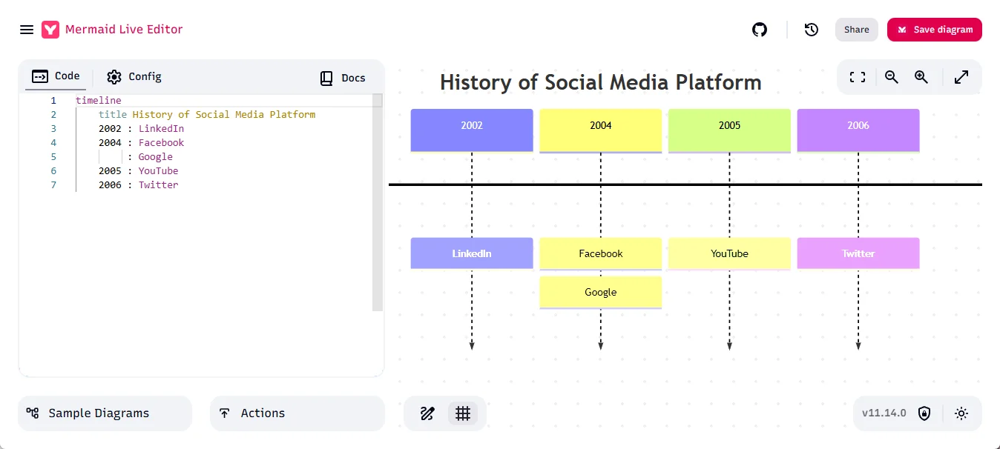
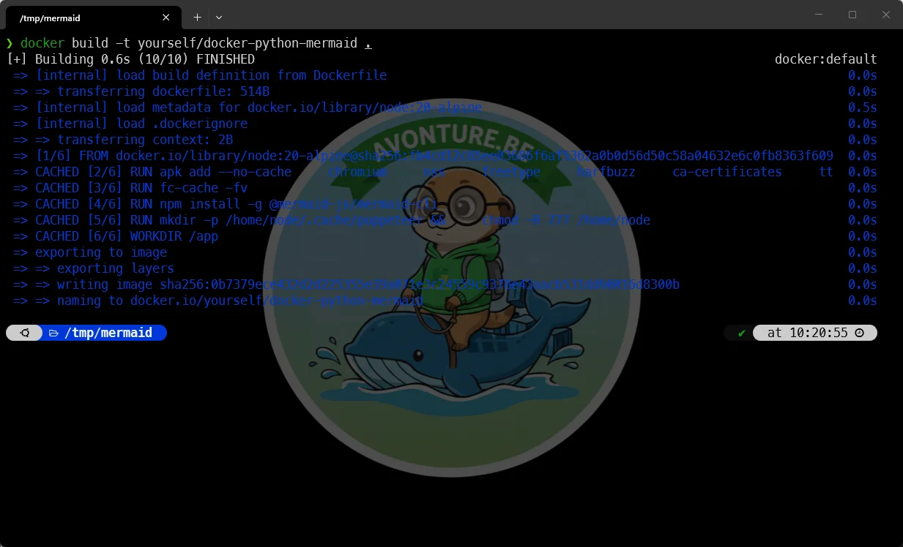
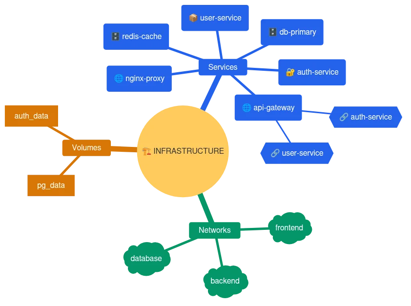
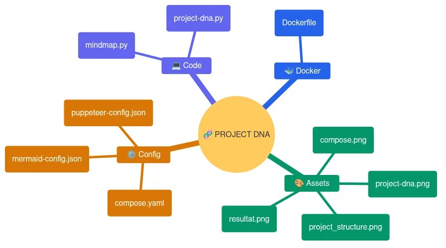
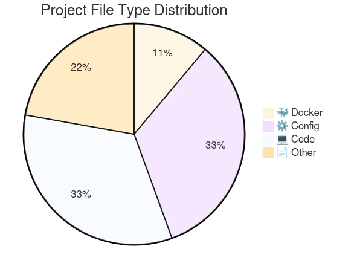

<TLDR>Manual documentation gets outdated the second your code changes. To solve this, you can embrace Documentation as Code by building a custom Docker image equipped with Python and the Mermaid CLI to automatically generate your visual assets. By writing straightforward Python scripts that parse your compose.yaml files or scan your project directories, you can dynamically output Mermaid pseudocode and render it directly into clean, up-to-date PNG diagrams (like mindmaps and pie charts) using a single command.</TLDR>

I like documentation, and what is more inefficient than writing docs for things that can be self-documented?

As you might know, I love Docker and I do almost everything in a dockerized way. So, in every one of my projects, there is a `compose.yaml` file. If I want to document it for my colleagues, I could start writing: *There are three services, one is for PHP, one for Nginx, one for PostgreSQL. That one is using a volume to make data persistent on disk and blah blah blah. The Nginx service is publishing on port xxx and the database is accessible using port yyy.* I can do that, for sure, but are there no better ways to do this? What if I add a new service or update a port number? My documentation would already be outdated, unless...

Let's see how to automate the documentation using Docker, Python and Mermaid.

<!-- truncate -->

In modern DevOps, documentation often lags behind code. How many times has your `compose.yaml` changed while your architectural diagrams remained stuck in last year's version?

Thanks to AI, Docker, Python, [Mermaid](https://mermaid.js.org/) and [mermaid-cli](https://github.com/mermaid-js/mermaid-cli), we can automate such things.

We can write a Python script that will analyze a file, a codebase, ... anything in reality ("Your imagination is your own limit*). Python will analyze and will create a Mermaid diagram. It's a *pseudocode* that can be rendered as an image.

Look at this [example](https://mermaid.live/edit#pako:eNpFjctqwzAQRX9FzNoNtmzJtrYtfUALhWbT4o1ijR0RWRMUmTYN-fcqCU3uauZw7swBejIICqKd0FmPnWcp0UaH7NnuIoU9o4F9UG-1Y29orGbvTseBwnRxeZ5zptir9Rs0L_4KqwQfdY8ros0FnqPYE9Ho8OqJhD5pXs6rG5OJLb9tjBgggzFYAyqGGTOYMEz6tMLhZHcQ1zhhByqNBgc9u9hB54-pttX-i2j6bwaaxzWoQbtd2uat0REfrB6DvinoDYZ7mn0EVYi6Ph8BdYAfUHdFVS7aVuZlK9uiraumzGAPipcLIaXkKTWvmrqRxwx-z4-LBW8L0XDR5GVTiroSxz-rtW0b):

In the left part, you've the *pseudocode*, really easy to read no? In the right part, the rendered image.

Go to [Mermaid Live Editor](https://mermaid.live/edit) and play with the *Sample Diagrams* bottom left to discover all the tool has to offer.

In this article, we'll create a Docker image ready-to-use to render such *pseudocode* into a transparent PNG.

## First things first, let's create the Docker image

The Dockerfile we'll use is this one.  It's quite simple.

<Snippet filename="Dockerfile" source="./files/Dockerfile" defaultOpen={false} />

To build this image run `docker build -t yourself/docker-python-mermaid .` in your terminal:

<Terminal wrap={true}>
docker build -t yourself/docker-python-mermaid .
</Terminal>

The final image size will be around 2GB.

## Prepare Mermaid rendering

We need to have two external files for the rendering.

The first one will configure Puppeteer:

<Snippet filename="puppeteer-config.json" source="./files/puppeteer-config.json" defaultOpen={false} />

And the second one will allow us to use our own formatting (font, colors, ...) when rendering the pseudocode to an image:

<Snippet filename="mermaid-config.json" source="./files/mermaid-config.json" defaultOpen={false} />

## Finally, we need a Python script

We've our Docker image, we've our configuration files. The last thing is writing a Python script that will do "something", generate a Mermaid pseudocode and render that pseudocode as an image.

What can we do? Whatever you want to do! Just use your preferred AI engine and ask it to create the corresponding Python script.

Let's try two things:

### We'll read a Docker compose.yaml and create a mindmap

The script below will read a `compose.yaml` file and generate a visual mindmap.

<Snippet filename="mindmap.py" source="./files/scripts/mindmap.py" defaultOpen={false} />

Here is the dummy `compose.yaml` I'll use as an example:

<Snippet filename="compose.yaml" source="./files/samples/compose.yaml" defaultOpen={false} />

Now, the best part: please run this command to render the image:

<Terminal wrap={true}>
$ docker run --rm -u $(id -u):$(id -g) -e HOME=/tmp -v .:/app yourself/docker-python-mermaid python3 /app/scripts/mindmap.py /app/samples/compose.yaml -o /app/compose.png

Generating single mermaid chart

🚀 Generating Pro diagram...
✨ Done! Image: /app/compose.png
</Terminal>

Using a single command line will create this image:

Cool, isn't it? This image has been generated by the `mindmap.py` Python script once our `compose.yaml` file was processed. We can now change our YAML file, run the `docker run` command again, and the image will be updated automatically.

<AlertBox variant="note" title="Colors">
Remember, simply update the `mermaid-config.json` file if you want another color scheme.
</AlertBox>

### Another example

This script will look at our file structure, identify the files we have, and create a mindmap as well:

<Snippet filename="project-dna.py" source="./files/scripts/project-dna.py" defaultOpen={false} />

<Terminal wrap={true}>
$ docker run --rm -u $(id -u):$(id -g) -e HOME=/tmp -v .:/app yourself/docker-python-mermaid python3 /app/scripts/project-dna.py /app -o /app/project-dna.png

Generating single mermaid chart
🔎 Analyzing /app...
✨ DNA successfully generated in /app/project-dna.png
</Terminal>

This mindmap will not just show us our folders but will group files into categories like `Code`, `Configuration`, `Assets`, etc.

### Last example

This time a Pie chart:

<Snippet filename="pie.py" source="./files/scripts/pie.py" defaultOpen={false} />

<Terminal wrap={true}>
$ docker run --rm -u $(id -u):$(id -g) -e HOME=/tmp -v .:/app yourself/docker-python-mermaid python3 /app/scripts/pie.py /app -o /app/pie.png

Generating single mermaid chart
🔎 Analyzing /app...
✨ DNA successfully generated in /app/project-dna.png
</Terminal>

## All needed files

<ProjectSetup folderName="/tmp/mermaid" createFolder={true} >
  <Guideline>
    Now, please run 'docker build -t yourself/docker-python-mermaid .' to
    create the Docker image..
  </Guideline>
<Snippet filename="Dockerfile" source="./files/Dockerfile" defaultOpen={false} />
<Snippet filename="puppeteer-config.json" source="./files/puppeteer-config.json" defaultOpen={false} />
<Snippet filename="mermaid-config.json" source="./files/mermaid-config.json" defaultOpen={false} />
<Snippet filename="scripts/mindmap.py" source="./files/scripts/mindmap.py" defaultOpen={false} />
<Snippet filename="scripts/pie.py" source="./files/scripts/pie.py" defaultOpen={false} />
<Snippet filename="samples/compose.yaml" source="./files/samples/compose.yaml" defaultOpen={false} />
<Snippet filename="scripts/project-dna.py" source="./files/scripts/project-dna.py" defaultOpen={false} />
</ProjectSetup>

## Conclusion

By combining the parsing power of Python with the rendering elegance of Mermaid, we've turned static documentation into a dynamic asset.
