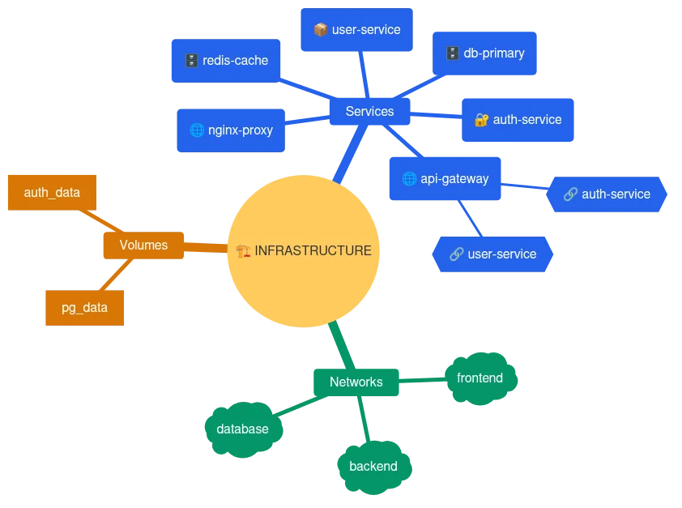
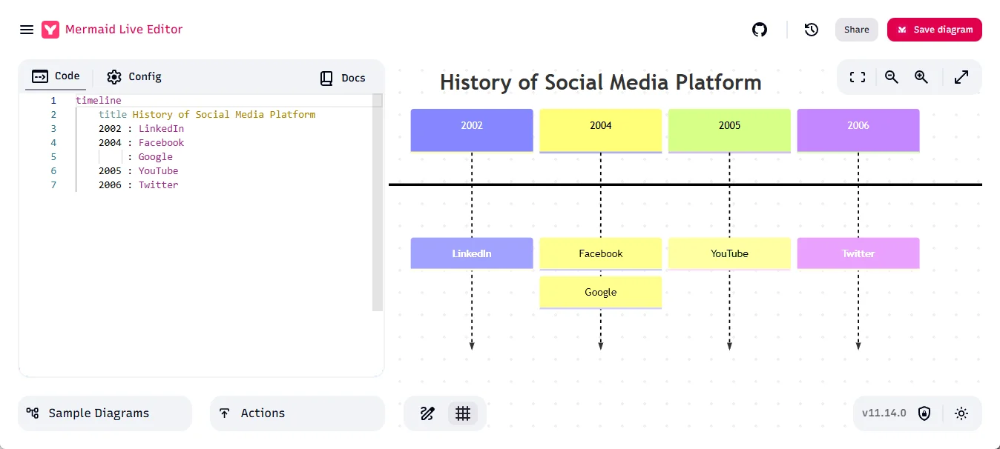
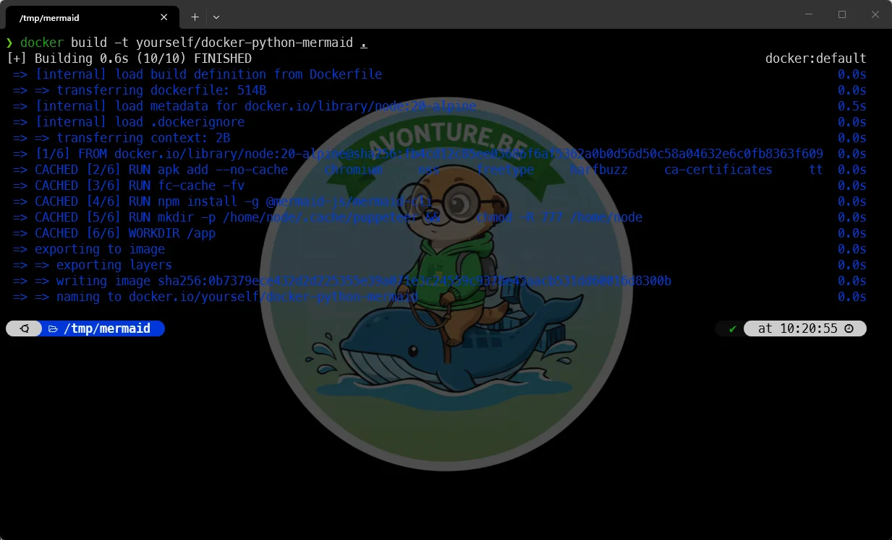
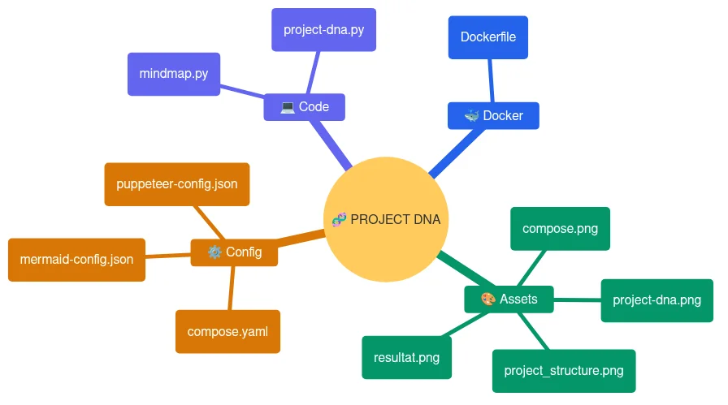
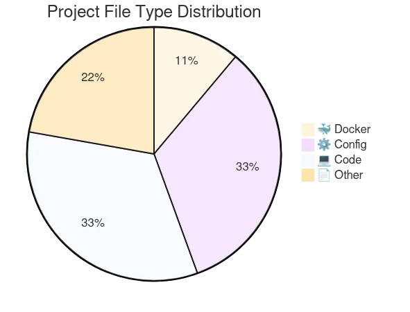

<TLDR>Manual documentation gets outdated the second your code changes. To solve this, you can embrace Documentation as Code by building a custom Docker image equipped with Python and the Mermaid CLI to automatically generate your visual assets. By writing straightforward Python scripts that parse your compose.yaml files or scan your project directories, you can dynamically output Mermaid pseudocode and render it directly into clean, up-to-date PNG diagrams (like mindmaps and pie charts) using a single command.</TLDR>

I like documentation, and what is more inefficient than writing docs for things that can be self-documented?

As you might know, I love Docker and I do almost everything in a dockerized way. So, in every one of my projects, there is a `compose.yaml` file. If I want to document it for my colleagues, I could start writing: *There are three services, one is for PHP, one for Nginx, one for PostgreSQL. That one is using a volume to make data persistent on disk and blah blah blah. The Nginx service is publishing on port xxx and the database is accessible using port yyy.* I can do that, for sure, but isn't there a better way to do this? What if I add a new service or update a port number? My documentation would already be outdated, unless...

Let's see how to automate the documentation using Docker, Python and Mermaid.

<!-- truncate -->

<QuickJump
  links={[
    { label: "See it in Action", to: "#the-result" },
    { label: "All needed files", to: "#all-needed-files" },
  ]}
/>

## The Result

Point the pipeline built in this article at a real `compose.yaml`, and one command produces this:

This image has been generated entirely from the `compose.yaml` file — no manual drawing, no diagramming tool. Change the YAML, run the command again, and the diagram updates itself.

## Why Mermaid

<AlertBox variant="note" title="Pseudocode in, image out">
[Mermaid](https://mermaid.js.org/) turns a small block of text — its own *pseudocode* — into a rendered diagram. Look at this [example](https://mermaid.live/edit#pako:eNpFjctqwzAQRX9FzNoNtmzJtrYtfUALhWbT4o1ijR0RWRMUmTYN-fcqCU3uauZw7swBejIICqKd0FmPnWcp0UaH7NnuIoU9o4F9UG-1Y29orGbvTseBwnRxeZ5zptir9Rs0L_4KqwQfdY8ros0FnqPYE9Ho8OqJhD5pXs6rG5OJLb9tjBgggzFYAyqGGTOYMEz6tMLhZHcQ1zhhByqNBgc9u9hB54-pttX-i2j6bwaaxzWoQbtd2uat0REfrB6DvinoDYZ7mn0EVYi6Ph8BdYAfUHdFVS7aVuZlK9uiraumzGAPipcLIaXkKTWvmrqRxwx-z4-LBW8L0XDR5GVTiroSxz-rtW0b): on the left, the pseudocode — readable at a glance; on the right, the rendered image.
</AlertBox>

Go to [Mermaid Live Editor](https://mermaid.live/edit) and play with the *Sample Diagrams* bottom left to discover all the tool has to offer. A Python script can generate that same pseudocode from anything readable — a `compose.yaml`, a folder tree, whatever data you already have — and the Mermaid CLI renders it into a transparent PNG.

## Installation — Let's create the Docker image

The Dockerfile we'll use is this one. It's quite simple.

<Snippet filename="Dockerfile" source="./files/Dockerfile" defaultOpen={false} />

To build this image run `docker build -t yourself/docker-python-mermaid .` in your terminal:

<Terminal typewriter wrap={true}>
$ docker build -t yourself/docker-python-mermaid .
</Terminal>

The final image size will be around 2GB.

## Prepare Mermaid rendering

We need to have two external files for the rendering.

The first one will configure Puppeteer:

<Snippet filename="puppeteer-config.json" source="./files/puppeteer-config.json" defaultOpen={false} />

And the second one will allow us to use our own formatting (font, colors, ...) when rendering the pseudocode to an image:

<Snippet filename="mermaid-config.json" source="./files/mermaid-config.json" defaultOpen={false} />

## Finally, we need a Python script

We've our Docker image, we've our configuration files. The last thing is writing a Python script that will do "something", generate a Mermaid pseudocode and render that pseudocode as an image.

What can we do? Whatever you want to do! Just use your preferred AI engine and ask it to create the corresponding Python script.

Let's try two things:

### We'll read a Docker compose.yaml and create a mindmap

The script below will read a `compose.yaml` file and generate a visual mindmap. *There is also a ready-made tool for this, see <Link to="/blog/docker-compose-viz">How to generate a graph from compose.yaml</Link>, but writing the script ourselves gives us total freedom on the output.*

<Snippet filename="mindmap.py" source="./files/scripts/mindmap.py" defaultOpen={false} />

Here is the dummy `compose.yaml` I'll use as an example:

<Snippet filename="compose.yaml" source="./files/samples/compose.yaml" defaultOpen={false} />

Now, the best part: please run this command to render the image:

<Terminal typewriter wrap={true} source="./files/terminal-3.txt" />

Using a single command line produces the mindmap shown at the top of this article. This image has been generated by the `mindmap.py` Python script once our `compose.yaml` file was processed. We can now change our YAML file, run the `docker run` command again, and the image will be updated automatically.

<AlertBox variant="note" title="Colors">
Remember, simply update the `mermaid-config.json` file if you want another color scheme.
</AlertBox>

## More Examples

### Another example

This script will look at our file structure, identify the files we have, and create a mindmap as well:

<Snippet filename="project-dna.py" source="./files/scripts/project-dna.py" defaultOpen={false} />

<Terminal typewriter wrap={true} source="./files/terminal-2.txt" />

This mindmap will not just show us our folders but will group files into categories like `Code`, `Configuration`, `Assets`, etc.

### Last example

This time a Pie chart:

<Snippet filename="pie.py" source="./files/scripts/pie.py" defaultOpen={false} />

<Terminal typewriter wrap={true} source="./files/terminal-1.txt" />

## All needed files

<ProjectSetup folderName="/tmp/mermaid" createFolder={true} >
  <Guideline>
    Now, please run 'docker build -t yourself/docker-python-mermaid .' to
    create the Docker image.
  </Guideline>
<Snippet filename="Dockerfile" source="./files/Dockerfile" defaultOpen={false} />
<Snippet filename="puppeteer-config.json" source="./files/puppeteer-config.json" defaultOpen={false} />
<Snippet filename="mermaid-config.json" source="./files/mermaid-config.json" defaultOpen={false} />
<Snippet filename="scripts/mindmap.py" source="./files/scripts/mindmap.py" defaultOpen={false} />
<Snippet filename="scripts/pie.py" source="./files/scripts/pie.py" defaultOpen={false} />
<Snippet filename="samples/compose.yaml" source="./files/samples/compose.yaml" defaultOpen={false} />
<Snippet filename="scripts/project-dna.py" source="./files/scripts/project-dna.py" defaultOpen={false} />
</ProjectSetup>

## Conclusion

By combining the parsing power of Python with the rendering elegance of Mermaid, we've turned static documentation into a dynamic asset.

If you like the *Documentation as Code* approach, have a look at two other articles of mine going in the same direction: <Link to="/blog/docker-diagram-as-code">Docker - Diagrams as code</Link> and <Link to="/blog/python-pydot">Python - Generate flows using pydot</Link>.
