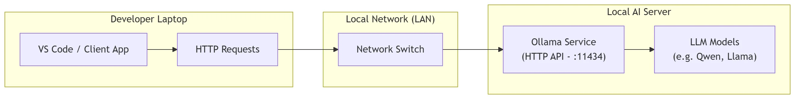
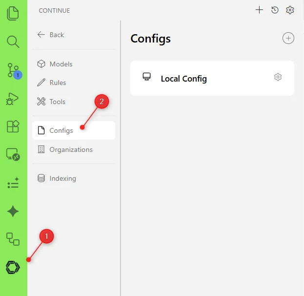
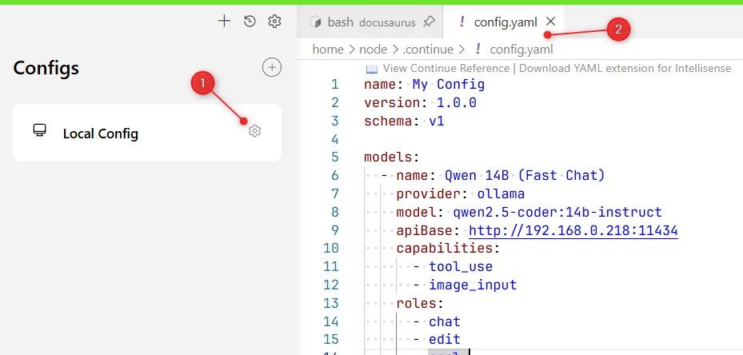

<TLDR>
This guide shows you how to decouple your heavy AI workloads by setting up a dedicated Ollama server on your local network. You'll learn how to find your server's IP, verify connectivity, and configure the Continue extension in VSCode (including WSL and devcontainers) on your client machine. The result is a fast, free, and completely private AI coding assistant that replaces cloud alternatives like GitHub Copilot.
</TLDR>

In a previous article, we installed Ollama, one or more AI models (LLMs), and a web interface called **Open WebUI**.

We learned how to play with Ollama locally on a single machine, but we haven't learned how to access it from another computer—for example, across your home network.

This is what we're going to do in this article. The idea is to use one computer as a *server* (the heavy lifter), and another as the *client* (your everyday laptop) to access it.

The server should have as much Video RAM (VRAM) and regular memory (RAM) as possible to run the AI smoothly. The client will just send web requests to it over your network, so a regular, less powerful computer is perfectly fine.

<!-- truncate -->

In this article, we'll implement this architecture. Please refer to my previous article (<Link to="/blog/ollama-installation">Installing Ollama and get local AI</Link>) for the set-up of the **Local AI Server**.



## Using a Local Network

Most likely, you already have a local area network (LAN) at home—this is usually managed by your Wi-Fi router. You can use it to securely access Ollama across your home without sending data to the internet. Personally, I use a simple network switch (like the **D-Link DGS-108**) to connect my computers with cables for the best speed, but a good Wi-Fi connection works too!

This setup provides high speed (1000Mbps bandwidth) with almost no delay (latency), which is perfect for our use case.

## Finding your Server's IP address

To connect to your server, you need its IP address—think of it as the computer's internal phone number on your home network.

Since my server runs on Windows 11, I can find it by opening a Powershell window and running the command: `ipconfig | Select-String -Pattern "IPv4"`. On my server, the output looks like this: `IPv4 Address. . . . . . . . . . . : 192.168.0.218`. Write this number down!

## Setting up the client computer

On your second computer (the client), let's first check if it can "talk" to your server. We do this using a networking command called `ping`. Open your terminal and type `ping 192.168.0.218` (replace with your server's IP):

<Terminal wrap={true}>
$ Pinging 192.168.0.218 with 32 bytes of data:

Reply from 192.168.0.218: bytes=32 time&lt;1ms TTL=128
Reply from 192.168.0.218: bytes=32 time&lt;1ms TTL=128
Reply from 192.168.0.218: bytes=32 time=1ms TTL=128
Reply from 192.168.0.218: bytes=32 time=1ms TTL=128

Ping statistics for 192.168.0.218:
    Packets: Sent = 4, Received = 4, Lost = 0 (0% loss),

Approximate round trip times in milliseconds:
    Minimum = 0ms, Maximum = 1ms, Average = 0ms

</Terminal>

This output means that our second computer can access the server with almost zero latency (`time < 1ms`).

### Running Open WebUI

First, make sure Ollama and **Open WebUI** are still running on the server computer. If they are, you should be able to open a web browser on your client computer and navigate to `http://192.168.0.218:4000`. Because we already verified the network connection, you should now see the Open WebUI login screen. Once connected, you'll be able to see the Ollama interface, view your available AI models, and start a chat!

### Double-checking the connection

Just before we jump into our code editor (VSCode) to set up our AI coding assistant, let's make sure the AI engine is actively listening.

To get the list of installed AI models on your server, simply run this command to ask the server for its list: `curl http://192.168.0.218:11434/api/tags` (add `| jq` to the end if you have it installed for prettier formatting).

And if you want to test the AI itself—for instance, to ask what a `Dockerfile` is—just fire this command in your client computer's console:

```bash
$ curl -X POST http://192.168.0.218:11434/api/generate \
    -H "Content-Type: application/json" \
    -d '{
        "model": "qwen2.5-coder:1.5b-base",
        "prompt": "What is a Dockerfile? Please explain it like I''m five.",
        "stream": false
        }'
```

<AlertBox variant="note" title="Check your model name">
Make sure the LLM `qwen2.5-coder:1.5b-base` model is well present; use another one based on your own list.
</AlertBox>

## Configure your Code Editor (VSCode)

As a developer, you can turn your editor into a smart assistant using just one extension. It provides:

1. **Inline Autocomplete**: Get real-time code suggestions as you type, powered by **FIM** (Fill-In-the-Middle) inference.
2. **Chat Interface**: Talk directly with your AI assistant to help you find bugs, rewrite code, or answer questions.

### Install the Continue extension on WSL

If you are using Windows with a Linux subsystem (WSL2) for your development, **the installation requires a bit of care to make sure the extension runs in the right place**. The [Continue](https://marketplace.visualstudio.com/items?itemName=Continue.continue) extension sometimes gets confused in this scenario.

To ensure it installs smoothly within the Linux environment (WSL), I carefully followed these steps:

<StepsCard
  title="Installing Continue on WSL"
  steps={[
    "Open your WSL terminal and start an Ubuntu session.",
    "In the terminal, run `code .` to open VSCode connected to your WSL session.",
    "Inside VSCode's terminal, run `code --install-extension continue.continue --force` to make 100% sure the extension is installed on the **Linux** side, not on Windows — this distinction is critical."
  ]}
/>

Once installed, the Continue icon appears in the left bar in VSCode. Click on it and, you'll see a list of available features.



Click on the `Configs` entry then click on the gear icon to get access to the configuration file. As illustrated on the image below, the path is well on WSL so, my configuration is fine.



<AlertBox variant="info" title="This screenshot has been taken in a Devcontainer">
This is why you see a full path like `/home/node/.continue/config.yaml`.  On your WSL, it should be like `/home/you/.continue/config.yaml`.
</AlertBox>

If you want a ready-to-use configuration file, you can use this one:

<Snippet filename="config.yaml" source="./files/config.yaml" defaultOpen={false} />

<AlertBox variant="info" title="config.json is deprecated" >
In some tutorials on the web (and even in AI's answers), you'll still see `config.json` instead of `config.yaml`. JSON is deprecated; use the YAML format. Read the official [config.yaml reference guide](https://docs.continue.dev/reference).
</AlertBox>

<AlertBox variant="important" title="Replace the model name">
The config references `qwen2.5-coder:14b-instruct` — replace it with a model you actually have installed. Run `ollama list` on your server to see what is available.
</AlertBox>

<AlertBox variant="important" title="Use your own server IP">
Replace every occurrence of `192.168.0.218` in this guide with your server's actual IP address.
</AlertBox>

If everything has been correctly configured, you now have AI auto-completion. Also, make sure autocomplete is enabled; look at the status bar of VSCode; you'll see an icon having the text `✓ Continue (NE)`.

#### Using chat with Continue

Actually, the provided `config.yaml` for Continue already includes two models for chat sessions. You can use them by clicking on the `Chat` entry in the left bar and then select one of the available models.

If you look at the configuration, we've defined a model called `Fast Chat (Qwen 14B)` (for fast reaction) and a smaller but stronger one called `Architect (Qwen 32B)` and that works fine.

Depending on your server's hardware (how much memory it has), feel free to experiment with different AI models.

#### You'll have to install Continue in any of your devcontainers

If, like me, you're using Devcontainers (isolated, specialized development environments), you'll need to add and configure Continue inside each of them.

The reason is that VSCode doesn't currently provide a way to say, *"Hey, please add this extension globally across all my containers."*

Because a devcontainer is designed to be completely standalone, any tool you need must be installed directly inside it. Unfortunately, this means a little extra setup!

## Conclusion

By following this guide, we've successfully decoupled our heavy AI workloads from our daily development environment. Setting up a dedicated "AI Server" on your local network allows you to leverage powerful LLMs without draining your primary computer's battery or monopolizing its RAM and CPU.

Furthermore, by integrating the Continue extension into VSCode, we've effectively built a private, self-hosted, and completely free alternative to cloud-based AI assistants like GitHub Copilot. Because everything runs over your LAN, your code and prompts never leave your local network, ensuring complete privacy and zero subscription fees.

Whether you are generating code, getting autocomplete suggestions, or asking questions about your codebase, your own local AI assistant is now just a quick network request away!
