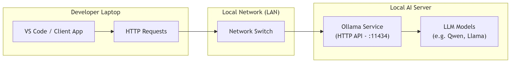

<AlertBox variant="caution" title="The Continue extension is shut down">
The [Continue](https://marketplace.visualstudio.com/items?itemName=Continue.continue) VSCode extension featured in this article was acquired by Cursor on June 18, 2026 and the standalone product has been shut down — the user-data export deadline (July 15, 2026) has passed and the repository is now read-only. The VSCode integration section below has been rewritten accordingly.
</AlertBox>

<TLDR>
This guide shows you how to decouple your heavy AI workloads by setting up a dedicated Ollama server on your local network. You'll learn how to find your server's IP, verify connectivity with `curl`, and connect a VSCode extension that supports Ollama as a backend. The result is a fast, free, and completely private AI coding assistant that replaces cloud alternatives like GitHub Copilot.
</TLDR>

In a previous article, we installed Ollama, one or more AI models (LLMs), and a web interface called **Open WebUI**.

We learned how to play with Ollama locally on a single machine, but we haven't learned how to access it from another computer—for example, across your home network.

This is what we're going to do in this article. The idea is to use one computer as a *server* (the heavy lifter), and another as the *client* (your everyday laptop) to access it.

The server should have as much Video RAM (VRAM) and regular memory (RAM) as possible to run the AI smoothly. The client will just send web requests to it over your network, so a regular, less powerful computer is perfectly fine.

*If containers on that server can't reach each other once everything is in place, <Link to="/blog/docker-networking-troubleshooting">Troubleshooting for Docker containers - Accessing the other one</Link> goes through the diagnosis step by step — a proxy is a frequent culprit.*

<!-- truncate -->

In this article, we'll implement this architecture. Please refer to my previous article (<Link to="/blog/ollama-installation">Installing Ollama and get local AI</Link>) for the set-up of the **Local AI Server**.



## Using a Local Network

Most likely, you already have a local area network (LAN) at home—this is usually managed by your Wi-Fi router. You can use it to securely access Ollama across your home without sending data to the internet. Personally, I use a simple network switch (like the **D-Link DGS-108**) to connect my computers with cables for the best speed, but a good Wi-Fi connection works too!

This setup provides high speed (1000Mbps bandwidth) with almost no delay (latency), which is perfect for our use case.

## Finding your Server's IP address

To connect to your server, you need its IP address—think of it as the computer's internal phone number on your home network.

Since my server runs on Windows 11, I can find it by opening a Powershell window and running the command: `ipconfig | Select-String -Pattern "IPv4"`. On my server, the output looks like this: `IPv4 Address. . . . . . . . . . . : 192.168.0.218`. Write this number down!

## Setting up the client computer

On your second computer (the client), let's first check if it can "talk" to your server. We do this using a networking command called `ping`. Open your terminal and type `ping 192.168.0.218` (replace with your server's IP):

<Terminal typewriter wrap={true} source="./files/terminal-1.txt" />

This output means that our second computer can access the server with almost zero latency (`time < 1ms`).

### Running Open WebUI

First, make sure Ollama and **Open WebUI** are still running on the server computer. If they are, you should be able to open a web browser on your client computer and navigate to `http://192.168.0.218:4000`. Because we already verified the network connection, you should now see the Open WebUI login screen. Once connected, you'll be able to see the Ollama interface, view your available AI models, and start a chat!

### Double-checking the connection

Just before we jump into our code editor (VSCode) to set up our AI coding assistant, let's make sure the AI engine is actively listening.

To get the list of installed AI models on your server, simply run this command to ask the server for its list: `curl http://192.168.0.218:11434/api/tags` (add `| jq` to the end if you have it installed for prettier formatting).

And if you want to test the AI itself—for instance, to ask what a `Dockerfile` is—just fire this command in your client computer's console:

```bash
$ curl -X POST http://192.168.0.218:11434/api/generate \
    -H "Content-Type: application/json" \
    -d '{
        "model": "qwen2.5-coder:1.5b-base",
        "prompt": "What is a Dockerfile? Please explain it like I''m five.",
        "stream": false
        }'
```

<AlertBox variant="note" title="Check your model name">
Make sure the LLM `qwen2.5-coder:1.5b-base` model is indeed present; use another one based on your own list.
</AlertBox>

## Configure your Code Editor (VSCode)

The original article used **Continue**, which has since been shut down (see the notice at the top of this page). The good news: the principle is the same regardless of which extension you use.

Any VSCode extension that supports Ollama as a backend gives you the same two capabilities:

1. **Inline Autocomplete**: Real-time code suggestions as you type, powered by **FIM** (Fill-In-the-Middle) inference.
2. **Chat Interface**: Talk directly with your AI assistant to find bugs, rewrite code, or answer questions.

At the time of writing, the most active open-source alternatives that natively support an Ollama endpoint are **Cline** and **RooCode** (an actively maintained fork of Cline). Both are available in the VSCode Marketplace.

Regardless of the extension you choose, the configuration principle is always the same: point the extension at your Ollama server's address (`http://192.168.0.218:11434`, replacing the IP with your own), select `Ollama` as the provider, and pick a model from your installed list (`ollama list` on the server to see what is available).

<AlertBox variant="info" title="WSL users: install the extension on the Linux side">
If you are using WSL2, make sure the extension is installed on the **Linux** side and not on Windows. Open VSCode connected to your WSL session and install the extension from the terminal with `code --install-extension <extension-id> --force`.
</AlertBox>

## Conclusion

By following this guide, we've successfully decoupled our heavy AI workloads from our daily development environment. Setting up a dedicated "AI Server" on your local network allows you to leverage powerful LLMs without draining your primary computer's battery or monopolizing its RAM and CPU.

By connecting a VSCode extension that supports Ollama to this server, you get a private, self-hosted, and completely free alternative to cloud-based AI assistants like GitHub Copilot. Because everything runs over your LAN, your code and prompts never leave your local network, ensuring complete privacy and zero subscription fees.

Whether you are generating code, getting autocomplete suggestions, or asking questions about your codebase, your own local AI assistant is now just a quick network request away!
