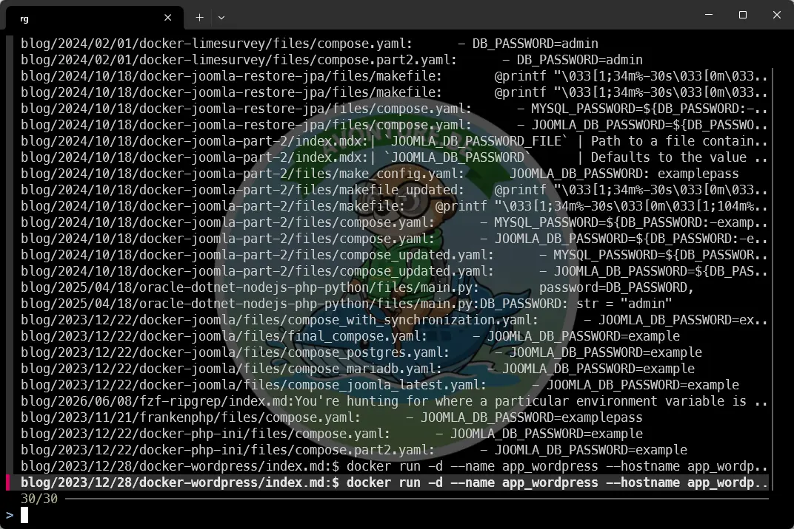
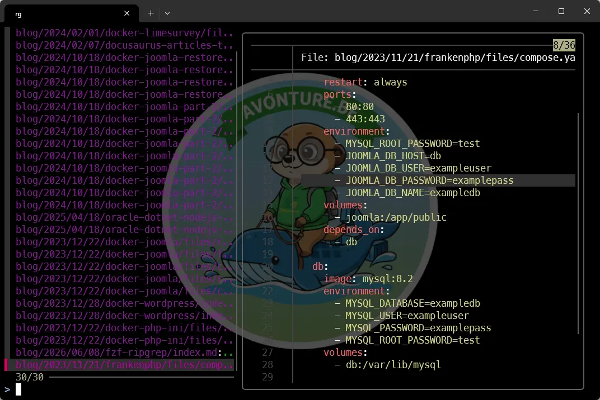

<TLDR>
`grep -r` returns a flat list — no context, no preview, no way to navigate without opening the file. By piping `ripgrep` into `fzf` and adding a `bat` preview panel, you get an interactive, syntax-highlighted code search that feels like an IDE search box, but lives entirely in your terminal. This article builds a ZSH function `rgf` that searches your codebase, shows a live preview of the matching file, and jumps straight to the right line in VSCode when you press <kbd>Enter</kbd>.
</TLDR>

You're hunting for where a particular environment variable is read, or which file still has that hardcoded URL you meant to clean up. You run `grep -rn "DB_PASSWORD" .` and get back forty lines of filenames, line numbers, and snippets — all jumbled together. You pick one, open the file, scroll to the right line, realize it is not the one you wanted, close it, and try again.

There is a better way.

<!-- truncate -->

## Prerequisites

This article builds on top of <Link to="/blog/linux-fzf-introduction">fzf</Link>, which you should already have installed. Two additional tools are needed: **ripgrep** and **bat**.

### ripgrep

> [ripgrep](https://github.com/BurntSushi/ripgrep) is a fast command-line search tool that recursively searches files for text patterns using Rust-powered performance, while automatically respecting `.gitignore` and similar ignore rules.

Check if ripgrep is already available:

<Terminal typewriter>
$ rg --version
ripgrep 14.1.0
</Terminal>

If not, install it:

<Terminal typewriter>
$ sudo apt install ripgrep
</Terminal>

### bat

[bat](https://github.com/sharkdp/bat) (batcat on Debian/Ubuntu) is a modern replacement for cat that displays files with syntax highlighting, Git integration, paging, and other developer-friendly features. It is used here to power the preview panel.

<Terminal typewriter>
$ bat --version
bat 0.24.0
</Terminal>

If not installed:

<Terminal typewriter>
$ sudo apt install bat
</Terminal>

<AlertBox variant="note" title="batcat on Ubuntu/Debian">
On some Ubuntu/Debian systems, the binary is named `batcat` instead of `bat`. If it's your case, simply replace *bat* with *batcat* in the rest of this article.
</AlertBox>

## Why ripgrep instead of grep?

`grep -r` is fine for small codebases. `ripgrep` is built for the real world:

* It **ignores `.gitignore`** entries automatically — no more results from `node_modules`, `vendor`, or build folders.
* It is **significantly faster** on large projects, thanks to parallel processing and smarter file traversal.
* Its output format (`file:line:content`) is designed for tooling integration.

A quick comparison — searching for `TODO` in a Node.js project with `node_modules` present:

<Terminal typewriter>
$ time grep -rn "TODO" .

... hundreds of results from node_modules ...

real 0m4.2s

$ time rg "TODO"
src/auth/login.ts:47:  // TODO: add rate limiting
src/api/users.ts:123:  // TODO: validate email format
src/components/Header.tsx:8:  // TODO: make logo clickable
real 0m0.08s

</Terminal>

The speed and noise-reduction alone make it worth switching.

## Step 1 — Connect ripgrep to fzf

The simplest possible combination already beats plain `grep`:

```bash
rg "DB_PASSWORD" | fzf
```



You get an interactive, filterable list. Type a few letters to narrow down results. Press <kbd>Enter</kbd> to print the selected line. Press <kbd>Esc</kbd> to exit without selecting.

But this only shows the matching line — no context, no preview of the surrounding code.

## Step 2 — Add a bat preview panel

This is where it gets interesting. `fzf` has a `--preview` option that runs an arbitrary command for each highlighted line and displays its output in a side panel.

```bash
rg --color=always --line-number --no-heading --smart-case "DB_PASSWORD" \
  | fzf --ansi \
        --delimiter=':' \
        --preview='bat --color=always --highlight-line {2} -- {1}' \
        --preview-window='right:60%:+{2}+3/3:~3'
```



As you move the cursor up and down the result list, the right panel updates live — showing the file with syntax highlighting, the matching line highlighted in yellow, and a few lines of surrounding context.

Let's break down what each flag does:

<StepsCard
  variant="remember"
  title="Flag Reference"
  steps={[
    {
      content: "**`--color=always`** (rg) — Forces colored output even when piping. Without this, rg detects the pipe and strips all colors, leaving fzf with plain text.",
    },
    {
      content: "**`--line-number --no-heading`** (rg) — Formats each result as `filename:linenumber:content` on a single line. This is the format fzf will parse.",
    },
    {
      content: "**`--smart-case`** (rg) — Case-insensitive when the query is all lowercase, case-sensitive when it contains uppercase. Best default for code search.",
    },
    {
      content: "**`--ansi`** (fzf) — Tells fzf to interpret and render ANSI color codes from rg's output.",
    },
    {
      content: "**`--delimiter=':'`** (fzf) — Splits each line on `:` so that `{1}` = filename, `{2}` = line number, `{3}` = content. These are then referenced in `--preview`.",
    },
    {
      content: "**`--highlight-line {2}`** (bat) — Highlights the specific matching line in the preview. `{2}` is resolved by fzf to the line number field.",
      substeps: [
        "**`-- {1}`** — The double dash separates bat options from the filename argument. `{1}` is resolved to the filename."
      ]
    },
    {
      content: "**`--preview-window='right:60%:+{2}+3/3:~3'`** — Opens the preview on the right, taking 60% of the terminal width. `+{2}+3/3` scrolls the panel so the matching line is visible, centered with context. `~3` keeps 3 header lines sticky."
    }
  ]}
/>

## Step 3 — The `rgf` function

Typing that full pipeline every time is not practical. The solution follows the same pattern as the <Link to="/blog/modular-zsh-workflow">modular ZSH workflow</Link> article: a standalone file in `~/.zsh/fns/`, lazy-loaded by ZSH — no `.zshrc` editing required.

The function checks all dependencies on startup, detects `bat` vs `batcat` automatically, and opens the selected result in VSCode at the exact matching line when you press <kbd>Enter</kbd>. If `code` is not in `$PATH`, it falls back to printing `file:line` to the terminal.

<ProjectSetup folderName="~/.zsh/fns" createFolder={true}>
  <Guideline>
    The filename must be exactly "rgf" — no extension. ZSH autoload uses the filename as the command name.
  </Guideline>
  <Snippet filename="rgf" source="./files/rgf.zsh" defaultOpen={true}/>
</ProjectSetup>

<AlertBox variant="note" title="Why a temp file instead of $(...)">
Running `selected=$(rg ... | fzf ...)` captures fzf's stdout and prevents it from displaying its TUI in WSL — the command just hangs. Writing fzf's output to a temp file lets it run in the foreground with full terminal access; the selection is read from the file after fzf exits.
</AlertBox>

If `~/.zsh/fns` is already in your `fpath` (see the <Link to="/blog/modular-zsh-workflow">modular ZSH workflow</Link> article), reload ZSH and run:

```bash
rgf "database"
```

Navigate with <kbd>↑</kbd> / <kbd>↓</kbd>, filter by typing, press <kbd>Enter</kbd> to jump to the matching line in VSCode, <kbd>Esc</kbd> to cancel.

## Real-world scenarios

Here are four situations where `rgf` becomes part of your daily workflow.

### Find all TODOs in the project

```bash
rgf "TODO|FIXME|HACK"
```

rg supports regex by default. This searches for any of the three markers. Navigate through all of them, pick the one you want to tackle, and land directly in the editor.

### Track down where a function is called

You renamed `sendEmail` to `sendNotification` but something still crashes. Find every call site:

```bash
rgf "sendEmail"
```

Each result shows the call in context. You see immediately whether it is an import, a call, or a test — without opening files one by one.

### Locate a hardcoded value

Your Docker Compose file used to have a hardcoded port. Is it still somewhere in the codebase?

```bash
rgf "5432"
```

The preview shows the surrounding lines — you can tell at a glance if it is a default value, a comment, or an active connection string.

### Search within a specific folder

`rgf` passes all its arguments directly to `rg`, so path scoping works as expected:

```bash
rgf "useEffect" src/components/
```

Only files under `src/components/` are searched. The same applies to file type filters:

```bash
rgf -t ts "interface UserProps"
```

The `-t ts` flag tells rg to search only TypeScript files.

## Going further

### Bind rgf to a keyboard shortcut

If you want `rgf` to be one keystroke away, add a ZSH keybinding. This binds <kbd>CTRL</kbd>+<kbd>F</kbd> to launch `rgf` with your current command-line content as the initial query:

```zsh
# In ~/.zshrc
rgf-widget() { rgf "$BUFFER"; zle reset-prompt }
zle -N rgf-widget
bindkey '^F' rgf-widget
```

### Combine with the repo navigator

If you have the `repo` function from the <Link to="/blog/modular-zsh-workflow">modular ZSH workflow</Link> article, a natural workflow emerges: `repo` to jump to the project, `rgf` to find the code, <kbd>Enter</kbd> to open it. Three keystrokes to any line in any project.

### Use ripgrep standalone

`rg` is also worth learning on its own — even without `fzf`. Common options you will reach for quickly:

```bash
rg -l "pattern"          # filenames only, no content
rg -c "pattern"          # count of matches per file
rg --type-list           # list all supported file types
rg -t py "def connect"   # Python files only
rg -g "*.yml" "image:"   # glob filter — only YAML files
```
