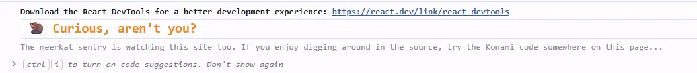
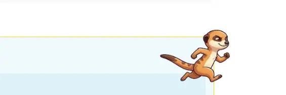
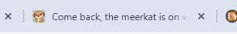

<!-- cspell:ignore Konami konami keydown postBuild urlset avonture nginx meerkats KONAMI AZERTY azerty -->

<TLDR>
Beyond the meerkat mascot already visible on this blog, this blog hides eight small, deliberately discoverable easter eggs: an ASCII-art meerkat sitting right in the page source, a `console.log` wink, rotating 404 messages, a Konami-code sprite run, a tab-away title/favicon swap, an `X-Powered-By` HTTP header, a print-stylesheet footer, and a hidden comment in `sitemap.xml`. This article walks through every one of them with the actual source code, and — more usefully — the real bugs we shipped and caught along the way: a key-repeat race in the Konami handler, an AZERTY keyboard mismatch a real user (not our tests) found, a wrong emoji codepoint, a Docusaurus `postBuild` concurrency gotcha, and a favicon that was unreadable until we redesigned the crop.
</TLDR>

You already know this site has a mascot: a meerkat that shows up on the 404 page, rides the "scroll to top" button, and hides in an [ASCII-art HTML comment](/blog/docusaurus-ascii-art) on every page. That last one got me thinking: if a comment in the page source is fun, what else could a curious visitor stumble upon?

So, this week-end, I asked myself — and Claude Code — a simple question: how far can we take this without it becoming annoying? The answer turned into eight small easter eggs — the ASCII-art comment revisited in detail, plus seven new additions — each following the same rule: **if you're not looking for it, you'll never see it.** No pop-ups, no confetti on page load, nothing that gets in a reader's way. Just quiet rewards for the curious.

<!-- truncate -->

<AlertBox variant="note" title="The one rule behind all of this">
Every easter egg on this list lives in the console, the source, the response headers, or a state the visitor has to trigger on purpose (leaving the tab, printing a page, typing a secret code). None of them ever appear in the normal reading flow.
</AlertBox>

## 1. The one that started it all: an ASCII-art meerkat in the page source

This is the easter egg that inspired everything else on this list, so it earns the top spot. Press <kbd>CTRL</kbd>+<kbd>U</kbd> on any page of this blog — or right-click and choose "View Page Source" — and right after the opening `<!doctype html>` line, before a single visible pixel has been described, you'll find a meerkat drawn entirely in ASCII characters, sitting inside an HTML comment:

<BrowserWindow url="view-source:https://www.avonture.be/blog/ripgrep/">
  
</BrowserWindow>

It's invisible in the rendered page — an HTML comment never reaches the screen — and it doesn't cost a single byte of layout or a single line of visible markup. It's purely a reward for anyone curious enough to look at the raw response.

Under the hood, a small `postBuild` plugin (`plugins/ascii-injector/index.mjs`) walks every generated HTML file after `yarn docusaurus build` finishes and inserts the contents of `src/data/banner.txt` as a comment right after the `<!doctype html>` tag. *The plugin itself is built step by step in <Link to="/blog/docusaurus-ascii-art">Inject ASCII Art in any HTML pages rendered by Docusaurus</Link>, and the banner comes from the same generator as the one in <Link to="/blog/bash-ascii-art">Bash - ASCII art</Link>:*

<Terminal title="user@machine: ~/blog">
$ yarn docusaurus build
$ grep -A2 doctype build/index.html
&lt;!doctype html&gt;
&lt;!--
</Terminal>

<AlertBox variant="info" title="Already covered in detail">
This one has its own dedicated article — [Inject ASCII Art in any HTML pages rendered by Docusaurus](/blog/docusaurus-ascii-art) — with the full plugin source, how to convert your own logo to ASCII art, and a `postBuild`-only caveat (it won't show up while running `yarn start` in dev mode, only on a real build). We won't repeat all of it here; this entry exists mainly so the egg gets its rightful place in this list.
</AlertBox>

## 2. A console.log wink for DevTools visitors

The easiest one. If you open your browser's DevTools console on this blog, you'll see this:

<Snippet filename="src/theme/Root.js (excerpt)" source="./files/root-console-egg.js" />

Nothing fancy: a styled `console.log` call (the `%c` directive lets you apply CSS to console output) that fires once per full page load. It also doubles as a hint, pointing curious readers toward the Konami code below.



<AlertBox variant="tip" title="Why useEffect(..., [])">
An empty dependency array means this effect runs once when the component mounts — not on every client-side route change. Since `Root` wraps the whole app and survives navigation between pages, this is the right place for a "once per visit" easter egg.
</AlertBox>

## 3. A 404 page with a sense of humorba

The 404 page already showed a meerkat illustration and a message. We turned the message into a small pool of five, picked at random on every load:

<Snippet filename="src/theme/NotFound/index.js" source="src/theme/NotFound/index.js" defaultOpen={false} />

`useState(() => …)` with a function initializer ensures the random pick happens exactly once per mount, not on every re-render — important here since `NotFound` doesn't need to re-roll the message while the user reads it.

Try it: Click on this link [inexisting_page](/blog/inexisting_page) then press <kbd>F5</kbd> to get random message.

## 4. The star of the show: a Konami code easter egg

Type `↑ ↑ ↓ ↓ ← → ← → B A` anywhere on this site (not in a text field) and a meerkat sprints across your screen. This is the one worth the most detail, because it's also the one that taught us the most.

Here is our running merkat; try it out!



More info about what's Konami code is?  Consult [this page](https://en.wikipedia.org/wiki/Konami_Code) on wikipedia.

### The component

<Snippet filename="src/components/KonamiEasterEgg/index.js" source="src/components/KonamiEasterEgg/index.js" />

The logic keeps a `useRef` cursor into a `KONAMI_CODE` array of [`KeyboardEvent.code`](https://developer.mozilla.org/en-US/docs/Web/API/KeyboardEvent/code) values (not `.key` — `.code` reflects the physical key position, so the sequence works the same on an AZERTY keyboard as on a QWERTY one). Each keydown either advances the cursor, resets it, or — on a full match — mounts a runner `` for 3 seconds:

<Snippet filename="src/components/KonamiEasterEgg/styles.module.css" source="src/components/KonamiEasterEgg/styles.module.css" defaultOpen={false} />

It's mounted once, globally, from `src/theme/Root.js`:

```jsx title="src/theme/Root.js (excerpt)"
import KonamiEasterEgg from '@site/src/components/KonamiEasterEgg';

// ...

return (
  <>
    {children}
    <KonamiEasterEgg />
  </>
);
```

<AlertBox variant="tip" title="Try it right now">
Seriously — click anywhere on this page to make sure it has focus, then type `↑ ↑ ↓ ↓ ← → ← → B A`. This exact component is running on the page you're reading.
</AlertBox>

### The bug that nearly killed the fun

After shipping this, real-world testing turned up a genuine bug: typed slowly and deliberately, the sequence sometimes just... didn't trigger. The cause was auto-repeat. Hold `ArrowUp` even a fraction of a second too long — which is very natural when you're carefully recalling a sequence — and the browser fires several `keydown` events with `repeat: true` before you release the key. Since the sequence needs `ArrowUp` **twice in a row**, one held press can inject an extra `ArrowUp` event right when the handler expects `ArrowDown`, silently resetting the whole thing.

The fix is one guard clause:

```jsx title="src/components/KonamiEasterEgg/index.js (excerpt)"
const handleKeyDown = (event) => {
  // Ignore auto-repeated keydowns fired while a key is held down: a
  // slightly-too-long "ArrowUp" press would otherwise inject extra
  // events and break a sequence that has two of the same key in a row.
  if (event.repeat) return;

  // ...
};
```

We verified the fix with [Playwright](https://playwright.dev/) rather than just eyeballing it — dispatching a synthetic `keydown` with `repeat: true` confirmed the handler now ignores it, and a full quick-tap run of the sequence still triggers the animation. If your easter egg (or any keyboard shortcut, really) involves two identical keys back-to-back, don't skip this check.

### The bug a real user found that automated testing missed

The key-repeat fix shipped, tests were green — and the feature still didn't work for a real visitor. The report: "I try the combination but nothing happens." The cause turned out to be the keyboard, not the code: on a Belgian AZERTY keyboard, the physical key printed **A** sits exactly where a QWERTY keyboard has **Q** (and vice-versa). The original implementation matched on [`event.code`](https://developer.mozilla.org/en-US/docs/Web/API/KeyboardEvent/code), which reports the *physical position* of the key on a QWERTY reference layout — so pressing the keycap labeled "A" on an AZERTY keyboard produced `code: 'KeyQ'`, not `'KeyA'`. The user's own diagnosis nailed it: typing what looked like "B, Q" on their keyboard worked, because that physical position maps to `KeyA`.

The fix is to match on [`event.key`](https://developer.mozilla.org/en-US/docs/Web/API/KeyboardEvent/key) instead — the actual character produced, which respects whatever layout the visitor has configured:

```jsx title="src/components/KonamiEasterEgg/index.js (excerpt)"
// event.code reflects the physical key position on a QWERTY reference
// layout, so on an AZERTY keyboard the key printed "A" reports 'KeyQ'.
// event.key reflects the actual character produced, which matches what
// players see printed on their own keycaps regardless of layout.
const normalizeKey = (key) => (key.length === 1 ? key.toLowerCase() : key);

// ...

const key = normalizeKey(event.key);
if (key === expectedKey) { /* ... */ }
```

Arrow keys were never affected — `ArrowUp`, `ArrowDown`, `ArrowLeft`, `ArrowRight` are identical strings for both `.code` and `.key` on every layout. The bug only bit the two letter keys at the end of the sequence, and only for the roughly [15–20% of keyboards worldwide](https://en.wikipedia.org/wiki/Keyboard_layout) that aren't QWERTY.

<AlertBox variant="important" title="Lesson">
Our Playwright test caught the key-repeat regression because it dispatched real, sequential events — but it never caught the layout bug, because Playwright's virtual keyboard defaults to QWERTY. Automated tests validate the logic you thought to test; they don't replace a human with different hardware. If a feature involves typed input, `.key` is almost always the right choice over `.code` — reserve `.code` for cases where you deliberately want physical key position (game movement controls, for instance, where WASD should stay in the same physical spot regardless of layout).
</AlertBox>

## 5. Tab-away easter egg: title and favicon swap

Leave this tab and come back — the title changes to "Come back, the meerkat is on watch! 👀" and the favicon swaps to a dozing meerkat. Both revert the instant the tab regains focus:



<Snippet filename="src/theme/Root.js (excerpt)" source="./files/root-titlebar-egg.js" />

The `visibilitychange` event and `document.hidden` are the standard way to detect this — no polling needed. `useBaseUrl` (a Docusaurus hook) resolves the favicon path correctly regardless of the site's configured base URL, the same helper used elsewhere on this site for image sources.

## 6. A wink in the HTTP headers

This one is invisible unless you check the Network tab or run `curl -I`. It lives in `nginx.conf`, right in the HTTPS server block:

<Snippet filename="nginx.conf" source="nginx.conf" defaultOpen={false} />

`add_header X-Powered-By "Meerkat-Sentry/1.0" always;` — a small, harmless header for anyone who inspects response headers out of habit.

## 7. Print stylesheet easter egg

Print an article (`Ctrl+P`) and a small footer note appears on the printed page:

<Snippet filename="src/css/custom.css (excerpt)" source="./files/print-easter-egg.css" defaultOpen={false} />

`@media print` only applies its rules when the browser is generating a print preview or an actual printout — it's invisible in the normal browsing experience, which is exactly the point.

## 8. Sitemap.xml gets a comment too

The least likely to ever be found, and the one that produced the most interesting bug. The idea: slip a small XML comment as the first child of `<urlset>` in the generated `sitemap.xml`. A comment there is valid XML and ignored by every sitemap parser and crawler, so it can't break indexing.

<Snippet filename="plugins/sitemap-easter-egg/index.mjs" source="plugins/sitemap-easter-egg/index.mjs" />

Registered the same way as the [ASCII-art injector](/blog/docusaurus-ascii-art):

<Snippet filename="docusaurus.config.js (excerpt)" source="./files/docusaurus.config.js" defaultOpen={false} />

## What we ended up with

<StepsCard
  variant="remember"
  title="The eight easter eggs"
  steps={[
    "**ASCII-art meerkat** — hidden in the page source, right after `<!doctype html>`",
    "**Console.log wink** — a styled message for anyone with DevTools open",
    "**Rotating 404 messages** — five random, mascot-flavored variants",
    "**Konami code** — `↑ ↑ ↓ ↓ ← → ← → B A` sends a meerkat running across the screen",
    "**Tab-away swap** — title and favicon change while the tab is hidden, and revert on return",
    "**X-Powered-By header** — a wink in the HTTP response headers",
    "**Print stylesheet** — a small footer note on printed pages",
    "**Sitemap.xml comment** — a hidden, XML-valid comment as the first child of `<urlset>`",
  ]}
/>

None of these change how a single reader reads a single article. That was the whole point — a blog's job is still to be read, not to perform tricks at the reader. But for the developers, the crawlers, the DevTools-curious, and the people who actually print articles or inspect response headers, there's now a little more personality hiding just under the surface. So cool no?

If you're running your own Docusaurus blog and have a mascot, a logo, or even just a favorite color: pick one or two of these — they're all small, self-contained, and none of them require touching your actual content. Start with the one that matches where your readers already are (DevTools console if your audience is developers, HTTP headers if it's other bloggers who poke at things, print CSS if people print your recipes or tutorials) and grow from there.
