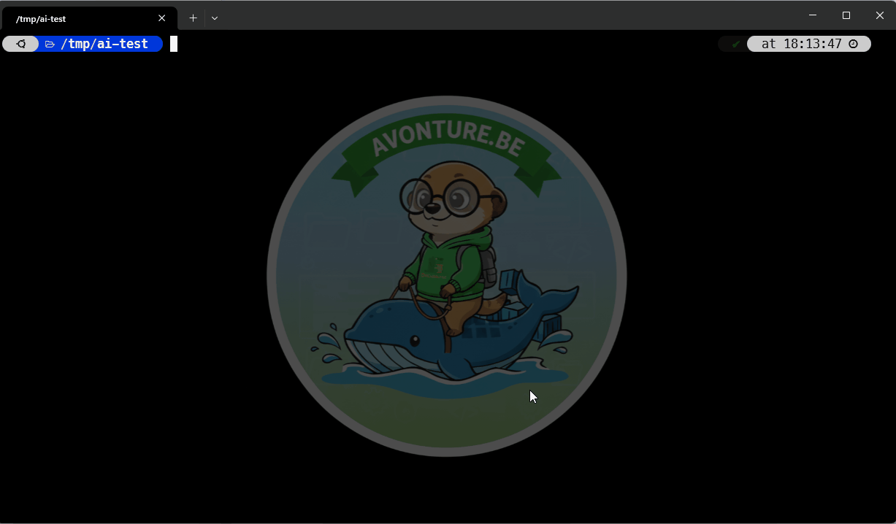

<!-- cspell:ignoreCase ai-test ai-commit qwen ollama bats batcat pytest pyproject zshrc dotfiles -->

<TLDR>
`ai-test` turns your local Ollama model into an on-demand unit test generator. Point it at a Bash, PHP or Python file, review the generated tests, save them if you like, then run them immediately in Docker — all without leaving your terminal. It supports Bats (Bash), Pest (PHP) and Pytest (Python).

This article opens the **<Link to="/series/ollama-daily-use-functions">Ollama daily-use</Link>**: small zsh functions that turn a local LLM into a practical terminal tool instead of another browser tab.
</TLDR>

Let's stop pretending: we all know unit tests are necessary, and almost nobody enjoys writing them. There's always an excuse — a tight deadline, a Bash script that was only supposed to be temporary, the sheer tedium of mocking dependencies. We promise ourselves we'll add them later, and *later* is the moment the technical debt explodes in production.

`ai-test` does the grunt work instead. Point it at a file, get a Bats, Pest or Pytest suite back, read it, save it, run it — all from the terminal, all on your machine.

<!-- truncate -->

## What `ai-test` Does For You

Take `greet.sh`, a small script that asks for a name and a language. One command, and a full Bats suite comes back — trimmed to three tests below, the real run produced more than fifteen:

<Terminal source="./files/terminal_greet.txt" typewriter />

That's the whole pitch: one command, a suite you can read in a minute, two confirmations, and a green run telling you it isn't decorative. Nothing was installed to run those tests, and nothing left the machine.

## Why It Works

Four ideas, and none of them require you to read a line of zsh yet:

- **The extension decides everything** — framework, naming convention, and where the file lands.
- **The prompt carries your project layout.** The model never sees a path, only a blob of text; `ai-test` computes the destination first, then dictates how the suite must load the code.
- **It reads the tests you already have** and asks for the gaps only, appended to the existing file.
- **It validates in a throw-away container**, so a suite that *looks* right has to prove it *passes*.

## Installing It

Two files to drop into `~/.zsh/fns/`, one new shell. First, the one hard dependency — `jq`, used to build the JSON payload sent to Ollama:

<Prerequisite
  name="jq"
  install="sudo apt update && sudo apt install jq -y"
  installOutput={`\nReading package lists... Done\nBuilding dependency tree... Done\n0 upgraded, 1 newly installed, 0 to remove and 0 not upgraded.`}
  check="jq --version"
  checkOutput={`\njq-1.7`}
  typewriter
/>

You also need Ollama running somewhere reachable — I've covered <Link to="/blog/ollama-installation">installing it</Link> and <Link to="/blog/accessing-ollama-across-your-local-network">exposing it across my network</Link> before; mine sits idle most of the day, so why not point it at the one task I keep postponing?

<Details label="Two optional tools: bat and docker (click if you want the details)">

**`bat`** — if [it](https://github.com/sharkdp/bat) is installed, the generated code is syntax-highlighted before it hits your terminal. If not, `ai-test` falls back to plain output. Watch out for one Debian/Ubuntu quirk: the `bat` name was already taken by `bacula-console-qt`, so `apt install bat` installs the binary as **`batcat`**. That's why the `_ai_bat` helper probes both spellings instead of hard-coding `bat`.

<Prerequisite
  name="bat"
  install="sudo apt install bat"
  check="batcat --version"
  checkOutput="bat 0.24.0"
  typewriter
/>

**`docker`** — only needed for the "run the suite now" step at the very end. `ai-test` skips that step with a message when `docker` isn't on your `PATH`.

<Prerequisite
  name="docker"
  install="sudo apt install docker"
  check="docker --version"
  checkOutput="Docker version 29.6.2, build dfc4efb"
  typewriter
/>

</Details>

Now the two files. `_ollama.zsh` holds everything the series shares — the query helper, the command registry, and the `ai` entry point — while `ai-test.zsh` is the function itself:

<ProjectSetup folderName="~/.zsh/fns">
  <Snippet filename="_ollama.zsh" source="./files/_ollama.zsh" />
  <Snippet filename="ai-test.zsh" source="./files/ai-test.zsh" />
</ProjectSetup>

If you already set up the `~/.zsh/fns/` autoloader from <Link to="/blog/ripgrep">my ripgrep article</Link>, you're done: open a new shell. If not, here's what to add to your existing `~/.zshrc`:

```bash title="~/.zshrc"
export OLLAMA_MODEL="qwen3-coder:30b"       # optional, this is already the default
export AI_TEST_PHP_IMAGE="php:8.4-cli"      # optional, override to match your project's PHP
export AI_TEST_PY_IMAGE="python:3.14-slim"  # optional, same idea for Python

for fn_file in ~/.zsh/fns/*.zsh; do
  source "$fn_file"
done
```

The exports go *above* the loop on purpose: the `AI_TEST_*` defaults are applied at source time, so anything you set afterwards would arrive too late.

### One Entry Point: `ai`

Open a new shell and type `ai`, with no argument. Instead of having to remember what you called your functions six months ago, you get an `fzf` picker listing every command that registered itself — today just `test`, tomorrow whatever else the series adds:



Pick one and it runs. If you already know what you want, `ai test greet.sh` dispatches straight to `ai-test` and skips the menu entirely — the two forms are equivalent, one is discoverable and, the other is fast.

<AlertBox variant="caution" title="Read before you trust">
Generated tests are a draft, not a guarantee — read them like a pull request from a junior contributor. Running the suite proves it *executes*; only reading it proves it *checks* something.
</AlertBox>

## More Demos

### A Real Script, and the Gaps It Fills

`greet.sh` was a warm-up. `backup.sh` is a different beast — an external command, a timestamp, and real filesystem side effects:

<Snippet filename="backup.sh" source="./files/backup.sh" defaultOpen={false} />

`ai-test backup.sh` came back with ten tests, all green. Here are the first three:

<Terminal source="./files/terminal_backup_run1.txt" />

Now run the very same command a second time:

<Terminal source="./files/terminal_backup_run2.txt" />

`ai-test` found the `tests/backup.bats` it wrote a minute ago, sent it to the model along with the source, and asked for the missing cases only. Instead of re-reading ten tests I already trust, I'm reviewing one new, focused addition — and it gets **appended** to the existing file, not written to a second one that would duplicate the `setup()`.

That's the mode you'll use the most: every time you add a branch to a function, a second run asks the model for what changed and nothing else.

### The Same Command, in PHP and in Python

Two Bash demos might give the impression this is a shell-scripting toy, so let's be explicit: the only thing that changes between languages is the extension you type. Here's a PHP class small enough to keep in your head, doing the one thing every project ends up rewriting:

<Snippet filename="src/Slug.php" source="./files/Slug.php" defaultOpen={false} />

And its Python equivalent in spirit — two pure functions, a few guard clauses, no I/O:

<Snippet filename="src/prices.py" source="./files/prices.py" defaultOpen={false} />

Run `ai-test src/Slug.php` and `ai-test src/prices.py`, and everything behaves the same way: same prompt, same two confirmations, same throw-away container. Only the destination changes — `tests/Unit/SlugTest.php` and `tests/test_prices.py`, both resolved from the project root (`composer.json` for PHP, `pyproject.toml` or `setup.py` for Python) rather than from `src/`.

## Under the Hood (skip this if you just want to use it)

### The Logic, Step by Step

1. Register itself with `AI_COMMANDS[test]=...` — the one line that puts `ai-test` in the `ai` menu.
2. Walk up to the project root (`.git`, `composer.json`, `pyproject.toml`…), derive where the suite *should* live, and look for an existing test file using each ecosystem's naming convention: `<name>.bats`, `<Name>Test.php`, `test_<name>.py` / `<name>_test.py`.
3. Build one of two prompts — "write a full suite", or "here's the source *and* the current tests, give me only what's missing" — and, in the first case, append the **bootstrap paragraph**.
4. Send it through `_ollama_query`, strip the Markdown fences the model adds despite being told not to, and pretty-print the result with `bat` if it's available.

Three things worth calling out in `_ollama.zsh` itself:

- The leading underscore is deliberate: the loader (`for fn_file in ~/.zsh/fns/*.zsh`) sources files alphabetically and `_` sorts before any letter, so `AI_COMMANDS` and `ai()` always exist before an `ai-*.zsh` file tries to register itself into them.
- `_ollama_query` pings `${host}/api/tags` first, with a two-second timeout, and fails loudly if Ollama isn't reachable — better an immediate error than a `curl` hanging for thirty seconds against a stopped container. It also builds its JSON payload with `jq -n`, so quotes, backslashes and newlines in the source code I'm about to paste into the prompt are escaped for me.
- `AI_COMMANDS` is a plain associative array, and that is why one line of registration is enough to make a new function show up in the `ai` menu — no central list to maintain, no file to edit when the series grows.

### The One Instruction That Makes the Difference

That bootstrap paragraph in step 3 is what decides whether a generated suite works or is completely inert.

The rule is simple: **a test can only call code it has loaded, and the model never sees where that code lives.** It receives a blob of text, never a path. Ask for a suite without saying anything else, and you get well-named tests with sensible assertions that all fail the same way — `command not found`, exit code 127 — because nothing ever loaded the file under test.

`ai-test` computed the save path a step earlier, so it doesn't hope: `_ai_test_bootstrap` dictates the loading line, in the form each ecosystem expects.

- **<Link to="/blog/bats-unit-tests">Bats</Link>** — each test runs in a fresh shell that has loaded nothing but the `.bats` file, so the suite must open with a `setup()` that sources the script. `_ai_relative_to` computes the path from the test's folder to the source, so `src/lib/tool.sh` saved as `tests/tool.bats` yields `source "$BATS_TEST_DIRNAME/../src/lib/tool.sh"`.
- **Pytest** — `tests/test_tool.py` can't `import tool` unless the project root is on the path. Rather than let the model write `sys.path` incantations, the Docker run sets `PYTHONPATH=/code` and the prompt says *"import the module directly, do not touch sys.path"*.
- **Pest** — the class is autoloaded by Composer, so what the model needs is the **namespace**: `_ai_test_bootstrap` greps the `namespace` line out of the source and hands over a ready-made `use` statement. No namespace declared? It falls back to a `require_once` with the computed relative path.

<AlertBox variant="tip" title="Give the model the layout, not just the code">
This generalizes well beyond tests. When an LLM writes code that will live in a *specific place* in a *specific project*, most of its mistakes come from the context you didn't give it — file paths, import roots, namespaces, conventions. Those are things your script already knows, and every fact you hand over is a fact the model no longer has to guess wrong.
</AlertBox>

### Where the File Gets Saved

The suite is printed in your console first: you read it there, and nothing has touched your disk yet. Then `ai-test` asks if you want to keep it — and since it knows the framework, it proposes the path that framework expects, so you never have to remember whether Pest wants `tests/Unit/` or `tests/Feature/`:

| Source | Framework | Proposed path |
| --- | --- | --- |
| `backup.sh` | Bats | `tests/backup.bats` |
| `src/Backup.php` | Pest | `tests/Unit/BackupTest.php` |
| `src/backup.py` | Pytest | `tests/test_backup.py` |

Note that `tests/` hangs off the **project root**, not off the source file's folder: `src/Backup.php` proposes `tests/Unit/BackupTest.php` at the top of the repository, not the nonsensical `src/tests/Unit/BackupTest.php`.

<AlertBox variant="caution" title="It still asks first">
Nothing is written without an explicit `y`, and if the target file already exists the question becomes an unambiguous *"… already exists. Overwrite it?"*. Anything else — including just pressing Enter — prints `→ Not saved.` and stops there. Generated code shouldn't land in your repository by accident.
</AlertBox>

### Running the Suite Without Installing a Test Runner

Installing a test runner for code I might delete thirty seconds later is an absurd amount of setup, so `ai-test` runs the suite in a container instead. Bats [publishes an official image](https://hub.docker.com/r/bats/bats) whose entrypoint is `bats` itself, which makes it a one-liner:

<Terminal source="./files/terminal_docker_run.txt" typewriter />

The three images are overridable through `AI_TEST_BATS_IMAGE`, `AI_TEST_PHP_IMAGE` and `AI_TEST_PY_IMAGE` — see the `~/.zshrc` block above.

<AlertBox variant="note" title="Your code is mounted read-write">
The container gets the project folder, not a copy of it, because the tests have to create temporary files next to the code. It's a throw-away container (`--rm`), but it *is* running generated code against your working tree — one more reason to read the output before answering `y`.
</AlertBox>

### Write for the Test You Haven't Written Yet

Here's the `greet.sh` from the top of this article:

<Snippet filename="greet.sh" source="./files/greet.sh" defaultOpen={false} />

It's tiny, but it already has everything a test suite cares about: two functions, a default value, and three ways to fail. Run on its own, it's just an interactive prompt:

<Terminal typewriter>
$ ./greet.sh

What is your first name? christophe
Which language (en/fr/nl)? fr
Bonjour Christophe !
</Terminal>

The last three lines are what makes the whole exercise possible:

```bash
if [[ "${BASH_SOURCE[0]}" == "${0}" ]]; then
  main "$@"
fi
```

`main` runs only when the script is *executed*, never when it is *sourced*. Without that guard, the `setup()` of the generated suite would `source greet.sh`, hit `read -rp "What is your first name? "`, and hang forever on input that never comes.

Which gives the two habits that make any script testable: put the logic in functions that take arguments and print results, and wrap the interactive part in a `BASH_SOURCE` guard. Skip them, and the best model in the world can only generate tests that hang.

### Choosing Your Model

This isn't a one-model-fits-all situation. On a 24GB card, `qwen3-coder:30b` gives noticeably better test coverage reasoning than the smaller `1.5b`/`7b` variants I compared in my <Link to="/blog/accessing-ollama-across-your-local-network">network access article</Link> — it's slower, but for a task you run a handful of times a day, not thousands, the extra ten seconds don't matter. If you're VRAM-constrained, drop to `qwen2.5-coder:7b` and expect a good happy-path suite with weaker edge-case coverage; you'll do more of the thinking yourself.

## Conclusion

Two files to copy into `~/.zsh/fns/`, one new shell, and the script you were never going to test becomes `ai-test greet.sh`: a full suite, green, in the time it takes to make coffee — nothing installed, nothing leaving your machine.

Grab `greet.sh` above and try it on your own scripts. Then look at the one you've been avoiding for months, the `backup.sh` of your repository, and run it there too: worst case you throw the output away, best case you finally have a suite.
