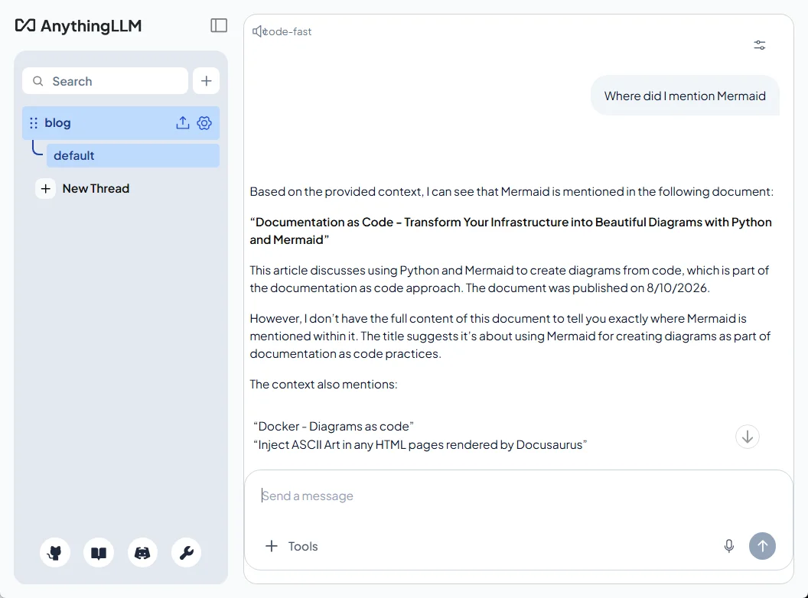
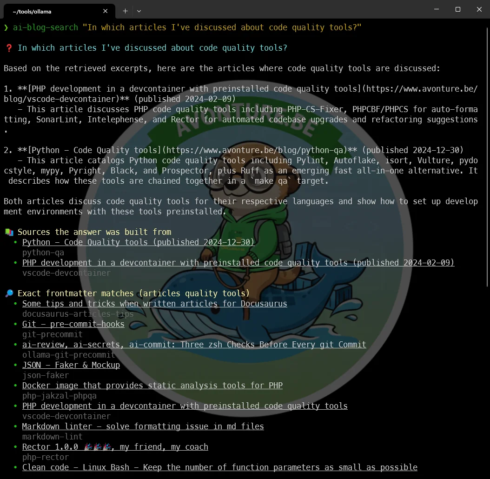

<!-- cspell:ignoreCase anythingllm lancedb nomic mxbai mintplexlabs qwen tailscale wireguard seccomp qmd minilm -->

<TLDR>
AnythingLLM is a self-hosted, Docker-friendly app that turns your own documents — Markdown, Quarto, PDF, DOCX, Excel, PowerPoint, whatever — into a searchable, chattable knowledge base, with answers that cite the exact file they came from. It doesn't run its own AI; it talks to an LLM provider of your choice, which means it can reuse an Ollama server you already have running elsewhere. This article sets it up twice: once fully on one machine (my home PC), and once split across two — documents on my work PC, GPU inference on the home PC — because some documents are simply not allowed to leave the machine they live on.
</TLDR>

Under `~/repositories` on my work laptop, I have dozens of project folders, and every one of them has quietly grown its own pile of documentation: a `README.md` here, a Quarto report there, a PDF spec somebody sent me, an Excel sheet nobody remembers the purpose of anymore, a PowerPoint from a meeting six months ago. Individually, each file is fine. Together, they're a graveyard — I *know* I wrote down the answer to "how did I configure that VPN last time" somewhere, in one of these folders, in one of these formats, but finding it means either remembering the exact filename or grepping and hoping the words match.

If you've ever opened a terminal, typed `grep -r "some term" ~/repositories`, gotten forty irrelevant hits, and given up — you already have the problem this article is about.

<!-- truncate -->

## Seeing It Work

Here is a real question against a real workspace — the 248 articles of this blog, indexed with the script further down. Asking is one API call, the same request the chat panel sends when you type into it:

<Terminal source="./files/terminal_chat_proof.txt" typewriter wrap={true} />

Read the question again and notice what it doesn't contain. Not `chpwd`. Not `for-each-ref`. Not `committerdate`. Not even the words in the title of the article it found — *Showing the last 3 updated branches when you jump in a git repo*. I described a vague memory in the words I'd actually use two years later, and got back the mechanism, the hook it's wired to, the flag that sorts the branches, and a link.

That is precisely the query `grep` cannot serve. `grep -r "chpwd"` would have found it instantly — if I had remembered the word `chpwd`. The whole point is that I hadn't.

## Why It Works

- [AnythingLLM](https://anythingllm.com/) is an open-source, self-hosted app built around Retrieval-Augmented Generation (RAG) over your own files, organized into **workspaces** — one per project, per client, or per topic, with nothing leaking between them.
- **It's a client, not an LLM.** AnythingLLM doesn't ship a model of its own — it calls out to an **LLM Provider** you configure: OpenAI, Anthropic, or, the interesting part for us, **Ollama**. If you already run Ollama somewhere, AnythingLLM is just another thing that talks to it.
- Every answer comes back with a reference to the source file and the chunk it was pulled from — a citation, not a guess you have to trust on faith.
- It reads what `grep` cannot open at all: the PDF spec, the Excel sheet, the PowerPoint deck. That is the other half of why it complements `rg` rather than replacing it. It also coexists with Open WebUI — Open WebUI is a general-purpose chat client for Ollama, AnythingLLM is specifically the document-RAG layer, and both are happy to talk to the same Ollama instance.

<AlertBox variant="tip" title="What you get for the setup effort">
A natural-language question over everything in a workspace, with the source file named in the answer. That single feature is worth the twenty minutes of Docker setup below — it turns "I know I wrote this down somewhere" into an actual answer.
</AlertBox>

Four things follow, and they are worth reading in any order you like:

- <Link to="#install">**Installing it**</Link> — one `compose.yaml`, plus the thirty-second check that saves you from an embedder that silently returns noise.
- <Link to="#ingest">**Getting documents in**</Link> — why there is no "index this folder" button, and the script that indexed 248 articles in 94 seconds.
- <Link to="#search">**Searching from the terminal**</Link> — one `curl`, then the same thing as a shell command with clickable results.
- <Link to="#two-machines">**Documents here, GPU there**</Link> — the two-machine split, for documents that are not allowed to travel.

## Part 1 — Installing AnythingLLM on One Machine {#install}

This is the simple case: AnythingLLM and Ollama live on the same machine, my home PC with 24GB of VRAM to spare.

<AlertBox variant="note" title="Prerequisites">
This assumes Ollama is already running as a Docker container, the way I set it up in <Link to="/blog/ollama-installation">Installing Ollama and get local AI</Link>. Nothing below re-explains that part.
</AlertBox>

### The compose.yaml file

Following my usual habit of one folder per tool under `~/tools`, let's create `~/tools/anythingllm/compose.yaml`:

<Vars port="3001" labels={{ port: "Host port" }} />

<Snippet filename="compose.yaml" source="./files/compose.yaml" defaultOpen={true} />

Before starting it, create the `.env` file it references, holding a random secret AnythingLLM uses to sign session tokens:

<Terminal title="user@home-pc: ~/tools/anythingllm">
$ echo "JWT_SECRET=$(openssl rand -hex 32)" > .env
</Terminal>

<AlertBox variant="caution" title="About cap_add: SYS_ADMIN">
AnythingLLM uses a headless Chromium under the hood for some document and web-scraping features, and Chromium wants this capability to run its sandbox inside a container. It's a broader grant of privilege than I'd like to hand out by default — the project has an open discussion about replacing it with a narrower seccomp profile instead, but as of now, `SYS_ADMIN` is what the official image expects. Worth knowing, not worth losing sleep over on a home LAN.
</AlertBox>

`OLLAMA_BASE_PATH` and `EMBEDDING_BASE_PATH` both point at `192.168.0.218` — the same home-server IP address I used in <Link to="/blog/accessing-ollama-across-your-local-network">Accessing Ollama across your local network</Link>. Replace it with your own server's IP. Notice that even though Ollama and AnythingLLM run on the very same machine here, I'm still using the LAN IP rather than `localhost` — that detail matters later, where it stops being a detail and becomes the whole point.

Pull the embedding model on the Ollama side before starting AnythingLLM — it's small (a few hundred MB) and required for anything to get embedded at all:

<Terminal title="user@home-pc: ~/tools/anythingllm" wrap={true}>
$ docker exec -it ollama ollama pull mxbai-embed-large
</Terminal>

<AlertBox variant="caution" title="Match the chunk size to the embedding model, or nothing will embed at all">
`EMBEDDING_MODEL_MAX_CHUNK_LENGTH` above is set to `400` for a reason. Run `docker exec ollama ollama show mxbai-embed-large` and you'll see **context length 512** — set the chunk size higher than that and *every* document fails to embed, with `Ollama Failed to embed: the input length exceeds the context length` buried in `docker logs anythingllm`. The UI gives you no hint: the upload succeeds, the document shows up in the library, and the workspace simply stays empty. `OLLAMA_EMBEDDING_BATCH_SIZE` is pure speed — the default of 1 sends one chunk per HTTP call, which turns a few hundred documents into a very long afternoon.
</AlertBox>

### Check that your embedder actually discriminates

I originally used `nomic-embed-text` here — it's the model everyone recommends for this job. It embedded all 248 articles without a single error, and then answered "there are no articles specifically covering WordPress" about a blog containing an article titled *Quickly install WordPress in just three commands*.

Nothing had failed. The embeddings were simply meaningless, and a RAG stack has no way to tell you that: it retrieves the closest vectors it can find and hands them to the model, whatever they are. So before trusting an embedder, spend thirty seconds proving it separates related text from unrelated text:

<Snippet filename="embedder-sanity-check.py" source="./files/embedder-sanity-check.py" />

<Terminal source="./files/embedder_check.txt" wrap={true} />

Two sentences that mean the same thing should score far above an unrelated one. `mxbai-embed-large` separates them by **+0.49**; on my machine `nomic-embed-text` managed **+0.05**, which is noise. I never traced the root cause — both the `:latest` and `:v1.5` tags behaved identically, and Ollama's `OLLAMA_FLASH_ATTENTION` / `OLLAMA_KV_CACHE_TYPE` tuning made no difference — but the fix doesn't depend on the cause. Run the check, and if the separation is small, change the model rather than your questions.

Then bring AnythingLLM up:

<Terminal title="user@home-pc: ~/tools/anythingllm">
$ docker compose up --detach

[+] Running 1/1
 ✔ Container anythingllm  Started
</Terminal>

### First-run setup

Browse to `http://localhost:`<Var name="port">3001</Var> (or <Code>http://192.168.0.218:<Var name="port">3001</Var></Code> from another machine on the network). The onboarding wizard asks for:

<StepsCard
  variant="steps"
  title="AnythingLLM onboarding"
  steps={[
    { content: "**LLM Provider** — select Ollama, paste your server's URL (`http://192.168.0.218:11434`), pick the model you already pulled (`qwen2.5:14b-instruct` fits comfortably in 24GB of VRAM alongside the embedding model)" },
    { content: "**Embedding Provider** — select Ollama again, same URL, pick `mxbai-embed-large`" },
    { content: "**Vector Database** — leave the default, LanceDB; it's embedded, no extra container to run" },
    { content: "**Create your first workspace** — name it after a real project, not \"test\"" }
  ]}
/>

<BrowserWindow url="http://localhost:%%port=3001%%/workspace/blog">
    
</BrowserWindow>

## Getting Your Documents In {#ingest}

Inside the workspace, the upload dialog accepts exactly the mix I described earlier: drop in a `README.md`, a Quarto `.qmd` report, a PDF, a DOCX, an Excel sheet, a PowerPoint deck — multi-select as many as the OS file picker lets you grab at once. AnythingLLM parses each format on its own; you don't need to convert anything first.

Once the documents show a green "embedded" status, ask a real question in the chat panel — something you'd normally have gone digging for, the same way the terminal proof above got its answer. The answer comes back with the source document named next to it, so you can go double-check it instead of taking the model's word for it.

### You don't give it a path — and that surprises everyone

This is the part I got wrong the first time, so let's make it explicit: **there is no field anywhere in AnythingLLM where you type `/home/me/repositories` and let it index that folder.** Two things stack up to make that impossible:

- The server runs in a container, and the `compose.yaml` above mounts exactly one volume — `anythingllm_storage`. Your documents folder simply doesn't exist inside that container.
- Adding a bind mount wouldn't help either, because that *Upload* dialog is your **browser's** file picker, running on your machine. It can't see inside the container, and the container never learns where the file came from — the bytes arrive over HTTP like any other form upload.

So AnythingLLM never reads your files in place. It **copies** each one into its storage volume, parses it to JSON, splits it into chunks and embeds them. That's the same fact Part 2 below hangs its entire argument on, and it's worth internalizing early: *documents live where the container runs*.

Which leaves a real question — how do you get a few hundred files in there without clicking through a file picker a few hundred times?

### Indexing a whole folder tree with one command

The GUI is one of three doors, and the other two are better suited to bulk:

- **The Developer API** — a REST endpoint that takes one file per call. Wrap it in a loop and you can feed it anything you can `find`. This is the one we'll use.
- **Data connectors** (*Settings → Data Connectors*) — ready-made importers for GitHub, GitLab, Confluence, Obsidian and a website depth-crawler. If your documents already live in a repository, pointing the GitHub connector at it is zero scripting. Do give it an access token though: unauthenticated, it's throttled by GitHub's public rate limit and often only picks up top-level files.
- **The website crawler**, if the content is published somewhere. Simplest of all, but you index rendered HTML — navigation, footer and sidebar included — instead of the source.

I went with the API, because what I actually want indexed is this blog: 248 articles, each one an `index.md` in its own dated folder. Generate a key under *Settings → Tools → Developer API*, and a single call looks like this:

<Terminal wrap={true} source="./files/terminal-upload.txt" />

The `addToWorkspaces` field is what makes this a one-step operation: without it the document lands in AnythingLLM's document library but isn't embedded into anything, and you'd still have to go tick boxes in the UI.

<AlertBox variant="caution" title="The trap: 241 files named index.md">
Docusaurus puts every article in its own folder as `index.md`, and AnythingLLM cites its sources **by filename**. Upload them as-is and every single answer ends with `Source: index.md` — 241 of them, indistinguishable. Citation is the whole reason to use this tool, so it has to be fixed at upload time: `curl` lets you override the transmitted name with `-F "file=@path/index.md;filename=the-slug.md"`, and the slug is sitting right there in the frontmatter.
</AlertBox>

That, plus skipping files that haven't changed since last time, is all the script does:

<Snippet filename="anythingllm-index.sh" source="./files/anythingllm-index.sh" />

Create a workspace named `blog` in the UI first, then run it from the root of the blog repository:

<Terminal source="./files/index_run.txt" wrap={true} />

### One manual step: the workspace system prompt

The script handles everything the upload API allows, but one thing it cannot reach is how the model reads what it receives. Paste this into *Workspace Settings → Chat Settings → Prompt* — it is what makes dates come out right, and what stops the model reconstructing URLs it half-remembers:

<Snippet filename="Workspace system prompt" source="./files/workspace-prompt.txt" defaultOpen={true} />

<AlertBox variant="tip" title="Ask in French, get 02/03/2024">
With that prompt in place, *"Quand ai-je publié l'article sur Tabnine ?"* answers **02/03/2024** — right value, right format, right language. Without it, the same question returns `8/10/2026, 9:56:01 AM`: the day I ran the indexer, in a US format nobody asked for. Skipping this step is the one way to end up with a workspace that looks fine and lies about every date; <Link to="#where-that-wrong-date-comes-from">the last section</Link> explains where that second date comes from.
</AlertBox>

### Keeping the index up to date

One habit to unlearn before you build anything on top of this: **AnythingLLM never re-scans anything on its own.** An embedded document is a frozen copy; editing the original Markdown on disk changes nothing in the workspace, and a brand-new file is simply invisible to it.

There *is* an automatic sync feature, but it doesn't cover this case: in the Docker deployment it only watches website links and documents pulled in by a data connector. Manually uploaded files — everything the API route produces — are explicitly out of scope. (The desktop app does watch local files, every 10 minutes, but only while the app is open.)

Hence the state file the script keeps. Re-running it is the sync:

<StepsCard
  variant="steps"
  title="Keeping the workspace current"
  steps={[
    { content: "**A new article** — its path isn't in `.anythingllm-indexed`, so it gets uploaded and embedded" },
    { content: "**A modified article** — its checksum no longer matches, so the old copy is removed first, then the new one uploaded; without that removal the workspace would answer from two versions of the same text" },
    { content: "**Everything else** — checksum unchanged, skipped without an HTTP call of its own" }
  ]}
/>

The numbers make the case better than I can: indexing all 248 articles from scratch took **1 minute 34**, and the second run — where nothing had changed — took **0.26 seconds** and made exactly one HTTP call, the workspace lookup. That's cheap enough to hang off every publish: a line in your deploy script, a `post-commit` hook, or a nightly cron entry.

<AlertBox variant="important" title="One workspace per project">
For my `~/repositories` documentation, I still keep one workspace per project rather than dumping everything into one — it keeps the vector space focused, so a question about project A doesn't get diluted by irrelevant chunks from project B. The script takes the target workspace as `ANYTHINGLLM_WORKSPACE`, so the same loop covers both layouts.
</AlertBox>

## Searching From the Terminal {#search}

With 248 articles embedded, the payoff is a single `curl` away. Export the key once — I keep mine in `~/.zshrc`, but a plain `export` in the shell works just as well — and query the workspace:

<Terminal source="./files/query_devcontainer.txt" wrap={true} />

Three things make that answer useful rather than merely impressive:

- **`"mode": "query"`** restricts the model to what it actually retrieved. The other value, `"chat"`, lets it fall back on its own general knowledge when the workspace has nothing relevant — which is precisely how you get a confident answer about an article you never wrote. For searching your own corpus, `query` is the honest setting.
- **The URLs are real**, not reconstructed. That's the `chunkSource` field in the script: AnythingLLM copies metadata prefixed with `link://` into every chunk's header, so the live URL travels with the text into the model's context. Without it you get filenames, and a model left to guess at URLs will happily invent them.
- **`jq -r '.textResponse'`** is all you need for reading; drop it to see the full payload, where `sources[]` gives you each retrieved chunk with its `title`, `docSource` (the path in the repo) and a similarity `score`.

### `ai-blog-search`: the portable script

Typing that `curl` every time gets old fast, so it lives in a script — same key/URL resolution as the indexer, plus source formatting:

<Snippet filename="anythingllm-search.sh" source="./files/anythingllm-search.sh" />

Point your shell at it, exporting the key once:

```zsh title="~/.zshrc"
export ANYTHINGLLM_API_KEY="your-key-here"
ai-blog-search() { (cd ~/repositories/blog && .scripts/anythingllm-search.sh "$@"); }
```

<Terminal source="./files/search_run.txt" wrap={true} />

Two design decisions in there earned their place the hard way.

**A random `sessionId` on every call.** Without one, each query lands in the workspace's default thread and the model reads its own previous answers as context. I spent a genuinely embarrassing amount of time on a workspace that kept insisting it had no WordPress article — long after retrieval had been fixed and was returning the right chunks. It was quoting *itself*, from the failed attempt before. A search command has no business carrying conversation history.

**Two result lists instead of one.** Look at the run above: the semantic half names three Joomla articles, the `grep` half finds nine. That gap isn't a bug to tune away — vector search stops at the workspace's `topN` and ranks by similarity, so a couple of long articles fill the slots with their own chunks. Raising `topN` from 20 to 60 added exactly one result. So the script also runs a plain `grep` over `title`/`slug`/`description`/tags. Semantic search finds what you couldn't phrase; `grep` guarantees you didn't miss anything. Printing both is the honest answer.

Turning a sentence into `grep` terms needs one trick worth stealing: after dropping the obvious function words, the script also drops any surviving word that matches **more than 10% of the blog**. "Docker" would bury everything under half the corpus; "joomla" matches nine posts and is precisely what you asked about. Rarity does the work no stopword list can, and it doesn't care which language you asked in.

<AlertBox variant="caution" title="RAG is not a search index">
This is the mental adjustment that matters most. "Which articles mention X" is a question for `grep` or the site search — exact, complete, instant. RAG earns its keep on the other kind of question: the `chpwd` one at the top of this article, where you remember the *idea* but not a single word you actually used, or where the answer is buried in a PDF that `grep` can't read at all. Expecting exhaustive enumeration from a similarity ranking is expecting the wrong thing from the right tool.
</AlertBox>

### The same thing as a zsh function

The script above is the portable version — it runs in a devcontainer, in CI, in a `post-commit` hook, anywhere with `bash` and `jq`. For daily use I'd rather type a word, so it also exists as a member of the <Link to="/blog/ollama-git-precommit">`ai-*` family</Link>: drop it in `~/.zsh/fns/`, and it registers itself with the `ai` dispatcher exactly like `ai-review` and `ai-commit` do.

<Snippet filename="~/.zsh/fns/ai-blog-search.zsh" source="./files/ai-blog-search.zsh" />

Here is an example of use:



It's the odd one out in that series, and worth saying why: every other `ai-*` function calls `_ollama_query`, while this one talks to AnythingLLM — which owns the vector index and calls Ollama itself, for the embeddings and for the answer. So it brings its own `_anythingllm_check` guard rather than reusing `_ollama_check`, and declares `AI_PARAMS[blog-search]="text"` so the `ai` menu prompts for the question before running it.

<AlertBox variant="tip" title="The zsh detail that costs you an afternoon">
`?` and `*` are glob characters, and a natural question ends in one. Without the `alias ai-blog-search='noglob ai-blog-search'` at the bottom of that file, `ai-blog-search which posts cover Joomla?` dies with `zsh: no matches found` before the function is ever entered. The alias has to come *after* the function definition, too — zsh refuses to define a function whose name is already an alias.
</AlertBox>

Two implementations of one idea is a real cost, so be deliberate about it: the bash script is the repo's tool and the single source of truth for the logic; the zsh function is the daily driver, and stays self-contained because the whole promise of that series is "drop the file in and it works". If you only ever query from inside the blog repository, take the bash one and skip this section entirely.

At this point, everything — the documents themselves, their embeddings, the LanceDB files — lives inside the `anythingllm_storage` volume, on the home PC. Fine for this machine. Not fine for what comes next.

## Part 2 — Documents on One Machine, GPU on Another {#two-machines}

Here's the constraint that changes everything: my actual documentation — the stuff under `~/repositories` — lives on my **work** PC, and it's staying there. Not synced, not copied, not uploaded anywhere for convenience.

That rules out the simplest option, which would be "just open <Code>http://192.168.0.218:<Var name="port">3001</Var></Code> from my work PC's browser and upload files there." It would technically work — but uploading a file to that page sends its content over the network to the home PC's container, where AnythingLLM stores the parsed text, the vector embeddings, and a cached copy, inside `anythingllm_storage`, on a disk that isn't mine at the office. That's exactly the kind of copy I ruled out. The browser is just the window; the documents themselves land wherever the **server** behind that page is actually running.

So the fix follows directly from that: run the AnythingLLM **server** itself on the work PC — same Docker container, same `compose.yaml` — and only reach out to the home PC for the one thing that doesn't touch document content: the model doing the actual thinking.

```text
Work PC (Docker)                          Home PC
┌─────────────────────────┐               ┌──────────────────────┐
│ anythingllm container   │  inference    │ ollama container     │
│  - documents            │ ────────────► │  - qwen2.5:14b       │
│  - vectors (LanceDB)    │ ◄──────────── │  - mxbai-embed-large │
│  - STORAGE_DIR          │   tokens back │  - 24GB VRAM         │
└─────────────────────────┘               └──────────────────────┘
```

Only prompts and the retrieved text chunks needed to answer them cross the network for that single request — nothing gets stored on the other end.

### What actually changes in the compose file

Nothing structural — it's the exact same `compose.yaml` from Part 1, running through Docker Desktop on the work PC instead. The only thing that changes is which address `OLLAMA_BASE_PATH` and `EMBEDDING_BASE_PATH` point to, and that address depends on where the work PC physically is:

```yaml title="compose.yaml — the two lines that change"
      - OLLAMA_BASE_PATH=http://192.168.0.218:11434      # same LAN, e.g. working from home
      - EMBEDDING_BASE_PATH=http://192.168.0.218:11434
```

When the work PC is sitting on the same home network, that's it — `192.168.0.218` is reachable exactly as it was in <Link to="/blog/accessing-ollama-across-your-local-network">the earlier article</Link>, and the rest of this setup is a copy-paste of Part 1.

### And when it isn't home

Five days a week, that work PC isn't on the home LAN at all. A plain IP address on a private `192.168.x.x` range simply isn't reachable from the office — that's the whole point of a private network.

<AlertBox variant="tip" title="The practical fix: a mesh VPN">
Tools like Tailscale or WireGuard give every device — home PC included — a stable address that stays reachable no matter which network it's actually sitting on, without opening ports on your home router to the internet. Install it on the home PC, install it on the work PC, and the same `OLLAMA_BASE_PATH` pattern above keeps working — just with the VPN-assigned address instead of `192.168.0.218`. That setup deserves its own article rather than a rushed paragraph here, so consider this a preview of one.
</AlertBox>

<AlertBox variant="caution" title="Ollama has no authentication of its own">
Exposing `192.168.0.218:11434` inside a private LAN is one thing; making it reachable from anywhere via a VPN is another step up in exposure. Ollama's API doesn't ask for a password — anyone who can reach that port can query your models. A mesh VPN like Tailscale keeps that surface limited to devices you've explicitly authorized, which is precisely why it's the recommended answer here rather than a router port-forward.
</AlertBox>

### Recreate the workspaces, this time for real

With the container now running on the work PC, redo the onboarding from Part 1 — same LLM provider, same embedding model, pointing at whichever address currently reaches the home PC. Then start creating one workspace per repository under `~/repositories`, feeding each one its own documentation.

This time, the documents never leave the machine you're sitting at. The only thing making the round trip to the home PC is a question and the handful of text chunks needed to answer it — exactly the split I wanted going in.

## Under the Hood (skip this if you just want to use it)

Everything above is enough to run this. What follows is the one piece of AnythingLLM's internals worth knowing, because it explains why the indexing script does something that otherwise looks arbitrary.

### Where that wrong date comes from {#where-that-wrong-date-comes-from}

Three fields, and only three, ever reach the model. Whatever the API accepted at upload time, AnythingLLM builds this header and prepends it to **every** chunk:

<Terminal wrap={true}>
&lt;document_metadata&gt;
sourceDocument: Tabnine - AI Autocomplete & Chat for Javascript, Python, ... (published 2024-03-02)
published: 8/10/2026, 9:56:01 AM
source: https://www.avonture.be/blog/vscode-tabnine
&lt;/document_metadata&gt;
</Terminal>

`published` comes from the collector: `published: createdDate(fullFilePath)`, stat'ed off the temporary file it has just received. Not your frontmatter `date` — the day you ran the indexer. And `metadata.published` is silently ignored on upload, so there is no way to correct it.

That leaves exactly two levers, which is why the script pulls both: the title carries the real date appended as `(published YYYY-MM-DD)`, and `chunkSource` carries the live URL because a `link://` prefix is the one thing that turns into the `source:` line. Everything else you pass at upload — `docSource`, `description`, `docAuthor` — is stored, retrievable through the API, and never shown to the model.

Which is also why the system prompt isn't optional decoration. Two contradictory dates sit in that header on every single chunk, and nothing in the data says which one to believe.

## Key Takeaways

The one thing to carry away in prose: **documents live where the container runs, not where the browser is.** Everything else on this page follows from that — where to deploy it, why there is no "index this folder" box, and why the bulk route is the API rather than the GUI.

The rest is lookup material, and these are the values that cost me an afternoon each:

<StepsCard
  variant="remember"
  title="Settings that silently break things when wrong"
  steps={[
    { content: "`EMBEDDING_MODEL_MAX_CHUNK_LENGTH=400` — must stay under the embedder's context (`ollama show <model>`; 512 for `mxbai-embed-large`). Above it, **every** embedding fails and the workspace stays empty with no error in the UI" },
    { content: "`OLLAMA_EMBEDDING_BATCH_SIZE=16` — pure speed; the default of 1 sends one chunk per HTTP call" },
    { content: "`topN` = 20, in *Workspace Settings → Vector Database* — the default of 4 answers corpus-wide questions from a single article. Past ~20 it buys almost nothing" },
    { content: "**Workspace system prompt** — not optional: it is what settles the two contradictory dates sitting in every chunk header, and what fixes date formatting once" },
    { content: "`\"mode\": \"query\"` in every API call — `\"chat\"` lets the model answer from general knowledge and invent articles you never wrote" },
    { content: "**A fresh `sessionId` per call** — without one the model reads its own previous answers, and one wrong answer repeats forever" },
    { content: "`ANYTHINGLLM_API_KEY` (*Settings → Tools → Developer API*), plus `AI_BLOG_DIR` and `AI_BLOG_SITE_URL` for the zsh function" }
  ]}
/>

## Conclusion

What started as "I can never find that one config I wrote down somewhere" turned into a genuinely small amount of Docker work: one `compose.yaml`, pointed at a model I was already running for something else. The part worth remembering isn't the YAML — it's the realization that a web UI's "upload" button is a request to wherever its server happens to live, which is exactly the detail that decides whether your documents stay put or quietly migrate to a machine you didn't intend. Once that clicked, the two-machine setup wasn't a compromise; it was just the obvious shape once GPU and documents don't live in the same place. Now, every time I catch myself about to `grep -r` and hope, I ask the workspace instead.

The uncomfortable lesson is the other one, though: a RAG stack cannot tell you it is broken. Mine indexed 248 articles without a single error and then denied having anything on WordPress. If you take one habit from this article, take the thirty-second cosine check before you trust an embedder — and if you want more of your terminal answering questions locally, the <Link to="/blog/ollama-git-precommit">`ai-review`, `ai-secrets` and `ai-commit` family</Link> is where this one came from. The mesh VPN that makes the two-machine setup work from the office is the article I owe you next.
