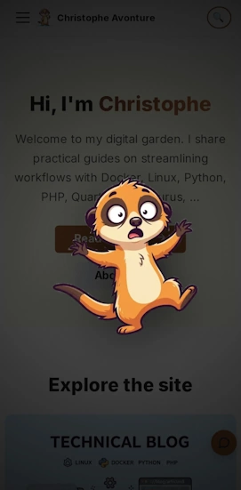

<!-- cspell:ignore devicemotion accelerationIncludingGravity avonture RGBA meerkat's -->


<TLDR>
This blog already hides [eight small easter eggs](/blog/docusaurus-easter-eggs), but every one of them assumes a keyboard or an open DevTools panel — no use to a reader on a phone. This adds a ninth: shake the phone and the mascot appears full-screen, startled, for about two seconds. Covers the shake-detection math (a "jerk" threshold computed between consecutive `devicemotion` samples), the three-phase overlay animation (pop in, tremble, fade out), how to trigger and test it from a desktop DevTools console with no accelerometer involved, and a real bug caught along the way: an AI image generator that drew the checkerboard pattern used to *represent* transparency as literal opaque pixels, caught by reading the raw PNG bytes rather than trusting a preview. **Android only**, deliberately and permanently — iOS Safari's motion-permission prompt needs a tap, and every way to provide one conflicts with this site's "invisible until you stumble onto it" rule for easter eggs.
</TLDR>

Every easter egg on this blog so far assumes a keyboard: <kbd>CTRL</kbd>+<kbd>U</kbd> to view source, a ten-key Konami sequence, a `console.log` that only shows up with DevTools open. All reasonable on a laptop — and invisible to anyone reading on a phone, which on a technical blog is still a meaningful share of the traffic. A phone has no arrow keys, but it has something a laptop doesn't: an accelerometer, sitting one `window.addEventListener("devicemotion", …)` away, on any page served over HTTPS.

So: shake the phone, and the mascot reacts.

<!-- truncate -->

## Shake Your Phone, See What Happens

Visit this blog on Android — in Chrome, or in the installed PWA — and give the phone a real shake. This is what shows up, full screen, for about two seconds:

<BrowserWindow url="https://www.avonture.be/">
  
</BrowserWindow>

No page reload, nothing to opt into first — the phone's own motion sensor did all the work. Here's how little code that actually takes.

<AlertBox variant="tip" title="Nothing happening when you shake?">
Check that this site is allowed to read **Motion sensors** — tap the icon left of the address bar → Permissions. Chrome for Android can silently block this per site; see [How to Debug If the Shake Does Nothing](#how-to-debug-if-the-shake-does-nothing) below.
</AlertBox>

## Why It Works

- **Shake detection needs one number, not three.** A `devicemotion` event reports acceleration on three axes (x, y, z); comparing each to a threshold barely works, because ordinary handling already wobbles all three constantly. What actually marks a deliberate shake is *how fast* those three numbers change between two consecutive readings — summed across axes and normalized by the time between samples, that collapses to a single "jerk" value with one clean threshold to tune.
- **Android has no `requestPermission()` prompt; iOS does.** Ships Android-only as a result — deliberately, not temporarily; see [why](#why-ios-is-left-out-on-purpose) below. Android's own permission story turned out to have a wrinkle anyway, covered in [How to Debug If the Shake Does Nothing](#how-to-debug-if-the-shake-does-nothing).
- **A cooldown, not a boolean flag, stops the retrigger.** The overlay stays on screen for over two seconds; without a minimum gap between triggers, the tail end of the same shake gesture would relaunch it immediately. Comparing timestamps is simpler than a lock, and it can't get stuck "on" if a cleanup step is ever skipped.
- **It's one component, mounted once, globally** — [the same pattern already used for the Konami code and the tab-away favicon swap](/blog/docusaurus-easter-eggs): no new route, no per-page wiring, one more line in `Root.js`.
- **The haptic buzz is a bonus, not a requirement.** A short `navigator.vibrate()` call adds a physical "yelp" alongside the visual one — and on browsers that silently ignore it outside a user gesture (which a sensor event isn't), the easter egg still works fine, just without the buzz.

## Why iOS Is Left Out, on Purpose

iOS Safari 13+ requires an explicit `DeviceMotionEvent.requestPermission()` call, tied to a real tap, before it will hand over a single `devicemotion` reading — and that call cannot be made proactively on page load. Something has to trigger it, which leaves exactly two options, and both were rejected.

The first is a visible control: a small "Enable shake effects" button or banner, shown once on iOS. It would work — but it would also be the first UI element on this entire blog that exists purely to ask for something before a reader has done anything to earn it. Every other easter egg here follows one rule, stated plainly in the article that introduced the first eight of them:

<AlertBox variant="note" title="The rule this blog holds every easter egg to">
Every easter egg lives in the console, the source, the response headers, or a state the visitor triggers on purpose. None of them ever appear in the normal reading flow. **If you're not looking for it, you'll never see it.**
</AlertBox>

A button asking for motion-sensor access breaks that on sight, for every iOS visitor, whether or not they'd ever care about a shaking meerkat — a cost paid up front by 100% of them, for a payoff only the curious minority would ever trigger. That's a bad trade before it's even a design one.

The second option is worse in a different way: skip the visible button and fire `requestPermission()` on the visitor's very first tap anywhere on the page — a nav link, a search icon, anything. Technically invisible in *this* site's own UI, since nothing rendered by this component would show up — but iOS still pops its own native "Allow Motion & Orientation Access?" system dialog the first time the call is made for an origin. A reader who tapped a menu item gets interrupted by a permission request with zero context for why a blog is suddenly asking about motion sensors. That's not surprise in the fun sense this site aims for; it's a non sequitur that degrades the very first interaction of an unrelated visit.

Both paths spend something that belongs to every visitor — attention, trust, or a clean first tap — to fund a feature only some of them would ever want. An easter egg earns the right to exist by costing nothing to everyone who doesn't go looking for it; a permission prompt of any shape fails that test before the meerkat ever gets a chance to be startling. Android needed nothing to be asked, so Android is where this ships. iOS stays out, not because the code is hard, but because every way to make it possible there charges rent to a reader who came here to read, not to grant permissions.

## Installation

The whole thing is two files plus one import. Given a transparent-background image of the mascot looking startled — more on how that image was actually produced, and the mistake that nearly shipped, in [Under the Hood](#under-the-hood-skip-this-if-you-just-want-to-use-it) below — the detection and the overlay live entirely in `index.tsx`:

<Snippet filename="src/components/ShakeEasterEgg/index.tsx" source="src/components/ShakeEasterEgg/index.tsx" />

And the full-screen overlay, its pop-in/tremble/fade animation, and the `prefers-reduced-motion` fallback live in the CSS module:

<Snippet filename="src/components/ShakeEasterEgg/styles.module.css" source="src/components/ShakeEasterEgg/styles.module.css" defaultOpen={false} />

Mounted once, globally, from `src/theme/Root.js` — right next to the Konami code component it borrows its shape from:

```jsx title="src/theme/Root.js (excerpt)"
import ShakeEasterEgg from "@site/src/components/ShakeEasterEgg";

// ...

return (
  <>
    {children}
    <KonamiEasterEgg />
    <ShakeEasterEgg />
  </>
);
```

That's it — no new route, no config flag, no build step.

## Testing It Without Shaking Anything

Standing up from a desk to physically shake a phone, twenty times in a row, to check a CSS timing tweak, gets old fast. `devicemotion` is just an event — nothing stops sending one synthetically from a browser console, on desktop, with no sensor anywhere in the loop:

<Snippet filename="Paste in DevTools console" source="./files/test-shake-in-console.js" defaultOpen={false} />

Two calls, 150 ms apart, with a large enough jump between the two acceleration readings to cross the jerk threshold — that's the entire "physical" gesture, reduced to two numbers. This is also, honestly, how the screenshot above was produced: a headless browser, a mobile viewport, and this exact snippet dispatched through the page — not a real phone.

## How to Debug If the Shake Does Nothing

Two checks, in order — both take under a minute and neither requires touching the code.

### 1. Allow Motion sensors for the site

Chrome for Android has its own per-site **Motion sensors** permission, separate from anything this component controls. Tap the icon left of the address bar (padlock, "i", or a warning triangle if the certificate is self-signed) → **Permissions** → make sure **Motion sensors** is set to *Allow*, not *Block*. If it's not listed there, check **Chrome ⋮ → Settings → Site settings → Motion sensors** for a global block instead. Reload the page after changing it — this alone was the fix the one real device this was tested on needed.

### 2. Watch the raw sensor data

When step 1 doesn't explain it, a small standalone diagnostic page settles the rest — no build step, no remote DevTools setup, just live numbers on the phone's own screen:

<Snippet filename="static/shake-debug.html" source="static/shake-debug.html" defaultOpen={false} />

Visit `/shake-debug.html` on the same origin as the rest of the site and it reports, live: whether `DeviceMotionEvent` exists at all, `navigator.permissions.query({ name: "accelerometer" })`'s state (`"granted"` / `"denied"` / `"prompt"`), a running count of events received, the live `x`/`y`/`z` readings, and the computed jerk value against the current threshold. Three distinct failure signatures to read off it:

- **No events at all, count stuck at 0** — the browser or OS is blocking the sensor entirely, or `DeviceMotionEvent` isn't supported (iOS without the permission flow, see the limitation above).
- **Events arrive, but `x`/`y`/`z` stay `null`** — this is the Motion sensors permission from step 1, confirmed: the browser fires the event out of habit but withholds the data.
- **Real numbers, but the max jerk never crosses the threshold** — not a bug, just a threshold calibrated for a different hand; see the tuning note below.

This is also, worth admitting plainly, how the bug in step 1 was actually found in the first place: the shake did nothing on a real phone, this page showed events climbing with `x`/`y`/`z` stuck at `null`, and the permission query spelled out exactly why in one word — `"denied"`.

## Under the Hood (skip this if you just want to use it)

### The image was the hard part, not the code

The component itself came together in one pass. Getting a **real** transparent-background image of the startled meerkat needed more care than the code — worth knowing if you're generating art with an AI image tool for anything that has to composite over other content.

The site's mascot art is [generated with Google Gemini](/blog/gemini-meerkat), feeding an existing reference image so new poses stay visually consistent. For a full-screen overlay, "transparent background" isn't a style preference, it's a hard requirement: the file needs a real alpha channel, not just something that *looks* transparent in a preview. The prompt asked for a PNG export specifically, with an explicit line telling the model not to render the gray-and-white checkerboard pattern editors use to *represent* transparency as if it were part of the picture — that pattern is a UI convention, not pixels to draw.

Two format facts make the result easy to verify, rather than trust a preview:

- JPEG cannot store transparency at all, structurally — a PNG (or WebP) export is non-negotiable from the start.
- A PNG's `IHDR` chunk carries one byte for exactly this: `6` means RGBA with a real alpha channel, `2` means plain RGB with none. Reading that byte — or just sampling a corner pixel and checking whether its alpha is actually `0` — settles the question without opening an editor.

The final file passed both checks: alpha `6` in the `IHDR` chunk, corners at alpha `0`, character fully opaque — verified pixel by pixel rather than by eye.

### Tuning the jerk threshold on a real phone

The first value shipped for `SHAKE_JERK_THRESHOLD` (`28`) was picked by feel, with a note admitting it hadn't been measured on a physical device. It didn't survive first contact with one: on a real Android phone, a quick *tilt* — no shaking involved — was already enough to cross it. A first correction raised it to `60`, which stopped the tilt-triggering — but a full day of carrying the phone normally still set it off repeatedly, which `60` alone hadn't revealed in a five-minute test. `100` is where it landed after that. There's no formula that gets this right from a desk, and apparently not from five minutes on a real phone either; a "jerk" threshold needs to survive actual carrying and handling over real time, not just a deliberate test shake, before it's trusted.

## Conclusion

A ninth easter egg, and the first one this blog built for a phone rather than a keyboard: shake detection reduced to one "jerk" number, a full-screen overlay that respects `prefers-reduced-motion` and a tap to dismiss, and a way to test all of it without leaving a desk. The real lesson wasn't in the shake-detection code — it was in not trusting an image preview: a file can *look* transparent and still be fully opaque, and the only way to know for sure is to check the bytes.

iOS staying out for good, [not for lack of trying but by design](#why-ios-is-left-out-on-purpose), is itself the reminder worth keeping: an easter egg only has to delight the people who go looking for it, never cost anything to the ones who don't — a bar a real feature doesn't get to duck under, but a hidden reward does. If you're running your own Docusaurus blog with a mascot of its own, the [Konami code and tab-away favicon swap](/blog/docusaurus-easter-eggs) are the desktop-side siblings of this one — same "mount once in `Root.js`" shape, no sensor, no permission trade-off to make.

<StepsCard
  variant="remember"
  title="What to tune"
  steps={[
    "**`SHAKE_JERK_THRESHOLD`** (default `100`, up from `28` then `60` after real-world use kept firing too easily) — raise it further if the egg still fires too easily, lower it if a deliberate shake does nothing",
    "**`COOLDOWN_MS`** (default `4000`) — minimum time between two triggers",
    "**`VISIBLE_DURATION_MS`** (default `2200`) / **`EXIT_DURATION_MS`** (default `250`) — how long the overlay stays up and how fast it fades; keep the CSS `overlay-out` duration in sync with the latter",
    "All four live at the top of `src/components/ShakeEasterEgg/index.tsx`",
  ]}
/>
