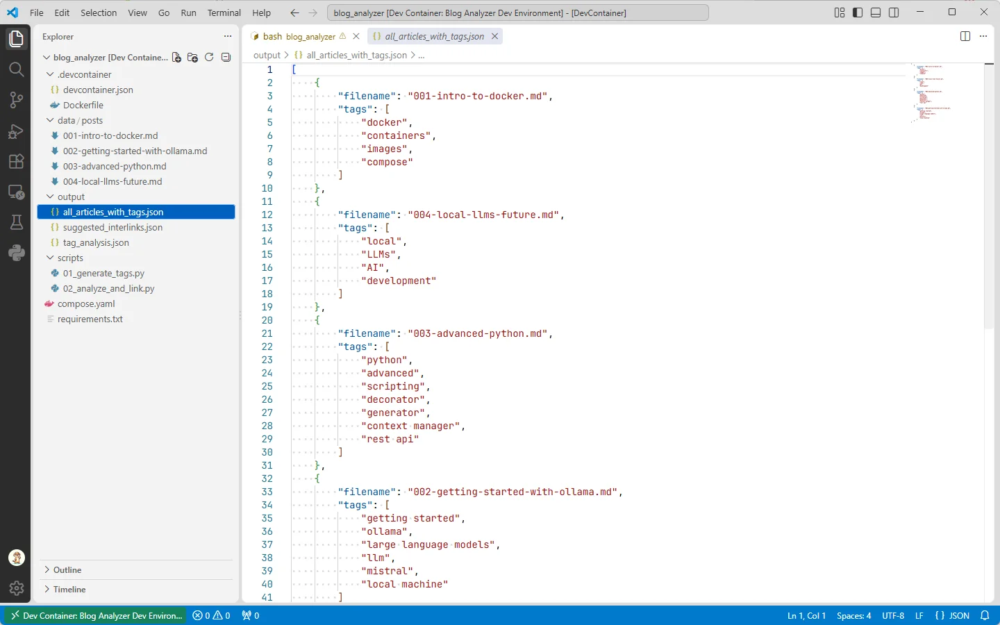
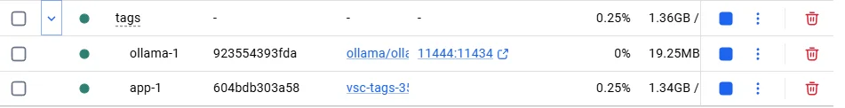
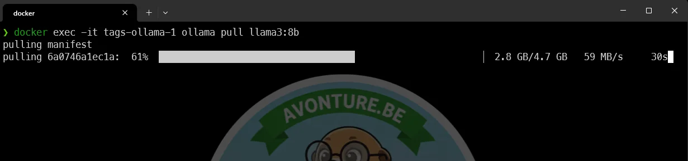
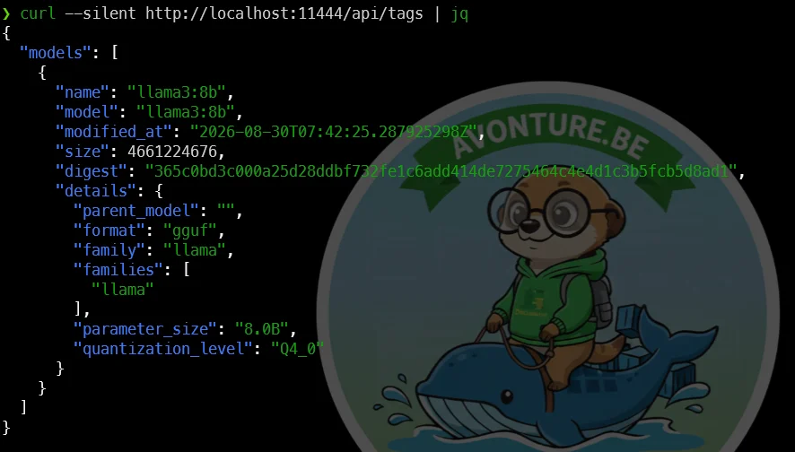
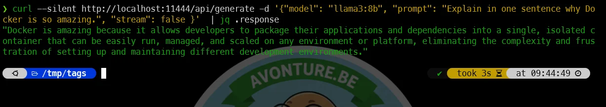
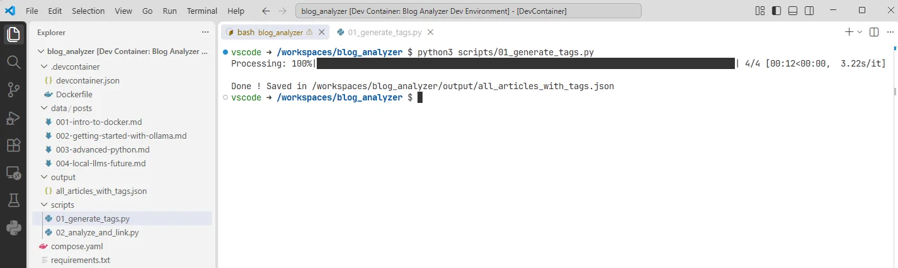
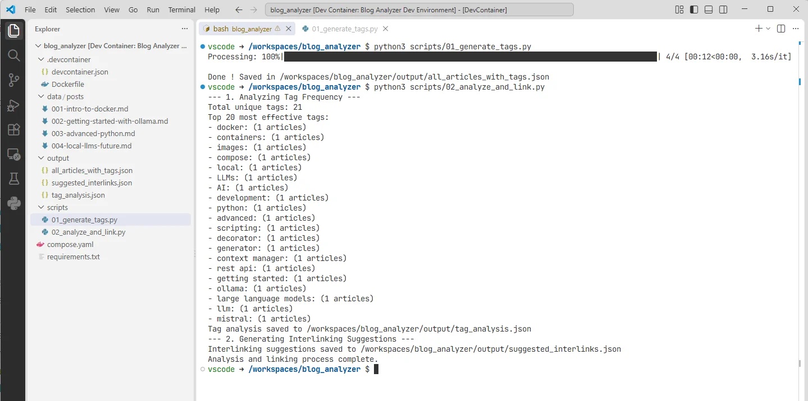

<TLDR>
A devcontainer running Ollama alongside two Python scripts: `01_generate_tags.py` reads every Markdown post in `data/posts`, sends its content to a local model, and saves the generated tags to a JSON file. `02_analyze_and_link.py` then compares tags across posts to suggest which articles should be interlinked, and how often each tag occurs across the corpus. Everything runs locally — no cloud API, no manual tagging.
</TLDR>

Tagging blog posts by hand does not scale — and neither does spotting, across a few hundred posts, which ones actually belong together. I wanted to see whether a local model, given nothing but the raw Markdown, could generate reasonable tags and then use those tags to suggest interlinks on its own.

<!-- truncate -->

<QuickJump
  links={[
    { label: "See it in Action", to: "#the-result" },
    { label: "Installation", to: "#installation" },
  ]}
/>

## The Result

Once both scripts have run, `output/all_articles_with_tags.json` holds the generated tags for every post:



The second script then compares those tags across posts. `suggested_interlinks.json` is the first output worth looking at:

<Snippet source="./files/output/suggested_interlinks.json" defaultOpen={true} />

Articles 002 and 004 are correctly identified as related — they both talk about local LLMs. Articles 001 and 003 are left alone, since they cover unrelated topics. Sounds good!

The second output file, `tag_analysis.json`, shows the tags and their occurrences across the articles. In this small sample, "local LLMs" appears in two articles (002 and 004) while every other tag appears in only one:

<Snippet source="./files/output/tag_analysis.json" defaultOpen={true} />

## Why It Works

- One script per responsibility: the first script only talks to the LLM and produces tags; the second only reads those tags and computes relationships — no single script does both.
- Tags are the only signal used for linking. Two posts sharing a tag are considered related; the more tags they share, the stronger the suggestion.
- Nothing here is Docusaurus-specific — swap `data/posts` for any folder of Markdown files and the same two scripts produce the same kind of analysis.

## Installation

### Copy the directory structure and files

Please run the following command in your terminal to copy the directory structure and files for this tutorial:

<ProjectSetup folderName="/tmp/tags" createFolder={true} >
  <Guideline>
  </Guideline>
  <Snippet filename=".devcontainer/devcontainer.json" source="./files/.devcontainer/devcontainer.json" />
  <Snippet filename=".devcontainer/Dockerfile" source="./files/.devcontainer/Dockerfile" />
  <Snippet filename="data/posts/001-intro-to-docker.md" source="./files/data/posts/001-intro-to-docker.txt" />
  <Snippet filename="data/posts/002-getting-started-with-ollama.md" source="./files/data/posts/002-getting-started-with-ollama.txt" />
  <Snippet filename="data/posts/003-advanced-python.md" source="./files/data/posts/003-advanced-python.txt" />
  <Snippet filename="data/posts/004-local-llms-future.md" source="./files/data/posts/004-local-llms-future.txt" />
  <Snippet filename="output/all_articles_with_tags.json" source="./files/output/all_articles_with_tags.json" />
  <Snippet filename="scripts/01_generate_tags.py" source="./files/scripts/01_generate_tags.py" />
  <Snippet filename="scripts/02_analyze_and_link.py" source="./files/scripts/02_analyze_and_link.py" />
  <Snippet filename="compose.yaml" source="./files/compose.yaml" />
  <Snippet filename="requirements.txt" source="./files/requirements.txt" />
</ProjectSetup>

Once done, please run `code .` to open the current directory in Visual Studio Code then press <kbd>Ctrl</kbd>+<kbd>Shift</kbd>+<kbd>P</kbd> and select `Devcontainers: Reopen in Container` to open the project in a development container.

It will take a few minutes to build the container and install the dependencies. Once the devcontainer is running, you'll see in your Docker Desktop that the two containers are running:



### Download the LLM model

Then, return to your terminal (on your host) and run the following command to download the LLM model:

<Terminal wrap={true}>
$ docker exec -it tags-ollama-1 ollama pull llama3:8b
</Terminal>



### Test the Ollama service

So we've just downloaded the LLM model, now let's test that the Ollama service is working correctly. Run the following command in your terminal (on your host):

<Terminal wrap={true}>
$ curl --silent http://localhost:11444/api/tags | jq
</Terminal>



<AlertBox variant="note" title="If you don't have jq">
The `jq` command is used to format the JSON output for better readability. If you don't have `jq` installed, check out <Link to="/blog/linux-jq">The jq utility for Linux</Link> to learn how to install and use it, or simply run the `curl` command without it to see the raw JSON response.
</AlertBox>

```bash
curl --silent http://localhost:11444/api/generate \
  -d '{\
    "model": "llama3:8b", \
    "prompt": "Explain in one sentence why Docker is so amazing.", \
    "stream": false \
  }' | jq .response
```



Ok, the service is working, and we can see that the `tags` endpoint is available. This endpoint will be used by our Python scripts to send the content of the blog posts and receive the generated tags.

## More Demos

### Run the tag generation script

Go back to Visual Studio Code, jump in the terminal (in VSCode) and run the `scripts/01_generate_tags.py` file. This script will read all the markdown files in the `data/posts` directory, send their content to the LLM model running in the container, and save the generated tags in a JSON file.



And, indeed, you can see that the `output/all_articles_with_tags.json` file has been created — the tags shown earlier under "The Result" are exactly what this run produced.

<AlertBox variant="info" title="Host port vs container port">
Notice that `scripts/01_generate_tags.py` calls `http://ollama:11434/api/generate`, not `http://ollama:11444/api/generate` like the `curl` commands above.

**On your host**, `curl` must use `11444` — the port published by `compose.yaml` (`"11444:11434"`). But `01_generate_tags.py` runs **inside the `app` container**, on the same Docker Compose network as `ollama`. From there, `11444` doesn't exist: containers on that network reach each other through the container's own port, `11434`. Mixing the service name (only resolvable inside the Compose network) with the host-published port is a classic trap, and it results in a `Connection refused`.
</AlertBox>

### Run the analyze and link script

The second script, `scripts/02_analyze_and_link.py`, reads the generated tags from that JSON file and produces the `suggested_interlinks.json` and `tag_analysis.json` files shown above.



## Under the Hood (skip this if you just want to use it)

### Choosing the Right Model

In this article, I used `llama3:8b` as a starting point. However, the true beauty of Ollama lies in the flexibility to swap "brains" depending on the task at hand. The Ollama registry offers a vast library of models, but choosing the right one depends on your available hardware — specifically your RAM and GPU.

#### Model Comparison at a Glance

| Model | Ideal Use Case | Pros | Cons | Hardware Requirement |
| :--- | :--- | :--- | :--- | :--- |
| **Llama 3 (8B)** | Casual chat, simple scripts, fast tasks. | Extremely fast, lightweight, runs on almost anything. | Lower reasoning capability for complex logic. | ~8GB RAM |
| **Mistral (7B)** | Coding, creative writing, general reasoning. | Often more "human-sounding" and concise. | Can be less rigorous than Llama 3 for structured data. | ~8GB RAM |
| **Llama 3 (70B)** | Deep analysis, complex coding, heavy reasoning. | Near-human intelligence, very low hallucination rate. | Resource-intensive; slower generation. | ~48GB+ RAM |

#### Which one should you pick?

- **Go for `llama3:8b`** if you are just getting started or have limited RAM. It is perfect for rapid prototyping and simple automation tasks that don't require deep logical reasoning.
- **Try `mistral`** if you find Llama 3's responses a bit too rigid. Many developers prefer Mistral for its creative flair and efficiency. It's an excellent "daily driver" for general coding support.
- **Scale up to `llama3:70b`** if you are performing tasks that demand high precision — such as refactoring complex codebases, deep logical debugging, or processing large datasets where accuracy is critical. Because this model is massive, it significantly reduces "hallucinations," making it the most reliable choice for professional work.

#### Downloading your models

You can add any of these models to your local environment instantly. Simply run the following commands in your terminal:

**To pull the standard Llama 3 (8B) model:**

<Terminal wrap={true}>
$ docker exec -it tags-ollama-1 ollama pull llama3:8b
</Terminal>

**To pull the highly capable Llama 3 (70B) model:**

<Terminal wrap={true}>
$ docker exec -it tags-ollama-1 ollama pull llama3:70b
</Terminal>

**To pull the Mistral model:**

<Terminal wrap={true}>
$ docker exec -it tags-ollama-1 ollama pull mistral
</Terminal>

> **Note:** The `70b` model is significantly larger (~40GB). Ensure you have enough disk space and, more importantly, at least 48GB of RAM available to ensure the model runs smoothly without slowing down your system.

<AlertBox variant="tip" title="Not enough RAM?">
On my machine with 64GB of RAM, I can run the `70b` model, but it does consume a lot of resources. If you have less RAM, you might want to stick with the `8b` or `mistral` models for a smoother experience.
</AlertBox>

## Conclusion

Two small Python scripts and a local model turned a folder of Markdown posts into a tag index and a set of interlink suggestions — no cloud API, no manual tagging, and nothing about the pipeline is specific to Docusaurus. Point `data/posts` at any folder of Markdown files and the same two scripts do the same job.

Turning a suggestion like "articles 002 and 004 are related" into an actual `<Link>` in the prose is still a manual step here — the natural next iteration is having the second script propose the exact sentence and anchor text, not just the pair of files.
