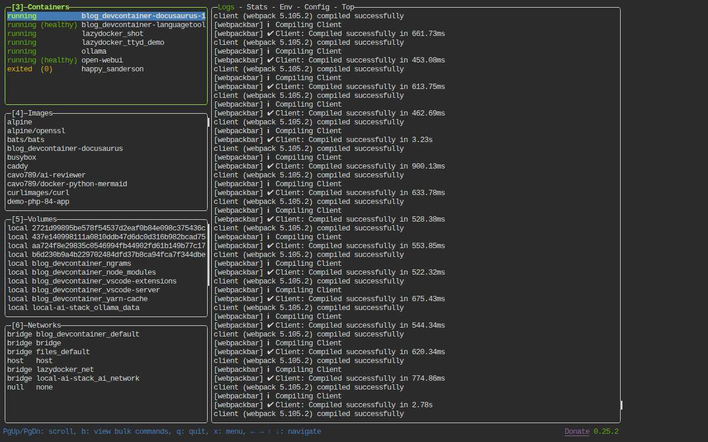

<!-- cspell:ignoreCase lazydocker jesseduffield alpine apk hjkl -->

<TLDR>
[lazydocker](https://github.com/jesseduffield/lazydocker) is a terminal UI that shows containers, images, volumes and networks side by side, with live CPU/memory stats and a log pane that updates as you move the selection — the same kind of glanceable dashboard `top` gives you for processes, but for Docker. This article containers it (of course), sharing the host's Docker socket the same way I explained in <Link to="/blog/docker-out-of-docker-dood">my Docker-out-of-Docker article</Link>, and adds one global wrapper script so running `lazydocker` from any project folder shows that project's containers, not a random flat list.
</TLDR>

In <Link to="/blog/zsh-docker-functions">a previous article</Link>, I shared the ZSH functions I use daily: `dex` to jump into a container, `dstop` to stop one, `dlogs` to tail its logs. They're fast, precisely because they assume I already know what I want — pick a container, do one thing, done.

But sometimes that's not the situation. Sometimes I've just started five containers for a test and I genuinely don't know yet which one is spiking CPU, or whether a log line I half-noticed scrolling by was actually an error. That's not a "run one command" problem, it's a "let me just look at everything for a second" problem — and none of `dex`/`dstop`/`dlogs` are built for that.

<!-- truncate -->

## The Dashboard, Running

Five panes, updating live, on this exact machine's real containers:



The right-hand pane is streaming this Docusaurus dev server's actual webpack output as it recompiles — no `docker logs -f` typed anywhere, just the container selected on the left.

## What lazydocker Actually Shows

Move the selection with arrow keys or the `hjkl` vim-style keys; each pane updates live. Select a container and the right-hand panel shows its logs, streaming, without you having to type `docker logs -f <name>` first. Press <kbd>Enter</kbd> on a container to open a menu of actions — restart, stop, remove, attach a shell — instead of remembering the exact flag for each. If lazydocker detects a `compose.yaml` in the current directory, the **Containers** pane groups them by their compose service name instead of listing everything flat.

<AlertBox variant="tip" title="Full keybinding list, in-app">
Press <kbd>?</kbd> inside lazydocker for the complete, version-accurate keybinding list rather than trusting a snapshot in an article — the exact keys have shifted slightly between releases.
</AlertBox>

## Containerizing It

You know me well enough by now: I like to containerize things, and I'm not about to install a Go binary straight onto my host for this one either.

Let's create a new folder for it: `mkdir -p ~/tools/lazydocker && cd $_`

Then create the `Dockerfile`:

<Snippet filename="Dockerfile" source="./files/Dockerfile" />

Two things worth calling out. First, the base image installs the Docker CLI itself (`docker-cli` and `docker-cli-compose`) — lazydocker doesn't talk to the daemon directly, it shells out to the same `docker` and `docker compose` commands you'd type by hand, so they need to exist inside the image. Second, the version is pinned via an `ARG` rather than baked into the `curl` line directly — check the [releases page](https://github.com/jesseduffield/lazydocker/releases) for the current tag before your first build.

Now the `compose.yaml`:

<Snippet filename="compose.yaml" source="./files/compose.yaml" />

<AlertBox variant="highlyImportant" title="Same socket-sharing principle as DooD">
Mounting `/var/run/docker.sock` here is exactly the Docker-out-of-Docker technique from <Link to="/blog/docker-out-of-docker-dood">that earlier article</Link> — a container reaching out to control the host's Docker daemon. lazydocker's whole reason to exist is host-level container control, so unlike the DooD article's unprivileged-user walkthrough, I'm not bothering to drop root inside this particular image: restricting the container's own UID buys nothing when the thing it's mounting already grants full Docker control regardless of who's asking. The privilege boundary that actually matters here is "who can run this wrapper script at all," not the UID inside the container.
</AlertBox>

`stdin_open` and `tty` are both set to `true` — without them, lazydocker's full-screen interface never gets an interactive terminal to draw into, and the container would just exit immediately.

Build it: `docker compose build`.

<Terminal source="./files/build.txt" wrap={true} typewriter />

## The Global Wrapper

If I only ever ran lazydocker from inside `~/tools/lazydocker`, it would show me... `~/tools/lazydocker`'s own container, which is not the point. The trick is mounting whatever directory you're *currently* in, so lazydocker's project-detection logic finds the right `compose.yaml`. That means the plain `docker compose run` I've used elsewhere doesn't work here — the compose file's own working directory would always win.

A tiny wrapper script fixes it. It goes in `/usr/local/bin/` so it's on your `PATH` from every folder, and since that directory is root-owned, creating the file there needs `sudo`. Open it with `sudo vi /usr/local/bin/lazydocker` and paste in the content below (in `vi`: press <kbd>i</kbd>, paste, then <kbd>Esc</kbd> and `:wq` to save and quit):

<Snippet filename="/usr/local/bin/lazydocker" source="./files/lazydocker.sh" />

Then make it executable: `sudo chmod +x /usr/local/bin/lazydocker`.

From any project folder now — this Docusaurus repo, a client's API, wherever — running `lazydocker` opens the dashboard scoped to *that* folder's containers.

<AlertBox variant="note" title="Config survives, projects don't need to">
`lazydocker-config`, the named volume, persists your pane layout and sort order across every project. It's the textbook reason to reach for a <Link to="/blog/docker-volumes">Docker-managed volume</Link> — don't let a `--rm` container throw away state that has no reason to be re-created every single run.
</AlertBox>

## Customize

lazydocker's action menu is extensible: any shell command can appear there by name, in any pane — containers, images, volumes, networks. The config lives in a single YAML file that lazydocker reads from its config directory, the same one the `lazydocker-config` named volume already persists.

The two most useful additions depend on which pane you're in:

- **Containers pane** — the container is already running; `docker exec` jumps straight into it.
- **Images pane** — nothing is running yet; `docker run --rm` spins up a throw-away container from the selected image, drops you into a shell, and removes the container the moment you exit.

Both cases, both shells, in one file. Create `~/tools/lazydocker/config.yml`:

<Snippet filename="config.yml" source="./files/config.yml" />

All four entries use `attach: true` so lazydocker hands the terminal over to the shell rather than running the command in the background. `bash` and `sh` cover images that ship one or the other — Alpine-based images only have `sh`.

Now tell both the compose file and the global wrapper to bind-mount that file on top of the named volume — Docker layers file mounts on top of volume mounts for overlapping paths, so `config.yml` wins while the volume still persists your pane layout and sort order:

```yaml title="compose.yaml — updated volumes section"
volumes:
  - /var/run/docker.sock:/var/run/docker.sock
  - lazydocker-config:/root/.config/jesseduffield/lazydocker
  - ./config.yml:/root/.config/jesseduffield/lazydocker/config.yml
  - .:/workdir
```

```bash title="/usr/local/bin/lazydocker — updated exec line"
exec docker run --rm -it \
    -v /var/run/docker.sock:/var/run/docker.sock \
    -v lazydocker-config:/root/.config/jesseduffield/lazydocker \
    -v "${HOME}/tools/lazydocker/config.yml:/root/.config/jesseduffield/lazydocker/config.yml" \
    -v "${PWD}:/workdir" \
    --workdir /workdir \
    lazydocker
```

<AlertBox variant="note" title="Template variables">
Each pane exposes its own object: `{{ .Container.ID }}` in the containers pane, `{{ .Image.Name }}` and `{{ .Image.Tag }}` in the images pane, `{{ .Service.Name }}` for services. The full list is in [lazydocker's Config.md](https://github.com/jesseduffield/lazydocker/blob/master/docs/Config.md).
</AlertBox>

Restart lazydocker once to pick up the new mount. In the **Containers** pane, select a running container, press <kbd>Enter</kbd>, and **bash**/**sh** appear in the menu — one keypress to exec in. In the **Images** pane, select any image, press <kbd>Enter</kbd>, and **bash**/**sh** let you spin up a throw-away container from it on the spot.

## My `dex` function vs lazydocker

<AlertBox variant="info" title="Two tools, two starting points">
My <Link to="/blog/zsh-docker-functions#start-a-new-terminal-session-in-a-running-docker-container">`dex`</Link> function is what I reach for when I already know which container I want and what I want to do to it — it's optimized for speed on a decision I've already made. lazydocker is what I open a beat *before* that decision exists — when I need to look across everything at once to figure out which container is actually the problem. Neither replaces the other; `dops`' fzf menu and lazydocker's dashboard solve two different moments of the same workflow.
</AlertBox>

## Does Docker Desktop still earn its place?

On Windows I keep Docker Desktop running because that's what provides the engine in the first place — but its GUI is also where I used to go to watch logs, restart a container, or check what was eating memory. lazydocker does that part identically, faster, and the same way on every machine instead of only the Windows one.

<AlertBox variant="info" title="What lazydocker replaces — and what it doesn't">
lazydocker takes over the half of Docker Desktop you touch daily: the container, image, volume and network browser, the log pane, the quick restart/stop/shell actions. It does **not** provide the Docker engine, the WSL2 VM's CPU/memory/disk limits, the one-click Kubernetes node, or Docker Scout image scanning — for those you still open the Docker Desktop window.
</AlertBox>

In practice, since installing lazydocker I open that window maybe once a month, to bump a resource limit. *Uninstalling* Docker Desktop is a separate question — usually driven by [Docker's licensing terms for larger organizations](https://www.docker.com/pricing/) rather than by lazydocker — and the answer there is Docker Engine running straight inside a WSL2 distro, with lazydocker on top exactly as set up above.

## Key Takeaways

<StepsCard
  variant="remember"
  title="lazydocker quick reference"
  steps={[
    { content: "**Single binary, no host install** — containerized here, sharing the Docker socket the same way as DooD" },
    { content: "**Mount `$PWD`, not the Dockerfile's own folder** — that's what makes project-view detection work from anywhere" },
    { content: "**Root inside the container is fine here** — the socket mount already grants full host Docker control regardless of UID" },
    { content: "**Persist the config volume** — pane layout and sort order survive across every project you point it at" },
    { content: "**Press `?` for keybindings** — faster and more accurate than memorizing a list that shifts between releases" },
    { content: "**Extend the action menu via config.yml** — containers pane uses `docker exec` (running container), images pane uses `docker run --rm` (throw-away container from the image)" },
    { content: "**It replaces Docker Desktop's dashboard, not Docker Desktop** — the engine, WSL2 VM limits and Kubernetes still live there" }
  ]}
/>

## Conclusion

`dex`, `dstop` and `dlogs` are still exactly what I reach for the moment I know what I want to do. lazydocker fills the gap right before that moment — the "let me just look for a second" reflex that a fuzzy-finder menu isn't built to answer. And since it's just another container sharing a socket, it slots into the same mental model as the DooD article without adding a single new concept — only a new dashboard on top of one already-understood mechanism. Next up: the browser-based version of this same idea, for the times a terminal isn't the tool someone else has open.
