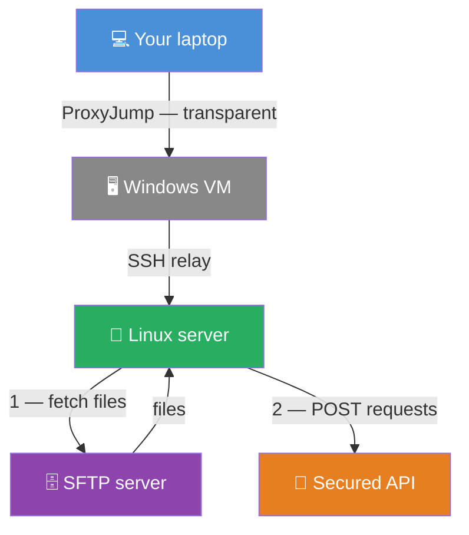
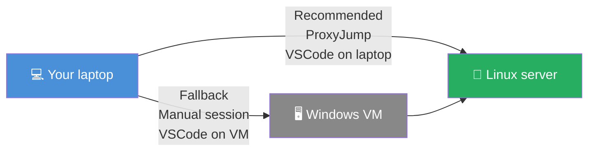

<TLDR>
VSCode's Remote - SSH and Dev Containers extensions chain together: connect to a remote Linux server over SSH, then reopen the project inside a devcontainer running *on that server*. The container inherits the server's network privileges, so any service only reachable from that server — a private SFTP endpoint, a secured API — becomes reachable from your terminal. Two paths to get there: ProxyJump from your laptop (one click, transparent), or VSCode on an intermediate Windows VM (fallback if direct SSH isn't available).
</TLDR>

I needed to test a script that fetches files from an SFTP server and sends POST requests to a secured API. Simple enough — except both sit on a private network segment only reachable from a specific Linux server. That Linux server itself is only reachable from a Windows VM at the office. My laptop, at the end of the chain, cannot see either service directly.

Without the technique below, the workflow is: open a terminal on the VM, SSH to the Linux server, edit the script with `nano`, run it, copy-paste errors back to my editor. Not great.

With VSCode Remote SSH chained to Dev Containers, the workflow becomes: open VSCode, connect once, and work exactly as I would locally — full editor, full devcontainer, and the SFTP server and API are reachable from the integrated terminal. There are two ways to set this up, and the article covers both.

*Prerequisite: you should already be comfortable with the basics of VSCode Remote SSH. If not, <Link to="/blog/vscode-remote-ssh">SSH Remote development with VSCode</Link> covers the extension setup and the SSH config file from scratch.*

<!-- truncate -->

<QuickJump
  links={[
    { label: "Recommended Approach — ProxyJump from your laptop", to: "#recommended-approach--proxyjump-from-your-laptop" },
    { label: "Fallback Approach — VSCode on the Windows VM", to: "#fallback-approach--vscode-on-the-windows-vm" },
    { label: "Connect with VSCode", to: "#connect-with-vscode" },
    { label: "Open the DevContainer", to: "#open-the-devcontainer" },
  ]}
/>

<Vars
  vmUser="vm-user"
  vmIp="windows-vm-ip"
  devUser="dev-user"
  linuxHost="test.example.internal"
  linuxAlias="linux-test"
  sshKey="id_ed25519"
  labels={{
    vmUser: "VM username",
    vmIp: "VM hostname or IP",
    devUser: "Linux server username",
    linuxHost: "Linux server hostname",
    linuxAlias: "SSH alias",
    sshKey: "SSH key name",
  }}
/>

## What You Get At the End

The architecture, with the recommended approach, looks like this:

VSCode runs on your laptop and connects to the Linux server in one click — the Windows VM is just a relay in the SSH config, invisible during normal use. The devcontainer runs on the Linux server, so it inherits the server's network: the SFTP server and the secured API are reachable from inside the container, even though they are invisible from your laptop.

The quick test below — run from your laptop, not from the VM — confirms that the entire chain is reachable:

<Terminal source="./files/terminal_proxyjump_test.txt" title="laptop: ~" copyCommandOnly />

If it prints your username and a hostname, the recommended approach is available and you can skip the fallback entirely.

*The second line is the output of `hostname` on the remote machine — it reflects the name set in `/etc/hostname`, which may differ from the address you used to connect. That is normal; what matters is that the command returned output rather than timing out or being refused.*

## Which Approach Works for You?

Two situations, two paths:

<AlertBox variant="note" title="SSH server on the Windows VM">
The recommended approach requires a SSH server on the Windows VM.
</AlertBox>

**To check if the recommended approach is available**, run this from your laptop terminal:

<Terminal wrap={true} typewriter>
ssh -J %%vmUser=vm-user%%@%%vmIp=windows-vm-ip%% %%devUser=dev-user%%@%%linuxHost=test.example.internal%% "whoami && hostname"
</Terminal>

- It prints <Var name="devUser">dev-user</Var> and the Linux server hostname → **use the recommended approach**.
- It times out → your laptop cannot reach the VM at all → **use the fallback approach**.
- `Connection refused` on port 22 → the VM is reachable but OpenSSH Server is not installed → **see the fix below**.

`Connection refused` means the network path works — only the SSH service is missing. If you have admin rights on the VM, open a PowerShell **as administrator** and run:

<Terminal title="%%vmUser=vm-user%%@%%vmIp=windows-vm-ip%%: PowerShell (Administrator)">
$ Add-WindowsCapability -Online -Name OpenSSH.Server~~~~0.0.1.0
$ Start-Service sshd
$ Set-Service -Name sshd -StartupType Automatic
</Terminal>

Once done, re-run the test from your laptop — it should now print <Var name="devUser">dev-user</Var> and the server hostname. If this is the case, follow the **recommended approach**.

**The key authorization step is optional.** The connection works with password authentication too — you will simply be prompted for your VM password each time VSCode connects. For occasional use that is fine; for daily use, setting up the key makes the connection fully silent.

## Why It Works

- **Two extensions, one chain.** Remote - SSH opens a VS Code Server process on the Linux host. Dev Containers then starts a container on *that host* and connects VSCode to it — the container runs on the server's Docker engine, not your laptop's.
- **Network privilege is inherited from the host.** The container's network stack lives on the Linux server, so every outbound connection goes out from the server's IP. Services that block your laptop's address let the server through.
- **ProxyJump delegates the relay to SSH.** With `ProxyJump` in `~/.ssh/config`, SSH opens a connection to the VM, then tunnels a second SSH connection to the Linux server through it. VSCode sees only one host and one click.
- **No file transfer.** Files live on the server. The editor reads and writes them directly — no `scp`, no rsync, no upload step.

## Configure SSH

### Recommended Approach — ProxyJump from Your Laptop

#### Prerequisites

The Windows VM must have OpenSSH Server installed. On Windows 10/11, open **Settings → System → Optional features** and add **OpenSSH Server**, then start it (*already done if you've followed the fix*):

<Terminal title="%%vmUser=vm-user%%@%%vmIp=windows-vm-ip%%: PowerShell (Administrator)">
$ Start-Service sshd
$ Set-Service -Name sshd -StartupType Automatic
</Terminal>

Your SSH private key (`~/.ssh/`<Var name="sshKey">id_ed25519</Var>) should be on your laptop. ProxyJump tunnels the authentication — your laptop's key authenticates to both hosts, so the key never needs to leave your laptop. Password authentication also works if key-based auth is not set up on the VM.

#### Configure SSH on your laptop

Add the following to your laptop's `~/.ssh/config` (Linux/macOS) or `C:\Users\`<Var name="vmUser">vm-user</Var>`\.ssh\config` (Windows):

<Snippet filename="~/.ssh/config (your laptop)" source="./files/ssh_config_laptop.txt" />

The `ProxyJump` line tells SSH to reach <Var name="linuxAlias">linux-test</Var> by tunneling through the VM. From this point on, `ssh `<Var name="linuxAlias">linux-test</Var> from your laptop connects directly to the Linux server — no manual VM step.

#### Test the full chain

Run the command with the named alias now that the config is in place:

<Terminal title="laptop: ~" typewriter>
$ ssh %%linuxAlias=linux-test%% "whoami && hostname"
</Terminal>

The first run will look like this:

<Terminal source="./files/terminal_proxyjump_first_run.txt" title="laptop: ~" />

Two things happen here, both normal and both one-time only:

- **Host-key prompts** (`The authenticity of host ... can't be established`): SSH has never seen these hosts before. Type `yes` for each — the fingerprint is stored in `~/.ssh/known_hosts` and the prompt never appears again.
- **Password prompts**: you will see one for the VM and one for the Linux server — the connection works either way. To make it fully silent, authorize your public key on each host (see below).

There are two hops, so two places to authorize your key. Do them in order.

##### Step 1 — authorize your key on the Windows VM

For admin accounts on Windows, OpenSSH reads a system-wide file — **not** the per-user `~\.ssh\authorized_keys`. The directory `C:\ProgramData\ssh\` has restrictive ACLs: even a member of the Administrators group needs a **truly elevated** PowerShell session (right-click → *Run as Administrator*). On the VM:

**Step 1a** — on your laptop, display your public key and copy the entire line:

<Terminal title="laptop: ~">
$ cat ~/.ssh/%%sshKey=id_ed25519%%.pub
</Terminal>

**Step 1b** — on the VM (PowerShell as Administrator), append the copied key:

<Terminal title="%%vmUser=vm-user%%@%%vmIp=windows-vm-ip%%: PowerShell (Administrator)">
$ Add-Content C:\ProgramData\ssh\administrators_authorized_keys "ssh-ed25519 AAAA...your-key-here"
</Terminal>

Re-run the test — the VM password prompt should be gone. The Linux server will still ask for a password; that is step 2.

##### Step 2 — authorize your key on the Linux server

With ProxyJump already configured in `~/.ssh/config`, `ssh-copy-id` works transparently — it connects through the VM and copies your key to the Linux server in one command:

<Terminal source="./files/terminal_ssh_copy_id.txt" title="laptop: ~" copyCommandOnly />

It asks for the Linux server password one last time, then adds your public key to `~/.ssh/authorized_keys` on the server. After that, the full chain is silent — no prompts at all.

<QuickJump
  links={[
    { label: "SSH configured — continue with VSCode", to: "#connect-with-vscode" },
  ]}
/>

### Fallback Approach — VSCode on the Windows VM

Use this path if the recommended approach is not available (SSH server not installed on the VM, or the VM is not reachable from your laptop via SSH).

#### Create the SSH config file on the VM

Open a Powershell session on the VM. If the `.ssh` subfolder does not exist yet, create it: `New-Item -ItemType Directory -Path "$HOME\.ssh"`.

Open (or create) `C:\Users\`<Var name="vmUser">vm-user</Var>`\.ssh\config` in Notepad. The file must be called `config` with **no extension** — `config.txt` is silently ignored by every SSH client.

<Snippet filename="C:\Users\%%vmUser=vm-user%%\.ssh\config" source="./files/ssh_config.txt" />

#### Copy your SSH private key to the VM

The SSH client on the VM needs your private key. Copy it manually via Explorer (navigate to your Linux home under `\\wsl$\` and copy `~/.ssh/`<Var name="sshKey">id_ed25519</Var> to `C:\Users\`<Var name="vmUser">vm-user</Var>`\.ssh\`), or run this one-liner in a Powershell session that has access to WSL:

<Terminal title="%%vmUser=vm-user%%@%%vmIp=windows-vm-ip%%: ~" wrap={true}>
$ wsl sh -c 'cp "$HOME/.ssh/%%sshKey=id_ed25519%%" "/mnt/c/Users/$(cmd.exe /c echo %USERNAME% | tr -d "\r")/.ssh/%%sshKey=id_ed25519%%"'
</Terminal>

#### Test the connection from the VM

From Powershell on the VM, confirm the alias resolves and authenticates:

<Terminal source="./files/terminal_ssh_test.txt" title="%%vmUser=vm-user%%@%%vmIp=windows-vm-ip%%: ~" copyCommandOnly />

## Connect with VSCode

SSH is now configured and the test command returned your username — the connection works end to end. Whether you followed the recommended approach or the fallback, you are at the same point: ready to open VSCode and connect to the Linux server.

<AlertBox variant="important" title="WSL users — do not use `code .` for this step">

If you work exclusively in WSL, your reflex is `code .` from the terminal. **Do not use it here.**

When VSCode opens via `code .` from WSL, it connects to WSL as a remote host. In that mode, the Remote Explorer only shows **WSL Targets** and **Dev Containers** — the **Remotes (Tunnels/SSH)** category never appears, no matter which extensions you install.

Open VSCode the Windows way instead: from the **Start menu**, the **taskbar**, or a PowerShell terminal (just `code`, no arguments). That gives you a local window, and the full Remote Explorer dropdown — including **Remotes (Tunnels/SSH)** — will be there.

</AlertBox>

So, **from your Windows-side; start a Powershell console** and install the **Remote - SSH** extension — it provides the Remote Explorer sidebar used to connect to the remote host:

<Prerequisite
  name="Remote - SSH"
  install="code --install-extension ms-vscode-remote.remote-ssh"
  installOutput="Installing extension 'ms-vscode-remote.remote-ssh'...
Extension 'ms-vscode-remote.remote-ssh' v0.120.0 was successfully installed."
  check="code --list-extensions | grep remote-ssh"
  checkOutput="ms-vscode-remote.remote-ssh"
/>

<AlertBox variant="tip" title="On Powershell, use findstr instead of grep">

<Terminal title="laptop: ~">
$ code --list-extensions | grep remote-ssh
</Terminal>

</AlertBox>

Open VSCode — **on your laptop** if you followed the recommended approach, or **on the Windows VM** if you followed the fallback approach. In the **Remote Explorer** sidebar, select **Remotes (Tunnels/SSH)** from the dropdown.

> WSL users: once again because it's important; start your Windows Start Menu and run VSCode from there.

Locate <Var name="linuxAlias">linux-test</Var> in the list and click the arrow icon next to it to open it in a new window.

VSCode deploys a small server binary on the Linux host the first time — watch the status bar at the bottom left for the *Opening Remote...* message. Once the host name appears there, you are connected.

<AlertBox variant="tip" title="Host not visible in the list?">

Two things to check:

1. The config file extension. Open Explorer, navigate to `C:\Users\`<Var name="vmUser">vm-user</Var>`\.ssh\`, and confirm the file is called `config`, not `config.txt`. Windows Explorer hides known extensions by default — enable "File name extensions" in the View menu to be sure.

2. An outdated extension. If the host was visible before and has now disappeared, open the Extensions pane and update Remote - SSH. This has happened at least once after a VS Code update.

</AlertBox>

<AlertBox variant="coreConcept" title="You just opened a project on a server your laptop cannot directly reach">

VSCode is connected to the Linux server. You can already open files, run terminals, use Git — everything works from your laptop, on files that live on the server. The SFTP endpoint and the secured API are already reachable from the integrated terminal. Congratulations!

**The next chapter is optional.** It adds a DevContainer on top of this connection — useful if your project requires a specific runtime or isolated environment. If you only need the remote editor, you are done.

</AlertBox>

## Open the DevContainer

Once connected to the remote host, install the **Dev Containers** extension to open the project inside a container running on that host:

<Prerequisite
  name="Dev Containers"
  install="code --install-extension ms-vscode-remote.remote-containers"
  installOutput="Installing extension 'ms-vscode-remote.remote-containers'...
Extension 'ms-vscode-remote.remote-containers' v0.395.0 was successfully installed."
  check="code --list-extensions | grep remote-containers"
  checkOutput="ms-vscode-remote.remote-containers"
/>

Open the project folder on the Linux server, then press <kbd>F1</kbd> and run **Dev Containers: Rebuild and Reopen in Container** the first time (or **Reopen in Container** on subsequent connections).

<AlertBox variant="important" title="Docker must be installed on the Linux server">

Dev Containers requires Docker on the remote host, not on your laptop or the VM. If you see an error saying Docker is not found, your system administrator needs to install it, or follow the [official Docker installation guide](https://docs.docker.com/engine/install/) for your server's distribution.

</AlertBox>

After the container starts, your terminal prompt changes to reflect the container environment. From here, the SFTP server and the secured API are reachable — both services that were invisible from your laptop are now on the local network of the container.

## Under the Hood (skip this if you just want to use it)

**Remote - SSH** installs a `vscode-server` process on the Linux host the first time you connect, reused on subsequent connections. That server handles all editor communication — file reads, terminal I/O, language server protocol — over the SSH tunnel.

**Dev Containers** then talks to the Docker socket on that *remote* host. It reads `devcontainer.json`, builds or pulls the image, and starts the container. VSCode reconnects its editor protocol to the container runtime, leaving the SSH layer underneath unchanged. The result is two nested connections: SSH tunnel → VS Code Server on host → container runtime.

With the recommended approach, there is a third layer: the SSH tunnel itself goes through the VM via ProxyJump. The VS Code Server sees none of this — it only knows it is running on the Linux host. The ProxyJump is entirely at the SSH layer.

The container's bind mounts reference paths *on the Linux server*, not paths on your laptop or the VM — which is exactly what you want.

## Conclusion

The combination of VSCode Remote SSH and Dev Containers solves a problem that otherwise requires a clunky multi-step manual workflow: developing code that must run — or reach services that only exist — on a server your laptop cannot directly access.

The recommended approach (ProxyJump) is the cleaner option: once the SSH config is in place, the connection is one click and the Windows VM becomes invisible infrastructure. The fallback approach is the reliable alternative when the VM's SSH server is not available.

<Link to="/blog/vscode-remote-ssh">SSH Remote development with VSCode</Link> is the companion article if you want to start from a simpler case — editing files on a remote host without a devcontainer, with a local Docker container as a safe practice target before touching a real server.
