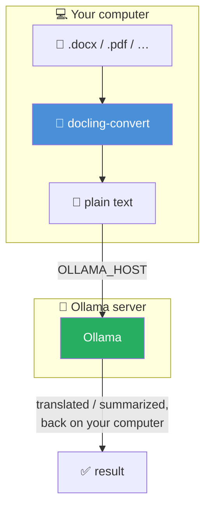

<!-- cspell:ignoreCase ai-test ai-commit ai-translate ai-summarize qwen ollama docling zshrc -->

<TLDR>
This article adds `ai-translate` and `ai-summarize` to the "Ollama daily use" series. Both accept a `.pdf`, `.docx`, `.pptx`, `.xlsx` or `.html` file — extracted to Markdown by [Docling](/blog/docling) — or a plain `.md`/`.txt` file directly, then hand the text to the local Ollama model to translate or condense into bullet points. The entire round trip stays on your machine: no cloud translation API, no document upload anywhere, which is precisely the point for a contract, an HR document, or anything else you'd think twice about pasting into Google Translate.
</TLDR>

I work in an office where a `.docx` lands in my inbox in Dutch, English or French. For a lot of good reasons, I sometimes need to translate from one language to another.

When it's not confidential at all, a reflex everyone has is to open the browser, paste into a translation tool, hope nobody minds that a client contract just passed through a third party's servers. Nobody ever explicitly told me not to. That's exactly the kind of thing you should not need permission to avoid.

<!-- truncate -->

## Demo — ai-translate

Translation of a contract from any language to French:

<Terminal source="./files/terminal_translate_french.txt" typewriter />

And the same to Dutch:

<Terminal source="./files/terminal_translate_dutch.txt" typewriter />

That's a fictional service agreement, converted from `.docx` and translated into French/Dutch, with every heading and every bold term intact — the kind of document I would genuinely not paste into a browser-based translator.

Same document, so you can try it yourself before adapting either function to your own files:

<DownloadButton file={require("./files/contract.docx").default} label="contract.docx — the source document" title="Download the fictional service agreement used in this demo" />

## Demo — ai-summarize

The same contract, condensed to four bullet points instead of translated:

<Terminal source="./files/terminal_summarize.txt" typewriter />

Delivery deadlines, payment terms, the termination clause and which parts of the framework agreement get overridden — the four points that matter, pulled out without reading the full document.

## Reusing Docling for Extraction

Both functions below share one job before they ever talk to Ollama: turning a document into plain text. I already built that piece in [my Docling article](/blog/docling) — `docling-convert file.docx` produces `file.md` locally, GPU-accelerated if you set it up that way. Rather than duplicate that logic twice, it lives in one small helper:

<Snippet filename="~/.zsh/fns/_ai-docs.zsh" source="./files/_ai-docs.zsh" defaultOpen={true} />

<AlertBox variant="note" title="Markdown and text files skip conversion entirely">
If you already have a `.md` or `.txt` file, `_ai_extract_text` just `cat`s it — no Docling call, no dependency. The conversion step only kicks in for actual office formats.
</AlertBox>

<AlertBox variant="caution" title="Why the subshell around docling-convert">
`docling-convert` (from the previous article) mounts the *current directory* into its container and expects a filename relative to it — it wasn't built to resolve an arbitrary absolute path. `( cd "$dir" && docling-convert "$filename" )` runs it from the document's own folder, in a subshell, so your actual working directory is untouched when the function returns.
</AlertBox>

## ai-translate

<Snippet filename="~/.zsh/fns/ai-translate.zsh" source="./files/ai-translate.zsh" defaultOpen={true} />

Extract, then ask the model to translate into whatever language you pass as the second argument (French by default — the language I need most often), with an explicit instruction to preserve the Markdown structure so headings, lists, and tables survive the round trip instead of collapsing into a wall of text.

## ai-summarize

<Snippet filename="~/.zsh/fns/ai-summarize.zsh" source="./files/ai-summarize.zsh" defaultOpen={true} />

Same extraction step, different prompt: a fixed number of bullet points (5 by default), explicitly told to prioritize decisions, numbers, deadlines and action items over generic description — and to answer in whatever language the source document is already in, rather than silently switching to English.

## Registered in the ai Menu

Two lines — `AI_COMMANDS[translate]=...` and `AI_COMMANDS[summarize]=...` — and both are reachable as `ai translate` / `ai summarize`, or directly as `ai-translate` / `ai-summarize`, alongside every other function in this series.

Both functions call `_ollama_query` and register into `AI_COMMANDS`, which live in the shared `_ollama.zsh` foundation introduced in <Link to="/blog/ollama-test-generator">ai-test</Link>. If you already followed an earlier article in this series, it's already sitting in `~/.zsh/fns/` and sourced by your autoloader — nothing more to do. Starting here instead?

<Snippet filename="~/.zsh/fns/_ollama.zsh" source="./files/_ollama.zsh" defaultOpen={false} />

<AlertBox variant="tip" title="Docling and Ollama don't have to be on the same machine">

`docling-convert` always runs locally, no GPU required — converting a document to Markdown works on any laptop. Translating or summarizing still needs an Ollama server reachable somewhere, though: both functions connect to `OLLAMA_HOST`, same setup as <Link to="/blog/accessing-ollama-across-your-local-network">accessing Ollama across your local network</Link> — a shared LAN, or a VPN/tunnel across two separate networks.

</AlertBox>

<AlertBox variant="important" title="Local doesn't mean automatically compliant">
Everything here stays on your machine and never calls an external API — but "technically private" and "allowed by your employer's data policy" are two different questions. If these functions ever touch actual client or HR documents at work, that's worth a quick check with IT/compliance first — the same caution applies to any future function that reaches into corporate mailboxes or document stores, not just this one.
</AlertBox>

## Key Takeaways

<StepsCard
  variant="remember"
  title="ai-translate / ai-summarize quick reference"
  steps={[
    { content: "**Shared extraction** — `_ai_extract_text` in `_ai-docs.zsh`, reused by both functions" },
    { content: "**Docling for office formats** — `.pdf`/`.docx`/`.pptx`/`.xlsx`/`.html` go through `docling-convert` first" },
    { content: "**Markdown/text skip conversion** — `.md`/`.txt` files are read directly" },
    { content: "**Nothing leaves the machine** — extraction and translation/summary both run locally, end to end" },
    { content: "**Registers into `ai`** — reachable as `ai translate` and `ai summarize`" }
  ]}
/>

## All Files at a Glance

All four files, together in one place — `_ollama.zsh` is the same shared foundation from earlier in the series, included here so the archive is complete on its own even if this is the first article of the series you're following. Download it or copy the one-liner to create everything straight into `~/.zsh/fns`:

<ProjectSetup folderName="~/.zsh/fns">
  <Snippet filename="_ollama.zsh" source="./files/_ollama.zsh" defaultOpen={false} />
  <Snippet filename="_ai-docs.zsh" source="./files/_ai-docs.zsh" defaultOpen={false} />
  <Snippet filename="ai-translate.zsh" source="./files/ai-translate.zsh" defaultOpen={false} />
  <Snippet filename="ai-summarize.zsh" source="./files/ai-summarize.zsh" defaultOpen={false} />
</ProjectSetup>

If this is your first time setting up `~/.zsh/fns`, the autoloader itself — the `.zshrc` loop that sources every file in that folder — is covered in <Link to="/blog/ripgrep">my ripgrep article</Link>.

## Conclusion

The actual privacy story here isn't a policy or a promise — it's an architecture. A document goes in, Docling turns it into text without a network call, Ollama processes that text without a network call, and the result lands in my terminal. There's no step in that chain where "trust the vendor" is required, which is exactly what makes it usable for the documents I'd never risk on a cloud tool in the first place. Between this, `ai-ci` for pipelines, `ai-standup` for the morning recap and the rest of this series, the local model I already had running for other reasons keeps finding one more thing worth doing quietly, in the background, without asking anything of me except a file path.
