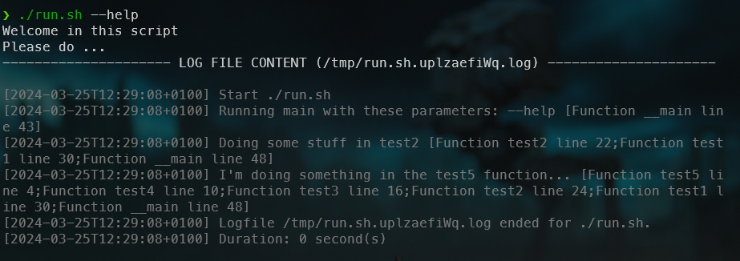

When write Bash scripts and certainly when you foresee to run them in a cron, you should implement a logfile. Every actions fired by your script should be log somewhere so we can start the script in a non-interactive mode and, in case of need, consult the last logfile.

Since I write a log of Bash scripts, I've coded my own implementation. It's really easy to use.

You just need to include the file in your script (`source log.sh`) then here and there foresee a `log::write "Something to log"`.

<!-- truncate -->

To illustrate how the log feature works, we need to create two files. Your script (here, I'll call it `run.sh`) and the one containing the log implementation (`log.sh`).

## Your script

If you already have a script, please open it. Otherwise, just create a new one and copy/paste the code below.

Name the file just as you want (I will name it `run.sh` for the example) and make sure the script can be executed by running `chmod +x run.sh` in your console.

```bash
#!/usr/bin/env bash

function test5() {
    log::write "I'm doing something in the test5 function..."

    return 0
}

function test4() {
    test5

    return 0
}

function test3() {
    test4

    return 0
}

function test2() {
    log::write "Doing some stuff in test2"

    test3

    return 0
}

function test1() {
    test2

    return 0
}

function __init() {
    source ./log.sh
    return 0
}

function __main() {
    __init

    log::write "Running main with these parameters: $*"

    echo "Welcome in this script"
    echo "Please do ..."

    test1

    return 0
}

__main $*
```

## The log helper

Please create a file called `log.sh`, in the exact same folder of your script, and copy/paste this content:

```bash
#!/usr/bin/env bash

# region - Intro block -----------------------------------------------
#
# Working with log files
#
# ## How to use this script?
#
# 1. Include the script in your own Bash like this `source log.sh` (adjust path if needed).
# 2. Here and there, where you want a log, just type `log::write "This is a log info"`
#
# ## Dependencies
#
# None
#
# endregion - Intro block --------------------------------------------

# let script exit if an unset variable is used or if a command fails
set -o nounset
set -o errexit

# region - private function log::__main
#
# ## Description
#
# This function will initialize important global variables
# This function is called as soon as this file is "sourced" (like "source log.sh")
# to make sure variables are initialized as soon as possible.
#
# ## Examples
#
# ```bash
# log::__main
# ```
#
# ## Exit code
#
# * 0 If successful.
#
# endregion
function log::__main() {
    # "trap ... EXIT" allow to define a function to call when the script exits,
    # so, here, call our __logDestruct function
    trap log::__logDestruct EXIT

    # Example of a filename: /tmp/myScript.sh.1J6Sqb62.log
    # Set LOG_FILE="" if you don't want to write to a log file (but simplier to not source this file then)
    [[ ! -v LOG_FILE ]] && LOG_FILE="$(mktemp /tmp/"$(basename "$0")".XXXXXXXXXX.log)"
    
    # Quick function to export the system date in the chosen format.
    log::__logNow() { date +"%Y-%m-%dT%H:%M:%S%z"; }

    # Generate a trace dump like [test5,line 728;test4,line 731;test3,line 734;test2,line 737;test1,line 740;main,line 755]
    # i.e. the latest called function, then the one who called that function, ... until the very first function called
    # (the entry point function)
    log::__trace() {
        local traceInfo
        traceInfo=""

        LEN=${#BASH_LINENO[@]}
        # INDEX=0 is this __trace function, INDEX=1 is the log::write function so start at 2.
        for (( INDEX=2; INDEX < LEN-1; INDEX++ )); do
            traceInfo="${traceInfo}Function ${FUNCNAME[(( INDEX ))]} line ${BASH_LINENO[ (( INDEX - 1)) ]};"
        done

        traceInfo="$(echo "${traceInfo}" | sed 's/;$//g')"

        echo "[${traceInfo}]"

        return 0
     }

    # From now, writing to 3 will write to the log file
    [[ -z "${LOG_FILE}" ]] || exec 3>"${LOG_FILE}"

    return 0
}

# region - private function log::__logDestruct
#
# ## Description
#
# Before exiting the script, display or not the logfile content (and remove it then)
#
# ## Examples
#
# ```bash
# log::__logDestruct
# ```
#
# ## Exit code
#
# * 0 If successful.
#
# endregion
function log::__logDestruct() {
    # Only if the file isn't empty
    if [[ -s ${LOG_FILE} ]]; then
        logEntry="$(printf '[%s] Logfile %s ended for %s.' "$(log::__logNow)" "$LOG_FILE" "$0")"
        echo "${logEntry}" >&3

        logEntry="$(printf '[%s] Duration: %d second(s)' "$(log::__logNow)" "$SECONDS")"
        echo "$logEntry" >&3
        
        log::__displayLog
    fi

    return 0
}

# region - public function log::write()
#
# ## Description
#
# Write a sentence to a logfile
#
# ## Examples
#
# ```bash
# log::write 'This is a log entry'
# ```
#
# ## Parameters
#
# * @arg string The string to write to the logfile
#
# ## Exit code
#
# * 0 If successful.
# * 1 An error has occurred.
#
# endregion
function log::write() {
    # When LOG_FILE was not defined, it means no log so just exit
    [[ -z ${LOG_FILE} ]] && return 0

    local -r message="${1:-}"
    [[ -z ${message} ]] && return 0  # No message so nothing to write in the log

    # Create the log file if not yet there
    [[ ! -f ${LOG_FILE} && ! "${LOG_FILE}" = "/dev/stdout" ]] && touch "${LOG_FILE}"

    # If the file isn't writable, error and return
    if [[ ! -w ${LOG_FILE} ]]; then
        errorMessage="ERROR - The ${LOG_FILE} file isn't writable. Exiting..."
        printf "\033[1;${__RED:-31}m%s\033[0m\n" "ERROR - ${message} Exiting..." >&2  # Write on stderr
    fi
    
    # If the file size is 0, echo a start info date/time; do it once
    if [[ ! -s ${LOG_FILE} ]]; then
        printf '[%s] %s\n' "$(date +"%Y-%m-%dT%H:%M:%S%z")" "Start $0" >&3
    fi

    printf '[%s] %s %s\n' "$(date +"%Y-%m-%dT%H:%M:%S%z")" "${message}" "$(log::__trace)" >&3
    
    return 0
}

# region - private function log::__displayLog
#
# ## Description
#
# Display the content of the logfile
#
# ## Examples
#
# ```bash
# log::__displayLog
# ```
#
# ## Exit code
#
# * 0 If successful.
#
# endregion
function log::__displayLog() {
    # If the file is empty, nothing to do
    [[ ! -s ${LOG_FILE} ]] && return 0

    printf "%s\n" "--------------------- LOG FILE CONTENT (${LOG_FILE}) ---------------------"

    # Show the log content but make sure to remove, if any, ANSI colors. 
    # (@see https://stackoverflow.com/a/51141872/1065340)
    printf "\033[1;${__GRAY:-30}m%s\n" ""
    sed "s/\x1B\[[0-9;]\{1,\}[A-Za-z]//g" "${LOG_FILE}"
    printf "\033[0m\n\n"

    echo ""

    return 0
}

# This script didn't contains executable code; only helpers.
sourced=0
(return 0 2> /dev/null) && sourced=1 || sourced=0
if [ "${sourced}" -eq "0" ]; then
    printf "\033[1;31m%s\033[0m\n" "ERROR, the $0 script is meant to be sourced. Try 'source $0' and use public functions." >&2  # Write on stderr
    exit 1
fi

log::__main
```

## The result

By running the script, we can see our different `echo` but, too, the content of the generated log.



You can for sure not display the log automatically, just comment the line `log::__displayLog`.

### Trace

Each statement logged will have a trace as you can see. For instance, the block `[Function __main line 43]` means that the caller was function called `__main` and it was on line `43`.

```log
[2024-03-25T12:29:08+0100] Start ./run.sh
[2024-03-25T12:29:08+0100] Running main with these parameters: --help [Function __main line 43]
[2024-03-25T12:29:08+0100] Doing some stuff in test2 [Function test2 line 22;Function test1 line 30;Function __main line 48]
[2024-03-25T12:29:08+0100] I'm doing something in the test5 function... [Function test5 line 4;Function test4 line 10;Function test3 line 16;Function test2 line 24;Function test1 line 30;Function __main line 48]
[2024-03-25T12:29:08+0100] Logfile /tmp/run.sh.uplzaefiWq.log ended for ./run.sh.
[2024-03-25T12:29:08+0100] Duration: 0 second(s)
```

When there are multiple parents, you'll get the entire trace, f.i. `[Function test5 line 4;Function test4 line 10;Function test3 line 16;Function test2 line 24;Function test1 line 30;Function __main line 48]`: the function `__main` on line 48 has called `test1` who has called then `test2` and so.

Each statement in the log will then contains the entire trace, making debugging easier.
